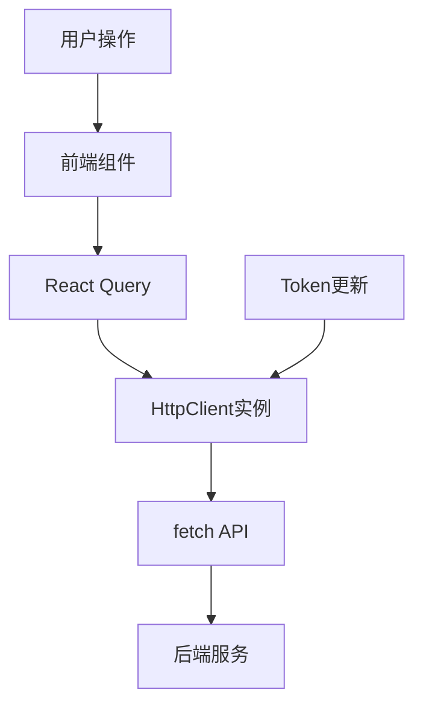
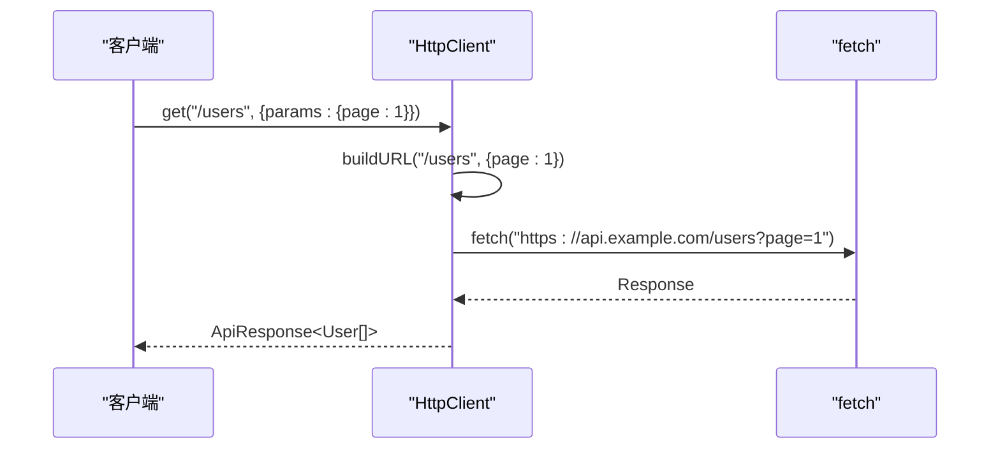
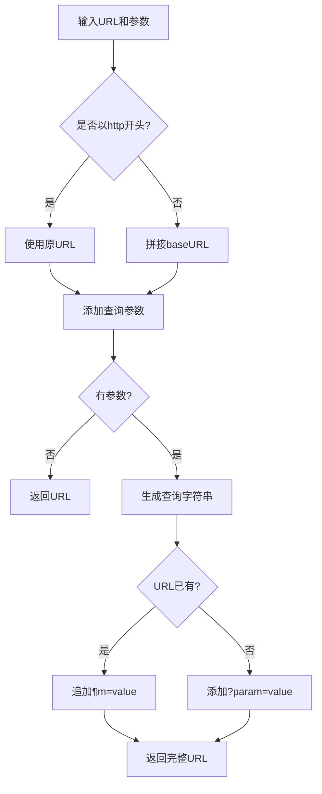

# API通信层

<cite>
**本文档引用文件**   
- [request.ts](file://src/lib/request.ts#L1-L191)
- [query.tsx](file://src/components/providers/query.tsx#L1-L46)
- [index.tsx](file://src/components/providers/index.tsx#L1-L14)
</cite>

## 目录

1. [项目结构](#项目结构)
2. [核心组件分析](#核心组件分析)
3. [HttpClient类设计与实现](#httpclient类设计与实现)
4. [请求方法封装](#请求方法封装)
5. [与React Query的集成](#与react-query的集成)
6. [认证机制](#认证机制)
7. [错误处理与用户提示](#错误处理与用户提示)
8. [URL构建与参数序列化](#url构建与参数序列化)
9. [数据类型定义](#数据类型定义)
10. [使用示例](#使用示例)

## 项目结构

本项目采用Next.js框架构建，主要目录结构如下：

- `public/`：静态资源文件
- `scripts/`：构建脚本
- `src/`：源码目录
  - `app/`：应用页面路由
  - `components/`：UI组件库
  - `hooks/`：自定义Hook
  - `lib/`：工具库和网络请求模块

其中，API通信相关的核心逻辑位于`src/lib/request.ts`文件中。

**Section sources**

- [request.ts](file://src/lib/request.ts#L1-L191)

## 核心组件分析

项目中的API通信机制由`HttpClient`类驱动，该类提供了强类型的HTTP请求封装。同时，通过React Query进行状态管理，实现数据获取、缓存、重试等高级功能。



**Diagram sources**

- [request.ts](file://src/lib/request.ts#L1-L191)
- [query.tsx](file://src/components/providers/query.tsx#L1-L46)

**Section sources**

- [request.ts](file://src/lib/request.ts#L1-L191)
- [query.tsx](file://src/components/providers/query.tsx#L1-L46)

## HttpClient类设计与实现

`HttpClient`是一个基于`fetch`的HTTP客户端封装类，具有以下特性：

- 强类型支持（无`any`）
- 自动JSON序列化
- FormData上传支持
- 请求/响应拦截能力
- 错误码统一映射

### 构造函数

```typescript
constructor(config: RequestConfig = {})
```

初始化时可传入基础URL和默认请求头。

### 核心属性

- **baseURL**: 请求的基础地址
- **defaultHeaders**: 默认请求头（包含`Content-Type: application/json`）

### 私有方法

#### buildURL

```typescript
private buildURL(url: string, params?: Record<string, unknown>): string
```

用于构建完整的请求URL，自动处理查询参数拼接。

**Section sources**

- [request.ts](file://src/lib/request.ts#L47-L79)

## 请求方法封装

`HttpClient`提供了多种HTTP动词的便捷方法，均基于通用的`request`方法实现。

### 通用请求方法

```typescript
async request<T>(url: string, options: RequestOptions = {}): Promise<ApiResponse<T>>
```

#### 参数说明

- **url**: 请求地址（相对或绝对）
- **options**: 请求选项（含`params`、`data`、`method`等）

#### 返回类型

```typescript
interface ApiResponse<T> {
  data: T;
  status?: number;
  ok?: boolean;
  code?: number;
  msg?: string | null;
}
```

### 具体HTTP方法

#### GET请求

```typescript
get<T>(url: string, params?: Record<string, string | number | boolean>, options?: Omit<RequestOptions, "params">)
```

#### POST请求

```typescript
post<T = unknown, B = unknown>(url: string, data?: B, options?: Omit<RequestOptions, "data">)
```

#### PUT/PATCH/DELETE请求

类似POST，分别对应更新和删除操作。

#### 文件上传

```typescript
upload<T = unknown>(url: string, formData: FormData, options?: Omit<RequestOptions, "data" | "body">)
```

特殊处理`FormData`，自动移除`Content-Type`头部。



**Diagram sources**

- [request.ts](file://src/lib/request.ts#L125-L189)

**Section sources**

- [request.ts](file://src/lib/request.ts#L81-L189)

## 与React Query的集成

项目通过`QueryProvider`将`HttpClient`与React Query无缝集成，实现声明式数据获取。

### QueryClient配置

```typescript
new QueryClient({
  defaultOptions: {
    queries: {
      staleTime: 5 * 60 * 1000, // 数据缓存时间
      gcTime: 5 * 60 * 1000, // 内存缓存时间
      retry: 3, // 重试次数
      retryDelay: (attemptIndex) => Math.min(1000 * 2 ** attemptIndex, 30000),
      refetchOnWindowFocus: false,
      refetchOnReconnect: true,
    },
    mutations: {
      retry: 1,
      retryDelay: 1000,
    },
  },
});
```

### 使用模式

将`http.get`等方法作为`queryFn`传递给React Query：

```typescript
useQuery({
  queryKey: ['users'],
  queryFn: () => http.get<User[]>('/users'),
});
```

**Section sources**

- [query.tsx](file://src/components/providers/query.tsx#L1-L46)

## 认证机制

通过`updateToken`方法管理用户认证令牌：

```typescript
updateToken(token: string) {
  this.defaultHeaders["token"] = `${token}`;
}
```

> 注意：当前使用`token`字段而非标准的`Authorization: Bearer`，可能是项目特定需求。

**Section sources**

- [request.ts](file://src/lib/request.ts#L45-L46)

## 错误处理与用户提示

在`request`方法中实现了统一的错误处理逻辑：

- 网络异常捕获
- 业务状态码检查（如401跳转登录）
- 用户友好提示（通过`sonner`弹窗）

```typescript
if (jsonResponse.code == 401) {
  localStorage.clear();
  toast.error('登录信息已过期，请重新登录');
}
```

**Section sources**

- [request.ts](file://src/lib/request.ts#L105-L108)

## URL构建与参数序列化

`buildURL`方法负责URL和查询参数的拼接：

1. 判断是否为绝对URL
2. 使用`URLSearchParams`处理查询参数
3. 自动处理`?`和`&`连接符



**Diagram sources**

- [request.ts](file://src/lib/request.ts#L47-L79)

**Section sources**

- [request.ts](file://src/lib/request.ts#L47-L79)

## 数据类型定义

### RequestConfig

```typescript
interface RequestConfig {
  baseURL?: string;
  headers?: Record<string, string>;
}
```

### RequestOptions

```typescript
interface RequestOptions extends RequestInit {
  params?: Record<string, string | number | boolean>;
  data?: unknown;
}
```

### 后端响应结构

```typescript
interface BackendResponse<T> {
  code: number;
  msg: string | null;
  data: T;
}
```

**Section sources**

- [request.ts](file://src/lib/request.ts#L6-L25)

## 使用示例

### 创建实例

```typescript
export const http = new HttpClient({
  baseURL: `${process.env.NEXT_PUBLIC_API_URL || '/api'}`,
});
```

### GET请求

```typescript
const users = await http.get<User[]>('/users', { params: { page: 1 } });
```

### POST请求

```typescript
const newUser = await http.post<User>('/users', { name: 'John' });
```

### 文件上传

```typescript
const formData = new FormData();
formData.append('file', file);
const result = await http.upload('/upload', formData);
```

### 在React Query中使用

```typescript
const { data, isLoading } = useQuery({
  queryKey: ['profile'],
  queryFn: () => http.get<User>('/profile'),
});
```

**Section sources**

- [request.ts](file://src/lib/request.ts#L189-L191)
- [index.tsx](file://src/components/providers/index.tsx#L1-L14)
