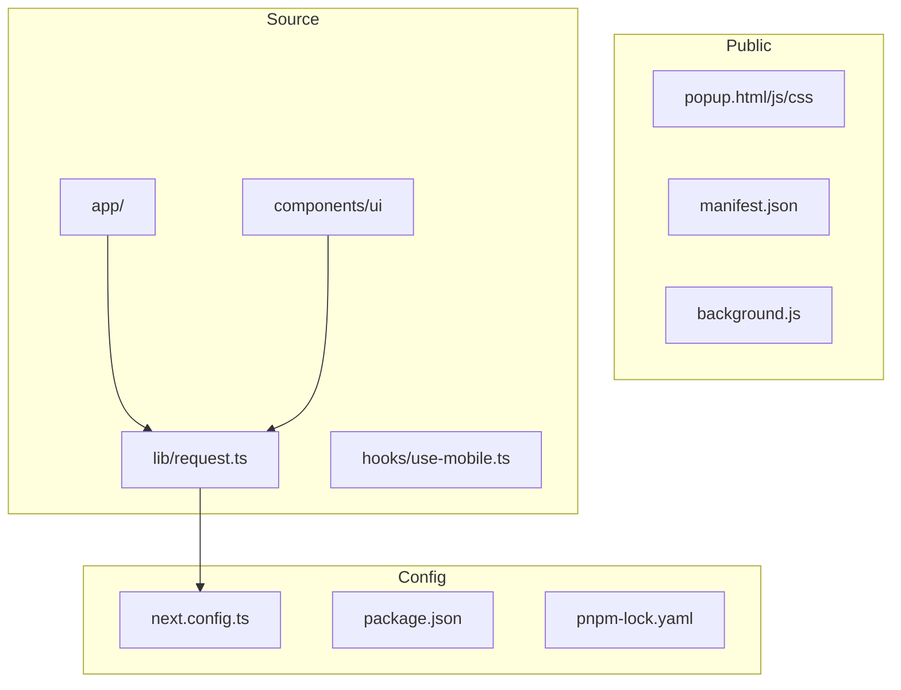
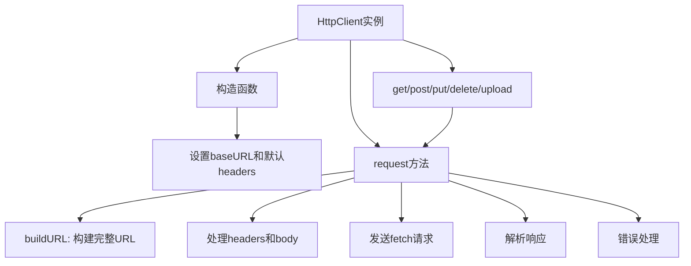
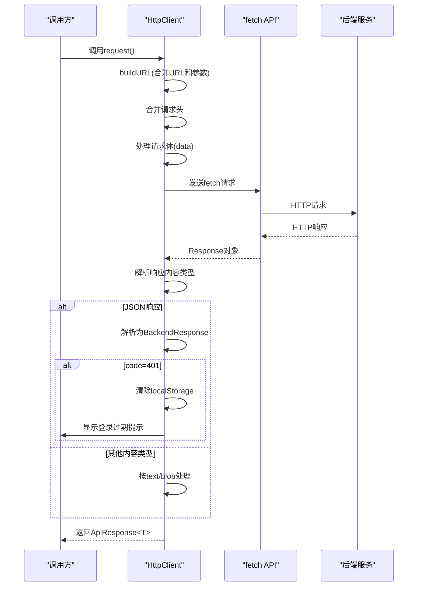
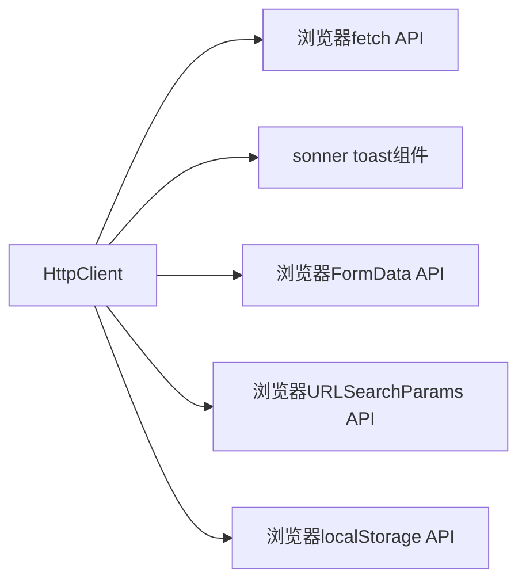

# HTTP客户端实现

<cite>
**本文档引用文件**  
- [request.ts](file://src/lib/request.ts#L1-L190)
- [next.config.ts](file://next.config.ts#L1-L27)
</cite>

## 目录

1. [简介](#简介)
2. [项目结构](#项目结构)
3. [核心组件](#核心组件)
4. [架构概览](#架构概览)
5. [详细组件分析](#详细组件分析)
6. [依赖分析](#依赖分析)
7. [性能考量](#性能考量)
8. [故障排查指南](#故障排查指南)
9. [结论](#结论)

## 简介

本文档深入解析`src/lib/request.ts`中`HttpClient`类的完整实现。该类为项目提供强类型的HTTP请求封装，支持与React Query集成，简化了超时和重试逻辑。文档将详细说明其构造函数配置、请求方法封装、拦截器机制、文件上传处理及实际使用方式。

## 项目结构

项目采用标准的Next.js应用结构，主要功能模块集中在`src`目录下。`lib`目录存放工具类和通用逻辑，其中`request.ts`是网络请求的核心实现。



**图示来源**

- [request.ts](file://src/lib/request.ts#L1-L190)
- [next.config.ts](file://next.config.ts#L1-L27)

**本节来源**

- [next.config.ts](file://next.config.ts#L1-L27)
- [src/lib/request.ts](file://src/lib/request.ts#L1-L190)

## 核心组件

`HttpClient`类是整个项目网络通信的核心，提供类型安全的HTTP请求能力。其设计目标是简化API调用、统一错误处理、自动处理认证和响应解析。

**本节来源**

- [request.ts](file://src/lib/request.ts#L1-L190)

## 架构概览

`HttpClient`基于`fetch` API构建，采用面向对象设计模式，通过封装统一的请求流程，实现对GET、POST、PUT、DELETE等HTTP方法的支持。



**图示来源**

- [request.ts](file://src/lib/request.ts#L1-L190)

## 详细组件分析

### HttpClient类分析

#### 构造函数与配置

`HttpClient`的构造函数接受`RequestConfig`类型的参数，用于配置基础URL和默认请求头。

```typescript
constructor(config: RequestConfig = {}) {
  this.baseURL = config.baseURL || "";
  this.defaultHeaders = {
    "Content-Type": "application/json",
    ...config.headers,
  };
}
```

- **baseURL**: 所有相对URL请求的前缀，若未设置则使用空字符串
- **defaultHeaders**: 默认请求头，始终包含`Content-Type: application/json`，可被传入的`headers`覆盖或扩展

**本节来源**

- [request.ts](file://src/lib/request.ts#L28-L34)

#### 请求URL构建机制

`buildURL`方法负责将相对URL与基础URL合并，并处理查询参数。

```typescript
private buildURL(url: string, params?: Record<string, unknown>): string {
  let fullURL = url.startsWith("http") ? url : `${this.baseURL}${url}`;

  if (params) {
    const searchParams = new URLSearchParams();
    Object.entries(params).forEach(([key, value]) => {
      if (value !== null && value !== undefined) {
        searchParams.append(key, String(value));
      }
    });
    const paramString = searchParams.toString();
    if (paramString) {
      fullURL += `${fullURL.includes("?") ? "&" : "?"}${paramString}`;
    }
  }

  return fullURL;
}
```

该方法支持：

- 完整URL直接使用
- 相对URL自动拼接`baseURL`
- 查询参数自动序列化并正确处理`?`和`&`

**本节来源**

- [request.ts](file://src/lib/request.ts#L47-L59)

#### 核心请求方法

`request<T>`方法是所有HTTP请求的底层实现，封装了完整的请求-响应流程。



**图示来源**

- [request.ts](file://src/lib/request.ts#L61-L123)

**本节来源**

- [request.ts](file://src/lib/request.ts#L61-L123)

#### 请求方法封装

`HttpClient`提供了对常用HTTP方法的封装：

```typescript
// GET请求
get<T>(url: string, params?: Record<string, string | number | boolean>, options?: Omit<RequestOptions, "params">) {
  return this.request<T>(url, { ...options, method: "GET", params });
}

// POST请求
post<T = unknown, B = unknown>(url: string, data?: B, options?: Omit<RequestOptions, "data">) {
  return this.request<T>(url, { ...options, method: "POST", data });
}

// PUT请求
put<T = unknown, B = unknown>(url: string, data?: B, options?: Omit<RequestOptions, "data">) {
  return this.request<T>(url, { ...options, method: "PUT", data });
}

// DELETE请求
delete<T = unknown>(url: string, options?: RequestOptions) {
  return this.request<T>(url, { ...options, method: "DELETE" });
}
```

这些方法通过调用`request`方法并设置相应的`method`和参数来实现。

**本节来源**

- [request.ts](file://src/lib/request.ts#L125-L158)

#### 文件上传机制

`upload`方法专门用于文件上传，支持`FormData`自动识别：

```typescript
upload<T = unknown>(url: string, formData: FormData, options?: Omit<RequestOptions, "data" | "body">) {
  return this.request<T>(url, { ...options, method: "POST", data: formData });
}
```

在`request`方法中，当检测到`data`为`FormData`实例时，会自动删除`Content-Type`头，让浏览器自动设置正确的`multipart/form-data`边界：

```typescript
if (data instanceof FormData) {
  body = data;
  Reflect.deleteProperty(headers, 'Content-Type');
} else {
  body = JSON.stringify(data);
}
```

**本节来源**

- [request.ts](file://src/lib/request.ts#L160-L189)

#### 认证与拦截器机制

`HttpClient`实现了简单的拦截器模式：

- **请求拦截**: 通过`updateToken`方法动态更新认证token
- **响应拦截**: 在响应处理中统一处理401状态码

```typescript
updateToken(token: string) {
  this.defaultHeaders["token"] = `${token}`;
}
```

当后端返回`code: 401`时，自动清除本地存储并提示用户重新登录：

```typescript
if (jsonResponse.code == 401) {
  localStorage.clear();
  toast.error('登录信息已过期，请重新登录');
}
```

**本节来源**

- [request.ts](file://src/lib/request.ts#L36-L39)
- [request.ts](file://src/lib/request.ts#L98-L101)

#### 类型定义

`HttpClient`使用了精确的类型定义，确保类型安全：

```typescript
interface RequestConfig {
  baseURL?: string;
  headers?: Record<string, string>;
}

interface RequestOptions extends RequestInit {
  params?: Record<string, string | number | boolean>;
  data?: unknown;
}

interface ApiResponse<T> {
  data: T;
  status?: number;
  ok?: boolean;
  code?: number;
  msg?: string | null;
}

interface BackendResponse<T> {
  code: number;
  msg: string | null;
  data: T;
}
```

**本节来源**

- [request.ts](file://src/lib/request.ts#L6-L25)

## 依赖分析

`HttpClient`依赖于以下外部模块：



**图示来源**

- [request.ts](file://src/lib/request.ts#L1-L190)

**本节来源**

- [request.ts](file://src/lib/request.ts#L1-L190)

## 性能考量

- **连接复用**: 基于`fetch` API，浏览器自动管理连接池
- **序列化开销**: JSON序列化/反序列化是主要性能开销
- **内存管理**: `FormData`上传时可能产生较大内存占用
- **错误处理**: 网络错误被捕获并转换为统一错误格式

建议在大量数据传输时考虑分块上传或流式处理。

## 故障排查指南

### 常见问题及解决方案

| 问题现象       | 可能原因           | 解决方案                                                  |
| -------------- | ------------------ | --------------------------------------------------------- |
| 请求401错误    | token过期或未设置  | 调用`updateToken`设置有效token                            |
| 参数未正确传递 | params格式错误     | 确保params为`Record<string, string \| number \| boolean>` |
| 文件上传失败   | 未正确创建FormData | 使用`new FormData()`并正确添加字段                        |
| 响应解析错误   | 后端返回非JSON     | 检查后端接口返回格式                                      |
| CORS错误       | 跨域限制           | 在`next.config.ts`中配置代理                              |

### 调试技巧

1. 在`request`方法中添加日志输出
2. 使用浏览器开发者工具查看网络请求详情
3. 检查`baseURL`配置是否正确
4. 验证请求头是否按预期设置

**本节来源**

- [request.ts](file://src/lib/request.ts#L1-L190)
- [next.config.ts](file://next.config.ts#L1-L27)

## 结论

`HttpClient`类为项目提供了强大而灵活的HTTP请求能力。其主要优势包括：

- 类型安全，避免`any`类型
- 统一的错误处理和认证管理
- 简洁的API设计，易于使用
- 支持文件上传和复杂请求
- 与React Query良好集成

通过合理使用`HttpClient`，开发者可以专注于业务逻辑而非网络通信细节，提高开发效率和代码质量。
