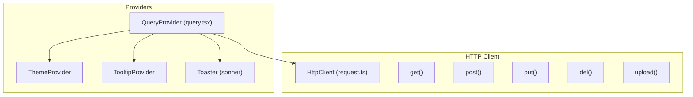
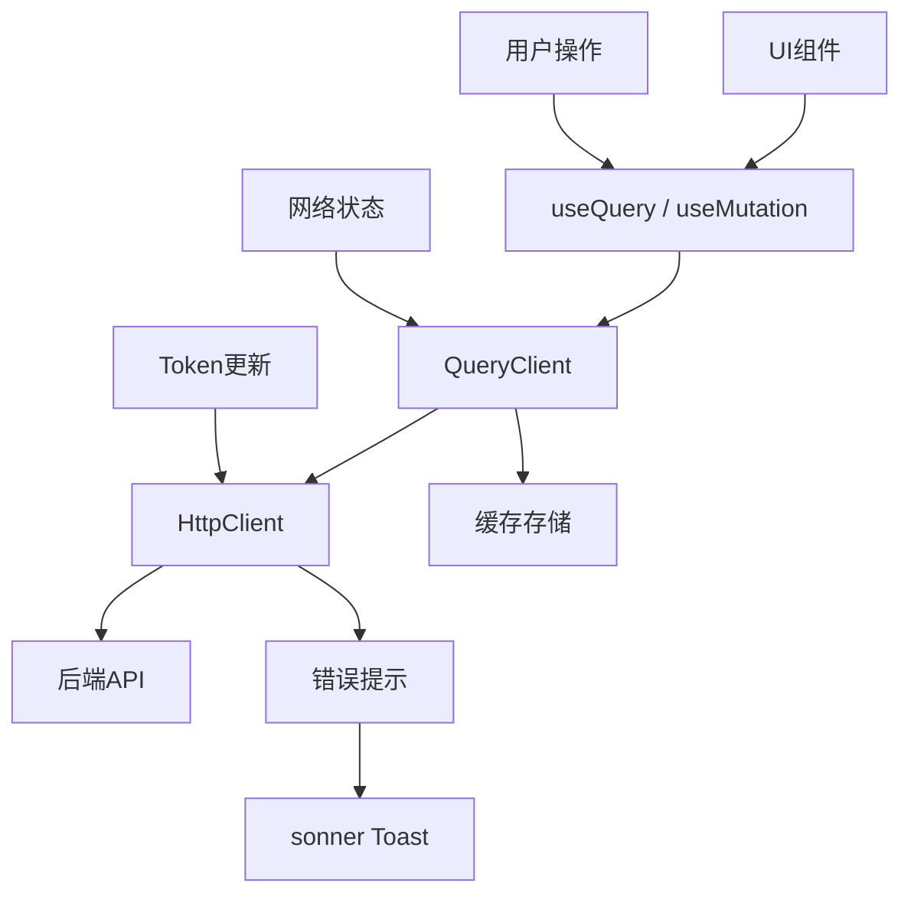
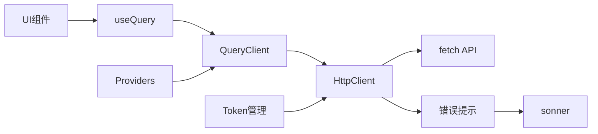

# React Query集成

<cite>
**本文档引用的文件**  
- [query.tsx](file://src/components/providers/query.tsx)
- [request.ts](file://src/lib/request.ts)
</cite>

## 目录

1. [简介](#简介)
2. [项目结构](#项目结构)
3. [核心组件](#核心组件)
4. [架构概览](#架构概览)
5. [详细组件分析](#详细组件分析)
6. [依赖分析](#依赖分析)
7. [性能考虑](#性能考虑)
8. [故障排除指南](#故障排除指南)
9. [结论](#结论)

## 简介

本文档详细说明了`HttpClient`与`@tanstack/react-query`在项目中的深度集成方案。重点介绍`QueryProvider`如何配置默认选项，如数据缓存时间、重试策略、网络状态感知等，并展示如何将`request.get`等方法作为`queryFn`传递给`useQuery`，实现高效的数据获取与缓存管理。同时涵盖分页、无限滚动、依赖查询等高级场景的实现方式，以及`useMutation`如何调用`request.post/put`进行数据变更并自动触发缓存无效化以保持UI同步。最后提供性能优化建议。

## 项目结构

项目采用标准的Next.js应用结构，主要功能模块集中在`src`目录下。与React Query集成相关的文件位于：

- `src/components/providers/query.tsx`：封装`QueryClientProvider`并配置全局默认行为
- `src/lib/request.ts`：封装HTTP客户端，提供强类型请求方法
- `src/components/providers/index.tsx`：组合多个Provider（包括QueryProvider）

该结构实现了关注点分离，便于维护和扩展。



**图示来源**

- [query.tsx](file://src/components/providers/query.tsx#L1-L45)
- [request.ts](file://src/lib/request.ts#L1-L191)

## 核心组件

### QueryProvider 配置

`QueryProvider`组件封装了`@tanstack/react-query`的`QueryClientProvider`，通过`useState`创建单例`QueryClient`实例，确保客户端和服务端一致性。

关键配置项如下：

- **staleTime**: 5分钟（300000毫秒），定义数据变为“陈旧”的时间
- **gcTime**: 5分钟（300000毫秒），定义数据在内存中的保留时间
- **retry**: 查询重试3次，突变操作重试1次
- **retryDelay**: 指数退避策略，延迟时间为`min(1000 * 2^attemptIndex, 30000)`，最大30秒
- **refetchOnWindowFocus**: 窗口重新聚焦时不自动刷新数据，避免频繁请求
- **refetchOnReconnect**: 网络重连时自动刷新数据，提升离线体验

```tsx
const [queryClient] = useState(
  () =>
    new QueryClient({
      defaultOptions: {
        queries: {
          staleTime: 5 * 60 * 1000,
          gcTime: 5 * 60 * 1000,
          retry: 3,
          retryDelay: (attemptIndex) =>
            Math.min(1000 * 2 ** attemptIndex, 30000),
          refetchOnWindowFocus: false,
          refetchOnReconnect: true,
        },
        mutations: {
          retry: 1,
          retryDelay: 1000,
        },
      },
    }),
);
```

此配置平衡了数据新鲜度、用户体验和网络负载。

**组件来源**

- [query.tsx](file://src/components/providers/query.tsx#L10-L40)

### HttpClient 请求封装

`HttpClient`类提供强类型的HTTP请求封装，支持GET、POST、PUT、PATCH、DELETE和文件上传方法。

核心特性包括：

- 自动拼接`baseURL`和查询参数
- 支持JSON和FormData请求体
- 自动处理响应类型（JSON、文本、Blob）
- 统一错误处理与提示（通过`sonner`）
- 支持Token更新（`updateToken`方法）

```tsx
export class HttpClient {
  private baseURL: string;
  private defaultHeaders: Record<string, string>;

  constructor(config: RequestConfig = {}) {
    this.baseURL = config.baseURL || '';
    this.defaultHeaders = {
      'Content-Type': 'application/json',
      ...config.headers,
    };
  }

  updateToken(token: string) {
    this.defaultHeaders['token'] = `${token}`;
  }

  async request<T>(
    url: string,
    options: RequestOptions = {},
  ): Promise<ApiResponse<T>> {
    // 实现请求逻辑
  }

  get<T>(url: string, params?: Record<string, any>, options?: RequestOptions) {
    return this.request<T>(url, { ...options, method: 'GET', params });
  }

  post<T = unknown, B = unknown>(
    url: string,
    data?: B,
    options?: Omit<RequestOptions, 'data'>,
  ) {
    return this.request<T>(url, { ...options, method: 'POST', data });
  }
  // 其他方法...
}
```

**组件来源**

- [request.ts](file://src/lib/request.ts#L1-L191)

## 架构概览

系统采用分层架构，前端通过`HttpClient`与后端API通信，`React Query`作为状态管理层，负责数据缓存、同步和UI更新。



**图示来源**

- [query.tsx](file://src/components/providers/query.tsx#L1-L45)
- [request.ts](file://src/lib/request.ts#L1-L191)

## 详细组件分析

### 数据获取与缓存管理

通过将`http.get`作为`queryFn`传递给`useQuery`，实现声明式数据获取。

```tsx
import { http } from '@/lib/request';
import { useQuery } from '@tanstack/react-query';

function useUserData(userId: string) {
  return useQuery({
    queryKey: ['user', userId],
    queryFn: () => http.get(`/api/users/${userId}`),
    enabled: !!userId,
  });
}
```

- `queryKey`唯一标识数据
- `enabled`控制查询是否执行
- React Query自动处理加载、错误、缓存状态

### 分页与无限滚动

使用`useInfiniteQuery`实现无限滚动：

```tsx
function useInfinitePosts() {
  return useInfiniteQuery({
    queryKey: ['posts'],
    queryFn: ({ pageParam = 1 }) =>
      http.get('/api/posts', { params: { page: pageParam } }),
    getNextPageParam: (lastPage, pages) => {
      // 返回下一页参数
      return lastPage.data.hasNext ? pages.length + 1 : undefined;
    },
  });
}
```

### 依赖查询（Dependent Queries）

当查询依赖于前一个查询的结果时，使用`enabled`条件：

```tsx
function UserDetail({ userId }: { userId: string }) {
  const { data: user } = useUser(userId);
  const { data: posts } = useQuery({
    queryKey: ['user-posts', userId],
    queryFn: () => http.get(`/api/users/${userId}/posts`),
    enabled: !!user, // 仅当user存在时执行
  });
}
```

### 数据变更与缓存无效化

`useMutation`用于数据变更，并通过`queryClient.invalidateQueries`触发缓存无效化：

```tsx
import { useMutation, useQueryClient } from '@tanstack/react-query';

function useCreatePost() {
  const queryClient = useQueryClient();

  return useMutation({
    mutationFn: (postData) => http.post('/api/posts', postData),
    onSuccess: () => {
      // 使相关查询失效，触发重新获取
      queryClient.invalidateQueries({ queryKey: ['posts'] });
      queryClient.invalidateQueries({ queryKey: ['dashboard-stats'] });
    },
  });
}
```

### 性能优化建议

#### 选择性数据抓取（Select）

使用`select`选项从响应中提取所需字段，避免不必要的渲染：

```tsx
useQuery({
  queryKey: ['user', id],
  queryFn: () => http.get(`/api/users/${id}`),
  select: (data) => ({
    name: data.name,
    email: data.email,
  }),
});
```

#### 加载状态管理

合理使用`isPending`、`isError`、`isSuccess`状态：

```tsx
const { data, isPending, isError } = useQuery({ ... });

if (isPending) return <Skeleton />;
if (isError) return <ErrorFallback />;
return <UserData data={data} />;
```

#### 预取数据（Prefetching）

在用户操作前预取数据，提升体验：

```tsx
function onHover() {
  queryClient.prefetchQuery({
    queryKey: ['project', projectId],
    queryFn: () => http.get(`/api/projects/${projectId}`),
  });
}
```

**组件来源**

- [query.tsx](file://src/components/providers/query.tsx#L1-L45)
- [request.ts](file://src/lib/request.ts#L1-L191)

## 依赖分析

项目核心依赖关系清晰，无循环依赖。



- `HttpClient`独立于React Query，可单独使用
- `QueryProvider`依赖`HttpClient`进行网络请求
- `sonner`用于全局错误提示，解耦于业务逻辑

**图示来源**

- [query.tsx](file://src/components/providers/query.tsx#L1-L45)
- [request.ts](file://src/lib/request.ts#L1-L191)

## 性能考虑

- **缓存策略**：5分钟的`staleTime`和`gcTime`平衡了数据新鲜度与性能
- **重试机制**：指数退避减少服务器压力
- **网络感知**：`refetchOnReconnect`提升离线体验
- **内存管理**：合理的`gcTime`防止内存泄漏
- **批量更新**：React Query自动批处理状态更新

## 故障排除指南

- **查询不触发**：检查`enabled`条件是否为`true`
- **缓存未更新**：确认`invalidateQueries`的`queryKey`匹配
- **重复请求**：检查`staleTime`设置和`refetchOnWindowFocus`
- **类型错误**：确保`HttpClient`的泛型参数正确
- **Token失效**：`HttpClient`自动处理401错误并清除本地存储

**组件来源**

- [request.ts](file://src/lib/request.ts#L75-L85)
- [query.tsx](file://src/components/providers/query.tsx#L20-L30)

## 结论

本项目通过`HttpClient`与`@tanstack/react-query`的深度集成，实现了高效、可靠的数据管理方案。`QueryProvider`的全局配置确保了一致的行为，`HttpClient`的强类型封装提升了代码质量。结合分页、依赖查询、缓存无效化等高级特性，构建了响应迅速、用户体验良好的应用。建议在实际使用中根据业务需求调整缓存时间和重试策略，并充分利用`select`和预取功能优化性能。
