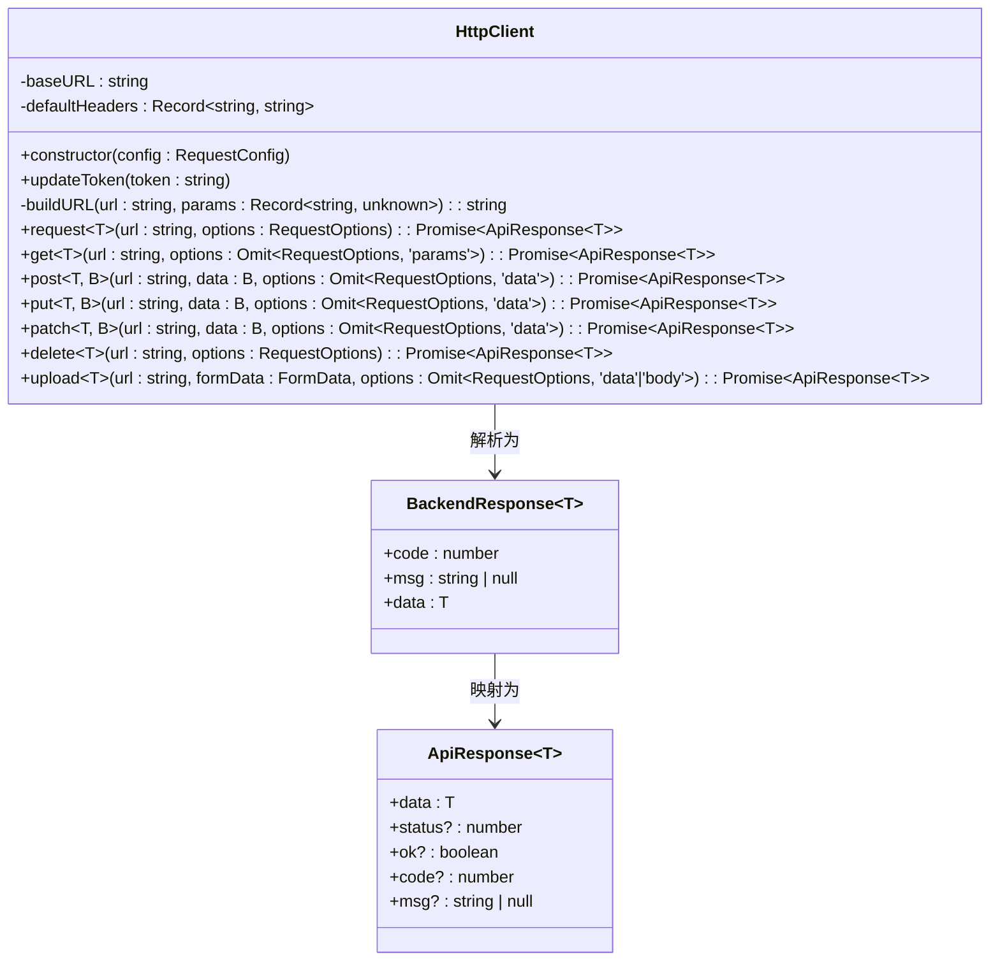
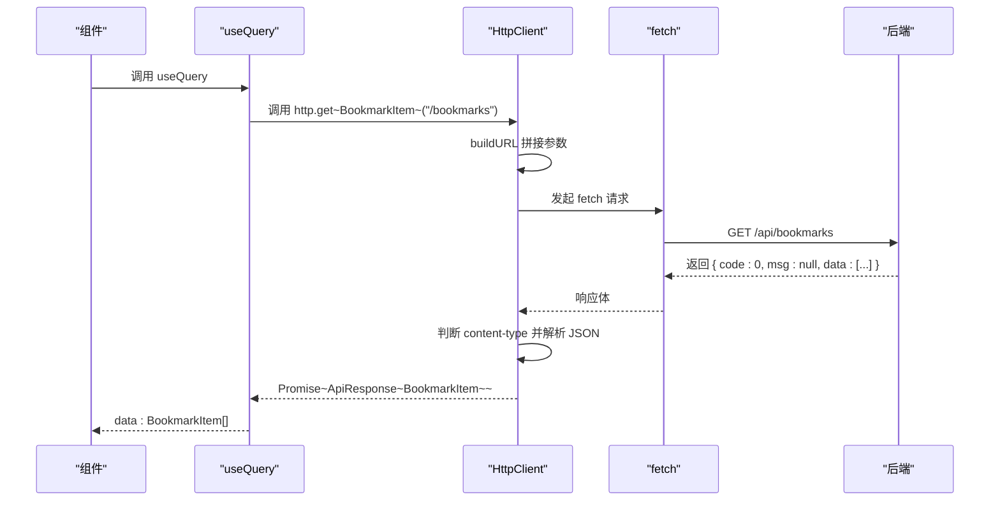

# 类型安全请求

<cite>
**本文档引用文件**  
- [request.ts](file://src/lib/request.ts#L1-L190)
- [query.tsx](file://src/components/providers/query.tsx#L1-L45)
</cite>

## 目录

1. [简介](#简介)
2. [项目结构](#项目结构)
3. [核心组件](#核心组件)
4. [架构概览](#架构概览)
5. [详细组件分析](#详细组件分析)
6. [依赖分析](#依赖分析)
7. [性能考量](#性能考量)
8. [故障排除指南](#故障排除指南)
9. [结论](#结论)

## 简介

本文档详细说明了在前端项目中如何通过 TypeScript 泛型实现类型安全的 API 通信。重点分析 `HttpClient` 类的设计与实现，展示其如何利用泛型 `<T>` 实现强类型响应解析，确保编译期类型安全。同时结合 React Query 的使用，说明请求重试、缓存策略与错误处理机制，并提供完整的类型流动示例。

## 项目结构

项目采用 Next.js 应用路由结构，主要分为 `app`、`components`、`hooks` 和 `lib` 四个核心目录。`lib` 目录存放工具类和网络请求模块，`components` 包含 UI 组件及状态管理提供者，`app` 为页面入口。

```mermaid
graph TB
subgraph "页面入口"
A[src/app/(main)/page.tsx]
B[src/app/popup/page.tsx]
end
subgraph "核心逻辑"
C[src/lib/request.ts] --> D[HttpClient]
E[src/components/providers/query.tsx] --> F[QueryProvider]
end
A --> C
B --> C
C --> F
```

**图示来源**

- [request.ts](file://src/lib/request.ts#L1-L190)
- [query.tsx](file://src/components/providers/query.tsx#L1-L45)

**章节来源**

- [request.ts](file://src/lib/request.ts#L1-L190)
- [query.tsx](file://src/components/providers/query.tsx#L1-L45)

## 核心组件

`HttpClient` 是项目中负责所有 HTTP 请求的核心类，封装了 `fetch` API 并通过泛型实现类型安全的响应解析。其设计目标是避免使用 `any` 类型，确保从 API 响应到前端状态的数据流全程具备类型保障。

关键特性包括：

- 支持泛型 `<T>` 指定响应数据类型
- 自动序列化请求体（JSON 或 FormData）
- 支持 URL 参数拼接
- 统一处理后端响应结构（code/msg/data）
- 集成 `sonner` 提示登录过期等错误

**章节来源**

- [request.ts](file://src/lib/request.ts#L1-L190)

## 架构概览

系统通过 `HttpClient` 与 `React Query` 协同工作，形成完整的类型安全请求链路。`HttpClient` 负责底层请求与类型解析，`QueryProvider` 配置全局查询策略，如缓存时间、重试机制等。

```mermaid
graph LR
A[前端组件] --> B[useQuery / useMutation]
B --> C[HttpClient.get / post]
C --> D[fetch]
D --> E[后端 API]
E --> D
D --> C
C --> B
B --> A
F[QueryProvider] --> B : 提供 QueryClient 配置
```

**图示来源**

- [request.ts](file://src/lib/request.ts#L1-L190)
- [query.tsx](file://src/components/providers/query.tsx#L1-L45)

## 详细组件分析

### HttpClient 类分析

`HttpClient` 类通过泛型 `<T>` 实现强类型响应，确保开发者在编译阶段即可发现类型错误。

#### 类结构图



**图示来源**

- [request.ts](file://src/lib/request.ts#L1-L190)

#### 请求流程序列图



**图示来源**

- [request.ts](file://src/lib/request.ts#L1-L190)

### 类型定义与泛型应用

项目中定义了统一的响应结构，确保前后端通信类型一致。

```typescript
// 后端响应结构
interface BackendResponse<T> {
  code: number;
  msg: string | null;
  data: T;
}

// 客户端响应结构
interface ApiResponse<T> {
  data: T;
  status?: number;
  ok?: boolean;
  code?: number;
  msg?: string | null;
}
```

使用示例：

```typescript
interface BookmarkItem {
  id: string;
  title: string;
  url: string;
}

// 编译期即可检查类型
const response = await http.get<BookmarkItem[]>('/bookmarks');
// response.data 类型为 BookmarkItem[]
```

**章节来源**

- [request.ts](file://src/lib/request.ts#L1-L190)

### 与 React Query 集成

`QueryProvider` 封装了 `QueryClient`，配置了全局查询策略，包括缓存时间、重试机制等。

```tsx
const [queryClient] = useState(
  () =>
    new QueryClient({
      defaultOptions: {
        queries: {
          staleTime: 5 * 60 * 1000, // 5分钟
          gcTime: 5 * 60 * 1000, // 5分钟
          retry: 3,
          retryDelay: (attemptIndex) =>
            Math.min(1000 * 2 ** attemptIndex, 30000),
          refetchOnWindowFocus: false,
          refetchOnReconnect: true,
        },
        mutations: {
          retry: 1,
          retryDelay: 1000,
        },
      },
    }),
);
```

此配置确保：

- 查询数据缓存 5 分钟
- 最多重试 3 次，指数退避延迟
- 窗口聚焦时不自动刷新
- 网络重连时自动重试

**章节来源**

- [query.tsx](file://src/components/providers/query.tsx#L1-L45)

## 依赖分析

项目主要依赖 `@tanstack/react-query` 进行状态管理，`sonner` 用于消息提示，`fetch` 作为底层网络请求。

```mermaid
graph TD
A[HttpClient] --> B[fetch]
A --> C[sonner]
D[QueryProvider] --> E[@tanstack/react-query]
F[页面组件] --> A
F --> D
```

**图示来源**

- [request.ts](file://src/lib/request.ts#L1-L190)
- [query.tsx](file://src/components/providers/query.tsx#L1-L45)

**章节来源**

- [request.ts](file://src/lib/request.ts#L1-L190)
- [query.tsx](file://src/components/providers/query.tsx#L1-L45)

## 性能考量

- **缓存策略**：React Query 的 `staleTime` 和 `gcTime` 有效减少重复请求
- **重试机制**：指数退避避免服务雪崩
- **类型安全**：编译期检查减少运行时错误
- **错误处理**：统一拦截 401 状态码并清除登录状态

## 故障排除指南

常见问题及解决方案：

1. **类型推断失败**
   - 确保泛型 `<T>` 明确指定
   - 检查接口定义是否匹配后端返回结构

2. **请求未携带 token**
   - 调用 `http.updateToken(token)` 更新 token
   - 检查 `defaultHeaders` 是否正确设置

3. **FormData 请求失败**
   - 确保未手动设置 `Content-Type`，`HttpClient` 会自动删除该头

4. **React Query 缓存未更新**
   - 检查 `staleTime` 配置
   - 手动调用 `queryClient.invalidateQueries`

**章节来源**

- [request.ts](file://src/lib/request.ts#L1-L190)
- [query.tsx](file://src/components/providers/query.tsx#L1-L45)

## 结论

通过 `HttpClient` 的泛型设计与 `React Query` 的集成，项目实现了端到端的类型安全请求机制。开发者可在编译阶段捕获类型错误，提升开发效率与系统稳定性。建议在所有 API 调用中明确指定泛型类型，并结合 zod 等库进行运行时验证，进一步增强健壮性。
