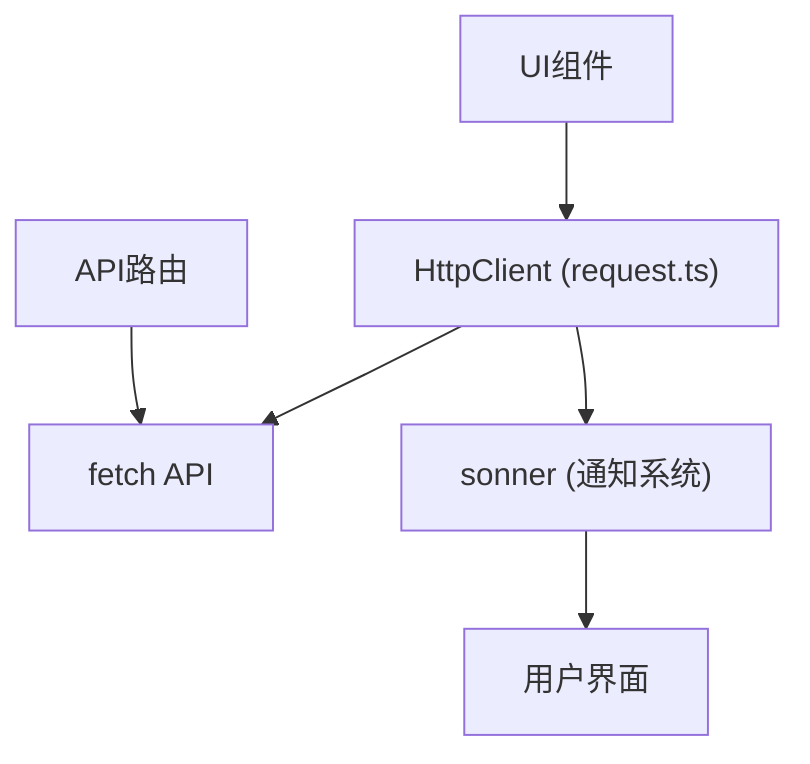
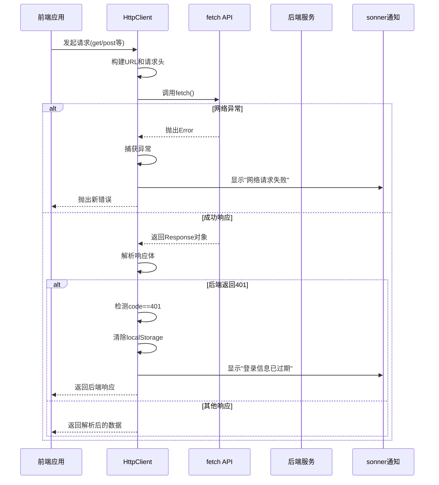
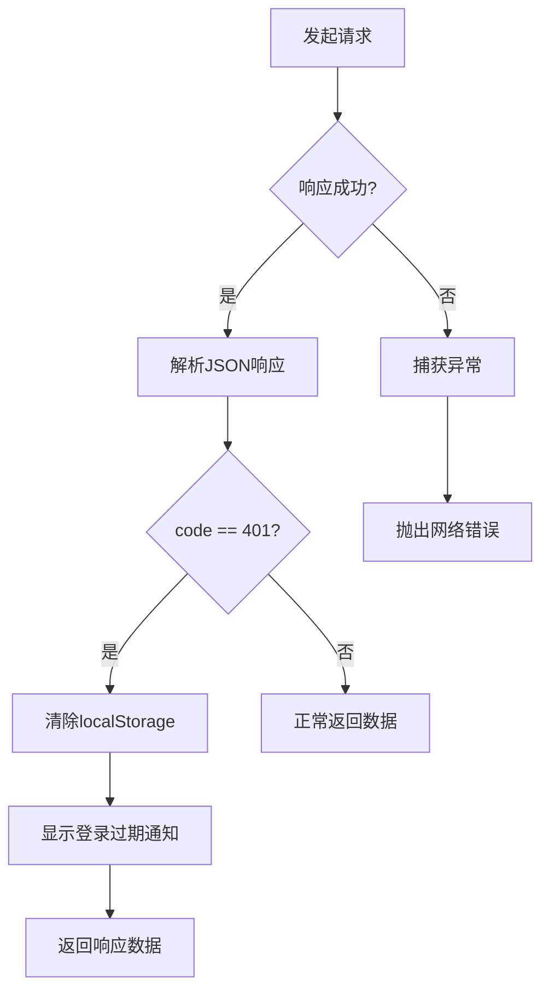

# 错误处理机制

<cite>
**本文档引用的文件**  
- [request.ts](file://src/lib/request.ts)
- [sonner.tsx](file://src/components/ui/sonner.tsx)
</cite>

## 目录

1. [简介](#简介)
2. [项目结构](#项目结构)
3. [核心组件](#核心组件)
4. [错误处理流程](#错误处理流程)
5. [错误对象结构设计](#错误对象结构设计)
6. [401未授权处理逻辑](#401未授权处理逻辑)
7. [UI层错误提示集成](#ui层错误提示集成)

## 简介

本文档全面描述了`HttpClient`类中的错误处理策略，涵盖网络请求失败时的异常捕获、响应解析、用户提示等完整流程。重点分析了401状态码下的自动登出机制，并展示了如何通过`sonner`通知系统向用户展示友好的错误反馈。

## 项目结构

项目采用标准的Next.js应用结构，核心请求逻辑封装在`src/lib/request.ts`中，UI组件位于`src/components`目录下。错误处理主要集中在HTTP客户端实现与通知系统的集成。



**图示来源**

- [request.ts](file://src/lib/request.ts)
- [sonner.tsx](file://src/components/ui/sonner.tsx)

## 核心组件

`HttpClient`类是整个应用的HTTP请求核心，提供了强类型的请求封装，支持GET、POST、PUT、PATCH、DELETE及文件上传等操作。该类通过`fetch` API实现底层通信，并集成`sonner`进行用户通知。

**组件来源**

- [request.ts](file://src/lib/request.ts#L1-L190)

## 错误处理流程

`HttpClient`类的`request`方法统一处理所有HTTP请求的错误情况，包括网络中断、超时、非2xx响应等。错误处理分为两个层面：JavaScript异常和后端业务错误。



**图示来源**

- [request.ts](file://src/lib/request.ts#L79-L123)

**组件来源**

- [request.ts](file://src/lib/request.ts#L79-L123)

## 错误对象结构设计

错误处理涉及两种响应结构：API响应结构和异常对象结构。

### API响应结构

```typescript
interface BackendResponse<T> {
  code: number; // 后端业务状态码
  msg: string | null; // 后端消息
  data: T; // 实际数据
}
```

### 客户端响应结构

```typescript
interface ApiResponse<T> {
  data: T;
  status?: number; // HTTP状态码
  ok?: boolean; // fetch的ok属性
  code?: number; // 后端业务状态码
  msg?: string | null; // 后端消息
}
```

当请求发生JavaScript异常时，会抛出标准`Error`对象，包含错误消息。

**组件来源**

- [request.ts](file://src/lib/request.ts#L10-L25)

## 401未授权处理逻辑

系统对401未授权状态码有专门的处理机制，但**不包含token刷新与请求重放逻辑**，而是直接执行登出操作。

### 处理流程

1. 发起请求
2. 接收响应
3. 检查响应是否为JSON格式
4. 解析JSON响应
5. 判断`code`字段是否等于401
6. 若是401：
   - 清除`localStorage`中所有数据
   - 通过`sonner.error()`显示"登录信息已过期，请重新登录"
7. 返回原始响应数据



**图示来源**

- [request.ts](file://src/lib/request.ts#L100-L105)

**组件来源**

- [request.ts](file://src/lib/request.ts#L100-L105)

## UI层错误提示集成

系统使用`sonner`作为通知系统，在请求失败时向用户展示错误提示。

### 集成方式

1. 在`request.ts`中导入`toast`：

```typescript
import { toast } from 'sonner';
```

2. 当检测到401错误时调用：

```typescript
toast.error('登录信息已过期，请重新登录');
```

3. `sonner`的`Toaster`组件在UI层渲染：

```tsx
// src/components/ui/sonner.tsx
import { Toaster as Sonner } from 'sonner';

const Toaster = () => {
  return <Sonner theme={theme} />;
};
```

### 通知样式定制

通过CSS变量自定义了通知的外观：

- `--normal-bg`: 背景颜色（使用`--popover`变量）
- `--normal-text`: 文本颜色（使用`--popover-foreground`变量）
- `--normal-border`: 边框颜色（使用`--border`变量）

这确保了通知组件与应用的整体主题保持一致。

**组件来源**

- [request.ts](file://src/lib/request.ts#L1)
- [sonner.tsx](file://src/components/ui/sonner.tsx#L1-L25)
