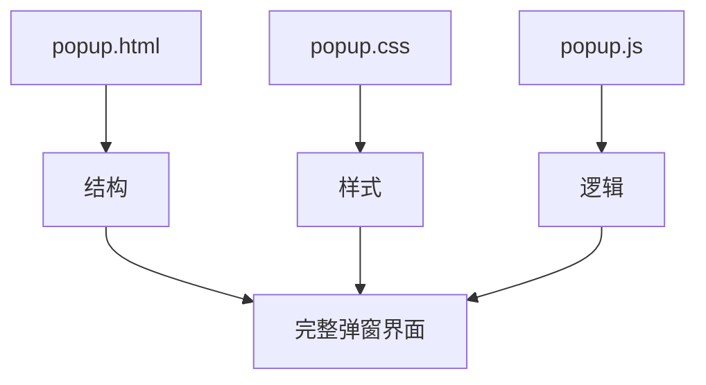
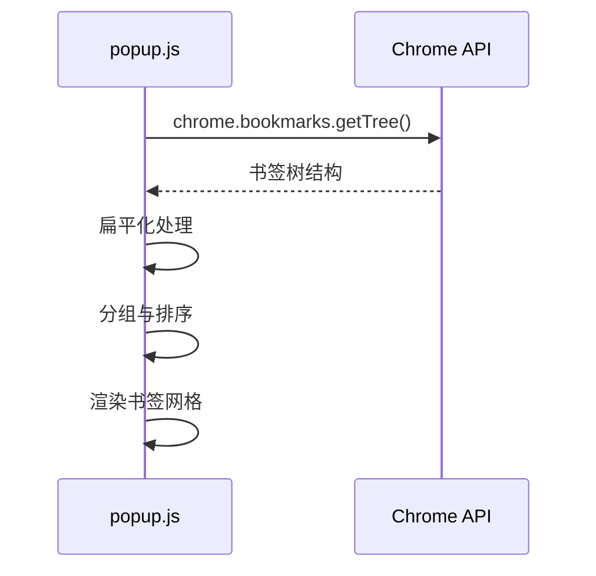
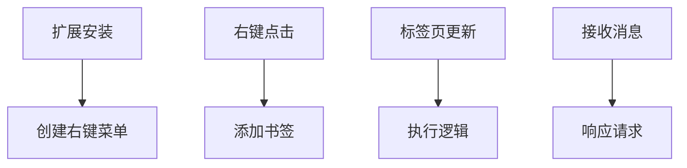
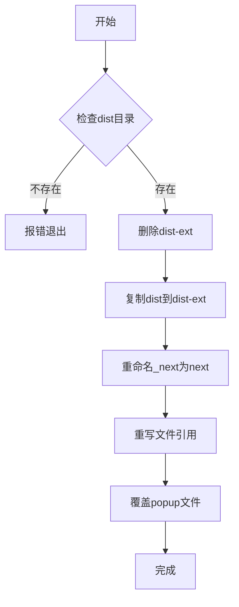

# PWA与浏览器扩展支持

<cite>
**本文档引用的文件**   
- [manifest.json](file://public/manifest.json)
- [popup.html](file://public/popup.html)
- [popup.js](file://public/popup.js)
- [background.js](file://public/background.js)
- [build-ext.mjs](file://scripts/build-ext.mjs)
</cite>

## 目录

1. [项目结构分析](#项目结构分析)
2. [PWA功能实现](#pwa功能实现)
3. [浏览器扩展核心组件](#浏览器扩展核心组件)
4. [弹窗界面与通信机制](#弹窗界面与通信机制)
5. [后台脚本生命周期](#后台脚本生命周期)
6. [构建脚本工作流程](#构建脚本工作流程)
7. [扩展安装与调试指南](#扩展安装与调试指南)
8. [自定义配置与安全策略](#自定义配置与安全策略)

## 项目结构分析

本项目采用典型的前后端分离架构，结合Next.js框架与浏览器扩展能力。主要目录包括：

- `public/`：存放浏览器扩展所需的静态资源文件（如`popup.html`、`background.js`等）
- `src/`：Next.js应用源码，包含页面、组件和工具函数
- `scripts/`：构建脚本，用于生成扩展包
- 根目录：配置文件（`package.json`、`next.config.ts`等）

浏览器扩展功能主要依赖`public`目录下的文件，而PWA能力则通过`manifest.json`实现。

**Section sources**

- [manifest.json](file://public/manifest.json)
- [popup.html](file://public/popup.html)

## PWA功能实现

### manifest.json关键字段解析

`manifest.json`是实现PWA安装与桌面快捷方式的核心配置文件。其关键字段如下：

- **name**: "OneNav - 书签管理与快速搜索" —— 定义应用的完整名称，显示在安装提示和桌面快捷方式中
- **short_name**: "OneNav" —— 简短名称，用于空间有限的显示场景（如桌面图标下方）
- **start_url**: 未显式定义，使用默认值"/" —— 指定应用启动时加载的页面
- **icons**: 定义不同尺寸的应用图标，支持从16x16到512x512的多种分辨率，确保在各种设备和场景下都能清晰显示
- **description**: 应用功能描述，增强用户理解和信任
- **homepage_url**: 官方网站链接，提供更多信息入口

```json
{
  "name": "OneNav - 书签管理与快速搜索",
  "short_name": "OneNav",
  "icons": {
    "16": "favicon-16x16.png",
    "32": "favicon-32x32.png",
    "128": "pwa-192x192.png",
    "256": "pwa-512x512.png",
    "512": "pwa-512x512.png"
  }
}
```

### Service Worker与离线访问

虽然`manifest.json`中未显式声明`service_worker`字段，但Next.js框架在构建时会自动生成并注册Service Worker。该Service Worker负责：

- 缓存关键资源（HTML、CSS、JS、图标等）
- 实现离线访问能力
- 支持后台同步和推送通知
- 管理缓存策略，确保应用更新时能正确获取最新资源

当用户访问应用时，Service Worker会拦截网络请求，优先从缓存中提供资源，从而实现快速加载和离线使用。

**Section sources**

- [manifest.json](file://public/manifest.json)

## 浏览器扩展核心组件

### 扩展三件套：popup.html/js/css

浏览器扩展的弹窗界面由三个核心文件构成：

- **popup.html**: 定义弹窗的HTML结构，包含搜索框、书签网格、工具按钮等UI元素
- **popup.css**: 样式文件，控制弹窗的视觉呈现（未在上下文中提供，但被引用）
- **popup.js**: 核心逻辑脚本，处理书签加载、渲染、交互等功能



**Diagram sources**

- [popup.html](file://public/popup.html)
- [popup.js](file://public/popup.js)

### 功能模块划分

弹窗界面分为三个主要区域：

1. **搜索区**: 位于顶部，包含搜索输入框，支持实时过滤书签
2. **最近添加区**: 显示最近添加的12个书签，方便快速访问
3. **工具区**: 提供固定标签、静音、关闭重复标签等实用功能

**Section sources**

- [popup.html](file://public/popup.html)
- [popup.js](file://public/popup.js)

## 弹窗界面与通信机制

### 状态管理

`popup.js`通过一个全局`state`对象管理应用状态：

- **editing**: 布尔值，表示是否处于编辑模式
- **folders**: 书签文件夹数组，包含每个文件夹的ID、标题和子书签
- **recent**: 最近添加的书签数组
- **mapParent**: 书签ID到顶层文件夹ID的映射

```javascript
const state = {
  editing: false,
  folders: [],
  recent: [],
  mapParent: {},
};
```

### 书签加载与渲染

1. **加载书签树**: 使用`chrome.bookmarks.getTree()`获取完整的书签数据结构
2. **扁平化处理**: 将树形结构转换为扁平数组，便于排序和过滤
3. **分组处理**: 以"书签栏"和"其他书签"的直接子目录作为顶层分组
4. **渲染网格**: 为每个书签生成"app tile"，包含图标、标题和删除按钮



**Diagram sources**

- [popup.js](file://public/popup.js#L50-L150)

### 交互功能实现

- **点击打开**: 单击书签在当前或新标签页打开链接
- **双击重命名**: 双击书签弹出对话框进行重命名
- **右键编辑**: 右键点击进入编辑模式，支持拖拽排序
- **拖拽排序**: 在同一文件夹内通过拖拽调整书签顺序，调用`chrome.bookmarks.move()`实现

**Section sources**

- [popup.js](file://public/popup.js)

## 后台脚本生命周期

### background.js核心功能

`background.js`作为扩展的后台脚本，负责监听和响应各种事件：

```javascript
// 监听扩展安装
chrome.runtime.onInstalled.addListener((details) => {
  if (details.reason === 'install') {
    // 创建右键菜单
    chrome.contextMenus.create({
      id: 'add-bookmark',
      title: '添加到 OneNav 书签',
      contexts: ['page', 'link'],
    });
  }
});
```

### 事件监听机制

1. **安装事件**: 扩展首次安装时创建右键菜单项
2. **右键菜单点击**: 监听用户点击右键菜单，将当前页面或链接添加为书签
3. **标签页更新**: 监听标签页状态变化，可在此添加标签页相关逻辑
4. **消息通信**: 处理来自弹窗或其他部分的消息请求



**Diagram sources**

- [background.js](file://public/background.js)

### 消息通信模式

后台脚本通过`chrome.runtime.onMessage.addListener`接收来自弹窗的消息：

```javascript
chrome.runtime.onMessage.addListener((request, sender, sendResponse) => {
  if (request.action === 'getData') {
    sendResponse({ data: 'Hello from background!' });
  }
  return true; // 保持消息通道开放
});
```

这种模式支持弹窗向后台请求数据或触发操作。

**Section sources**

- [background.js](file://public/background.js)

## 构建脚本工作流程

### build-ext.mjs执行流程

`build-ext.mjs`脚本负责将Next.js构建输出转换为浏览器扩展可用的格式：



**Diagram sources**

- [build-ext.mjs](file://scripts/build-ext.mjs)

### 详细步骤解析

1. **环境检查**: 验证`dist`目录是否存在，确保已执行过`npm run build`
2. **清理目标**: 删除旧的`dist-ext`目录
3. **复制文件**: 将`dist`目录完整复制到`dist-ext`
4. **重命名目录**: 将`_next`目录重命名为`next`，避免Chrome扩展的安全限制
5. **重写引用**: 遍历所有HTML、CSS、JS文件，将`/_next/`替换为`/next/`
6. **覆盖弹窗文件**: 用`public`目录下的静态文件覆盖`dist-ext`中的对应文件

```javascript
async function rewriteFiles(root) {
  const stack = [root];
  while (stack.length) {
    const dir = stack.pop();
    const entries = await fs.readdir(dir, { withFileTypes: true });
    for (const e of entries) {
      const p = path.join(dir, e.name);
      if (e.isDirectory()) {
        stack.push(p);
        continue;
      }
      const isText = /\.(html?|css|js|mjs|cjs|json|txt|map)$/.test(e.name);
      if (!isText) continue;
      const content = await fs.readFile(p, 'utf8');
      const replaced = content
        .replaceAll('/_next/', '/next/')
        .replaceAll('./_next/', './next/')
        .replaceAll('"/_next/', '"/next/')
        .replaceAll("'/_next/", "'/next/");
      if (replaced !== content) await fs.writeFile(p, replaced);
    }
  }
}
```

### 版本信息注入

虽然当前脚本未显式注入版本信息，但`manifest.json`中的`version`字段（"0.1.0"）会在构建时被保留，确保扩展包具有正确的版本标识。

**Section sources**

- [build-ext.mjs](file://scripts/build-ext.mjs)

## 扩展安装与调试指南

### Chrome开发者模式加载

1. 打开Chrome浏览器，进入`chrome://extensions/`
2. 开启右上角的"开发者模式"
3. 点击"加载已解压的扩展程序"
4. 选择`dist-ext`目录
5. 扩展将被加载并显示在扩展管理页面

### 调试方法

1. **弹窗调试**: 右键点击扩展图标，选择"检查弹出窗口"
2. **后台脚本调试**: 在`chrome://extensions/`页面，找到OneNav扩展，点击"背景页"链接
3. **控制台日志**: `background.js`中的`console.log`语句将在后台页面控制台输出
4. **错误排查**: 检查`chrome://extensions/`中的错误信息，确保所有权限和资源正确配置

### 常见问题解决

- **\_next目录问题**: Chrome扩展不允许下划线开头的目录，因此必须重命名为`next`
- **CSP限制**: 内容安全策略限制了脚本来源，确保所有资源来自`'self'`
- **权限问题**: 确保`manifest.json`中声明了必要的权限（bookmarks, storage, tabs等）

**Section sources**

- [manifest.json](file://public/manifest.json)
- [build-ext.mjs](file://scripts/build-ext.mjs)

## 自定义配置与安全策略

### 图标自定义

通过`manifest.json`的`icons`字段配置不同尺寸的图标：

```json
"icons": {
    "16": "favicon-16x16.png",
    "32": "favicon-32x32.png",
    "128": "pwa-192x192.png",
    "256": "pwa-512x512.png",
    "512": "pwa-512x512.png"
}
```

建议提供16、32、48、128、256、512等标准尺寸的PNG图标。

### 权限配置

`manifest.json`中声明了以下权限：

- **bookmarks**: 访问和修改书签
- **storage**: 存储扩展设置和数据
- **tabs**: 访问和控制标签页
- **activeTab**: 在当前活动标签页执行操作
- **contextMenus**: 创建和管理右键菜单

```json
"permissions": [
    "bookmarks",
    "storage",
    "tabs",
    "activeTab",
    "contextMenus"
]
```

### 内容安全策略（CSP）

`manifest.json`定义了严格的内容安全策略：

```json
"content_security_policy": {
    "extension_pages": "script-src 'self'; object-src 'self'; img-src 'self' data: blob: https://www.google.com https://*.google.com https://*.gstatic.com https://icons.duckduckgo.com; connect-src 'self';"
}
```

该策略：

- 仅允许执行本地脚本（`script-src 'self'`）
- 限制图像来源，包括Google和DuckDuckGo的图标服务
- 防止跨站脚本攻击（XSS）

**Section sources**

- [manifest.json](file://public/manifest.json)
