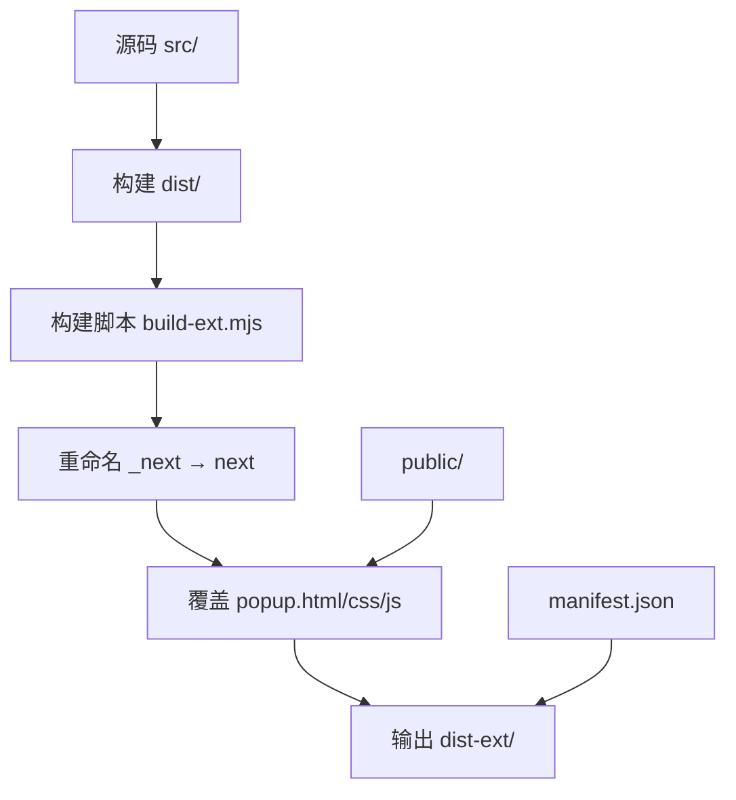
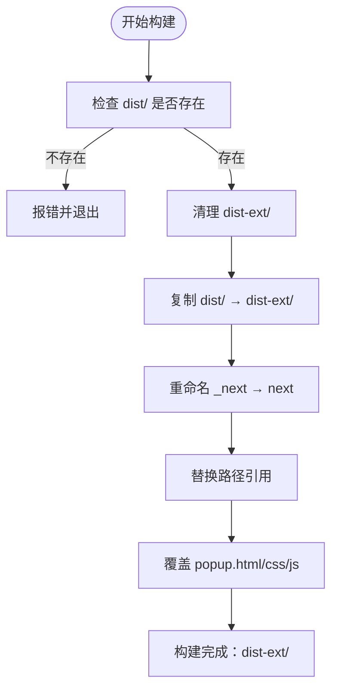
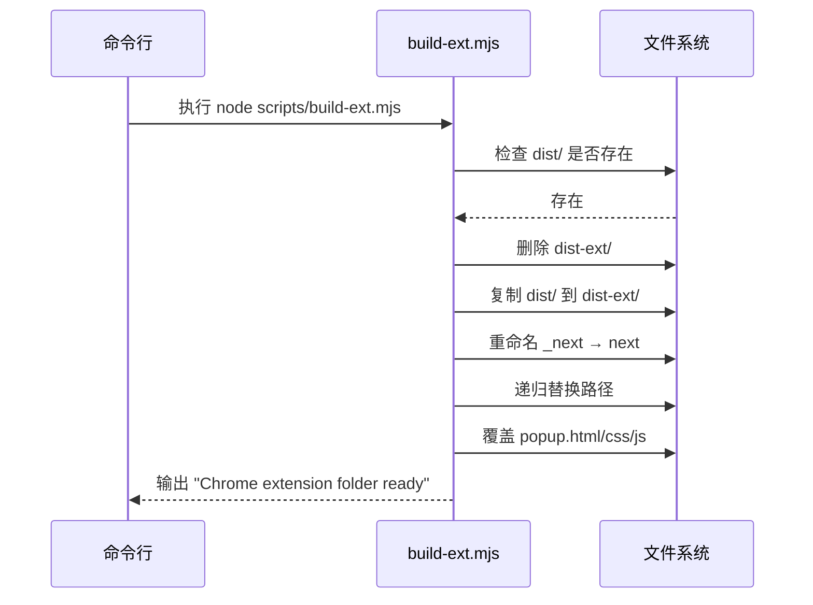
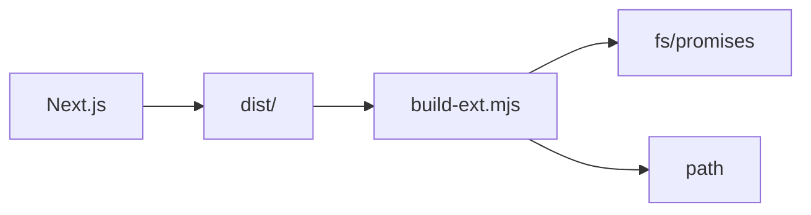

# 扩展构建流程

<cite>
**本文档引用的文件**  
- [build-ext.mjs](file://scripts/build-ext.mjs#L1-L75)
- [manifest.json](file://public/manifest.json#L1-L29)
- [package.json](file://package.json#L1-L143)
- [popup.html](file://public/popup.html#L1-L60)
- [background.js](file://public/background.js#L1-L48)
</cite>

## 目录

1. [简介](#简介)
2. [项目结构](#项目结构)
3. [核心组件](#核心组件)
4. [架构概述](#架构概述)
5. [详细组件分析](#详细组件分析)
6. [依赖分析](#依赖分析)
7. [性能考虑](#性能考虑)
8. [故障排除指南](#故障排除指南)
9. [结论](#结论)

## 简介

本文档详细说明了 `build-ext.mjs` 构建脚本的工作流程与技术实现。该脚本用于将 Next.js 项目打包为符合 Chrome 扩展规范的静态资源包，支持手动加载或 CI/CD 集成。文档涵盖构建流程、文件处理逻辑、错误处理机制及扩展加载验证方法。

## 项目结构

项目采用典型的前后端分离结构，前端基于 Next.js 框架，构建输出位于 `dist/` 目录。扩展构建脚本位于 `scripts/` 目录，静态资源（如 `popup.html`、`manifest.json`）存放于 `public/` 目录。构建过程将 `dist/` 内容复制并重命名为 `dist-ext/`，适配浏览器扩展的路径要求。



**图示来源**

- [build-ext.mjs](file://scripts/build-ext.mjs#L1-L75)
- [public/manifest.json](file://public/manifest.json#L1-L29)

**本节来源**

- [build-ext.mjs](file://scripts/build-ext.mjs#L1-L75)
- [package.json](file://package.json#L1-L143)

## 核心组件

`build-ext.mjs` 是构建扩展的核心模块，其主要职责包括：

- 检查源目录 `dist/` 是否存在
- 清理并创建目标目录 `dist-ext/`
- 复制构建产物并重命名 `_next` 为 `next`
- 递归替换 HTML/JS/CSS 中的路径引用
- 覆盖 `popup.html`、`popup.css`、`popup.js` 为静态版本

该脚本确保生成的扩展包可直接被 Chrome 加载，无需额外编译。

**本节来源**

- [build-ext.mjs](file://scripts/build-ext.mjs#L1-L75)

## 架构概述

构建流程遵循“复制-重命名-替换-覆盖”的四步策略，确保与 Chrome 扩展的资源加载机制兼容。`manifest.json` 定义了扩展的基本信息与权限，`popup.html` 提供用户界面入口，`background.js` 实现右键菜单与书签管理功能。



**图示来源**

- [build-ext.mjs](file://scripts/build-ext.mjs#L1-L75)
- [public/manifest.json](file://public/manifest.json#L1-L29)

## 详细组件分析

### 构建脚本分析

`build-ext.mjs` 使用 Node.js 的 `fs/promises` 模块进行异步文件操作，避免阻塞主线程。其核心函数包括：

#### 文件存在性检查

```javascript
async function exists(p) {
  try {
    await fs.access(p);
    return true;
  } catch {
    return false;
  }
}
```

该函数用于判断 `dist/` 是否已构建完成，若未找到则提示用户先运行 `npm run build`。

#### 目录复制与路径重写

`copyDir` 函数递归复制目录，支持符号链接。`rewriteFiles` 函数扫描所有文本文件（HTML/JS/CSS等），将 `/ _next/` 替换为 `/next/`，确保资源路径正确。

#### 静态资源覆盖

脚本最后覆盖 `popup.html`、`popup.css`、`popup.js`，确保扩展使用预定义的 UI 而非 Next.js 动态生成内容。



**图示来源**

- [build-ext.mjs](file://scripts/build-ext.mjs#L1-L75)

**本节来源**

- [build-ext.mjs](file://scripts/build-ext.mjs#L1-L75)

### 扩展配置分析

`manifest.json` 定义了扩展的元数据与权限：

- **名称与版本**：`OneNav - 书签管理与快速搜索`，版本 `0.1.0`
- **权限**：`bookmarks`, `storage`, `tabs`, `contextMenus` 等
- **入口**：`popup.html` 作为默认弹出页面
- **内容安全策略**：限制脚本仅来自自身，防止 XSS 攻击

```json
{
  "manifest_version": 3,
  "name": "OneNav - 书签管理与快速搜索",
  "version": "0.1.0",
  "permissions": ["bookmarks", "storage", "tabs", "contextMenus"]
}
```

**本节来源**

- [public/manifest.json](file://public/manifest.json#L1-L29)

### 用户界面分析

`popup.html` 是扩展的用户界面入口，包含搜索框、最近添加、文件夹与工具区。其结构简洁，使用原生 HTML/CSS/JS 实现，确保轻量与兼容性。

```html
<input id="q" placeholder="App Library / 搜索书签…" />
<div id="recentGrid"></div>
<div id="folders"></div>
<div id="utilGrid"></div>
```

**本节来源**

- [public/popup.html](file://public/popup.html#L1-L60)

### 背景脚本分析

`background.js` 实现扩展的后台逻辑：

- **安装监听**：创建右键菜单“添加到 OneNav 书签”
- **菜单点击**：捕获当前页面 URL 与标题，添加至书签
- **消息通信**：响应来自 `popup.js` 的数据请求

```javascript
chrome.contextMenus.create({
  id: 'add-bookmark',
  title: '添加到 OneNav 书签',
  contexts: ['page', 'link'],
});
```

**本节来源**

- [public/background.js](file://public/background.js#L1-L48)

## 依赖分析

构建脚本依赖 Node.js 内置模块 `fs` 与 `path`，无外部依赖。项目整体依赖 Next.js 与 Radix UI 组件库，但扩展包仅包含静态资源，不依赖运行时库。



**图示来源**

- [build-ext.mjs](file://scripts/build-ext.mjs#L1-L75)
- [package.json](file://package.json#L1-L143)

## 性能考虑

- 构建过程为一次性操作，不影响运行时性能
- 路径替换使用正则批量处理，效率较高
- 静态资源体积小，加载迅速
- 无动态渲染，减少内存占用

## 故障排除指南

### 常见问题与解决方案

| 问题                           | 原因                     | 解决方案                         |
| ------------------------------ | ------------------------ | -------------------------------- |
| `Source folder dist not found` | 未运行 `npm run build`   | 先执行 `npm run build`           |
| 权限不足无法删除 `dist-ext/`   | 文件被占用或权限问题     | 关闭占用程序或以管理员权限运行   |
| 路径未替换成功                 | 正则表达式未覆盖所有情况 | 检查 `rewriteFiles` 中的替换规则 |
| 扩展无法加载                   | `manifest.json` 格式错误 | 验证 JSON 语法与字段正确性       |

**本节来源**

- [build-ext.mjs](file://scripts/build-ext.mjs#L1-L75)
- [public/manifest.json](file://public/manifest.json#L1-L29)

## 结论

`build-ext.mjs` 是一个轻量、高效的构建脚本，成功将 Next.js 应用转换为 Chrome 扩展。其设计简洁，逻辑清晰，易于集成至 CI/CD 流程。通过路径重写与静态资源覆盖，确保扩展兼容性与稳定性。建议在发布流程中自动化调用 `npm run build:ext`，提升部署效率。
