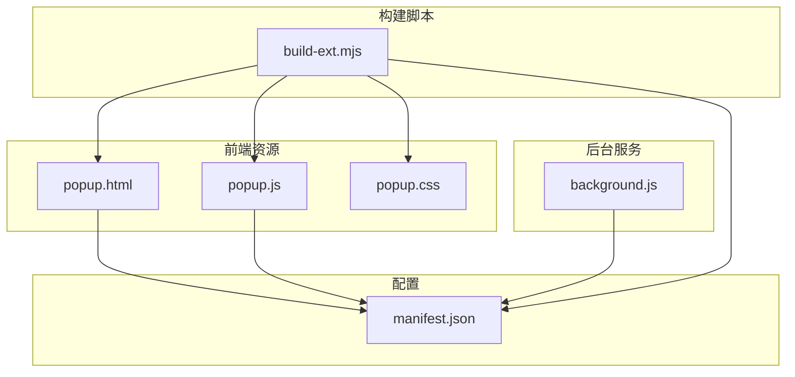
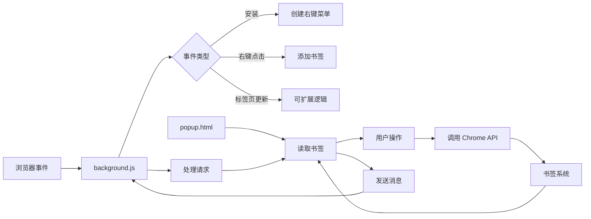
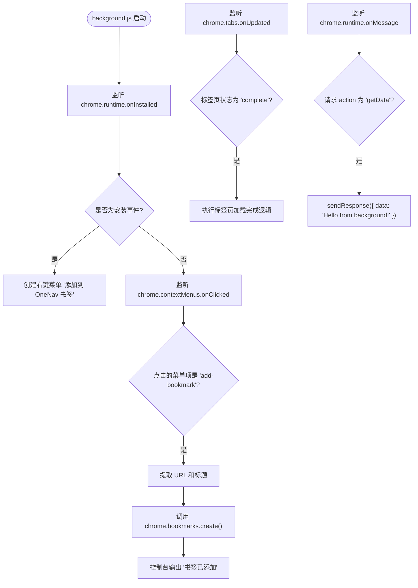
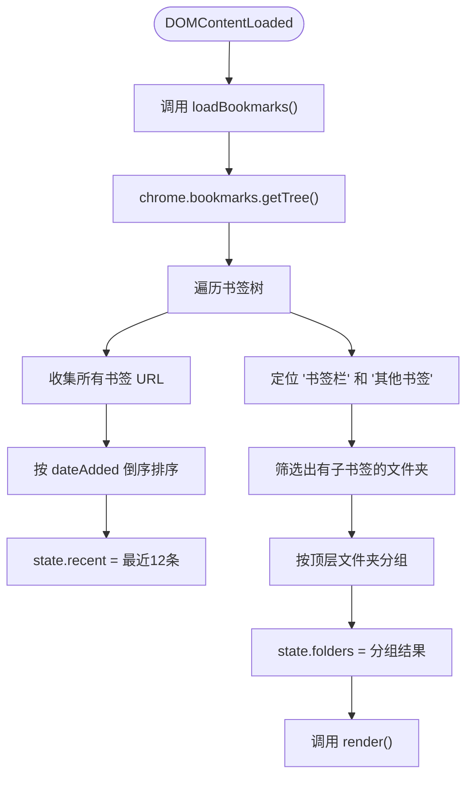
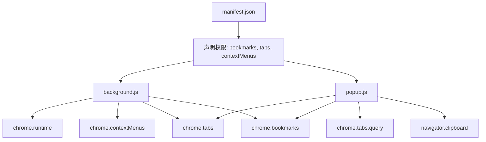

# 后台服务

<cite>
**本文档中引用的文件**  
- [background.js](file://public/background.js#L0-L47)
- [popup.js](file://public/popup.js#L0-L331)
- [manifest.json](file://public/manifest.json#L0-L28)
</cite>

## 目录

1. [项目结构](#项目结构)
2. [核心组件](#核心组件)
3. [架构概述](#架构概述)
4. [详细组件分析](#详细组件分析)
5. [依赖分析](#依赖分析)
6. [性能考虑](#性能考虑)
7. [故障排除指南](#故障排除指南)
8. [结论](#结论)

## 项目结构

OneNav 是一个基于浏览器扩展的书签管理工具，其核心功能通过 Chrome 扩展机制实现。项目采用前后端分离的结构，前端使用现代 Web 技术栈（Next.js），而后台逻辑由浏览器扩展的 `background.js` 驱动。

扩展的主要入口文件位于 `public/` 目录下，包括：

- `background.js`：后台服务脚本，负责监听事件、处理消息和管理右键菜单。
- `popup.html` 和 `popup.js`：弹窗界面及其交互逻辑，用户通过此界面访问书签。
- `manifest.json`：扩展的配置文件，声明权限、入口点和资源。

构建脚本 `scripts/build-ext.mjs` 负责将 Next.js 构建产物转换为符合 Chrome 扩展要求的目录结构，并覆盖 `popup.html`、`popup.js` 等静态资源，确保扩展使用定制的 UI。

**Diagram sources**

- [manifest.json](file://public/manifest.json#L0-L28)
- [background.js](file://public/background.js#L0-L47)
- [popup.js](file://public/popup.js#L0-L331)

**Section sources**

- [manifest.json](file://public/manifest.json#L0-L28)
- [background.js](file://public/background.js#L0-L47)
- [popup.js](file://public/popup.js#L0-L331)

## 核心组件

`background.js` 作为扩展的后台服务，是整个应用的事件中枢。它在浏览器生命周期内持久运行，负责监听和响应各种浏览器事件，如扩展安装、右键菜单点击、标签页更新等。同时，它通过 `chrome.runtime.onMessage` API 与 `popup.js` 进行通信，实现数据交换。

`popup.js` 则是用户交互的核心。它在用户点击扩展图标时加载，负责从 Chrome 书签系统中获取书签数据，进行扁平化处理和分组，然后渲染成直观的网格界面。用户可以通过点击、双击、拖拽等方式对书签进行操作，所有这些操作最终都通过 Chrome API 反馈到浏览器的书签系统。

**Section sources**

- [background.js](file://public/background.js#L0-L47)
- [popup.js](file://public/popup.js#L0-L331)

## 架构概述

OneNav 扩展的架构遵循 Chrome 扩展的典型模式，采用事件驱动和消息传递模型。

**Diagram sources**

- [background.js](file://public/background.js#L0-L47)
- [popup.js](file://public/popup.js#L0-L331)

## 详细组件分析

### background.js 分析

`background.js` 是扩展的后台服务脚本，其主要职责是监听和响应浏览器事件。

#### 事件监听与处理

**Diagram sources**

- [background.js](file://public/background.js#L0-L47)

#### 消息传递机制

`background.js` 通过 `chrome.runtime.onMessage` 监听来自 `popup.js` 的消息。当收到 `action` 为 `getData` 的请求时，它会立即调用 `sendResponse` 回传一个简单的数据对象。`return true` 语句确保了消息通道保持开放，允许异步响应。

**Section sources**

- [background.js](file://public/background.js#L0-L47)

### popup.js 分析

`popup.js` 负责构建用户界面并处理用户交互。

#### 书签加载与处理流程

**Diagram sources**

- [popup.js](file://public/popup.js#L27-L68)

#### 用户交互与操作

`popup.js` 实现了丰富的用户交互功能：

- **点击书签**：在当前标签页或新标签页打开链接。
- **双击书签**：弹出对话框进行重命名。
- **点击删除按钮**：确认后删除书签并刷新界面。
- **拖拽排序**：在同一顶层分区内，通过 HTML5 DnD API 实现书签排序，最终调用 `chrome.bookmarks.move`。
- **实用工具**：提供固定/取消固定标签页、静音/取消静音、关闭重复标签页、复制当前链接、打开书签管理器等快捷功能。

**Section sources**

- [popup.js](file://public/popup.js#L96-L136)
- [popup.js](file://public/popup.js#L212-L254)

## 依赖分析

OneNav 扩展的依赖关系清晰，主要依赖于 Chrome 浏览器提供的原生 API。

**Diagram sources**

- [manifest.json](file://public/manifest.json#L0-L28)
- [background.js](file://public/background.js#L0-L47)
- [popup.js](file://public/popup.js#L0-L331)

**Section sources**

- [manifest.json](file://public/manifest.json#L0-L28)

## 性能考虑

尽管当前代码库中没有显式的性能优化措施，但其设计遵循了良好的实践：

- **事件驱动**：后台脚本仅在事件触发时执行，避免了不必要的轮询。
- **懒加载**：书签数据在弹窗打开时才加载，减少了后台脚本的内存占用。
- **异步操作**：所有与 Chrome API 的交互都是异步的，不会阻塞 UI。

潜在的优化点包括对 `loadBookmarks` 函数的结果进行缓存，避免每次打开弹窗都重新获取整个书签树。

## 故障排除指南

- **右键菜单不出现**：检查 `manifest.json` 中是否声明了 `contextMenus` 权限，并确认扩展已正确安装。
- **书签无法添加**：确保 `background.js` 中的 `chrome.contextMenus.create` 调用成功，且没有 JavaScript 错误。
- **弹窗无响应**：检查 `popup.js` 是否正确加载，以及 `chrome.bookmarks.getTree` 是否因权限问题被拒绝。
- **消息传递失败**：确认 `chrome.runtime.onMessage` 的监听器已正确注册，并且 `sendResponse` 在异步操作中被正确调用。

**Section sources**

- [background.js](file://public/background.js#L0-L47)
- [popup.js](file://public/popup.js#L0-L331)

## 结论

OneNav 扩展通过 `background.js` 和 `popup.js` 的协同工作，实现了高效的书签管理功能。`background.js` 作为后台服务，负责事件监听和跨组件通信；`popup.js` 则提供了直观的用户界面和丰富的交互体验。整个架构简洁、高效，充分利用了 Chrome 扩展的 API 能力，为用户提供了一个便捷的书签管理解决方案。
