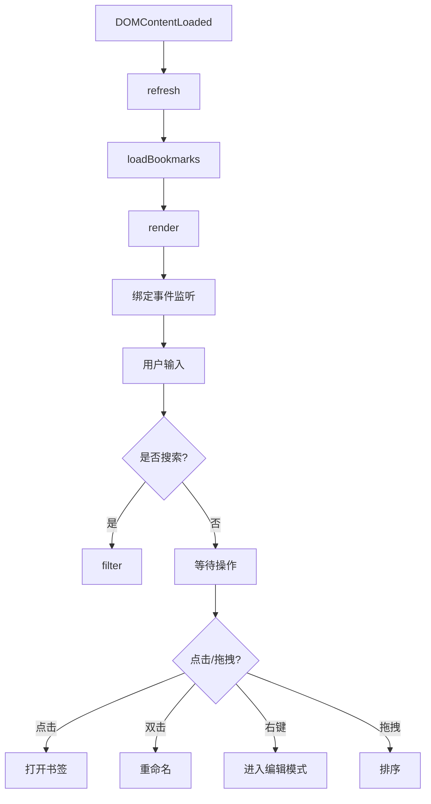
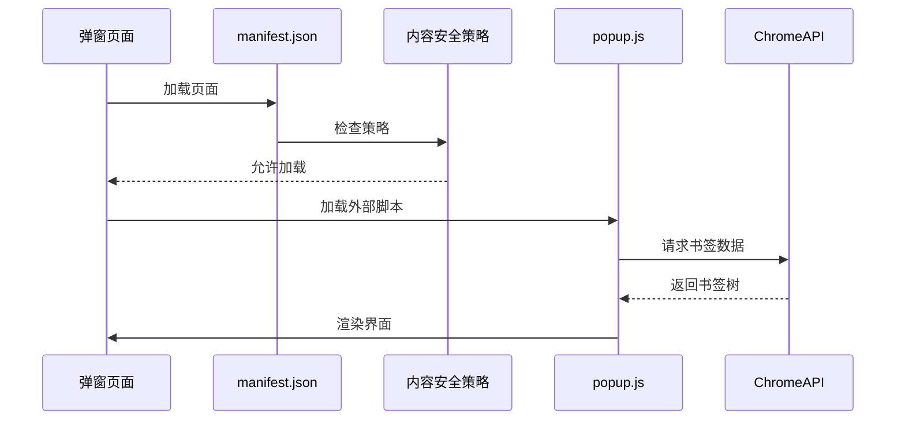

# 弹窗界面

<cite>
**本文档引用文件**  
- [popup.html](file://public/popup.html)
- [popup.css](file://public/popup.css)
- [popup.js](file://public/popup.js)
- [manifest.json](file://public/manifest.json)
</cite>

## 目录

1. [项目结构](#项目结构)
2. [核心组件分析](#核心组件分析)
3. [UI结构与语义化设计](#ui结构与语义化设计)
4. [样式实现与响应式布局](#样式实现与响应式布局)
5. [交互逻辑与事件处理](#交互逻辑与事件处理)
6. [消息通信与书签API集成](#消息通信与书签api集成)
7. [内容安全策略与脚本加载](#内容安全策略与脚本加载)
8. [视觉优化与用户体验](#视觉优化与用户体验)

## 项目结构

`one-nav` 项目是一个浏览器扩展，其弹窗界面（Popup）由 `public` 目录下的静态资源构成。核心弹窗功能由三个主要文件实现：

- `popup.html`：UI入口文件，定义了弹窗的HTML结构
- `popup.css`：样式文件，使用原生CSS实现视觉效果
- `popup.js`：交互逻辑脚本，处理书签加载、搜索、拖拽排序等操作

`manifest.json` 文件配置了扩展的基本信息，并将 `popup.html` 设置为默认弹窗页面。`src` 目录下的 Next.js 应用可能用于主站或设置页面，而弹窗界面独立于该框架运行。

**Section sources**

- [manifest.json](file://public/manifest.json#L1-L29)
- [popup.html](file://public/popup.html#L1-L60)

## 核心组件分析

弹窗界面的核心功能围绕书签管理展开，主要包括：

- 书签的加载与分组
- 最近添加书签展示
- 按顶层文件夹分类展示
- 快速搜索过滤
- 编辑模式下的删除、重命名、拖拽排序
- 实用工具集（固定标签、静音、关闭重复标签等）

这些功能由 `popup.js` 中的 `state` 状态对象统一管理，通过 `loadBookmarks()` 加载数据，`render()` 渲染界面，`filter()` 处理搜索，形成完整的MVC模式。

**Section sources**

- [popup.js](file://public/popup.js#L15-L20)

## UI结构与语义化设计

`popup.html` 采用语义化标签构建清晰的界面结构：

```html
<header>
  <div class="search">...</div>
</header>
<div class="wrap">
  <div id="recent">...</div>
  <div class="seg"></div>
  <div id="folders"></div>
  <div class="seg"></div>
  <div id="utils">...</div>
</div>
<footer></footer>
```

- `<header>` 包含搜索框，使用 `<svg>` 内联图标
- `<div class="wrap">` 作为主内容容器，包含三个主要区块
- `<div id="recent">` 展示最近添加的书签
- `<div id="folders">` 展示按文件夹分类的书签
- `<div id="utils">` 提供实用工具按钮
- `<footer>` 预留页脚位置
- 模态框使用 `aria-hidden` 和 `aria-modal` 属性增强可访问性

**Section sources**

- [popup.html](file://public/popup.html#L1-L60)

## 样式实现与响应式布局

`popup.css` 采用原生CSS而非Tailwind CSS，但实现了类似实用类的布局策略：

```css
.grid {
  display: grid;
  grid-template-columns: repeat(4, 1fr);
  gap: 12px;
}
```

### 响应式适配策略

- 固定尺寸：弹窗宽高均为600px，确保桌面端一致性
- 网格布局：使用CSS Grid实现四列布局，移动端可通过媒体查询调整
- 粘性定位：搜索栏使用 `position: sticky` 保持在顶部
- 背景模糊：使用 `backdrop-filter: blur(20px)` 实现iOS风格毛玻璃效果
- 滚动优化：隐藏横向滚动条，保留纵向滚动

### 视觉一致性处理

- 字体：优先使用苹果系统字体栈，确保macOS/iOS一致性
- 颜色：使用苹果系灰蓝色调（#1d1d1f, #86868b）
- 圆角：统一使用10-16px圆角，模拟iOS应用卡片
- 阴影：使用浅色阴影（rgba(0,0,0,0.1)）增强层次感

**Section sources**

- [popup.css](file://public/popup.css#L1-L329)

## 交互逻辑与事件处理

`popup.js` 实现了丰富的交互逻辑，核心流程如下：



### DOM事件绑定

- `click`：打开书签（支持Cmd/Ctrl新标签页）
- `dblclick`：重命名书签
- `contextmenu`：右键进入编辑模式
- `dragstart/dragover/dragleave/drop`：实现拖拽排序
- `input`：实时搜索过滤
- `keydown`：ESC键退出编辑模式

### 用户输入处理

搜索功能通过监听 `input` 事件实现实时过滤：

```javascript
q.addEventListener('input', () => filter(q.value));
```

`filter()` 函数遍历所有书签元素，根据搜索关键词匹配标题：

```javascript
t.style.display = name.includes(q) ? '' : 'none';
```

**Section sources**

- [popup.js](file://public/popup.js#L150-L170)
- [popup.js](file://public/popup.js#L250-L260)

## 消息通信与书签API集成

弹窗通过Chrome扩展API与浏览器书签系统通信：

### 书签加载

```javascript
const tree = await chrome.bookmarks.getTree();
```

### 书签操作

- `chrome.bookmarks.remove(id)`：删除书签
- `chrome.bookmarks.update(id, {title})`：更新书签
- `chrome.bookmarks.move(id, {parentId, index})`：移动书签（用于排序）

### 标签页控制

- `chrome.tabs.query()`：获取当前标签
- `chrome.tabs.create({url})`：创建新标签
- `chrome.tabs.update()`：更新标签URL或属性（如固定、静音）

### 实用工具实现

```javascript
// 固定/取消固定当前标签
await chrome.tabs.update(t.id, { pinned: !t.pinned });

// 静音/取消静音
await chrome.tabs.update(t.id, { muted: !t.mutedInfo?.muted });

// 关闭重复标签
await chrome.tabs.remove(t.id);
```

**Section sources**

- [popup.js](file://public/popup.js#L100-L140)
- [popup.js](file://public/popup.js#L300-L330)

## 内容安全策略与脚本加载

`manifest.json` 中定义了严格的内容安全策略（CSP）：

```json
"content_security_policy": {
  "extension_pages": "script-src 'self'; object-src 'self'; img-src 'self' data: blob: https://www.google.com ..."
}
```

### CSP限制规避方案

1. **外部JS文件**：`popup.html` 通过 `<script src="popup.js"></script>` 加载外部脚本，避免内联脚本
2. **事件代理**：使用事件监听器而非内联 `onclick` 属性
3. **动态创建元素**：`el()` 函数动态创建DOM元素并绑定事件
4. **允许的资源域**：明确列出favicon服务域名（google.com）

### 脚本加载流程



**Section sources**

- [manifest.json](file://public/manifest.json#L20-L25)
- [popup.html](file://public/popup.html#L58)
- [popup.js](file://public/popup.js#L1-L10)

## 视觉优化与用户体验

### 图标对齐与加载

- 使用 `object-fit: cover` 确保图标填充容器
- 错误处理：当favicon加载失败时，生成彩色首字母占位符
- 颜色算法：`monoColor()` 使用字符串哈希选择背景色

```javascript
function monoColor(str) {
  let h = 0;
  for (let i = 0; i < str.length; i++) h = (h * 33 + str.charCodeAt(i)) >>> 0;
  return COLORS[h % COLORS.length];
}
```

### 动画过渡

- 悬停效果：`transform: scale(1.05)` 配合 `transition: all 0.2s ease`
- 编辑模式：`@keyframes wiggle` 实现轻微晃动动画
- 模态框：`display: flex` 切换配合CSS过渡

### 字体与排版

- 系统字体栈：优先使用 `-apple-system` 确保原生感
- 行高：`line-height: 1.2` 提升可读性
- 文本溢出：`text-overflow: ellipsis` 处理长标题

### 用户提示

- `toast()` 函数提供短暂的消息提示
- `confirm()` 对话框确认删除操作
- `prompt()` 输入框用于重命名

```javascript
function toast(msg) {
  const n = el('div', { style: '...' }, msg);
  document.body.append(n);
  setTimeout(() => n.remove(), 1400);
}
```

**Section sources**

- [popup.css](file://public/popup.css#L150-L170)
- [popup.css](file://public/popup.css#L200-L220)
- [popup.js](file://public/popup.js#L280-L290)
