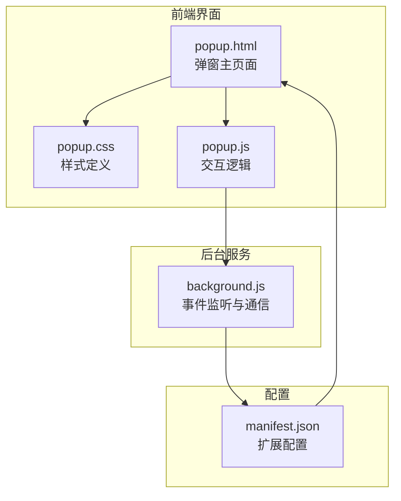
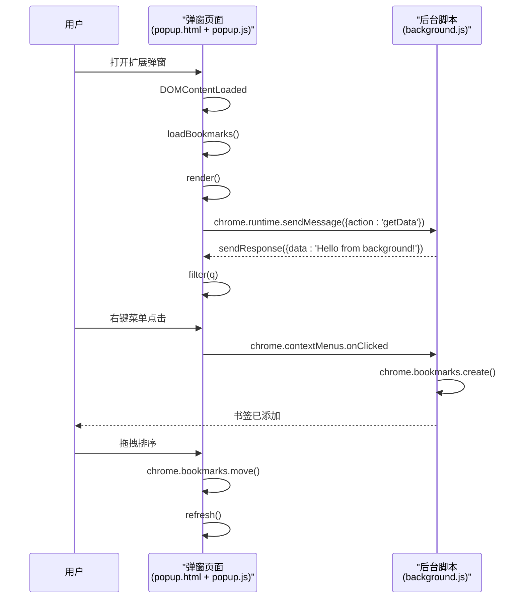
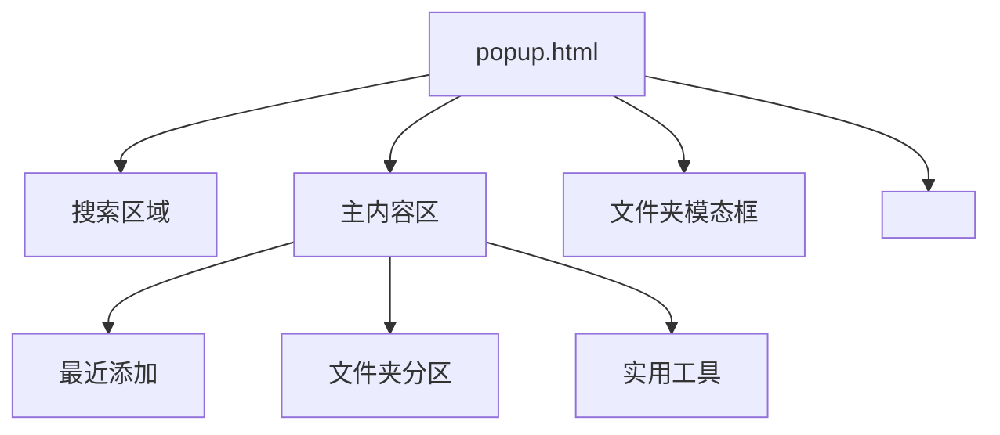
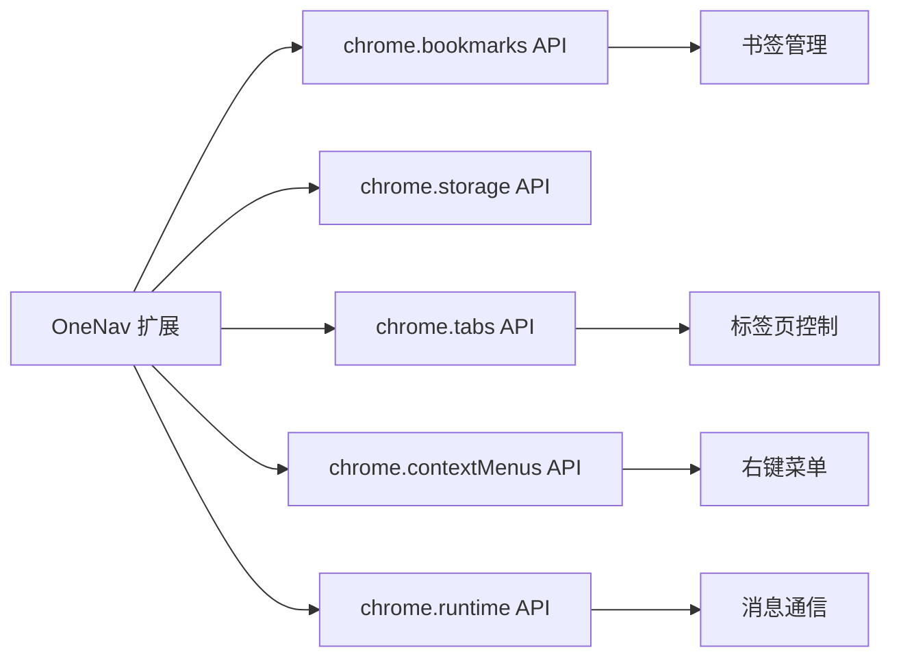

# 浏览器扩展架构

<cite>
**本文档引用文件**  
- [manifest.json](file://public/manifest.json#L1-L28)
- [popup.html](file://public/popup.html#L1-L59)
- [popup.css](file://public/popup.css#L1-L328)
- [popup.js](file://public/popup.js#L1-L331)
- [background.js](file://public/background.js#L1-L47)
</cite>

## 目录

1. [项目结构](#项目结构)
2. [核心组件](#核心组件)
3. [架构概览](#架构概览)
4. [详细组件分析](#详细组件分析)
5. [依赖分析](#依赖分析)
6. [性能考虑](#性能考虑)
7. [故障排除指南](#故障排除指南)
8. [结论](#结论)

## 项目结构

该项目是一个基于 Chrome 扩展的书签管理工具，名为 OneNav。其主要功能包括书签的增删改查、排序、导入导出以及快速搜索，并预留了 SSH 连接、脚本执行和两步验证等扩展能力。项目采用前后端分离的架构设计，前端使用现代 Web 技术栈（如 React、Next.js），而后端逻辑则通过 Chrome 扩展机制实现。

核心功能模块集中在 `public` 目录下，包含弹窗界面（`popup.html`）、样式文件（`popup.css`）、交互逻辑（`popup.js`）和后台服务（`background.js`）。`manifest.json` 文件定义了扩展的基本信息、权限和入口点。



**图示来源**

- [manifest.json](file://public/manifest.json#L1-L28)
- [popup.html](file://public/popup.html#L1-L59)
- [popup.js](file://public/popup.js#L1-L331)
- [background.js](file://public/background.js#L1-L47)

**本节来源**

- [manifest.json](file://public/manifest.json#L1-L28)
- [popup.html](file://public/popup.html#L1-L59)

## 核心组件

本扩展的核心由三个主要部分构成：`popup.html` 作为用户交互的入口，`popup.js` 提供动态交互逻辑，`background.js` 负责后台持久化运行和事件监听。

`popup.html` 是扩展弹窗的 HTML 入口文件，定义了搜索框、最近添加书签区、文件夹分区和实用工具区等 UI 结构。它通过 `<link>` 引入 `popup.css` 样式，并通过 `<script>` 加载 `popup.js` 脚本。

`popup.js` 是弹窗页面的核心逻辑脚本，负责加载书签数据、渲染 UI、处理用户交互（如点击、拖拽、搜索）以及与 `background.js` 通信。

`background.js` 是扩展的后台脚本，采用持久化运行机制，监听浏览器事件（如安装、标签页更新）并响应来自弹窗的消息请求。

**本节来源**

- [popup.html](file://public/popup.html#L1-L59)
- [popup.js](file://public/popup.js#L1-L331)
- [background.js](file://public/background.js#L1-L47)

## 架构概览

OneNav 扩展采用典型的 Chrome 扩展三层架构：UI 层（弹窗）、业务逻辑层（`popup.js`）和后台服务层（`background.js`），通过 `chrome.runtime` API 进行通信。



**图示来源**

- [popup.js](file://public/popup.js#L1-L331)
- [background.js](file://public/background.js#L1-L47)

## 详细组件分析

### 弹窗页面分析

`popup.html` 是扩展的用户界面入口，其结构清晰，分为头部（搜索）、主体（书签展示）和底部（模态框）三部分。

#### HTML 结构分析



**图示来源**

- [popup.html](file://public/popup.html#L1-L59)

#### 样式与交互分析

`popup.css` 定义了现代化的 iOS 风格 UI，采用 CSS Grid 布局实现书签网格。`popup.js` 通过 JavaScript 动态创建 DOM 元素，实现数据驱动的 UI 渲染。

```mermaid
classDiagram
class popup_js {
+state : {editing, folders, recent, mapParent}
+COLORS : string[]
+faviconUrl(url, size) : string
+fav(url) : string
+monoColor(str) : string
+el(tag, attrs, ...kids) : HTMLElement
+loadBookmarks() : Promise~void~
+renderTile(bm) : HTMLElement
+render() : void
+openFolder(folder) : void
+filter(q) : void
+toggleEditing(on) : void
+toast(msg) : void
+refresh() : Promise~void~
}
class popup_css {
.tile : 书签卡片样式
.grid : 网格布局
.folder-item : 文件夹项
.modal : 模态框
.editing : 编辑状态样式
}
popup_js --> popup_css : "应用样式"
popup_js --> chrome.bookmarks : "读取/修改书签"
popup_js --> chrome.tabs : "操作标签页"
popup_js --> chrome.runtime : "与 background 通信"
```

**图示来源**

- [popup.js](file://public/popup.js#L1-L331)
- [popup.css](file://public/popup.css#L1-L328)

**本节来源**

- [popup.html](file://public/popup.html#L1-L59)
- [popup.js](file://public/popup.js#L1-L331)
- [popup.css](file://public/popup.css#L1-L328)

### 后台脚本分析

`background.js` 是扩展的后台守护进程，负责监听全局事件和处理跨页面通信。

#### 核心职责

- **事件监听**：通过 `chrome.runtime.onInstalled` 监听扩展安装事件，初始化右键菜单。
- **持久化运行**：作为后台脚本常驻内存，响应浏览器级事件。
- **通信中枢**：通过 `chrome.runtime.onMessage` 接收来自 `popup.js` 的消息请求并返回响应。

#### 消息传递示例

从 `popup.js` 向 `background.js` 发送请求的代码示例：

```javascript
// 在 popup.js 中发送消息
chrome.runtime.sendMessage({ action: 'getData' }, (response) => {
  console.log(response.data); // 输出: Hello from background!
});
```

`background.js` 接收并响应消息：

```javascript
// 在 background.js 中监听消息
chrome.runtime.onMessage.addListener((request, sender, sendResponse) => {
  if (request.action === 'getData') {
    sendResponse({ data: 'Hello from background!' });
  }
  return true; // 保持异步响应通道
});
```

**本节来源**

- [background.js](file://public/background.js#L1-L47)
- [popup.js](file://public/popup.js#L320-L331)

### 内容安全策略（CSP）分析

根据 `manifest.json` 中的配置，该扩展实施了严格的内容安全策略（CSP）：

```json
"content_security_policy": {
  "extension_pages": "script-src 'self'; object-src 'self'; img-src 'self' data: blob: https://www.google.com https://*.google.com https://*.gstatic.com https://icons.duckduckgo.com; connect-src 'self';"
}
```

**策略解析**：

- `script-src 'self'`：仅允许执行扩展包内的脚本，禁止内联脚本和 `eval()`，有效防止 XSS 攻击。
- `img-src`：允许从指定域名（如 Google、DuckDuckGo）加载图标，用于获取网站 favicon。
- **绕行方案**：由于禁止了 `unsafe-inline`，所有动态脚本必须通过外部 `.js` 文件引入，内联事件处理器（如 `onclick`）需改用 `addEventListener`。

**本节来源**

- [manifest.json](file://public/manifest.json#L15-L18)

## 依赖分析

该扩展依赖 Chrome 浏览器提供的原生 API，主要包括：

- `chrome.bookmarks`：用于管理书签的增删改查和排序。
- `chrome.storage`：用于持久化存储用户设置（虽未在代码中直接体现，但已在权限中声明）。
- `chrome.tabs`：用于操作当前标签页（如固定、静音）。
- `chrome.contextMenus`：用于创建和监听右键菜单。
- `chrome.runtime`：用于扩展内部通信和生命周期管理。

这些依赖在 `manifest.json` 的 `permissions` 字段中明确声明。



**图示来源**

- [manifest.json](file://public/manifest.json#L10-L14)

**本节来源**

- [manifest.json](file://public/manifest.json#L10-L14)

## 性能考虑

- **书签加载**：`loadBookmarks()` 函数一次性获取整个书签树，对于大量书签可能造成性能瓶颈。建议实现分页或懒加载。
- **DOM 操作**：`render()` 函数在每次刷新时重新创建所有 DOM 元素，可优化为虚拟列表或增量更新。
- **事件监听**：`chrome.tabs.onUpdated` 监听器目前为空，若添加复杂逻辑需注意性能影响。

## 故障排除指南

- **书签不显示**：检查 `manifest.json` 中是否声明了 `bookmarks` 权限。
- **图标加载失败**：`faviconUrl` 函数依赖 Google 的 favicon 服务，若网络不通可导致图标缺失。
- **拖拽排序无效**：确保书签位于同一顶层文件夹下，跨文件夹排序不被支持。
- **消息通信失败**：检查 `chrome.runtime.sendMessage` 是否在 `DOMContentLoaded` 之后调用，并确保 `background.js` 返回 `true` 以保持异步响应。

**本节来源**

- [popup.js](file://public/popup.js#L1-L331)
- [background.js](file://public/background.js#L1-L47)

## 结论

OneNav 是一个功能完善的 Chrome 书签管理扩展，其架构清晰，前后端职责分明。`popup.html` 作为 UI 入口，结合 `popup.css` 和 `popup.js` 实现了美观且交互丰富的弹窗界面。`background.js` 作为后台服务，通过 Chrome API 实现了事件监听和跨页面通信。项目遵循安全最佳实践，通过 CSP 限制脚本执行，并合理使用 Chrome 的权限模型。未来可优化方向包括书签数据的分页加载和 DOM 渲染性能提升。
