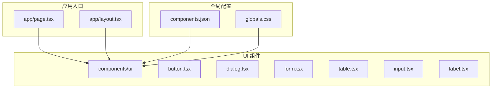
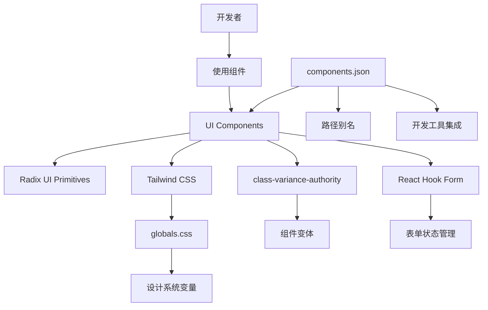
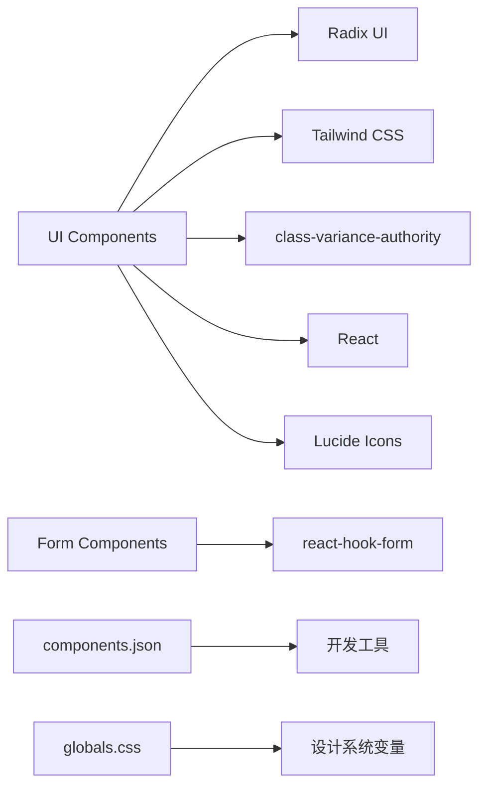

# UI组件库

<cite>
**本文档引用的文件**  
- [components.json](file://components.json)
- [globals.css](file://src/app/globals.css)
- [button.tsx](file://src/components/ui/button.tsx)
- [form.tsx](file://src/components/ui/form.tsx)
- [dialog.tsx](file://src/components/ui/dialog.tsx)
- [table.tsx](file://src/components/ui/table.tsx)
- [label.tsx](file://src/components/ui/label.tsx)
- [input.tsx](file://src/components/ui/input.tsx)
</cite>

## 目录

1. [项目结构](#项目结构)
2. [核心组件](#核心组件)
3. [架构概览](#架构概览)
4. [详细组件分析](#详细组件分析)
5. [依赖关系分析](#依赖关系分析)
6. [性能考量](#性能考量)
7. [故障排除指南](#故障排除指南)
8. [结论](#结论)

## 项目结构

本项目采用基于功能模块的组织结构，主要分为 `public`、`src`、配置文件和工具脚本。`src` 目录下包含应用逻辑、UI 组件、自定义 Hook 和工具函数。

- `app/`：Next.js 应用的页面和布局结构，采用 App Router 模式。
- `components/ui/`：基于 Radix UI 封装的可复用 UI 组件集合，遵循统一的设计语言。
- `components/providers/`：提供全局状态管理、主题和查询客户端的上下文封装。
- `lib/`：通用工具函数和请求封装。
- `hooks/`：自定义 React Hook。
- 根目录下的 `components.json` 是组件库的配置文件，用于自动化管理组件引入。



**图示来源**

- [components.json](file://components.json)
- [src/app/globals.css](file://src/app/globals.css)
- [src/components/ui](file://src/components/ui)

**本节来源**

- [components.json](file://components.json)
- [src/app/globals.css](file://src/app/globals.css)

## 核心组件

本UI组件库基于 Radix UI 原始组件进行封装，结合 Tailwind CSS 实现高度可定制的原子化样式，并通过 `class-variance-authority` (cva) 管理变体。所有组件均支持无障碍访问（a11y），并遵循一致的交互模式和视觉设计。

核心组件包括按钮（Button）、表单（Form）、对话框（Dialog）、表格（Table）、输入框（Input）、标签（Label）等，它们共同构成了应用的视觉和交互基础。这些组件通过 `@/lib/utils` 中的 `cn` 工具函数合并类名，确保样式优先级正确。

**本节来源**

- [src/components/ui/button.tsx](file://src/components/ui/button.tsx)
- [src/components/ui/form.tsx](file://src/components/ui/form.tsx)
- [src/components/ui/dialog.tsx](file://src/components/ui/dialog.tsx)

## 架构概览

整个组件库的架构围绕着可组合性、可访问性和主题定制三大原则构建。Radix UI 提供了无样式的、语义化的、无障碍的原始组件，而本项目在此基础上添加了视觉样式和预设变体。

Tailwind CSS 被用作原子化样式引擎，通过 `globals.css` 定义设计系统变量（如颜色、半径、阴影等），并支持明暗模式切换。`components.json` 文件则作为开发工具的配置中心，支持组件的自动导入和路径别名解析。



**图示来源**

- [components.json](file://components.json)
- [src/app/globals.css](file://src/app/globals.css)
- [src/components/ui/button.tsx](file://src/components/ui/button.tsx)
- [src/components/ui/form.tsx](file://src/components/ui/form.tsx)

## 详细组件分析

### 按钮组件分析

按钮组件（Button）是用户交互的基础元素，支持多种视觉变体和尺寸。

#### 变体与尺寸

通过 `cva` 定义了 `variant`（default, destructive, outline, secondary, ghost, link）和 `size`（default, sm, lg, icon）两种变体。

```tsx
// 示例：不同变体的按钮
<Button variant="default">默认按钮</Button>
<Button variant="destructive">危险操作</Button>
<Button variant="outline">线框按钮</Button>
<Button size="sm">小号按钮</Button>
<Button size="icon"><XIcon /></Button>
```

#### 可访问性

- 使用 `Slot` 组件支持 `asChild` 属性，允许将按钮样式应用于其他语义化标签（如 `<Link>`）。
- 添加了 `focus-visible` 样式，确保键盘导航的可见性。
- 通过 `aria-invalid` 处理表单验证错误状态。

**本节来源**

- [src/components/ui/button.tsx](file://src/components/ui/button.tsx)

### 表单组件分析

表单组件（Form）基于 `react-hook-form` 构建，提供了一套完整的表单管理解决方案。

#### 组件结构

- `Form`：表单的上下文提供者。
- `FormField`：字段控制器，连接 `react-hook-form` 的 `Controller`。
- `FormItem`：字段容器，提供布局和上下文。
- `FormLabel`：标签，与输入框关联。
- `FormControl`：输入控件，自动关联 `id` 和 `aria-*` 属性。
- `FormDescription`：辅助描述文本。
- `FormMessage`：显示验证错误信息。

```tsx
// 示例：表单使用
<Form {...form}>
  <FormField
    control={form.control}
    name="email"
    render={({ field }) => (
      <FormItem>
        <FormLabel>邮箱</FormLabel>
        <FormControl>
          <Input placeholder="请输入邮箱" {...field} />
        </FormControl>
        <FormDescription>我们将通过此邮箱与您联系。</FormDescription>
        <FormMessage />
      </FormItem>
    )}
  />
</Form>
```

#### 交互与可访问性

- `useFormField` Hook 提供了字段的 `id`、错误状态和消息 `id`，确保标签、输入和错误信息之间的正确关联。
- 错误状态通过 `aria-invalid` 和 `data-error` 属性传递，视觉上使用红色高亮。
- 支持屏幕阅读器，`sr-only` 类隐藏了关闭按钮的文本。

**本节来源**

- [src/components/ui/form.tsx](file://src/components/ui/form.tsx)
- [src/components/ui/input.tsx](file://src/components/ui/input.tsx)
- [src/components/ui/label.tsx](file://src/components/ui/label.tsx)

### 对话框组件分析

对话框（Dialog）提供模态和非模态的弹出层功能。

#### 组件组成

- `Dialog`：根组件，管理打开/关闭状态。
- `DialogTrigger`：触发器，点击后打开对话框。
- `DialogContent`：内容区域，居中显示。
- `DialogHeader` / `DialogFooter`：头部和底部布局容器。
- `DialogTitle` / `DialogDescription`：标题和描述文本。
- `DialogClose`：关闭按钮。

```tsx
// 示例：对话框使用
<Dialog>
  <DialogTrigger asChild>
    <Button>打开对话框</Button>
  </DialogTrigger>
  <DialogContent>
    <DialogHeader>
      <DialogTitle>确认操作</DialogTitle>
      <DialogDescription>您确定要执行此操作吗？</DialogDescription>
    </DialogHeader>
    <DialogFooter>
      <Button variant="outline">取消</Button>
      <Button>确认</Button>
    </DialogFooter>
  </DialogContent>
</Dialog>
```

#### 交互行为

- 使用 `DialogPortal` 确保对话框渲染在 DOM 树顶层，避免 z-index 冲突。
- `DialogOverlay` 提供半透明遮罩层，并支持点击关闭。
- 内容区域使用 `transform` 实现居中，并带有淡入缩放动画。
- 默认提供关闭按钮（可通过 `showCloseButton` 控制），并包含 `sr-only` 的“Close”文本以供屏幕阅读器识别。

**本节来源**

- [src/components/ui/dialog.tsx](file://src/components/ui/dialog.tsx)

### 表格组件分析

表格（Table）组件用于展示结构化数据。

#### 组件结构

- `Table`：外层容器，包含 `overflow-x-auto` 实现水平滚动。
- `TableHeader` / `TableBody` / `TableFooter`：表头、主体和底部。
- `TableRow`：行。
- `TableHead`：表头单元格。
- `TableCell`：数据单元格。
- `TableCaption`：表格标题。

```tsx
// 示例：表格使用
<Table>
  <TableHeader>
    <TableRow>
      <TableHead>姓名</TableHead>
      <TableHead>邮箱</TableHead>
    </TableRow>
  </TableHeader>
  <TableBody>
    <TableRow>
      <TableCell>张三</TableCell>
      <TableCell>zhangsan@example.com</TableCell>
    </TableRow>
  </TableBody>
</Table>
```

#### 样式与交互

- 表头单元格左对齐，字体加粗。
- 行在悬停时有背景色变化（`hover:bg-muted/50`）。
- 支持选中状态（`data-state=selected`）。
- 单元格内使用 `whitespace-nowrap` 防止文本换行。

**本节来源**

- [src/components/ui/table.tsx](file://src/components/ui/table.tsx)

## 依赖关系分析

组件库的依赖关系清晰，层次分明。



**图示来源**

- [components.json](file://components.json)
- [src/app/globals.css](file://src/app/globals.css)
- [package.json](file://package.json)

**本节来源**

- [components.json](file://components.json)
- [src/app/globals.css](file://src/app/globals.css)

## 性能考量

- **按需引入**：通过 `components.json` 配置，支持组件的按需引入，减少打包体积。
- **原子化CSS**：Tailwind CSS 的原子化类名减少了 CSS 文件大小，并提高了样式的复用性。
- **服务端渲染**：Next.js 支持 SSR，提升首屏加载性能。
- **组件轻量化**：每个组件仅封装必要的逻辑和样式，避免过度抽象。

## 故障排除指南

- **组件样式不生效**：检查 `globals.css` 是否正确引入，以及 Tailwind 的 JIT 模式是否正常工作。
- **对话框无法打开**：确保 `DialogTrigger` 和 `DialogContent` 在同一个 `Dialog` 根组件内。
- **表单验证错误不显示**：检查 `FormField` 是否正确使用 `render` prop，并确保 `FormMessage` 已包含。
- **明暗模式切换失效**：检查 `:root` 和 `.dark` CSS 变量是否正确定义，以及主题切换逻辑是否正确实现。

**本节来源**

- [src/app/globals.css](file://src/app/globals.css)
- [src/components/ui/dialog.tsx](file://src/components/ui/dialog.tsx)
- [src/components/ui/form.tsx](file://src/components/ui/form.tsx)

## 结论

该 UI 组件库通过封装 Radix UI 原始组件，结合 Tailwind CSS 和 `class-variance-authority`，实现了高度一致、可访问、可定制的用户界面。`components.json` 配置文件极大地简化了组件的管理和引入。开发者可以基于此库快速构建符合设计规范的应用界面，并通过扩展组件变体或创建新组件来满足特定需求。
