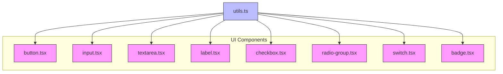
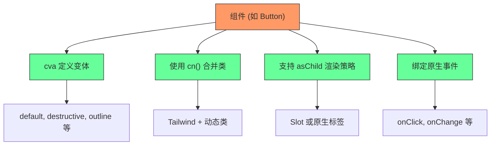
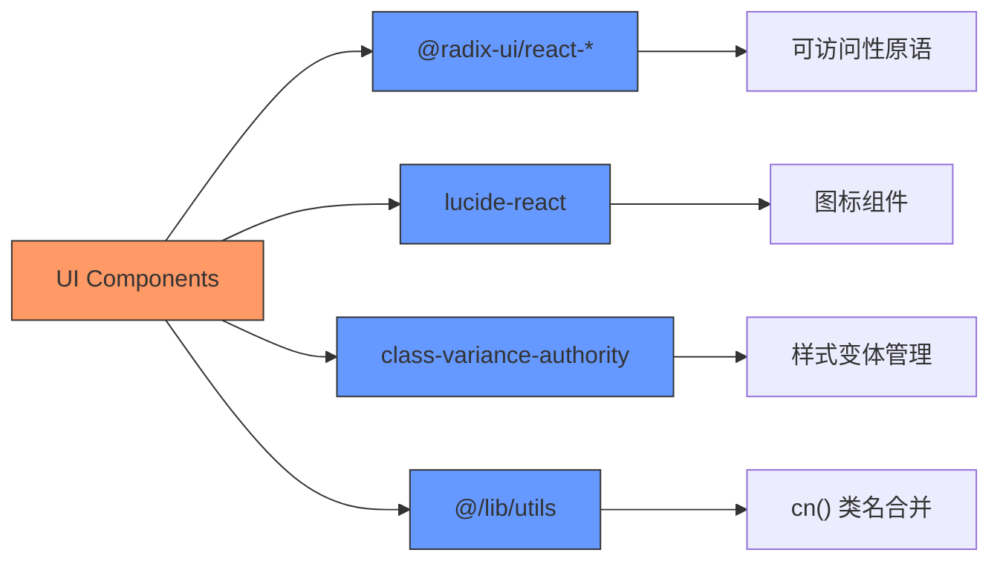

# 基础组件

<cite>
**本文档中引用的文件**  
- [button.tsx](file://src/components/ui/button.tsx)
- [input.tsx](file://src/components/ui/input.tsx)
- [textarea.tsx](file://src/components/ui/textarea.tsx)
- [label.tsx](file://src/components/ui/label.tsx)
- [checkbox.tsx](file://src/components/ui/checkbox.tsx)
- [radio-group.tsx](file://src/components/ui/radio-group.tsx)
- [switch.tsx](file://src/components/ui/switch.tsx)
- [badge.tsx](file://src/components/ui/badge.tsx)
- [utils.ts](file://src/lib/utils.ts)
</cite>

## 目录

1. [简介](#简介)
2. [项目结构](#项目结构)
3. [核心组件](#核心组件)
4. [架构概览](#架构概览)
5. [详细组件分析](#详细组件分析)
6. [依赖分析](#依赖分析)
7. [性能考虑](#性能考虑)
8. [故障排除指南](#故障排除指南)
9. [结论](#结论)

## 简介

本文档详细描述了UI库中的基础交互组件，包括按钮、输入框、文本域、标签、复选框、单选组、开关和徽章等。这些组件构成了用户界面的基础元素，支持丰富的视觉样式、交互行为和可访问性功能。文档将解释每个组件的设计目的、支持的属性（props）、事件回调机制以及如何在实际表单中组合使用它们。

## 项目结构

项目采用模块化结构，核心UI组件集中存放在`src/components/ui/`目录下，每个组件以独立的`.tsx`文件实现，遵循原子设计原则。工具函数位于`src/lib/utils.ts`，样式通过Tailwind CSS与`class-variance-authority`进行动态管理。



**图示来源**

- [button.tsx](file://src/components/ui/button.tsx)
- [input.tsx](file://src/components/ui/input.tsx)
- [textarea.tsx](file://src/components/ui/textarea.tsx)
- [label.tsx](file://src/components/ui/label.tsx)
- [checkbox.tsx](file://src/components/ui/checkbox.tsx)
- [radio-group.tsx](file://src/components/ui/radio-group.tsx)
- [switch.tsx](file://src/components/ui/switch.tsx)
- [badge.tsx](file://src/components/ui/badge.tsx)
- [utils.ts](file://src/lib/utils.ts)

**本节来源**

- [button.tsx](file://src/components/ui/button.tsx)
- [input.tsx](file://src/components/ui/input.tsx)

## 核心组件

基础组件库提供了构建现代Web界面所需的基本交互元素。所有组件均基于Radix UI原语封装，确保高可访问性（a11y）和跨浏览器兼容性，并通过Tailwind CSS实现一致的视觉风格。

**本节来源**

- [button.tsx](file://src/components/ui/button.tsx#L1-L60)
- [input.tsx](file://src/components/ui/input.tsx#L1-L22)
- [textarea.tsx](file://src/components/ui/textarea.tsx#L1-L19)

## 架构概览

整个UI组件库采用一致的设计模式：使用`cn()`工具合并类名，通过`data-slot`属性增强可访问性和样式隔离，利用`cva`定义变体（variant）和尺寸（size）的样式组合。



**图示来源**

- [button.tsx](file://src/components/ui/button.tsx#L7-L25)
- [badge.tsx](file://src/components/ui/badge.tsx#L7-L20)
- [utils.ts](file://src/lib/utils.ts)

## 详细组件分析

本节深入分析各个基础组件的实现细节、API设计和使用方式。

### 按钮组件分析

`Button`组件是用户交互的核心元素，支持多种视觉变体和尺寸。

#### 属性（Props）

- **variant**: 按钮样式类型，可选值包括：
  - `default`: 主要按钮（蓝色背景）
  - `destructive`: 危险操作按钮（红色背景）
  - `outline`: 轮廓按钮
  - `secondary`: 次要按钮
  - `ghost`: 透明背景悬停变色
  - `link`: 链接样式
- **size**: 尺寸，支持`default`、`sm`、`lg`、`icon`
- **asChild**: 布尔值，启用时使用`Slot`渲染子元素，保持样式一致性
- **disabled**: 禁用状态，自动降低透明度并禁用指针事件

#### 交互行为

- 支持标准`onClick`事件
- 获得焦点时显示环形高亮（`focus-visible:ring-[3px]`）
- 无效状态（`aria-invalid`）自动显示红色边框和阴影
- 悬停时有平滑过渡动画

```tsx
<Button variant="default" size="lg" onClick={() => console.log('点击')}>
  确认提交
</Button>
```

**图示来源**

- [button.tsx](file://src/components/ui/button.tsx#L7-L25)

**本节来源**

- [button.tsx](file://src/components/ui/button.tsx#L1-L60)

### 输入框与文本域分析

`Input`和`Textarea`组件提供一致的输入体验。

#### 共同特性

- 自动应用`focus-visible`边框和阴影
- 支持`aria-invalid`状态下的错误提示样式
- 使用`selection:bg-primary`统一选中文字样式
- 禁用状态自动设置`cursor-not-allowed`

#### 差异

- `Input`为单行输入，高度固定为`h-9`
- `Textarea`为多行输入，最小高度`min-h-16`，支持自动扩展

```tsx
<Label htmlFor="email">邮箱地址</Label>
<Input id="email" type="email" placeholder="请输入邮箱" />
<Textarea placeholder="请输入备注..." />
```

**本节来源**

- [input.tsx](file://src/components/ui/input.tsx#L1-L22)
- [textarea.tsx](file://src/components/ui/textarea.tsx#L1-L19)
- [label.tsx](file://src/components/ui/label.tsx#L1-L25)

### 表单控件组分析

标签、复选框、单选组和开关共同构成完整的表单控制体系。

#### 标签（Label）

- 使用`peer-disabled`选择器同步禁用状态
- 支持与`Input`等组件通过`htmlFor`关联
- 默认字体加粗，禁用时透明度降低

#### 复选框（Checkbox）

- 使用`data-[state=checked]`控制选中状态样式
- 内置`CheckIcon`作为选中标记
- 尺寸固定为`size-4`，边框圆角`rounded-[4px]`

#### 单选组（RadioGroup）

- 使用`grid gap-3`布局排列选项
- `RadioGroupItem`包含外圈和内点两层结构
- 选中时内点通过`CircleIcon`填充主色

#### 开关（Switch）

- 滑块通过`translate-x`实现左右切换动画
- 未选中时背景为`bg-input`，选中时为`bg-primary`
- 拇指（Thumb）在深色模式下根据状态切换颜色

```tsx
<div className="flex items-center gap-2">
  <Switch id="dark-mode" />
  <Label htmlFor="dark-mode">深色模式</Label>
</div>
```

**本节来源**

- [label.tsx](file://src/components/ui/label.tsx#L1-L25)
- [checkbox.tsx](file://src/components/ui/checkbox.tsx#L1-L33)
- [radio-group.tsx](file://src/components/ui/radio-group.tsx#L1-L46)
- [switch.tsx](file://src/components/ui/switch.tsx#L1-L32)

### 徽章（Badge）组件分析

`Badge`用于显示状态标签或分类标识。

#### 变体支持

- `default`: 主色背景
- `secondary`: 次要色背景
- `destructive`: 危险状态（红色）
- `outline`: 仅边框，透明背景

#### 特性

- 自动包裹内容（`w-fit`）
- 支持内嵌图标（`[&>svg]:size-3`）
- 可作为链接使用（`[a&]:hover:bg-primary/90`）
- 支持`asChild`模式以保持样式继承

```tsx
<Badge variant="destructive">未读消息</Badge>
<Badge asChild><a href="/profile">个人中心</a></Badge>
```

**本节来源**

- [badge.tsx](file://src/components/ui/badge.tsx#L1-L47)

## 依赖分析

组件库依赖于多个外部库和内部工具：



**图示来源**

- [button.tsx](file://src/components/ui/button.tsx#L2-L3)
- [checkbox.tsx](file://src/components/ui/checkbox.tsx#L2-L3)
- [utils.ts](file://src/lib/utils.ts)

**本节来源**

- [button.tsx](file://src/components/ui/button.tsx)
- [checkbox.tsx](file://src/components/ui/checkbox.tsx)
- [utils.ts](file://src/lib/utils.ts)

## 性能考虑

- 所有组件使用函数式组件和React.memo潜在优化
- 样式通过`cva`预编译，避免运行时计算
- `cn()`函数高效合并类名，减少重复
- 事件处理委托给原生机制，无额外开销
- 图标使用静态导入，支持Tree Shaking

## 故障排除指南

- **组件不显示**：检查是否正确导入并渲染
- **样式错乱**：确认`globals.css`已引入Tailwind基础样式
- **交互无响应**：检查`disabled`属性或事件绑定
- **可访问性问题**：确保使用`Label`关联表单控件
- **深色模式异常**：验证`theme.tsx`是否正确配置

**本节来源**

- [button.tsx](file://src/components/ui/button.tsx)
- [switch.tsx](file://src/components/ui/switch.tsx)
- [theme.tsx](file://src/components/providers/theme.tsx)

## 结论

该UI库的基础组件设计精良，遵循一致性、可访问性和可扩展性原则。通过标准化的API和Tailwind原子类的结合，开发者可以快速构建美观且功能完整的用户界面。建议在项目中统一使用这些组件以保证体验一致性。
