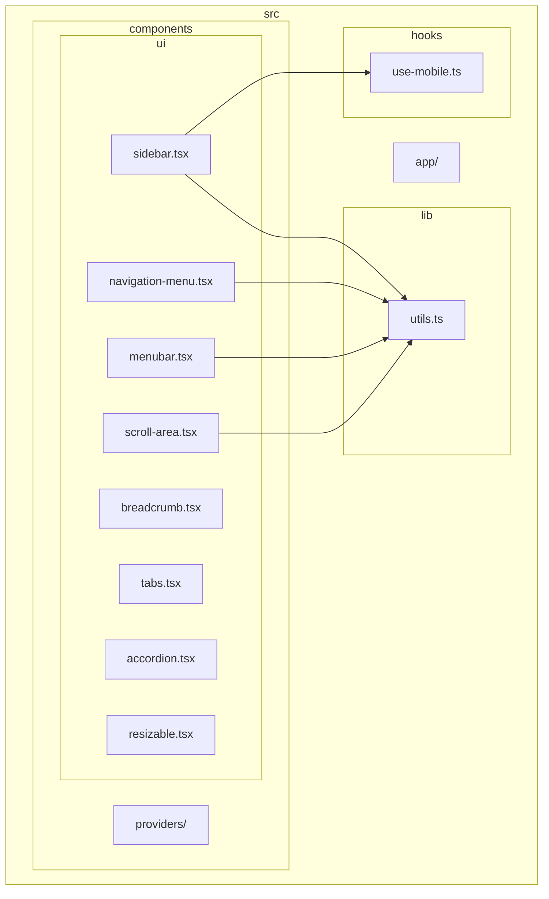
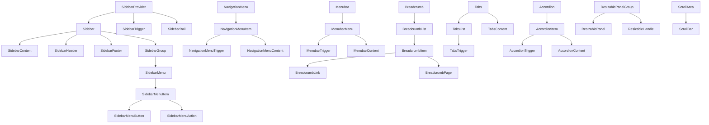
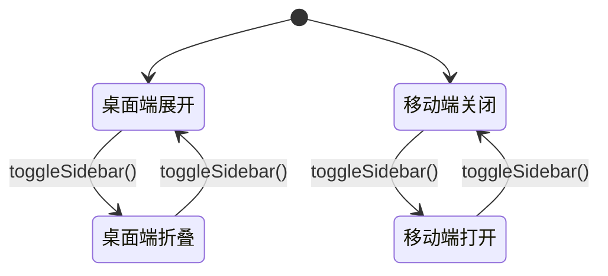
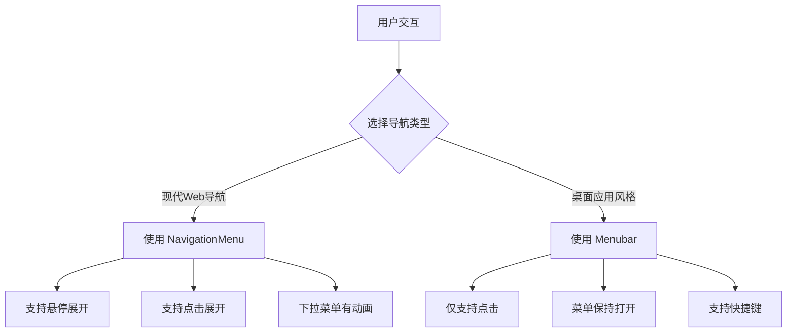
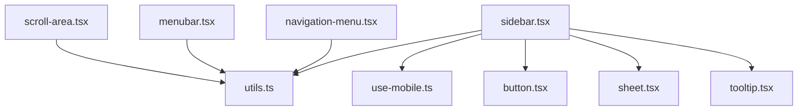

# 布局与导航组件

<cite>
**本文档引用的文件**   
- [sidebar.tsx](file://src/components/ui/sidebar.tsx)
- [navigation-menu.tsx](file://src/components/ui/navigation-menu.tsx)
- [menubar.tsx](file://src/components/ui/menubar.tsx)
- [breadcrumb.tsx](file://src/components/ui/breadcrumb.tsx)
- [tabs.tsx](file://src/components/ui/tabs.tsx)
- [accordion.tsx](file://src/components/ui/accordion.tsx)
- [resizable.tsx](file://src/components/ui/resizable.tsx)
- [scroll-area.tsx](file://src/components/ui/scroll-area.tsx)
- [use-mobile.ts](file://src/hooks/use-mobile.ts)
- [utils.ts](file://src/lib/utils.ts)
</cite>

## 目录

1. [简介](#简介)
2. [项目结构](#项目结构)
3. [核心组件](#核心组件)
4. [架构概览](#架构概览)
5. [详细组件分析](#详细组件分析)
6. [依赖分析](#依赖分析)
7. [性能考虑](#性能考虑)
8. [故障排除指南](#故障排除指南)
9. [结论](#结论)

## 简介

本文档全面文档化用于界面结构搭建的布局与导航组件。重点说明 `Sidebar` 如何构建主侧边栏导航区域，`NavigationMenu` 与 `Menubar` 在顶部导航中的应用差异，`Breadcrumb` 的路径追踪功能，以及 `Tabs` 与 `Accordion` 的内容分组切换机制。同时，解释 `Resizable` 实现可拖拽调整的面板尺寸，`ScrollArea` 确保内容在固定容器内的平滑滚动。提供响应式布局示例，并指导开发者如何组合这些组件构建复杂的管理后台界面。

## 项目结构

项目采用典型的 Next.js 应用结构，布局与导航组件集中存放在 `src/components/ui` 目录下。这些组件基于 Radix UI 原语构建，通过 Tailwind CSS 进行样式化，实现了高度的可定制性和一致性。

**图示来源**

- [sidebar.tsx](file://src/components/ui/sidebar.tsx)
- [navigation-menu.tsx](file://src/components/ui/navigation-menu.tsx)
- [menubar.tsx](file://src/components/ui/menubar.tsx)
- [scroll-area.tsx](file://src/components/ui/scroll-area.tsx)
- [use-mobile.ts](file://src/hooks/use-mobile.ts)
- [utils.ts](file://src/lib/utils.ts)

**本节来源**

- [sidebar.tsx](file://src/components/ui/sidebar.tsx)
- [navigation-menu.tsx](file://src/components/ui/navigation-menu.tsx)
- [menubar.tsx](file://src/components/ui/menubar.tsx)

## 核心组件

本节分析构成应用布局骨架的核心组件，包括侧边栏、顶部导航、面包屑、标签页、手风琴、可调整大小的面板和滚动区域。

**本节来源**

- [sidebar.tsx](file://src/components/ui/sidebar.tsx#L1-L727)
- [breadcrumb.tsx](file://src/components/ui/breadcrumb.tsx#L1-L110)
- [tabs.tsx](file://src/components/ui/tabs.tsx#L1-L67)

## 架构概览

整个布局系统围绕 `SidebarProvider` 构建，它通过 React Context 管理侧边栏的展开/折叠状态。其他组件如 `Sidebar`、`SidebarTrigger` 和 `SidebarRail` 共享此状态，实现一致的交互体验。顶部导航组件 `NavigationMenu` 和 `Menubar` 提供了不同的视觉和交互范式。`Breadcrumb`、`Tabs` 和 `Accordion` 用于内容的层级和分组展示，而 `Resizable` 和 `ScrollArea` 则处理空间和内容的动态管理。

**图示来源**

- [sidebar.tsx](file://src/components/ui/sidebar.tsx#L1-L727)
- [navigation-menu.tsx](file://src/components/ui/navigation-menu.tsx#L1-L169)
- [menubar.tsx](file://src/components/ui/menubar.tsx#L1-L277)
- [breadcrumb.tsx](file://src/components/ui/breadcrumb.tsx#L1-L110)
- [tabs.tsx](file://src/components/ui/tabs.tsx#L1-L67)
- [accordion.tsx](file://src/components/ui/accordion.tsx#L1-L67)
- [resizable.tsx](file://src/components/ui/resizable.tsx#L1-L57)
- [scroll-area.tsx](file://src/components/ui/scroll-area.tsx#L1-L59)

## 详细组件分析

本节深入分析每个关键布局与导航组件的实现细节、使用方法和最佳实践。

### 侧边栏 (Sidebar) 分析

`Sidebar` 组件是应用的主要导航区域，支持桌面端的展开/折叠和移动端的抽屉式交互。

#### 交互状态管理

`SidebarProvider` 使用 React Context (`SidebarContext`) 来管理侧边栏的状态，包括 `open` (桌面端展开状态)、`openMobile` (移动端打开状态) 和 `isMobile` (设备类型)。状态变化通过 `setOpen` 和 `setOpenMobile` 函数控制，并通过 `toggleSidebar` 函数提供统一的切换入口。状态会持久化到 Cookie 中，确保用户刷新页面后状态不变。

**图示来源**

- [sidebar.tsx](file://src/components/ui/sidebar.tsx#L50-L250)

#### 组件结构与用法

`Sidebar` 组件由多个子组件构成，形成一个完整的导航结构：

- `SidebarHeader` / `SidebarFooter`: 用于放置 Logo、用户信息或版权信息。
- `SidebarContent`: 包含主要的导航菜单。
- `SidebarGroup`: 将相关菜单项分组，可包含 `SidebarGroupLabel` 作为组标题。
- `SidebarMenu`: 一个无序列表，包含多个 `SidebarMenuItem`。
- `SidebarMenuButton`: 单个菜单项按钮，支持 `tooltip` 属性在侧边栏折叠时显示提示。
- `SidebarMenuSub`: 用于创建二级菜单，仅在侧边栏展开时显示。
- `SidebarTrigger`: 一个图标按钮，用于触发 `toggleSidebar`。
- `SidebarRail`: 一个隐藏的拖拽区域，鼠标悬停时出现，提供另一种展开/折叠方式。

**本节来源**

- [sidebar.tsx](file://src/components/ui/sidebar.tsx#L1-L727)

### 顶部导航分析

`NavigationMenu` 和 `Menubar` 都用于顶部导航，但设计和交互模式不同。

#### NavigationMenu 与 Menubar 的对比

`NavigationMenu` 更适合现代 Web 应用的主导航，其特点是：

- **交互模式**: 鼠标悬停或点击触发下拉菜单。
- **视觉风格**: 通常与品牌设计融合，下拉菜单有动画效果。
- **使用场景**: 主导航栏，如“产品”、“文档”、“定价”等。

`Menubar` 模仿传统桌面应用的菜单栏，其特点是：

- **交互模式**: 点击菜单项后，菜单保持打开状态，直到用户点击其他地方或选择菜单项。
- **视觉风格**: 有明显的菜单栏分隔，菜单项通常包含快捷键。
- **使用场景**: 应用内的功能菜单，如“文件”、“编辑”、“视图”等。

**本节来源**

- [navigation-menu.tsx](file://src/components/ui/navigation-menu.tsx#L1-L169)
- [menubar.tsx](file://src/components/ui/menubar.tsx#L1-L277)

### 内容分组与路径追踪

`Breadcrumb`、`Tabs` 和 `Accordion` 组件用于组织和展示内容。

#### Breadcrumb 路径追踪

`Breadcrumb` 组件通过 `BreadcrumbList` 包含一系列 `BreadcrumbItem`，每个 `BreadcrumbItem` 可以是 `BreadcrumbLink` (可点击的路径) 或 `BreadcrumbPage` (当前页面)。`BreadcrumbSeparator` 用于分隔路径项。当路径过长时，`BreadcrumbEllipsis` 可以用来折叠中间路径。

**本节来源**

- [breadcrumb.tsx](file://src/components/ui/breadcrumb.tsx#L1-L110)

#### Tabs 与 Accordion 内容切换

`Tabs` 组件提供标签页式的内容切换，`TabsList` 包含多个 `TabsTrigger`，每个 `TabsTrigger` 对应一个 `TabsContent`。`Accordion` 组件提供手风琴式的内容折叠，`AccordionItem` 包含一个 `AccordionTrigger` 和一个 `AccordionContent`，点击 `AccordionTrigger` 可以展开或收起对应的内容。

**本节来源**

- [tabs.tsx](file://src/components/ui/tabs.tsx#L1-L67)
- [accordion.tsx](file://src/components/ui/accordion.tsx#L1-L67)

### 空间与滚动管理

`Resizable` 和 `ScrollArea` 组件处理界面的空间布局和内容滚动。

#### Resizable 可调整大小的面板

`ResizablePanelGroup` 定义了一个可调整大小的容器，其 `direction` 属性可以是 `horizontal` 或 `vertical`。`ResizablePanel` 是组内的面板，可以通过 `defaultSize` 或 `minSize`/`maxSize` 控制尺寸。`ResizableHandle` 是分隔线，用户可以拖拽它来调整相邻面板的大小。`withHandle` 属性可以添加一个可视化的拖拽手柄。

**本节来源**

- [resizable.tsx](file://src/components/ui/resizable.tsx#L1-L57)

#### ScrollArea 内容滚动

`ScrollArea` 组件包裹需要滚动的内容。它内部包含一个 `Viewport` 和一个或多个 `ScrollBar`。`ScrollBar` 的 `orientation` 属性定义了滚动条的方向。该组件提供了平滑的滚动体验，并且滚动条样式可以自定义。

**本节来源**

- [scroll-area.tsx](file://src/components/ui/scroll-area.tsx#L1-L59)

## 依赖分析

布局与导航组件之间存在清晰的依赖关系。

**图示来源**

- [sidebar.tsx](file://src/components/ui/sidebar.tsx#L4-L10)
- [navigation-menu.tsx](file://src/components/ui/navigation-menu.tsx#L4-L5)
- [menubar.tsx](file://src/components/ui/menubar.tsx#L4-L5)
- [scroll-area.tsx](file://src/components/ui/scroll-area.tsx#L4-L5)

**本节来源**

- [sidebar.tsx](file://src/components/ui/sidebar.tsx#L1-L727)
- [navigation-menu.tsx](file://src/components/ui/navigation-menu.tsx#L1-L169)
- [menubar.tsx](file://src/components/ui/menubar.tsx#L1-L277)
- [scroll-area.tsx](file://src/components/ui/scroll-area.tsx#L1-L59)

## 性能考虑

- **状态管理**: `SidebarProvider` 使用 `useMemo` 优化 Context 值的计算，避免不必要的重新渲染。
- **条件渲染**: 组件根据 `isMobile` 和 `state` 状态进行条件渲染，例如移动端使用 `Sheet` 组件，桌面端使用 `div`。
- **动画**: `Accordion` 和 `NavigationMenu` 使用 CSS 动画 (`animate-in`, `animate-out`) 实现流畅的展开/折叠效果，性能良好。
- **轻量依赖**: 组件主要依赖 Radix UI 原语和 Tailwind CSS，没有引入大型第三方库，保证了较小的包体积。

## 故障排除指南

- **侧边栏不响应点击**: 检查是否将 `Sidebar` 及其子组件包裹在 `SidebarProvider` 内。
- **移动端抽屉不显示**: 确认 `useIsMobile` Hook 是否正确工作，检查 CSS 媒体查询。
- **滚动条不出现**: 确保 `ScrollArea` 内的内容高度或宽度超过了容器。
- **可调整大小的面板无法拖拽**: 检查 `ResizablePanelGroup` 是否正确设置了 `direction`，并确保 `ResizableHandle` 存在。
- **样式错乱**: 检查 Tailwind CSS 类名是否正确，确认 `cn` 工具函数是否正常工作。

**本节来源**

- [sidebar.tsx](file://src/components/ui/sidebar.tsx#L1-L727)
- [scroll-area.tsx](file://src/components/ui/scroll-area.tsx#L1-L59)
- [resizable.tsx](file://src/components/ui/resizable.tsx#L1-L57)
- [utils.ts](file://src/lib/utils.ts)

## 结论

本文档详细分析了项目中的布局与导航组件。`Sidebar` 提供了强大且响应式的侧边栏解决方案，`NavigationMenu` 和 `Menubar` 满足了不同风格的顶部导航需求。`Breadcrumb`、`Tabs` 和 `Accordion` 有效组织了内容层级。`Resizable` 和 `ScrollArea` 增强了界面的交互性。这些组件与 Tailwind CSS 深度集成，开发者可以轻松地组合它们来构建复杂、美观且用户友好的管理后台界面。
