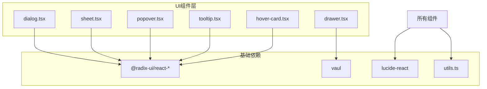
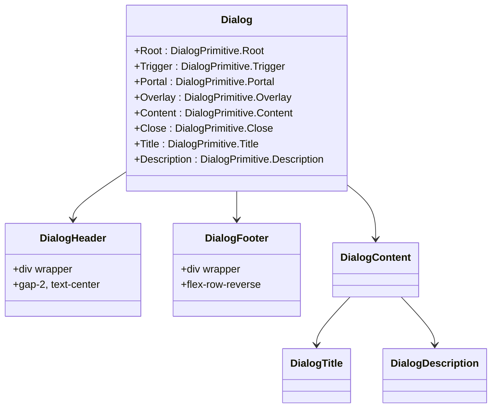
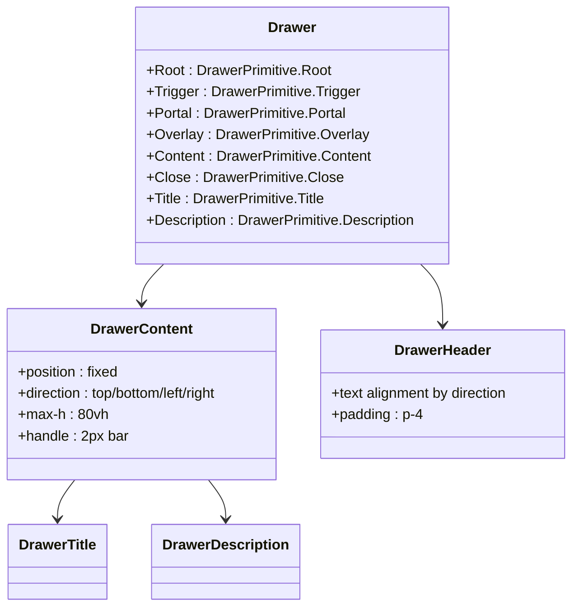
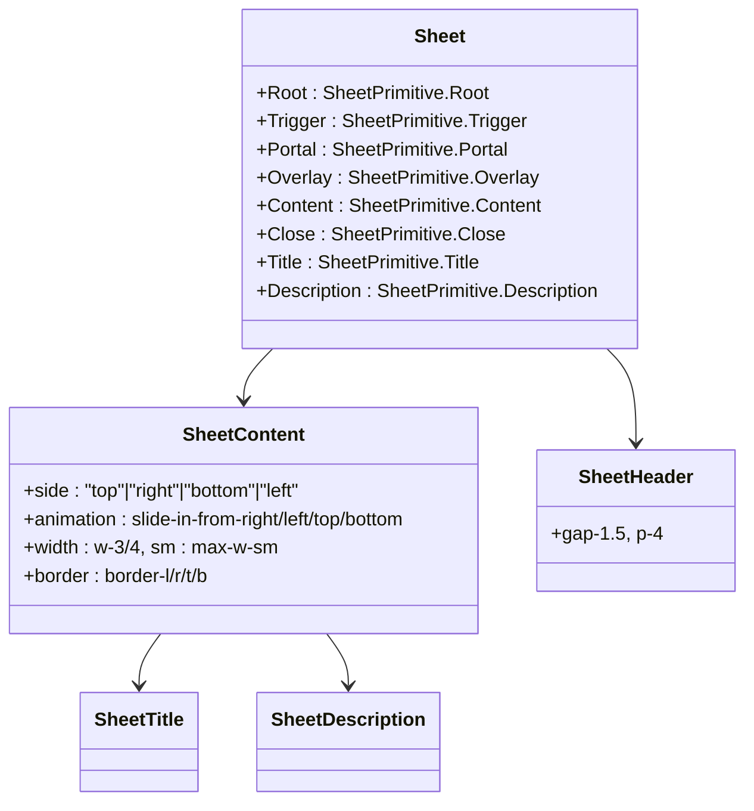
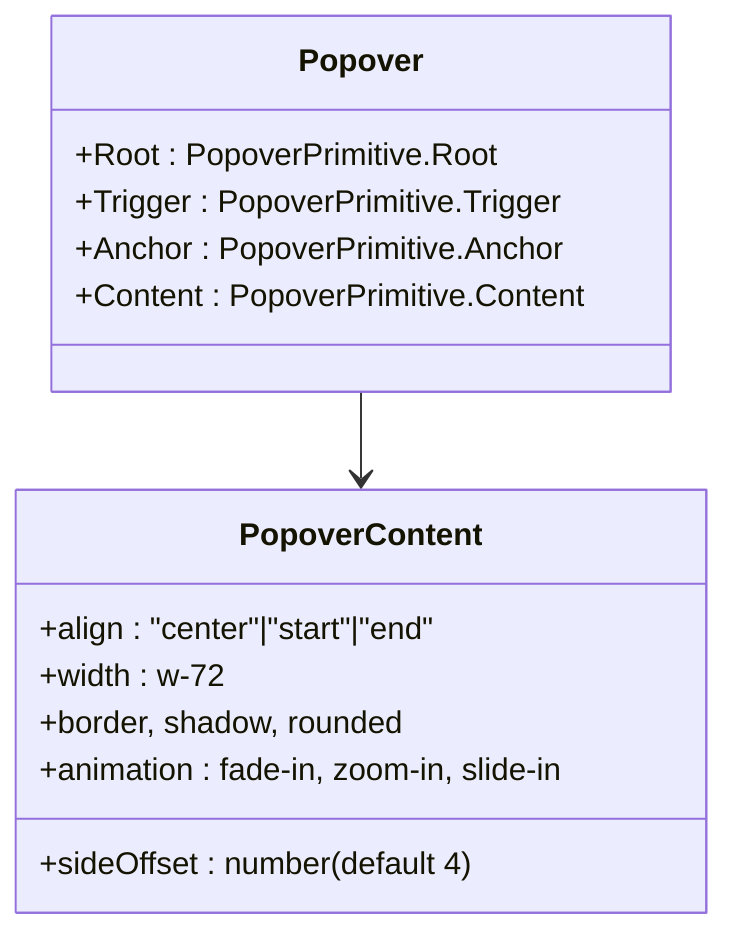
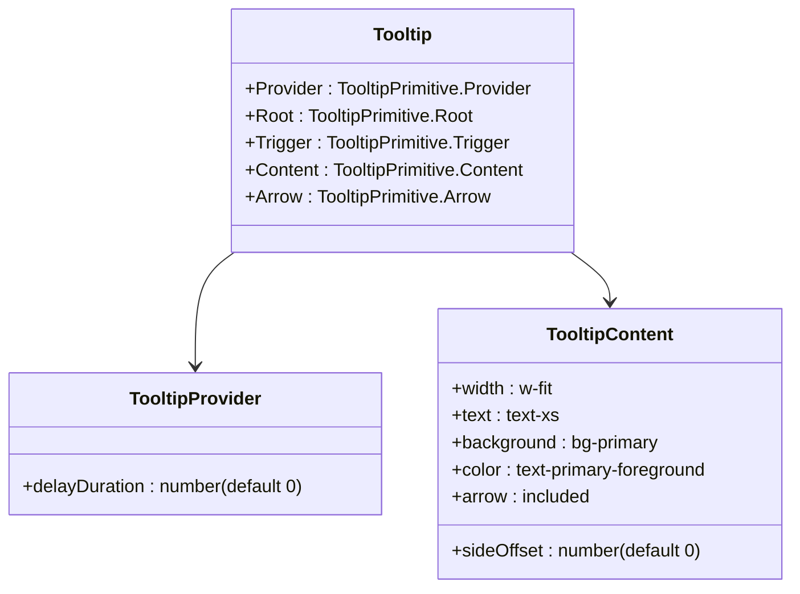
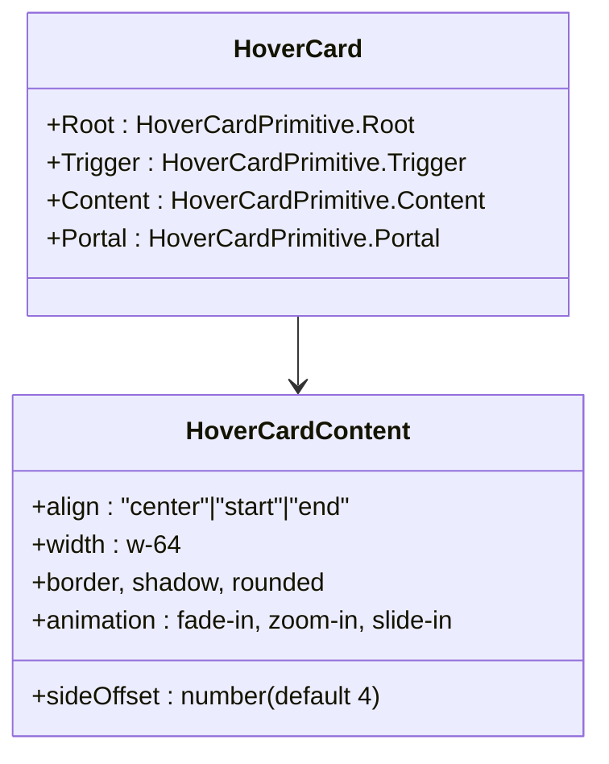
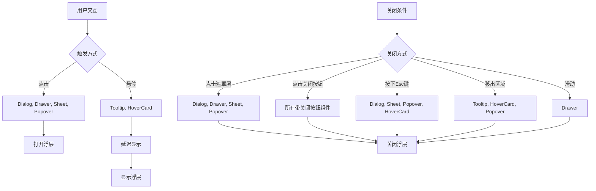
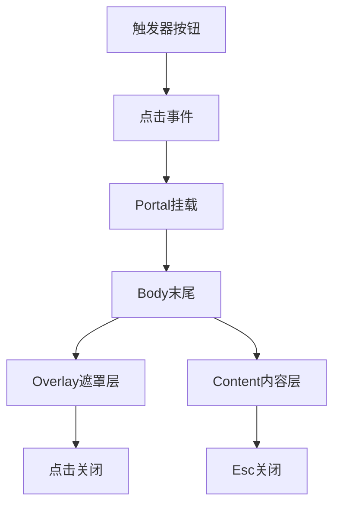

# 弹窗与浮层组件

<cite>
**本文档引用文件**   
- [dialog.tsx](file://src/components/ui/dialog.tsx)
- [drawer.tsx](file://src/components/ui/drawer.tsx)
- [sheet.tsx](file://src/components/ui/sheet.tsx)
- [popover.tsx](file://src/components/ui/popover.tsx)
- [tooltip.tsx](file://src/components/ui/tooltip.tsx)
- [hover-card.tsx](file://src/components/ui/hover-card.tsx)
</cite>

## 目录

1. [引言](#引言)
2. [项目结构](#项目结构)
3. [核心浮层组件概览](#核心浮层组件概览)
4. [详细组件分析](#详细组件分析)
5. [触发机制与交互行为](#触发机制与交互行为)
6. [可访问性与ARIA支持](#可访问性与aria支持)
7. [动画与过渡效果](#动画与过渡效果)
8. [Portal集成与DOM结构](#portal集成与dom结构)
9. [嵌套浮层与焦点管理](#嵌套浮层与焦点管理)
10. [最佳实践与使用建议](#最佳实践与使用建议)

## 引言

本文档系统化地文档化了项目中所有浮层类UI组件，包括模态对话框（Dialog）、抽屉（Drawer）、侧边面板（Sheet）、气泡弹窗（Popover）、工具提示（Tooltip）和悬停卡片（HoverCard）。这些组件均基于Radix UI等可访问性优先的底层库构建，具备良好的键盘交互、屏幕阅读器支持和动画过渡能力。文档将深入分析其使用场景、实现机制及最佳实践。

## 项目结构

项目采用基于Next.js的App Router架构，浮层组件集中存放于`src/components/ui/`目录下，遵循Headless UI + Tailwind CSS的无样式封装模式。每个组件独立为`.tsx`文件，通过`cn()`工具函数组合Tailwind类名实现样式定制。

**图示来源**

- [dialog.tsx](file://src/components/ui/dialog.tsx)
- [drawer.tsx](file://src/components/ui/drawer.tsx)
- [sheet.tsx](file://src/components/ui/sheet.tsx)
- [popover.tsx](file://src/components/ui/popover.tsx)
- [tooltip.tsx](file://src/components/ui/tooltip.tsx)
- [hover-card.tsx](file://src/components/ui/hover-card.tsx)

**本节来源**

- [src/components/ui](file://src/components/ui)

## 核心浮层组件概览

本项目实现了六种主要浮层组件，各自适用于不同交互场景：

| 组件                      | 使用场景                               | 触发方式 | 关闭方式                           | 定位方式               |
| ------------------------- | -------------------------------------- | -------- | ---------------------------------- | ---------------------- |
| **Dialog（模态对话框）**  | 关键操作确认、表单提交、重要信息展示   | 点击     | 点击关闭按钮、Esc键、点击遮罩层    | 居中悬浮               |
| **Drawer（抽屉）**        | 移动端菜单、筛选面板、侧边操作区       | 点击     | 滑动关闭、点击关闭按钮、点击遮罩层 | 从边缘滑入（支持四向） |
| **Sheet（侧边面板）**     | 内容详情展示、多步骤流程、复杂表单     | 点击     | 点击关闭按钮、Esc键、点击遮罩层    | 从边缘滑入（支持四向） |
| **Popover（气泡弹窗）**   | 上下文菜单、设置面板、富文本编辑工具栏 | 点击     | 再次点击触发器、点击外部区域       | 相对于锚点元素定位     |
| **Tooltip（工具提示）**   | 元素功能说明、简短提示信息             | 悬停     | 移出目标区域、自动消失             | 相对于目标元素定位     |
| **HoverCard（悬停卡片）** | 用户资料预览、商品详情预览、富内容提示 | 悬停     | 移出目标或卡片区域                 | 相对于触发器定位       |

## 详细组件分析

### Dialog（模态对话框）分析

Dialog组件用于阻断用户操作流的关键场景，如删除确认、登录表单等。它基于`@radix-ui/react-dialog`实现，确保符合WAI-ARIA标准。

**图示来源**

- [dialog.tsx](file://src/components/ui/dialog.tsx#L1-L144)

**本节来源**

- [dialog.tsx](file://src/components/ui/dialog.tsx#L1-L144)

### Drawer（抽屉）分析

Drawer组件专为移动端优化，支持手势滑动关闭，使用`vaul`库实现流畅的拖拽体验。常用于导航菜单、筛选条件等场景。

**图示来源**

- [drawer.tsx](file://src/components/ui/drawer.tsx#L1-L136)

**本节来源**

- [drawer.tsx](file://src/components/ui/drawer.tsx#L1-L136)

### Sheet（侧边面板）分析

Sheet组件类似于Drawer，但基于`@radix-ui/react-dialog`构建，提供更标准的模态行为，适用于桌面端和移动端的内容侧滑展示。

**图示来源**

- [sheet.tsx](file://src/components/ui/sheet.tsx#L1-L140)

**本节来源**

- [sheet.tsx](file://src/components/ui/sheet.tsx#L1-L140)

### Popover（气泡弹窗）分析

Popover组件用于显示与某个元素相关的上下文内容，如菜单、设置面板等，支持灵活的对齐和偏移配置。

**图示来源**

- [popover.tsx](file://src/components/ui/popover.tsx#L1-L49)

**本节来源**

- [popover.tsx](file://src/components/ui/popover.tsx#L1-L49)

### Tooltip（工具提示）分析

Tooltip组件提供悬停时的简短文字提示，内置延迟显示机制，避免干扰用户操作。

**图示来源**

- [tooltip.tsx](file://src/components/ui/tooltip.tsx#L1-L62)

**本节来源**

- [tooltip.tsx](file://src/components/ui/tooltip.tsx#L1-L62)

### HoverCard（悬停卡片）分析

HoverCard组件用于展示更丰富的悬停内容，如用户资料、商品信息等，支持更复杂的布局。

**图示来源**

- [hover-card.tsx](file://src/components/ui/hover-card.tsx#L1-L45)

**本节来源**

- [hover-card.tsx](file://src/components/ui/hover-card.tsx#L1-L45)

## 触发机制与交互行为

各组件的触发与关闭行为设计如下：

**图示来源**

- [dialog.tsx](file://src/components/ui/dialog.tsx)
- [drawer.tsx](file://src/components/ui/drawer.tsx)
- [sheet.tsx](file://src/components/ui/sheet.tsx)
- [popover.tsx](file://src/components/ui/popover.tsx)
- [tooltip.tsx](file://src/components/ui/tooltip.tsx)
- [hover-card.tsx](file://src/components/ui/hover-card.tsx)

**本节来源**

- [dialog.tsx](file://src/components/ui/dialog.tsx)
- [drawer.tsx](file://src/components/ui/drawer.tsx)
- [sheet.tsx](file://src/components/ui/sheet.tsx)
- [popover.tsx](file://src/components/ui/popover.tsx)
- [tooltip.tsx](file://src/components/ui/tooltip.tsx)
- [hover-card.tsx](file://src/components/ui/hover-card.tsx)

## 可访问性与ARIA支持

所有组件均基于Radix UI构建，自动满足WAI-ARIA标准：

- **焦点管理**：打开时自动将焦点移至内容区域，关闭时恢复至触发器
- **屏幕阅读器支持**：通过`aria-label`、`aria-labelledby`、`aria-describedby`提供语义信息
- **键盘导航**：支持Tab键在可聚焦元素间移动，Shift+Tab反向导航
- **关闭快捷键**：Esc键关闭所有模态浮层
- **隐藏内容**：使用`sr-only`类隐藏视觉上不需要但对屏幕阅读器重要的文本（如“关闭”按钮）

例如，Dialog的关闭按钮包含`关闭`，确保屏幕阅读器能正确播报其功能。

**本节来源**

- [dialog.tsx](file://src/components/ui/dialog.tsx)
- [drawer.tsx](file://src/components/ui/drawer.tsx)
- [sheet.tsx](file://src/components/ui/sheet.tsx)
- [popover.tsx](file://src/components/ui/popover.tsx)
- [tooltip.tsx](file://src/components/ui/tooltip.tsx)
- [hover-card.tsx](file://src/components/ui/hover-card.tsx)

## 动画与过渡效果

组件通过data属性与Tailwind CSS的动画类实现过渡效果：

- **淡入淡出**：`data-[state=open]:fade-in-0` / `data-[state=closed]:fade-out-0`
- **缩放动画**：`data-[state=open]:zoom-in-95` / `data-[state=closed]:zoom-out-95`
- **滑动动画**：`data-[state=open]:slide-in-from-right` / `data-[state=closed]:slide-out-to-right`
- **延迟控制**：Sheet使用`data-[state=open]:duration-500`实现更长的动画时间

这些动画均通过Radix UI的状态管理自动触发，无需手动控制。

**本节来源**

- [dialog.tsx](file://src/components/ui/dialog.tsx)
- [sheet.tsx](file://src/components/ui/sheet.tsx)
- [popover.tsx](file://src/components/ui/popover.tsx)

## Portal集成与DOM结构

所有浮层组件均使用Portal（`Portal`组件）将渲染内容挂载至`document.body`，避免父容器的`overflow`、`z-index`等CSS属性影响浮层显示。

这种结构确保浮层始终位于最上层，不受组件树位置影响。

**图示来源**

- [dialog.tsx](file://src/components/ui/dialog.tsx)
- [drawer.tsx](file://src/components/ui/drawer.tsx)
- [sheet.tsx](file://src/components/ui/sheet.tsx)

**本节来源**

- [dialog.tsx](file://src/components/ui/dialog.tsx)
- [drawer.tsx](file://src/components/ui/drawer.tsx)
- [sheet.tsx](file://src/components/ui/sheet.tsx)

## 嵌套浮层与焦点管理

当需要嵌套使用浮层时（如Dialog内打开Popover），Radix UI会自动管理焦点栈，确保：

1. 新打开的浮层获得焦点
2. 关闭内层浮层后，焦点自动返回至上一层浮层
3. 最外层浮层关闭后，焦点恢复至原始触发器

此机制通过`<FocusScope>`和`<DismissableLayer>`等内部组件实现，开发者无需手动处理。

**本节来源**

- [dialog.tsx](file://src/components/ui/dialog.tsx)
- [popover.tsx](file://src/components/ui/popover.tsx)

## 最佳实践与使用建议

1. **选择合适的组件**：
   - 关键操作 → Dialog
   - 移动端菜单 → Drawer
   - 内容详情 → Sheet
   - 上下文菜单 → Popover
   - 简短提示 → Tooltip
   - 富内容预览 → HoverCard

2. **可访问性**：
   - 始终提供`aria-label`或`sr-only`文本
   - 确保所有功能均可通过键盘完成
   - 避免快速闪烁的动画

3. **性能优化**：
   - 使用`lazy mount`模式，仅在打开时渲染复杂内容
   - 对于大型列表，考虑虚拟滚动

4. **样式定制**：
   - 通过`className`属性扩展Tailwind类名
   - 避免直接修改组件内部结构
