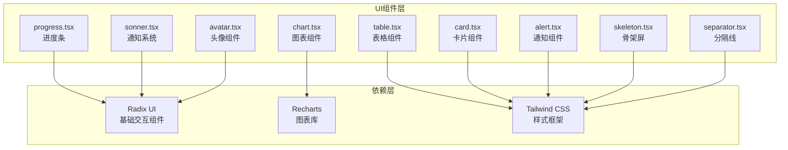
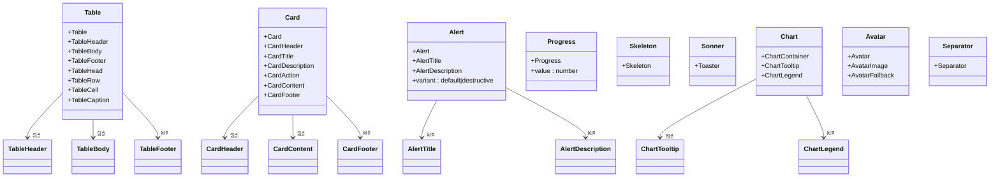
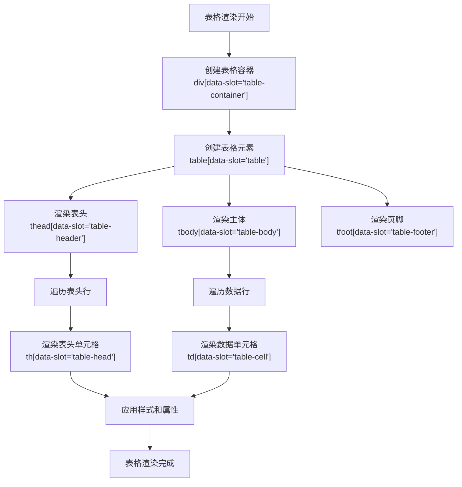
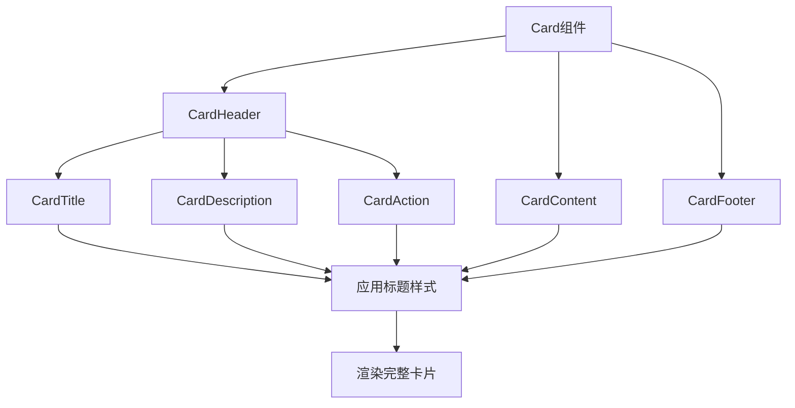
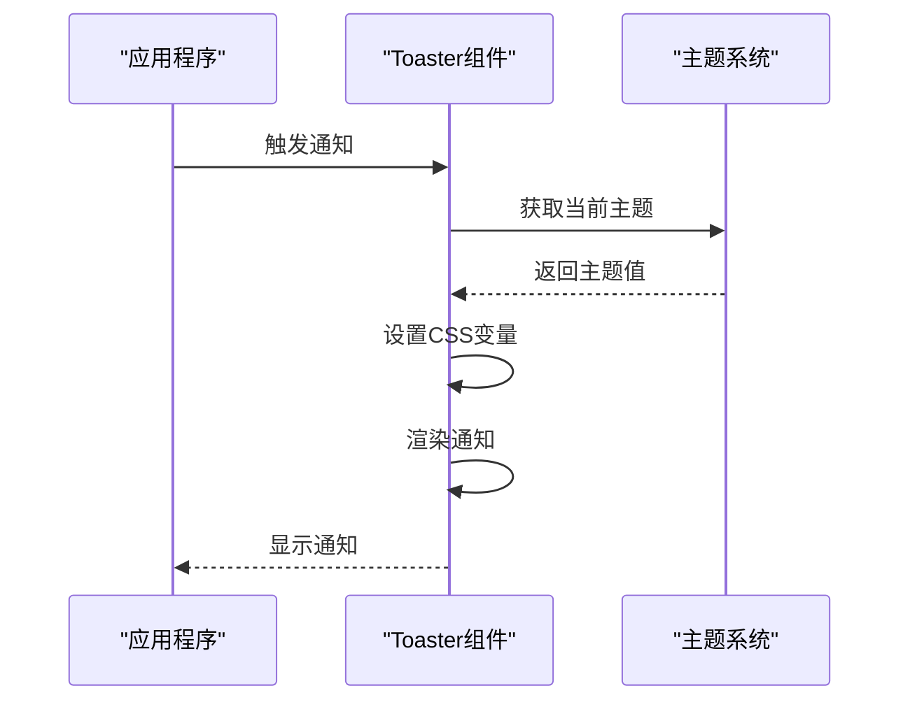
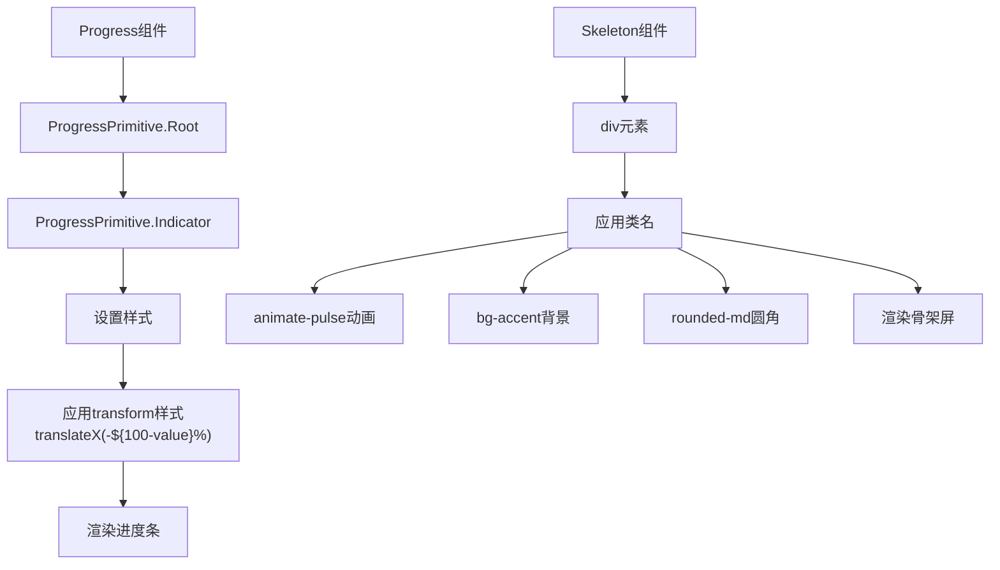
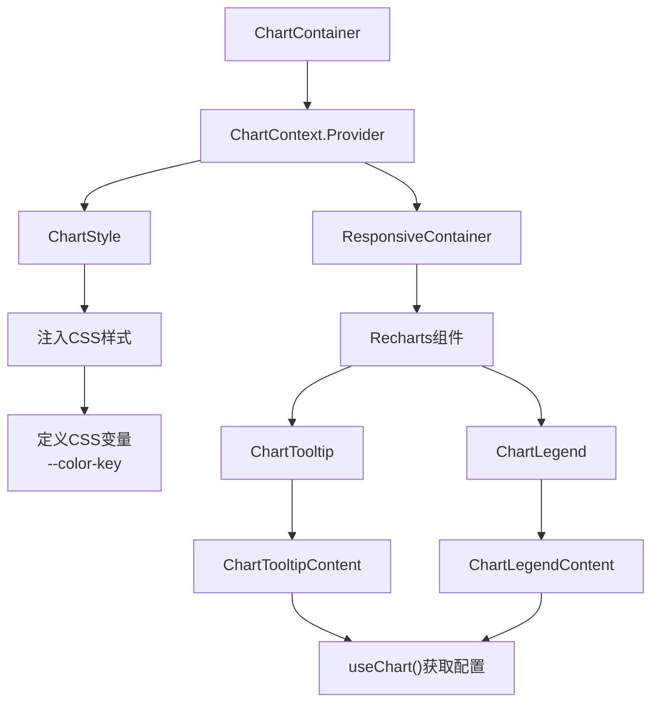

# 数据展示与反馈组件

<cite>
**本文档引用文件**   
- [table.tsx](file://src/components/ui/table.tsx)
- [card.tsx](file://src/components/ui/card.tsx)
- [alert.tsx](file://src/components/ui/alert.tsx)
- [progress.tsx](file://src/components/ui/progress.tsx)
- [skeleton.tsx](file://src/components/ui/skeleton.tsx)
- [sonner.tsx](file://src/components/ui/sonner.tsx)
- [chart.tsx](file://src/components/ui/chart.tsx)
- [avatar.tsx](file://src/components/ui/avatar.tsx)
- [separator.tsx](file://src/components/ui/separator.tsx)
</cite>

## 目录

1. [项目结构](#项目结构)
2. [核心组件分析](#核心组件分析)
3. [表格组件详解](#表格组件详解)
4. [卡片组件详解](#卡片组件详解)
5. [通知与反馈组件](#通知与反馈组件)
6. [可视化与加载组件](#可视化与加载组件)
7. [图表组件实现机制](#图表组件实现机制)
8. [用户界面辅助组件](#用户界面辅助组件)

## 项目结构

本项目采用基于Next.js的现代化前端架构，遵循组件化设计原则。主要目录结构如下：

- `public/`：存放静态资源文件
- `src/app/`：应用主路由和页面结构
- `src/components/`：UI组件库，包含可复用的界面元素
- `src/lib/`：工具函数和请求库

其中，`src/components/ui/`目录包含了所有基础UI组件，这些组件基于Radix UI和Tailwind CSS构建，提供了高度可定制的用户界面元素。



**图表来源**

- [table.tsx](file://src/components/ui/table.tsx#L1-L117)
- [card.tsx](file://src/components/ui/card.tsx#L1-L93)
- [alert.tsx](file://src/components/ui/alert.tsx#L1-L67)
- [progress.tsx](file://src/components/ui/progress.tsx#L1-L32)
- [skeleton.tsx](file://src/components/ui/skeleton.tsx#L1-L14)
- [sonner.tsx](file://src/components/ui/sonner.tsx#L1-L26)
- [chart.tsx](file://src/components/ui/chart.tsx#L1-L354)
- [avatar.tsx](file://src/components/ui/avatar.tsx#L1-L54)
- [separator.tsx](file://src/components/ui/separator.tsx)

**本节来源**

- [table.tsx](file://src/components/ui/table.tsx)
- [card.tsx](file://src/components/ui/card.tsx)
- [alert.tsx](file://src/components/ui/alert.tsx)

## 核心组件分析

本项目的核心UI组件库提供了丰富的界面元素，用于构建现代化的Web应用界面。这些组件可分为以下几类：

1. **数据展示类**：Table、Card、Chart
2. **用户反馈类**：Alert、Sonner、Progress
3. **加载状态类**：Skeleton、Progress
4. **用户信息类**：Avatar
5. **布局辅助类**：Separator

这些组件共同构成了应用的视觉语言体系，确保了界面的一致性和用户体验的连贯性。



**图表来源**

- [table.tsx](file://src/components/ui/table.tsx#L1-L117)
- [card.tsx](file://src/components/ui/card.tsx#L1-L93)
- [alert.tsx](file://src/components/ui/alert.tsx#L1-L67)
- [progress.tsx](file://src/components/ui/progress.tsx#L1-L32)
- [skeleton.tsx](file://src/components/ui/skeleton.tsx#L1-L14)
- [sonner.tsx](file://src/components/ui/sonner.tsx#L1-L26)
- [chart.tsx](file://src/components/ui/chart.tsx#L1-L354)
- [avatar.tsx](file://src/components/ui/avatar.tsx#L1-L54)
- [separator.tsx](file://src/components/ui/separator.tsx)

**本节来源**

- [table.tsx](file://src/components/ui/table.tsx#L1-L117)
- [card.tsx](file://src/components/ui/card.tsx#L1-L93)
- [alert.tsx](file://src/components/ui/alert.tsx#L1-L67)

## 表格组件详解

`Table`组件提供了一个完整的可排序、可分页的数据表格解决方案。它由多个子组件构成，形成了一个完整的表格体系：

- **Table**：表格容器，提供基本样式和布局
- **TableHeader**：表头容器，包含列标题
- **TableBody**：表格主体，包含数据行
- **TableFooter**：表格页脚，用于汇总信息
- **TableHead**：表头单元格，定义列标题
- **TableRow**：表格行，包含多个单元格
- **TableCell**：表格单元格，显示具体数据
- **TableCaption**：表格标题，提供表格描述

该组件支持响应式设计，通过`overflow-x-auto`实现水平滚动，确保在小屏幕上也能正常显示。同时，通过`hover:bg-muted/50`实现了行悬停效果，提升了用户体验。



**图表来源**

- [table.tsx](file://src/components/ui/table.tsx#L1-L117)

**本节来源**

- [table.tsx](file://src/components/ui/table.tsx#L1-L117)

## 卡片组件详解

`Card`组件用于创建内容区块的视觉隔离，提供了一种组织和呈现信息的有效方式。它由多个部分组成：

- **Card**：卡片容器，定义整体样式和布局
- **CardHeader**：卡片头部，通常包含标题和操作
- **CardTitle**：卡片标题，突出显示主要内容
- **CardDescription**：卡片描述，提供额外信息
- **CardAction**：卡片操作，放置按钮等交互元素
- **CardContent**：卡片内容，包含主要信息
- **CardFooter**：卡片页脚，用于补充信息或操作

该组件采用Flex布局，通过`flex-col`实现垂直排列，`gap-6`提供适当的间距。边框通过`border`实现，圆角通过`rounded-xl`设置，阴影通过`shadow-sm`添加，共同营造出卡片的立体感。



**图表来源**

- [card.tsx](file://src/components/ui/card.tsx#L1-L93)

**本节来源**

- [card.tsx](file://src/components/ui/card.tsx#L1-L93)

## 通知与反馈组件

### Alert组件

`Alert`组件用于传达重要通知信息，支持两种变体：

- **默认样式**：普通通知，用于一般性信息提示
- **破坏性样式**：错误或警告通知，用于重要或负面信息

组件结构包含：

- **Alert**：容器元素，定义整体样式
- **AlertTitle**：标题部分，突出显示通知主题
- **AlertDescription**：描述部分，提供详细信息

通过`cva`（Class Variance Authority）实现样式变体管理，确保样式的一致性和可维护性。

### Sonner通知系统

`Sonner`组件实现了全局通知系统，基于`sonner`库构建。它具有以下特点：

- **主题支持**：自动适配系统主题（通过`useTheme`）
- **样式定制**：通过CSS变量定义通知外观
- **分组管理**：通过`toaster group`类实现通知分组

该组件作为应用级别的通知中心，可以在任何位置触发通知，提供一致的用户体验。



**图表来源**

- [alert.tsx](file://src/components/ui/alert.tsx#L1-L67)
- [sonner.tsx](file://src/components/ui/sonner.tsx#L1-L26)

**本节来源**

- [alert.tsx](file://src/components/ui/alert.tsx#L1-L67)
- [sonner.tsx](file://src/components/ui/sonner.tsx#L1-L26)

## 可视化与加载组件

### Progress组件

`Progress`组件用于可视化加载进度，基于`@radix-ui/react-progress`构建。其核心特性包括：

- **响应式设计**：通过`h-2 w-full`实现自适应布局
- **动画效果**：通过`transition-all`实现平滑过渡
- **动态进度**：通过内联样式`transform: translateX()`控制进度条位置

组件通过计算`100 - value`来确定进度条的偏移量，实现从左到右的填充效果。

### Skeleton组件

`Skeleton`组件提供加载占位效果，用于在数据加载期间保持界面布局稳定。其特点包括：

- **动画效果**：通过`animate-pulse`实现脉冲动画
- **样式统一**：使用`bg-accent`颜色，与整体设计语言一致
- **灵活应用**：可通过`className`进一步定制形状和大小

该组件简单而有效，通过持续的淡入淡出动画模拟内容加载过程，减少用户等待的焦虑感。



**图表来源**

- [progress.tsx](file://src/components/ui/progress.tsx#L1-L32)
- [skeleton.tsx](file://src/components/ui/skeleton.tsx#L1-L14)

**本节来源**

- [progress.tsx](file://src/components/ui/progress.tsx#L1-L32)
- [skeleton.tsx](file://src/components/ui/skeleton.tsx#L1-L14)

## 图表组件实现机制

`Chart`组件基于`Recharts`库构建，实现了数据驱动的图表渲染机制。其核心架构包括：

- **ChartContainer**：图表容器，提供上下文和样式
- **ChartContext**：React上下文，管理图表配置
- **ChartStyle**：动态样式注入，支持主题化
- **ChartTooltip**：工具提示，提供数据详情
- **ChartLegend**：图例，解释数据系列

### 数据驱动机制

组件通过`ChartConfig`类型定义图表配置，支持：

- **标签配置**：为数据系列提供可读名称
- **颜色配置**：支持直接颜色值或主题化颜色
- **图标配置**：可自定义图例图标

### 主题支持

通过`THEMES`常量定义主题映射，支持：

- **浅色主题**：默认样式
- **深色主题**：`.dark`选择器

动态样式通过`<style>`标签注入，使用CSS变量`--color-${key}`存储颜色值，确保在不同主题下正确显示。



**图表来源**

- [chart.tsx](file://src/components/ui/chart.tsx#L1-L354)

**本节来源**

- [chart.tsx](file://src/components/ui/chart.tsx#L1-L354)

## 用户界面辅助组件

### Avatar组件

`Avatar`组件用于用户头像展示，基于`@radix-ui/react-avatar`构建。包含三个部分：

- **Avatar**：容器，定义大小和形状
- **AvatarImage**：头像图片，显示用户图像
- **AvatarFallback**：备用显示，当图片加载失败时显示

组件通过`size-8`设置固定尺寸，`rounded-full`实现圆形裁剪，`overflow-hidden`确保图片溢出部分被隐藏。

### Separator组件

`Separator`组件作为视觉分隔线，用于在内容区块之间创建清晰的界限。虽然代码未显示，但通常实现方式包括：

- **水平分隔线**：默认方向
- **垂直分隔线**：通过方向属性控制
- **样式定制**：支持不同颜色和粗细

### 动态数据更新示例

```tsx
// 示例：动态更新进度条
function LoadingIndicator() {
  const [progress, setProgress] = React.useState(0);

  React.useEffect(() => {
    const timer = setTimeout(() => setProgress(66), 1000);
    return () => clearTimeout(timer);
  }, []);

  return <Progress value={progress} />;
}

// 示例：条件性显示通知
function StatusNotifier({ error }) {
  return error ? (
    <Alert variant="destructive">
      <AlertTitle>错误</AlertTitle>
      <AlertDescription>{error.message}</AlertDescription>
    </Alert>
  ) : null;
}
```

这些组件共同作用，通过提供加载状态、错误提示和进度反馈，显著提升了用户体验和界面可读性。

**本节来源**

- [avatar.tsx](file://src/components/ui/avatar.tsx#L1-L54)
- [separator.tsx](file://src/components/ui/separator.tsx)
