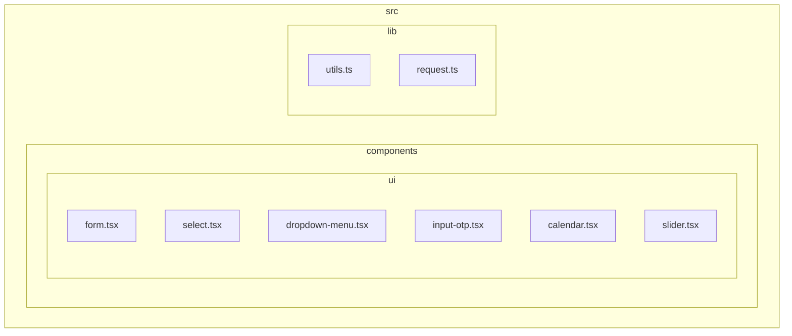
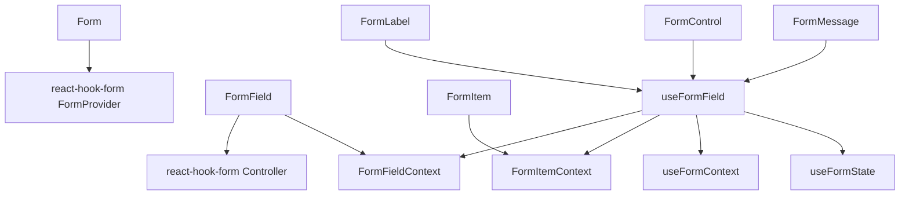
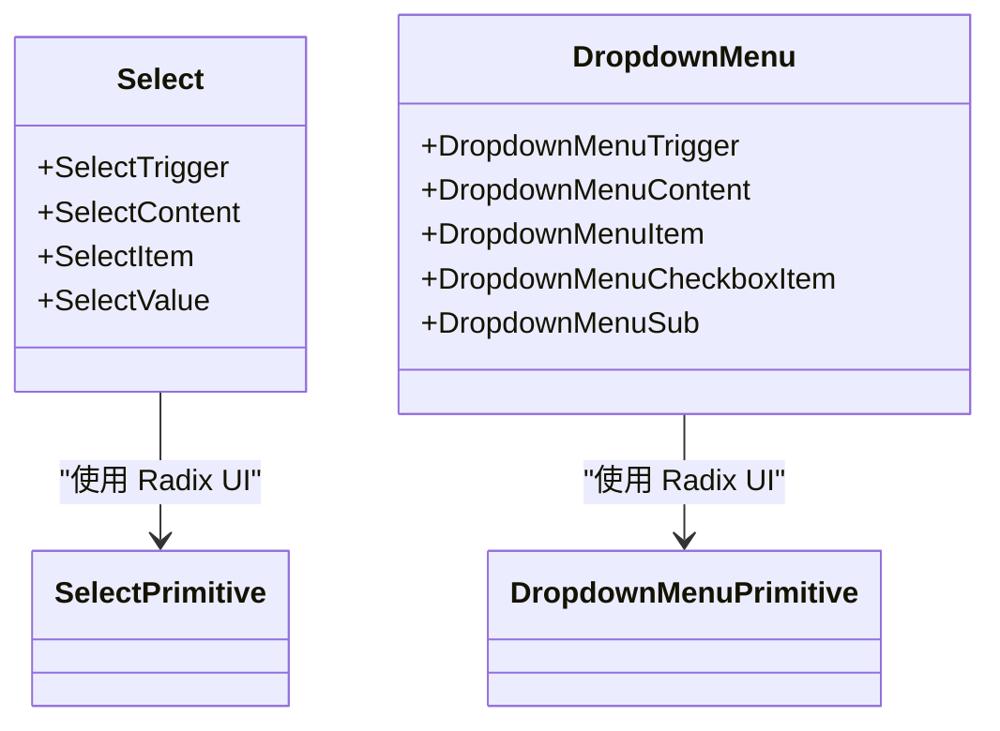
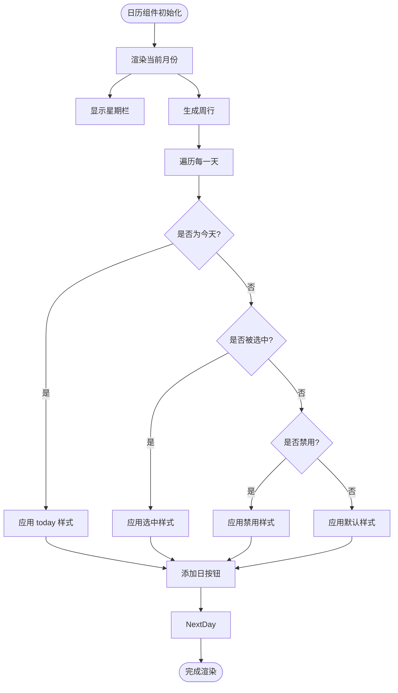

# 表单与数据输入组件

<cite>
**本文档引用的文件**  
- [form.tsx](file://src/components/ui/form.tsx)
- [select.tsx](file://src/components/ui/select.tsx)
- [dropdown-menu.tsx](file://src/components/ui/dropdown-menu.tsx)
- [input-otp.tsx](file://src/components/ui/input-otp.tsx)
- [calendar.tsx](file://src/components/ui/calendar.tsx)
- [slider.tsx](file://src/components/ui/slider.tsx)
</cite>

## 目录

1. [简介](#简介)
2. [项目结构](#项目结构)
3. [核心组件](#核心组件)
4. [架构概览](#架构概览)
5. [详细组件分析](#详细组件分析)
6. [依赖关系分析](#依赖关系分析)
7. [性能考量](#性能考量)
8. [故障排查指南](#故障排查指南)
9. [结论](#结论)

## 简介

本文档深入探讨了与表单和数据输入相关的复合组件，重点分析了如何通过 `react-hook-form` 和 `zod` 实现类型安全的表单验证。文档详细说明了下拉选择组件（如 Select、DropdownMenu、Combobox）的键盘导航机制，解释了 InputOTP 在两步验证码场景中的实现逻辑，并展示了 Calendar 和 Slider 组件的交互设计及其与表单的集成方式。同时，文档强调了无障碍设计和移动端适配的最佳实践。

## 项目结构

项目采用基于功能的模块化结构，主要分为 `public`、`scripts`、`src` 三大目录。核心 UI 组件位于 `src/components/ui` 目录下，每个组件以独立的 `.tsx` 文件实现，遵循原子化设计原则。表单相关组件（如 Form、Input、Select）均在此目录中定义，便于复用和维护。



**图示来源**

- [form.tsx](file://src/components/ui/form.tsx)
- [select.tsx](file://src/components/ui/select.tsx)
- [dropdown-menu.tsx](file://src/components/ui/dropdown-menu.tsx)
- [input-otp.tsx](file://src/components/ui/input-otp.tsx)
- [calendar.tsx](file://src/components/ui/calendar.tsx)
- [slider.tsx](file://src/components/ui/slider.tsx)

**本节来源**

- [form.tsx](file://src/components/ui/form.tsx#L1-L167)
- [select.tsx](file://src/components/ui/select.tsx#L1-L185)

## 核心组件

核心表单组件包括 `Form`、`FormField`、`FormItem`、`FormLabel`、`FormControl`、`FormDescription` 和 `FormMessage`，它们共同构建了一个结构清晰、语义明确的表单体系。`Form` 基于 `react-hook-form` 的 `FormProvider`，提供表单状态上下文；`FormField` 使用 `Controller` 实现受控组件的封装；`FormItem` 作为容器管理表单项的布局与 ID 生成。

**本节来源**

- [form.tsx](file://src/components/ui/form.tsx#L1-L167)

## 架构概览

整个表单系统基于 React Context 和 `react-hook-form` 构建，通过 `FormFieldContext` 和 `FormItemContext` 实现组件间通信。`useFormField` 钩子是连接各表单子组件的核心，它从上下文中提取字段状态（如错误、ID 等），并统一暴露给 `FormLabel`、`FormControl`、`FormMessage` 等组件使用，确保了数据的一致性和可访问性。



**图示来源**

- [form.tsx](file://src/components/ui/form.tsx#L1-L167)

## 详细组件分析

### 表单验证与类型安全

`Form` 组件通过集成 `react-hook-form` 和 `zod`，实现了强大的类型安全验证。开发者可以定义 Zod Schema，通过 `useForm` 钩子生成类型化的表单实例，确保表单值、错误信息和提交数据的类型安全。`FormField` 组件封装了 `Controller`，简化了受控组件的注册流程。

**本节来源**

- [form.tsx](file://src/components/ui/form.tsx#L1-L167)

### 下拉选择机制

`Select` 组件基于 `@radix-ui/react-select` 构建，提供无障碍的下拉选择功能。其结构包括 `SelectTrigger`（触发器）、`SelectContent`（内容面板）、`SelectItem`（选项项）等。支持键盘导航（如方向键、Enter、Escape），并自动管理焦点和选中状态。`DropdownMenu` 提供更通用的右键菜单或下拉菜单功能，支持嵌套子菜单（`DropdownMenuSub`）和复选框项（`DropdownMenuCheckboxItem`）。



**图示来源**

- [select.tsx](file://src/components/ui/select.tsx#L1-L185)
- [dropdown-menu.tsx](file://src/components/ui/dropdown-menu.tsx#L1-L257)

**本节来源**

- [select.tsx](file://src/components/ui/select.tsx#L1-L185)
- [dropdown-menu.tsx](file://src/components/ui/dropdown-menu.tsx#L1-L257)

### 验证码输入组件

`InputOTP` 用于处理一次性验证码输入，通常用于两步验证场景。它将输入分割为多个独立的 `InputOTPSlot`，每个槽位对应一个字符。组件支持自动跳转（输入一个字符后自动聚焦下一个）、删除回退、以及粘贴完整验证码。`InputOTPSeparator` 可用于分隔字符组（如 1234-5678）。

**本节来源**

- [input-otp.tsx](file://src/components/ui/input-otp.tsx#L1-L77)

### 日期选择与数值调节

`Calendar` 组件基于 `react-day-picker` 实现，支持单日、多日和日期范围选择。它集成了导航按钮（上一月/下一月）、月份下拉菜单，并通过 `CalendarDayButton` 包装按钮以支持无障碍和焦点管理。`Slider` 组件基于 `@radix-ui/react-slider`，提供滑动条控件，支持单手柄和多手柄，常用于调节数值（如音量、亮度）。



**图示来源**

- [calendar.tsx](file://src/components/ui/calendar.tsx#L1-L213)

**本节来源**

- [calendar.tsx](file://src/components/ui/calendar.tsx#L1-L213)
- [slider.tsx](file://src/components/ui/slider.tsx#L1-L63)

## 依赖关系分析

各组件之间通过明确的依赖关系组织。`Form` 系列组件依赖 `react-hook-form` 和 `@radix-ui/react-label`；`Select` 和 `DropdownMenu` 依赖 `@radix-ui/react-select` 和 `@radix-ui/react-dropdown-menu`；`InputOTP` 依赖第三方库 `input-otp`；`Calendar` 依赖 `react-day-picker`。所有 UI 组件共享 `cn` 工具函数进行条件样式合并。

```mermaid
graph LR
A[Form] --> B[react-hook-form]
C[Select] --> D[@radix-ui/react-select]
E[DropdownMenu] --> F[@radix-ui/react-dropdown-menu]
G[InputOTP] --> H[input-otp]
I[Calendar] --> J[react-day-picker]
K[所有组件] --> L[cn 工具函数]
```

**图示来源**

- [form.tsx](file://src/components/ui/form.tsx#L4-L8)
- [select.tsx](file://src/components/ui/select.tsx#L3-L4)
- [dropdown-menu.tsx](file://src/components/ui/dropdown-menu.tsx#L3-L4)
- [input-otp.tsx](file://src/components/ui/input-otp.tsx#L3-L4)
- [calendar.tsx](file://src/components/ui/calendar.tsx#L3-L4)
- [lib/utils.ts](file://src/lib/utils.ts)

**本节来源**

- [form.tsx](file://src/components/ui/form.tsx#L1-L167)
- [select.tsx](file://src/components/ui/select.tsx#L1-L185)
- [dropdown-menu.tsx](file://src/components/ui/dropdown-menu.tsx#L1-L257)

## 性能考量

所有组件均采用函数式组件和 React Hooks 实现，确保了良好的性能和可维护性。`useMemo` 被用于 `Slider` 组件中缓存值数组，避免不必要的重新计算。`React.useId` 用于生成唯一的 ID，确保无障碍属性的正确性。组件样式通过 `cn` 函数按需合并，减少运行时开销。

## 故障排查指南

- **表单验证不触发**：检查 `FormField` 是否正确包裹输入组件，并确保 `name` 属性与 schema 一致。
- **下拉菜单无法打开**：确认 `SelectTrigger` 和 `SelectContent` 成对出现，且未被 CSS 遮挡。
- **日历显示异常**：检查 `captionLayout` 和 `buttonVariant` 属性是否正确传递。
- **滑块无法拖动**：确保未设置 `disabled` 属性，且父容器未阻止事件冒泡。

**本节来源**

- [form.tsx](file://src/components/ui/form.tsx#L55-L57)
- [select.tsx](file://src/components/ui/select.tsx#L50-L55)
- [calendar.tsx](file://src/components/ui/calendar.tsx#L100-L110)
- [slider.tsx](file://src/components/ui/slider.tsx#L20-L25)

## 结论

本文档全面分析了表单与数据输入组件的设计与实现。通过集成现代 React 库（如 `react-hook-form`、`zod`、`Radix UI`），这些组件提供了类型安全、无障碍、响应式且高度可定制的用户体验。遵循此文档的指导，开发者可以高效构建复杂且可靠的表单界面。
