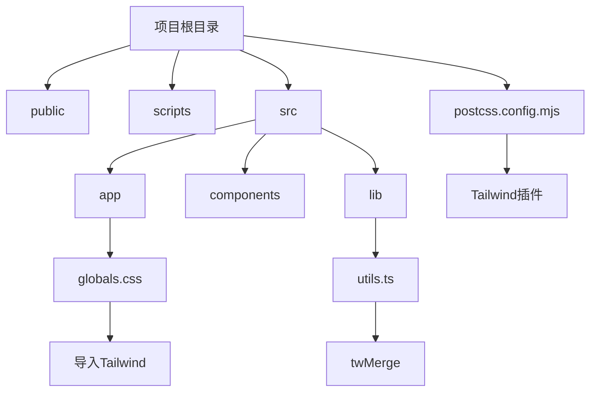

# Tailwind集成与配置

<cite>
**本文档引用的文件**   
- [globals.css](file://src/app/globals.css#L1-L122)
- [postcss.config.mjs](file://postcss.config.mjs#L1-L4)
- [utils.ts](file://src/lib/utils.ts#L1)
</cite>

## 目录

1. [项目结构](#项目结构)
2. [Tailwind配置分析](#tailwind配置分析)
3. [全局样式与主题系统](#全局样式与主题系统)
4. [工具函数与样式合并](#工具函数与样式合并)
5. [构建与优化配置](#构建与优化配置)

## 项目结构

本项目采用Next.js标准结构，结合组件库与工具模块，组织清晰。主要目录包括：

- `public/`：存放静态资源文件，如HTML、CSS、JS等
- `scripts/`：构建脚本目录
- `src/`：源码主目录，包含应用逻辑、组件和工具
  - `app/`：Next.js App Router结构
  - `components/`：UI组件库
  - `hooks/`：自定义React Hook
  - `lib/`：通用工具函数

Tailwind相关配置贯穿于多个文件中，核心为PostCSS配置、全局CSS样式及工具函数集成。



**图示来源**

- [postcss.config.mjs](file://postcss.config.mjs#L1-L4)
- [src/app/globals.css](file://src/app/globals.css#L1-L122)
- [src/lib/utils.ts](file://src/lib/utils.ts#L1)

**本节来源**

- [postcss.config.mjs](file://postcss.config.mjs#L1-L4)
- [src/app/globals.css](file://src/app/globals.css#L1-L122)

## Tailwind配置分析

项目通过PostCSS集成Tailwind CSS。在`postcss.config.mjs`中明确引入了`@tailwindcss/postcss`插件，这是Tailwind在构建流程中的核心处理机制。

该配置确保在构建过程中，Tailwind能够扫描所有JSX/TSX文件中的class使用情况，并生成对应的CSS规则。虽然未直接展示`tailwind.config.ts`文件，但从全局样式和实际使用模式可推断其基本结构。

```js
const config = {
  plugins: ['@tailwindcss/postcss'],
};
```

此配置表明项目使用了Tailwind的现代集成方式，依赖PostCSS管道进行样式处理，支持JIT（即时编译）模式，实现按需生成CSS类名，极大减少最终CSS体积。

**本节来源**

- [postcss.config.mjs](file://postcss.config.mjs#L1-L4)

## 全局样式与主题系统

`src/app/globals.css`是整个应用的样式入口文件，承担着Tailwind初始化、自定义主题变量和基础样式重置的职责。

### 核心导入

```css
@import 'tailwindcss';
@import 'tw-animate-css';
```

- `tailwindcss`：引入Tailwind所有基础、组件和工具类
- `tw-animate-css`：集成动画库，扩展动画能力

### 自定义变体

```css
@custom-variant dark (&:is(.dark *));
```

定义了一个名为`dark`的自定义变体，用于支持嵌套暗色模式。当父元素具有`.dark`类时，子元素可通过`dark:*`语法应用暗色样式。

### 主题变量映射

通过`@theme inline`语法，将CSS自定义属性映射到Tailwind的语义化变量命名空间，使Tailwind能识别并应用这些主题颜色。

例如：

```css
--color-primary: var(--primary);
```

这使得`text-primary`、`bg-primary`等Tailwind类能正确引用`--primary`变量值。

### 深色/浅色模式支持

`:root`定义了浅色主题的默认值，`.dark`类覆盖为深色主题值，使用`oklch`色彩空间确保颜色一致性与可访问性。

### 基础样式层

```css
@layer base {
  * {
    @apply border-border outline-ring/50;
  }
  body {
    @apply bg-background text-foreground;
  }
}
```

使用`@layer base`设置所有元素的默认边框和轮廓色，并为body设置背景与文字颜色，确保全局视觉一致性。

**本节来源**

- [src/app/globals.css](file://src/app/globals.css#L1-L122)

## 工具函数与样式合并

在`src/lib/utils.ts`中，项目引入了`tailwind-merge`库：

```ts
import { twMerge } from 'tailwind-merge';
```

`twMerge`是一个用于安全合并Tailwind CSS类名的工具函数，特别适用于创建可组合的UI组件。它能智能解析类名优先级，避免样式冲突。

### 使用场景示例

```tsx
function Button({ className, ...props }) {
  return (
    <button
      className={twMerge('px-4 py-2 rounded bg-primary text-white', className)}
      {...props}
    />
  );
}
```

这样外部传入的`className`会与内部定义的类名智能合并，而非简单字符串拼接，防止出现`bg-red bg-blue`这类冲突。

### 最佳实践建议

- **避免滥用`@apply`**：虽然可在CSS中使用`@apply`提取重复样式，但应限制在原子类组合，避免创建大型样式块，以免破坏Tailwind的原子化优势。
- **优先使用`twMerge`而非字符串拼接**：确保动态类名合并时的样式优先级正确。
- **保持类名语义清晰**：即使使用`twMerge`，也应确保传入的类名具有明确意图。

**本节来源**

- [src/lib/utils.ts](file://src/lib/utils.ts#L1)

## 构建与优化配置

项目通过`next.config.ts`配置了构建行为，虽未直接涉及Tailwind，但影响最终样式输出：

- **生产环境**：启用`output: "export"`，生成静态站点，禁用图片优化，输出至`dist`目录
- **开发环境**：配置API代理，便于本地开发调试

这些配置确保Tailwind生成的CSS能正确打包并部署为静态资源。

### 样式优化策略

- **Tree Shaking**：Tailwind自动扫描`content`字段指定的文件（虽未显式配置，但Next.js默认扫描`app`目录），仅生成实际使用的类。
- **PurgeCSS等效机制**：Tailwind JIT引擎内置按需生成，无需额外配置PurgeCSS。
- **CSS压缩**：Next.js构建流程自动压缩CSS文件，如`981a7b3ba1dfa6bd.css`。

### 推荐扩展实践

1. **创建`tailwind.config.ts`**：显式配置`theme.extend`以扩展颜色、间距、字体等。
   ```ts
   theme: {
     extend: {
       colors: {
         primary: "var(--primary)",
         secondary: "var(--secondary)",
       },
       spacing: {
         "18": "4.5rem",
         "72": "18rem",
       },
       fontSize: {
         "2xs": "0.625rem",
       },
     },
   }
   ```
2. **安全扩展**：始终使用`extend`而非覆盖`theme`，避免破坏现有类。
3. **插件集成**：如需自定义功能，可通过`plugins`字段添加Tailwind插件。

**本节来源**

- [next.config.ts](file://next.config.ts#L1-L28)
- [postcss.config.mjs](file://postcss.config.mjs#L1-L4)
- [src/app/globals.css](file://src/app/globals.css#L1-L122)
