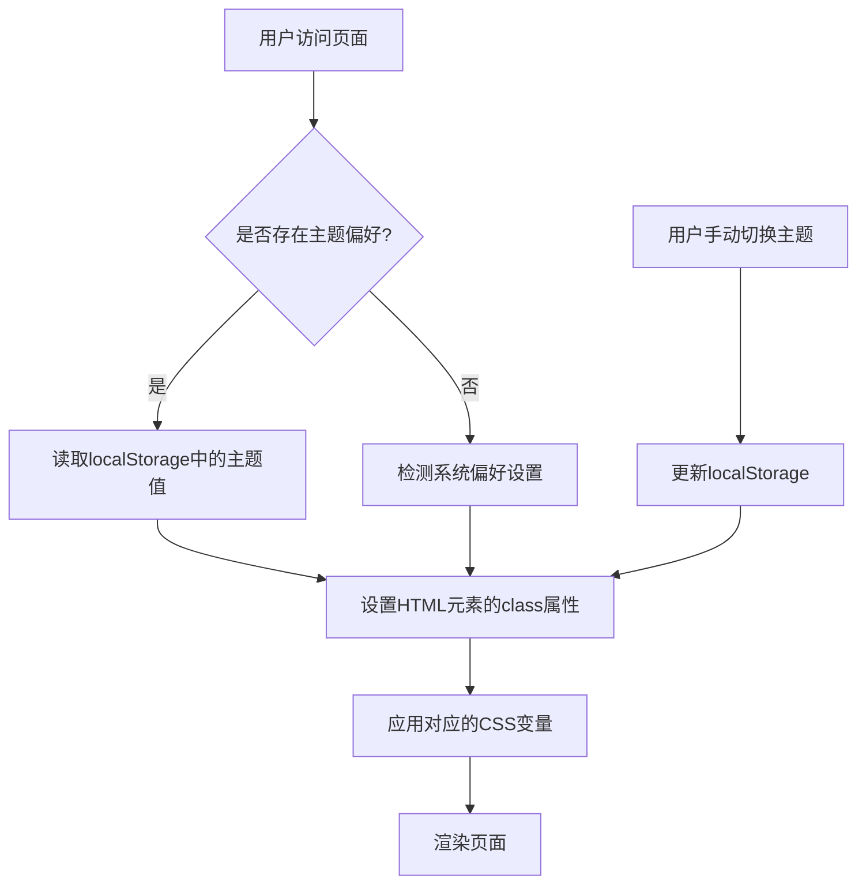

# 主题与样式系统

<cite>
**本文档引用的文件**  
- [theme.tsx](file://src/components/providers/theme.tsx)
- [globals.css](file://src/app/globals.css)
- [next.config.ts](file://next.config.ts)
- [components.json](file://components.json)
- [postcss.config.mjs](file://postcss.config.mjs)
</cite>

## 目录

1. [项目结构分析](#项目结构分析)
2. [主题提供器实现](#主题提供器实现)
3. [CSS变量与样式架构](#css变量与样式架构)
4. [Tailwind集成策略](#tailwind集成策略)
5. [主题切换机制](#主题切换机制)
6. [暗色模式与亮色模式定义](#暗色模式与亮色模式定义)
7. [自定义设计令牌扩展](#自定义设计令牌扩展)
8. [常见问题与解决方案](#常见问题与解决方案)

## 项目结构分析

项目采用标准的Next.js应用结构，核心主题相关文件位于以下路径：

- `/src/app/globals.css`：全局样式与CSS变量定义
- `/src/components/providers/theme.tsx`：主题上下文提供器
- `/components.json`：UI组件库配置
- `/postcss.config.mjs`：PostCSS配置
- `/next.config.ts`：Next.js框架配置

该结构遵循模块化设计原则，将样式、主题逻辑与UI组件分离，便于维护和扩展。

**Section sources**

- [theme.tsx](file://src/components/providers/theme.tsx#L1-L17)
- [globals.css](file://src/app/globals.css#L1-L123)

## 主题提供器实现

`ThemeProvider`组件封装了`next-themes`库的功能，为整个应用提供主题切换能力。

```tsx
'use client';

import { ThemeProvider as NextThemesProvider } from 'next-themes';
import * as React from 'react';

export function ThemeProvider({ children }: React.PropsWithChildren) {
  return (
    <NextThemesProvider
      attribute="class"
      defaultTheme="system"
      enableSystem
      disableTransitionOnChange
    >
      {children}
    </NextThemesProvider>
  );
}
```

### 配置参数说明

- **attribute**: `"class"` — 使用CSS类名控制主题，而非内联样式
- **defaultTheme**: `"system"` — 默认跟随系统偏好设置
- **enableSystem**: `true` — 启用系统级主题检测
- **disableTransitionOnChange**: `true` — 切换主题时禁用CSS过渡动画，避免闪烁

此实现确保了主题状态在客户端持久化，并支持用户手动切换或自动跟随系统设置。

**Section sources**

- [theme.tsx](file://src/components/providers/theme.tsx#L1-L17)

## CSS变量与样式架构

全局样式文件`globals.css`通过CSS自定义属性（CSS Variables）定义了一套完整的设计系统。

### 核心设计令牌

```css
:root {
  --radius: 0.625rem;
  --background: oklch(1 0 0);
  --foreground: oklch(0.145 0 0);
  --card: oklch(1 0 0);
  --card-foreground: oklch(0.145 0 0);
  /* ... 其他颜色变量 */
}
```

### 暗色模式覆盖

```css
.dark {
  --background: oklch(0.145 0 0);
  --foreground: oklch(0.985 0 0);
  --card: oklch(0.205 0 0);
  /* ... 暗色模式下的变量覆盖 */
}
```

### 设计变量映射

使用`@theme inline`语法将原始变量映射到语义化名称，增强可读性和可维护性：

```css
@theme inline {
  --color-background: var(--background);
  --color-foreground: var(--foreground);
  --font-sans: var(--font-geist-sans);
  --font-mono: var(--font-geist-mono);
  --radius-sm: calc(var(--radius) - 4px);
  --radius-md: calc(var(--radius) - 2px);
  --radius-lg: var(--radius);
  --radius-xl: calc(var(--radius) + 4px);
}
```

这种分层架构实现了：

- **一致性**：统一的设计语言贯穿整个应用
- **可扩展性**：易于添加新的颜色、间距或字体变量
- **可维护性**：集中管理所有设计令牌

**Section sources**

- [globals.css](file://src/app/globals.css#L15-L123)

## Tailwind集成策略

项目通过`components.json`配置文件与Tailwind深度集成：

```json
{
  "tailwind": {
    "config": "",
    "css": "src/app/globals.css",
    "baseColor": "neutral",
    "cssVariables": true,
    "prefix": ""
  }
}
```

### 集成特性

- **cssVariables**: `true` — 启用CSS变量模式，允许Tailwind类名引用CSS变量
- **baseColor**: `"neutral"` — 基础色调为中性色
- **css**: `"src/app/globals.css"` — 指定全局样式文件位置

### 实际应用示例

```css
@layer base {
  * {
    @apply border-border outline-ring/50;
  }
  body {
    @apply bg-background text-foreground;
  }
}
```

通过`@apply`指令，将CSS变量应用于Tailwind的原子类系统，实现：

- 动态主题切换时样式自动更新
- 保持Tailwind的开发效率优势
- 支持透明度调整（如`outline-ring/50`）

**Section sources**

- [components.json](file://components.json#L1-L22)
- [globals.css](file://src/app/globals.css#L115-L122)

## 主题切换机制

主题切换由`next-themes`库驱动，结合`ThemeProvider`组件实现无缝体验。

### 工作流程



**Diagram sources**

- [theme.tsx](file://src/components/providers/theme.tsx#L1-L17)
- [globals.css](file://src/app/globals.css#L1-L123)

### 持久化机制

- 使用`localStorage`存储用户选择的主题
- 支持三种状态：`light`（亮色）、`dark`（暗色）、`system`（跟随系统）
- 页面加载时优先读取存储的偏好，其次回退到系统设置

### 性能优化

- `disableTransitionOnChange: true` 防止主题切换时的样式重排闪烁
- 类名切换而非内联样式，提升渲染性能
- 预定义所有变量，避免运行时计算

**Section sources**

- [theme.tsx](file://src/components/providers/theme.tsx#L1-L17)

## 暗色模式与亮色模式定义

项目通过CSS类名控制两种主要显示模式：

### 亮色模式 (:root)

- 背景为浅色（`oklch(1 0 0)`，接近白色）
- 前景色为深色（`oklch(0.145 0 0)`，接近黑色）
- 适用于日间或明亮环境

### 暗色模式 (.dark)

- 背景为深色（`oklch(0.145 0 0)`，接近黑色）
- 前景色为浅色（`oklch(0.985 0 0)`，接近白色）
- 减少夜间视觉疲劳

### 颜色空间选择

使用`oklch()`颜色空间而非传统的`rgb()`或`hsl()`，优势包括：

- 更符合人眼感知的均匀色彩过渡
- 更广的色域支持
- 更自然的明暗对比调节

### 辅助颜色系统

定义了完整的调色板，包括：

- 主要色（primary）
- 次要色（secondary）
- 警告色（destructive）
- 数据图表色（chart-1 至 chart-5）
- 边框与输入框（border, input, ring）

**Section sources**

- [globals.css](file://src/app/globals.css#L45-L114)

## 自定义设计令牌扩展

开发者可轻松扩展主题系统以支持新设计需求。

### 添加新的配色方案

```css
/* 在 globals.css 中添加 */
.custom-theme {
  --background: oklch(0.95 0.1 120);
  --foreground: oklch(0.2 0.05 120);
  --primary: oklch(0.7 0.3 240);
  /* ... 其他变量覆盖 */
}
```

### 扩展ThemeProvider

```tsx
// 修改 theme.tsx
<NextThemesProvider
  attribute="class"
  defaultTheme="system"
  enableSystem
  disableTransitionOnChange
  themes={['light', 'dark', 'custom']}
>
  {children}
</NextThemesProvider>
```

### 使用自定义变量

```css
/* 在组件样式中 */
.my-component {
  background: var(--color-background);
  color: var(--color-foreground);
  border-radius: var(--radius-lg);
}
```

### 最佳实践

1. **语义化命名**：使用`--color-primary`而非`--color-blue`
2. **层级分离**：基础变量与映射变量分开定义
3. **响应式设计**：结合`@media (prefers-color-scheme)`增强兼容性
4. **无障碍考虑**：确保对比度符合WCAG标准

**Section sources**

- [globals.css](file://src/app/globals.css#L1-L123)
- [theme.tsx](file://src/components/providers/theme.tsx#L1-L17)

## 常见问题与解决方案

### 主题闪烁问题（FOUC）

**现象**：页面加载时短暂显示错误主题
**原因**：服务端渲染时无法立即获取客户端主题偏好
**解决方案**：

- 在`<html>`标签添加`class="light"`作为默认值
- 使用`next-themes`的`Script`组件预加载主题
- 或接受轻微闪烁，因`disableTransitionOnChange`已最小化影响

### Tailwind类名不生效

**检查项**：

1. 确认`components.json`中`css`路径正确指向`globals.css`
2. 验证PostCSS配置包含Tailwind插件
3. 确保变量前缀匹配（如`bg-background`对应`--background`）

### 自定义字体未加载

**解决方法**：

```css
/* 在 globals.css 中确保字体变量已定义 */
:root {
  --font-geist-sans: 'Geist Sans', sans-serif;
  --font-geist-mono: 'Geist Mono', monospace;
}
```

### 系统偏好检测失败

**调试步骤**：

1. 检查浏览器是否支持`window.matchMedia('(prefers-color-scheme: dark)')`
2. 验证`enableSystem: true`已启用
3. 测试不同操作系统和浏览器设置

**Section sources**

- [theme.tsx](file://src/components/providers/theme.tsx#L1-L17)
- [globals.css](file://src/app/globals.css#L1-L123)
- [postcss.config.mjs](file://postcss.config.mjs#L1-L4)
