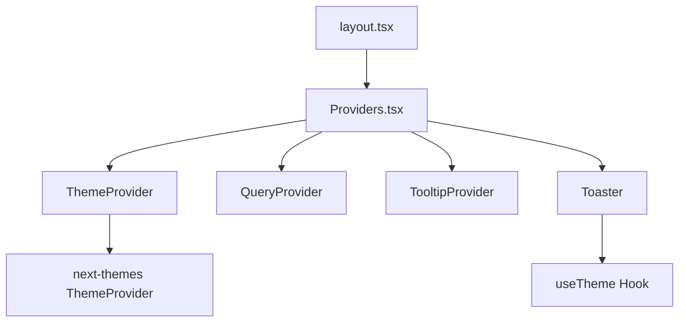
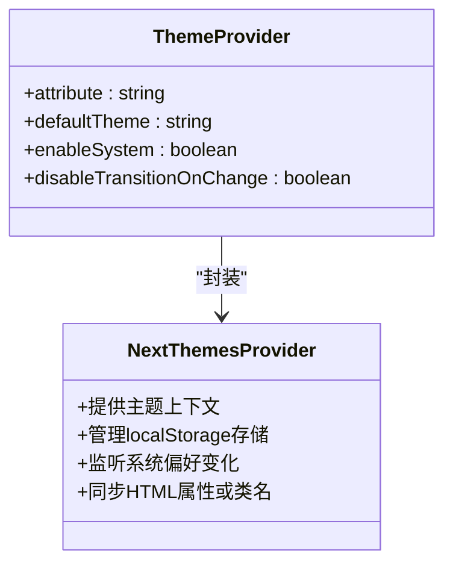

# 主题提供者实现

<cite>
**本文档引用的文件**  
- [theme.tsx](file://src/components/providers/theme.tsx#L0-L16)
- [layout.tsx](file://src/app/layout.tsx#L0-L100)
- [index.tsx](file://src/components/providers/index.tsx#L0-L15)
- [sonner.tsx](file://src/components/ui/sonner.tsx#L0-L25)
- [globals.css](file://src/app/globals.css#L0-L122)
</cite>

## 目录

1. [项目结构分析](#项目结构分析)
2. [核心组件分析](#核心组件分析)
3. [主题提供者实现机制](#主题提供者实现机制)
4. [服务端与客户端主题同步策略](#服务端与客户端主题同步策略)
5. [用户偏好持久化存储](#用户偏好持久化存储)
6. [自定义初始化主题配置](#自定义初始化主题配置)
7. [业务组件中读取主题状态](#业务组件中读取主题状态)
8. [常见问题与优化方案](#常见问题与优化方案)

## 项目结构分析

本项目采用基于功能模块的文件组织方式，主要结构如下：

- `src/app`：Next.js 应用的核心页面与布局文件
- `src/components/providers`：全局上下文提供者组件，包括主题、查询、提示等
- `src/components/ui`：可复用的UI组件库
- `src/hooks`：自定义React Hook
- `src/lib`：工具函数与请求封装

主题系统的核心实现位于 `src/components/providers/theme.tsx`，并通过 `Providers` 组件在应用根布局中统一注入。



**图示来源**

- [layout.tsx](file://src/app/layout.tsx#L0-L100)
- [index.tsx](file://src/components/providers/index.tsx#L0-L15)

## 核心组件分析

### ThemeProvider 组件

`ThemeProvider` 是对 `next-themes` 库中 `ThemeProvider` 的封装，位于 `src/components/providers/theme.tsx`。其主要职责是初始化主题系统并提供上下文环境。

```tsx
'use client';

import { ThemeProvider as NextThemesProvider } from 'next-themes';
import * as React from 'react';

export function ThemeProvider({ children }: React.PropsWithChildren) {
  return (
    <NextThemesProvider
      attribute="class"
      defaultTheme="system"
      enableSystem
      disableTransitionOnChange
    >
      {children}
    </NextThemesProvider>
  );
}
```

该组件使用客户端渲染（Client Component），确保主题切换逻辑在浏览器环境中执行。

**组件来源**

- [theme.tsx](file://src/components/providers/theme.tsx#L0-L16)

### Providers 组件

`Providers` 组件是多个上下文提供者的组合入口，在 `src/components/providers/index.tsx` 中定义：

```tsx
export function Providers({ children }: React.PropsWithChildren) {
  return (
    <QueryProvider>
      <ThemeProvider>
        <TooltipProvider>{children}</TooltipProvider>
        <Toaster position="top-right" richColors />
      </ThemeProvider>
    </QueryProvider>
  );
}
```

它将 `ThemeProvider` 与其他全局状态管理组件集成，并在根布局 `layout.tsx` 中被调用。

**组件来源**

- [index.tsx](file://src/components/providers/index.tsx#L0-L15)

## 主题提供者实现机制

`ThemeProvider` 封装了 `next-themes` 的核心功能，通过以下配置实现暗色/亮色模式的动态切换：

- **attribute="class"**：指定主题通过CSS类名（如 `.dark`）应用，而非内联样式
- **defaultTheme="system"**：默认主题跟随系统设置
- **enableSystem**：启用操作系统级主题检测
- **disableTransitionOnChange**：主题切换时禁用CSS过渡动画，避免视觉闪烁

此设计允许开发者通过Tailwind CSS的 `dark:` 前缀或原生CSS的 `:is(.dark *)` 语法编写响应式样式。



**图示来源**

- [theme.tsx](file://src/components/providers/theme.tsx#L0-L16)

## 服务端与客户端主题同步策略

为避免水合（hydration）不匹配，项目采取以下策略：

1. 在 `layout.tsx` 的 `<html>` 标签上添加 `suppressHydrationWarning` 属性，忽略初始HTML与客户端渲染差异的警告。
2. 使用 `attribute="class"` 模式，使服务端可预测地生成包含 `.dark` 或普通类名的HTML结构。
3. 客户端首次渲染时，`next-themes` 会立即读取 `localStorage` 或 `prefers-color-scheme` 并同步类名，减少FOUC（内容闪烁）。

```tsx
<html lang="en" suppressHydrationWarning>
```

**组件来源**

- [layout.tsx](file://src/app/layout.tsx#L0-L100)

## 用户偏好持久化存储

用户主题偏好通过 `localStorage` 持久化存储，具体流程如下：

1. 初始加载时，`next-themes` 自动读取 `localStorage` 中的 `theme` 键值
2. 若未设置，则根据 `prefers-color-scheme` 系统偏好决定
3. 用户手动切换主题后，自动写入 `localStorage`
4. 页面刷新时自动恢复上次选择的主题

存储格式示例：

```json
{
  "theme": "dark"
}
```

## 自定义初始化主题配置

可通过修改 `ThemeProvider` 的 props 实现自定义配置：

```tsx
<NextThemesProvider
  attribute="class"
  defaultTheme="dark" // 默认暗色模式
  enableSystem={false} // 禁用系统适配
  disableTransitionOnChange
>
  {children}
</NextThemesProvider>
```

可选配置项包括：

- **defaultTheme**: `"light" | "dark" | "system"`
- **enableSystem**: 是否启用系统主题检测
- **storageKey**: 自定义 `localStorage` 存储键名（默认为 `theme`）
- **themes**: 限制可用主题列表

## 业务组件中读取主题状态

通过 `useTheme` Hook 可在任意客户端组件中读取当前主题状态：

### 示例：Sonner通知组件

在 `src/components/ui/sonner.tsx` 中：

```tsx
import { useTheme } from 'next-themes';

const Toaster = () => {
  const { theme = 'system' } = useTheme();

  return (
    <Sonner
      theme={theme as ToasterProps['theme']}
      style={
        {
          '--normal-bg': 'var(--popover)',
          '--normal-text': 'var(--popover-foreground)',
        } as React.CSSProperties
      }
    />
  );
};
```

该组件根据当前主题动态设置通知框的背景与文字颜色，确保视觉一致性。

**组件来源**

- [sonner.tsx](file://src/components/ui/sonner.tsx#L0-L25)

## 常见问题与优化方案

### 问题：主题切换时页面闪烁（FOUC）

**原因**：客户端JavaScript加载前，页面以默认主题渲染，随后切换导致视觉闪烁。

**解决方案**：

#### 方案一：预加载CSS类名（推荐）

在 `layout.tsx` 中通过内联脚本预设类名：

```tsx
<script
  dangerouslySetInnerHTML={{
    __html: `
      (function() {
        const saved = localStorage.getItem('theme');
        const system = window.matchMedia('(prefers-color-scheme: dark)').matches;
        const theme = saved || (system ? 'dark' : 'light');
        if (theme === 'dark') document.documentElement.classList.add('dark');
      })();
    `,
  }}
/>
```

#### 方案二：使用CSS自定义属性预设

在 `globals.css` 中已定义完整的明暗色变量体系，确保即使类名未及时应用，也能保持基本可读性。

```css
:root {
  --background: oklch(1 0 0);
  --foreground: oklch(0.145 0 0);
}

.dark {
  --background: oklch(0.145 0 0);
  --foreground: oklch(0.985 0 0);
}
```

**样式来源**

- [globals.css](file://src/app/globals.css#L0-L122)
