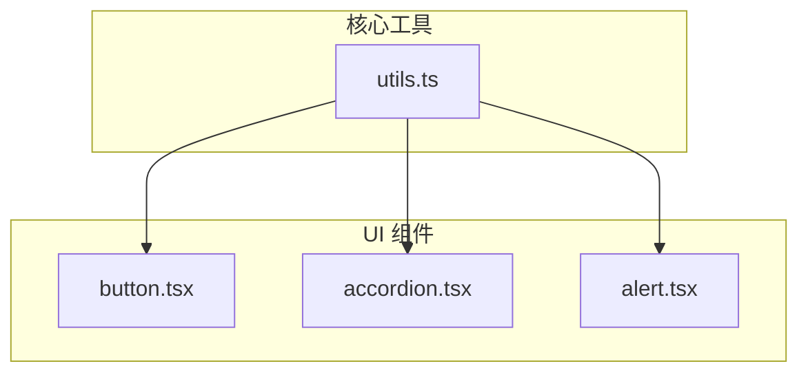
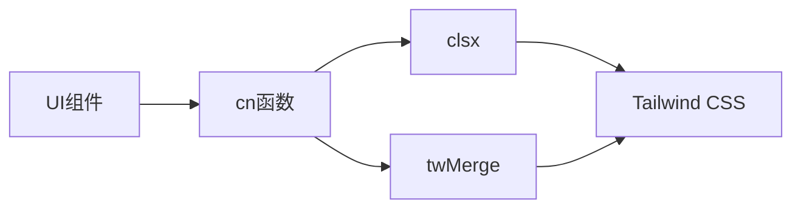

# 工具函数库

<cite>
**本文档引用文件**  
- [utils.ts](file://src/lib/utils.ts#L0-L5)
- [button.tsx](file://src/components/ui/button.tsx#L0-L59)
- [accordion.tsx](file://src/components/ui/accordion.tsx#L0-L66)
- [alert.tsx](file://src/components/ui/alert.tsx#L0-L66)
</cite>

## 目录

1. [项目结构](#项目结构)
2. [核心工具函数分析](#核心工具函数分析)
3. [使用场景与最佳实践](#使用场景与最佳实践)
4. [依赖关系分析](#依赖关系分析)

## 项目结构

项目采用标准的 Next.js 应用结构，主要组件和工具函数按功能模块组织。`utils.ts` 文件位于 `/src/lib/` 目录下，是全局工具函数的集中管理文件。该工具库被多个 UI 组件广泛引用，用于处理类名合并等常见任务。



**图示来源**

- [utils.ts](file://src/lib/utils.ts#L0-L5)
- [button.tsx](file://src/components/ui/button.tsx#L0-L59)
- [accordion.tsx](file://src/components/ui/accordion.tsx#L0-L66)
- [alert.tsx](file://src/components/ui/alert.tsx#L0-L66)

**本节来源**

- [utils.ts](file://src/lib/utils.ts#L0-L5)

## 核心工具函数分析

### `cn()` 函数详解

`cn()` 函数是 `clsx` 和 `tailwind-merge` 的组合封装，用于安全地合并 Tailwind CSS 类名。其主要作用是解决类名冲突问题，确保样式优先级正确。

#### 函数定义

```typescript
import { type ClassValue, clsx } from 'clsx';
import { twMerge } from 'tailwind-merge';

export function cn(...inputs: ClassValue[]) {
  return twMerge(clsx(inputs));
}
```

#### 参数说明

- **inputs**: 类型为 `ClassValue[]`，接受任意数量的类名输入，支持字符串、对象、数组等多种格式。

#### 返回值

- 返回一个经过 `twMerge` 处理后的字符串，包含所有合并且去重的类名。

#### 功能解析

1. **`clsx`**: 条件性地合并类名，支持动态类名生成。
2. **`twMerge`**: 解决 Tailwind 类名冲突（如 `text-red-500` 和 `text-blue-500`），保留正确的优先级顺序。

#### 示例

```tsx
// 在 Button 组件中的使用
className={cn(buttonVariants({ variant, size, className }))}
```

此代码将按钮变体类名与传入的自定义类名安全合并，避免样式覆盖问题。

**本节来源**

- [utils.ts](file://src/lib/utils.ts#L0-L5)
- [button.tsx](file://src/components/ui/button.tsx#L52)

## 使用场景与最佳实践

### 使用场景

1. **组件类名合并**: 在 UI 组件中合并预设样式与用户自定义样式。
2. **动态样式处理**: 根据条件动态生成类名列表。
3. **避免样式冲突**: 确保 Tailwind 类名的优先级正确。

### 最佳实践

1. **统一导入**: 所有需要合并类名的地方都应使用 `cn()` 而非直接字符串拼接。
2. **类型安全**: 利用 `ClassValue` 类型确保输入参数的正确性。
3. **性能优化**: `clsx` 和 `twMerge` 均经过优化，可安全用于高频更新场景。

### 实际应用示例

```tsx
// 在 Accordion 组件中的使用
className={cn("border-b last:border-b-0", className)}

// 在 Alert 组件中的使用
className={cn(alertVariants({ variant }), className)}
```

这些用法确保了基础样式与自定义样式的正确合并，同时解决了 Tailwind 的样式冲突问题。

**本节来源**

- [accordion.tsx](file://src/components/ui/accordion.tsx#L21)
- [alert.tsx](file://src/components/ui/alert.tsx#L30)
- [button.tsx](file://src/components/ui/button.tsx#L52)

## 依赖关系分析

### 直接依赖

- **clsx**: 用于条件性类名合并。
- **tailwind-merge**: 用于解决 Tailwind CSS 类名冲突。

### 依赖版本

根据 `package.json` 文件：

```json
"dependencies": {
  "clsx": "^2.1.1",
  "tailwind-merge": "^3.3.1"
}
```

### 依赖链分析



**图示来源**

- [utils.ts](file://src/lib/utils.ts#L0-L5)
- [package.json](file://package.json#L30-L31)

**本节来源**

- [utils.ts](file://src/lib/utils.ts#L0-L5)
- [package.json](file://package.json#L30-L31)
