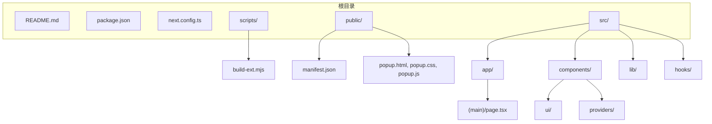
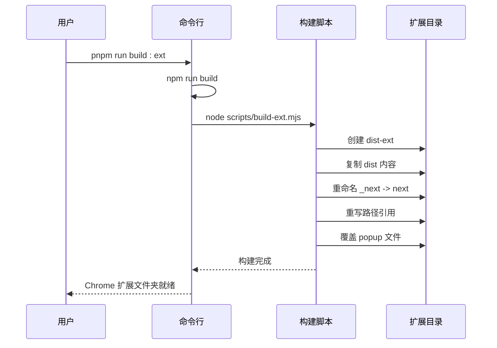

# 快速开始

<cite>
**本文档引用的文件**   
- [README.md](file://README.md)
- [package.json](file://package.json)
- [scripts/build-ext.mjs](file://scripts/build-ext.mjs)
- [public/manifest.json](file://public/manifest.json)
- [next.config.ts](file://next.config.ts)
</cite>

## 目录

1. [简介](#简介)
2. [项目结构概览](#项目结构概览)
3. [环境搭建与运行](#环境搭建与运行)
4. [浏览器扩展构建](#浏览器扩展构建)
5. [常见问题排查](#常见问题排查)

## 简介

OneNav 是一个基于 Next.js 的书签管理工具，支持书签的增删改查、排序、导入导出与快速搜索功能。项目还预留了 SSH 连接、脚本执行和两步验证等扩展能力，适用于打造个性化的高效导航系统。本指南将帮助新手用户和开发者在 5 分钟内完成环境搭建并成功运行项目。

**Section sources**

- [README.md](file://README.md#L0-L36)

## 项目结构概览

项目采用标准的 Next.js 应用结构，并包含用于构建浏览器扩展的专用脚本和静态资源。



**Diagram sources**

- [project_structure](file://#L0-L100)
- [public/manifest.json](file://public/manifest.json#L0-L28)
- [scripts/build-ext.mjs](file://scripts/build-ext.mjs#L0-L75)

**Section sources**

- [project_structure](file://#L0-L100)

## 环境搭建与运行

按照以下步骤可快速启动 OneNav 开发环境：

### 1. 克隆仓库

```bash
git clone https://github.com/your-repo/one-nav.git
cd one-nav
```

### 2. 安装依赖

项目使用 `pnpm` 作为包管理器，请确保已安装 pnpm（可通过 `npm install -g pnpm` 安装）：

```bash
pnpm install
```

### 3. 启动开发服务器

运行以下命令启动开发模式：

```bash
pnpm run dev
```

开发服务器默认在 `http://localhost:3000` 启动，支持热重载（Hot Reload），修改代码后浏览器将自动刷新。

### 4. 构建生产版本

生成生产环境构建包：

```bash
pnpm run build
```

构建输出目录由 `next.config.ts` 配置为 `dist`。

### 5. 本地预览生产版本

启动生产构建的本地预览服务：

```bash
pnpm run start
```

该命令将运行 `next start`，加载 `dist` 目录中的构建文件。

### 环境变量配置

本项目未在代码中发现 `.env` 文件或环境变量使用示例，所有配置通过 `next.config.ts` 和 `package.json` 完成。如需自定义配置，可在根目录创建 `.env.local` 文件并添加环境变量。

**Section sources**

- [README.md](file://README.md#L4-L20)
- [package.json](file://package.json#L5-L12)
- [next.config.ts](file://next.config.ts#L0-L27)

## 浏览器扩展构建

OneNav 支持构建为 Chrome 浏览器扩展，便于快速访问书签。

### 构建扩展包

运行以下命令生成扩展：

```bash
pnpm run build:ext
```

该命令执行流程如下：

1. 先运行 `pnpm run build` 生成 `dist` 目录
2. 执行 `node scripts/build-ext.mjs` 脚本，将 `dist` 复制为 `dist-ext`
3. 将 `_next` 文件夹重命名为 `next`
4. 重写 HTML/JS/CSS 中所有 `/ _next/` 路径为 `/next/`
5. 使用 `public/` 下的 `popup.html`, `popup.css`, `popup.js` 覆盖扩展入口文件

构建完成后，扩展文件位于 `dist-ext` 目录。

### 在 Chrome 中加载扩展

1. 打开 Chrome 浏览器，进入 `chrome://extensions/`
2. 开启右上角“开发者模式”
3. 点击“加载已解压的扩展程序”
4. 选择项目根目录下的 `dist-ext` 文件夹
5. 扩展将出现在浏览器工具栏中，点击即可使用

扩展功能通过 `public/manifest.json` 配置，包含书签、存储、标签页等权限。



**Diagram sources**

- [package.json](file://package.json#L10-L11)
- [scripts/build-ext.mjs](file://scripts/build-ext.mjs#L0-L75)
- [public/manifest.json](file://public/manifest.json#L0-L28)

**Section sources**

- [package.json](file://package.json#L10-L11)
- [scripts/build-ext.mjs](file://scripts/build-ext.mjs#L0-L75)
- [public/manifest.json](file://public/manifest.json#L0-L28)

## 常见问题排查

### 端口被占用

若启动开发服务器时报错 `EADDRINUSE`，表示 3000 端口已被占用。可使用以下命令指定其他端口：

```bash
pnpm run dev -- -p 3001
```

然后访问 `http://localhost:3001`。

### 依赖安装失败

若 `pnpm install` 失败，请尝试：

1. 检查网络连接
2. 清除缓存：`pnpm store prune`
3. 使用国内镜像源：`pnpm config set registry https://registry.npmmirror.com`

### 构建失败

若 `pnpm run build` 失败，请检查：

- 是否已正确安装依赖
- Node.js 版本是否满足要求（建议使用 LTS 版本）
- 磁盘空间是否充足

### 扩展加载失败

若 Chrome 无法加载扩展，请检查：

- `dist-ext` 目录是否存在
- `manifest.json` 是否正确配置
- 是否开启了“开发者模式”

**Section sources**

- [README.md](file://README.md#L4-L20)
- [package.json](file://package.json#L5-L12)
- [scripts/build-ext.mjs](file://scripts/build-ext.mjs#L0-L75)
