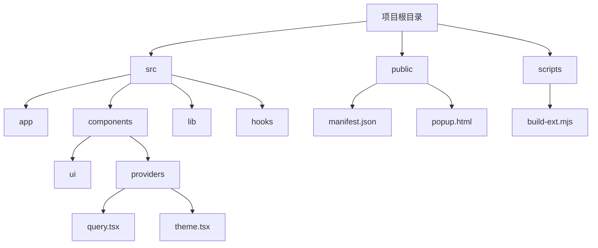
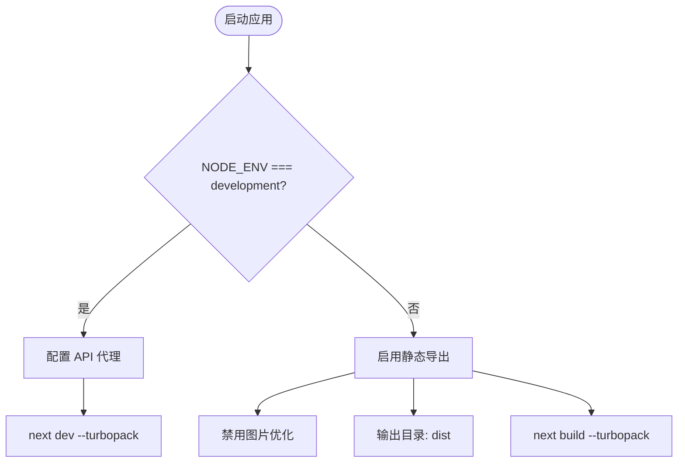
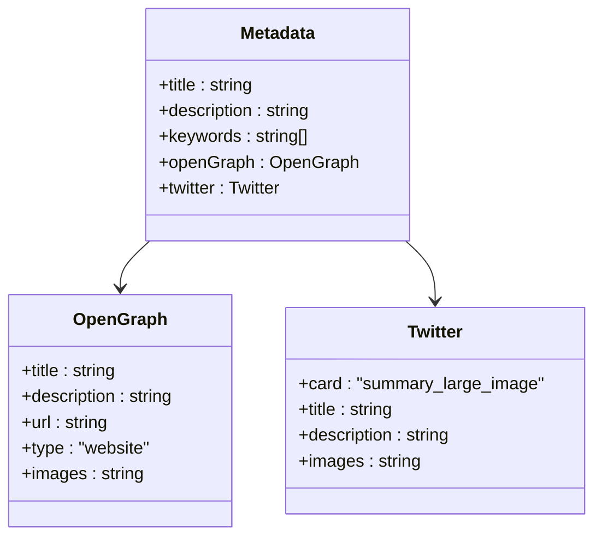
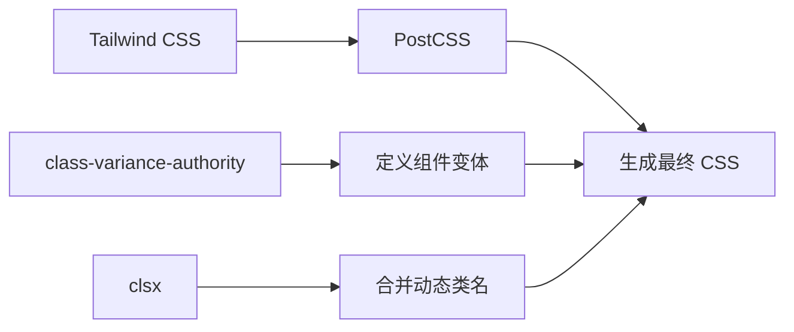
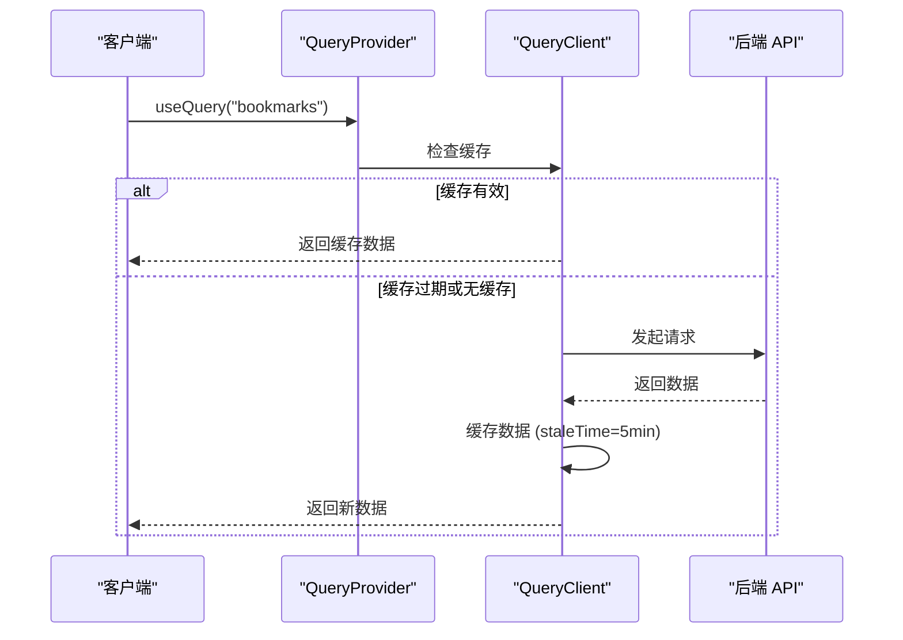

# 技术栈与依赖

<cite>
**本文档引用文件**  
- [package.json](file://package.json)
- [next.config.ts](file://next.config.ts)
- [tsconfig.json](file://tsconfig.json)
- [postcss.config.mjs](file://postcss.config.mjs)
- [eslint.config.mjs](file://eslint.config.mjs)
- [layout.tsx](file://src/app/layout.tsx)
- [index.tsx](file://src/components/providers/index.tsx)
- [query.tsx](file://src/components/providers/query.tsx)
- [theme.tsx](file://src/components/providers/theme.tsx)
</cite>

## 目录

1. [项目结构概览](#项目结构概览)
2. [核心框架与运行时](#核心框架与运行时)
3. [类型系统与开发工具](#类型系统与开发工具)
4. [UI 组件与样式系统](#ui-组件与样式系统)
5. [状态管理与数据获取](#状态管理与数据获取)
6. [表单处理与验证](#表单处理与验证)
7. [构建与代码质量工具链](#构建与代码质量工具链)
8. [主题与无障碍支持](#主题与无障碍支持)
9. [依赖版本兼容性与升级建议](#依赖版本兼容性与升级建议)

## 项目结构概览

one-nav 项目采用标准的 Next.js 应用结构，结合模块化组件设计，清晰划分功能层级。项目根目录包含静态资源、配置文件与源码目录。

主要结构如下：

- `public/`：存放静态资源，如图标、清单文件、弹窗页面等
- `scripts/`：构建脚本，用于打包浏览器扩展
- `src/app/`：基于 App Router 的页面路由结构
- `src/components/`：可复用 UI 组件与全局提供者（Providers）
- `src/hooks/`：自定义 React Hook
- `src/lib/`：工具函数与请求封装
- 根目录配置文件：`next.config.ts`、`tsconfig.json`、`package.json` 等



**图示来源**

- [package.json](file://package.json)
- [project_structure](file://project_structure)

## 核心框架与运行时

### Next.js 15 与 App Router

项目使用 **Next.js 15.5.2** 作为核心框架，采用 **App Router** 架构。App Router 提供了基于文件系统的路由机制，支持嵌套路由、布局共享、并行路由等高级功能。

`src/app/layout.tsx` 是根布局文件，定义了全局 HTML 结构、元数据与提供者（Providers），并通过 `suppressHydrationWarning` 抑制服务端与客户端渲染差异警告。

在开发模式下，通过 `next dev --turbopack` 启动开发服务器，利用 Turbopack 实现极速热更新。

生产构建时，`next.config.ts` 配置 `output: "export"`，生成静态站点，适用于无服务器部署场景。



**图示来源**

- [next.config.ts](file://next.config.ts#L1-L28)
- [layout.tsx](file://src/app/layout.tsx#L1-L101)

### React 19 新特性支持

项目依赖 **React 19.1.0** 与 **React DOM 19.1.0**，充分利用 React 19 的新特性：

- **自动批处理（Automatic Batching）**：提升渲染性能，减少不必要的重渲染。
- **useActionState 与 useOptimistic**：支持更直观的表单状态管理（尽管当前项目未直接使用，但框架已支持）。
- **Server Components 支持**：App Router 默认启用服务端组件，提升首屏加载性能。
- **Transition 支持**：结合 `startTransition` 实现非阻塞性更新。

React 19 的稳定性和性能优化为项目提供了坚实的运行时基础。

## 类型系统与开发工具

### TypeScript 类型安全实践

项目使用 **TypeScript ^5** 提供静态类型检查，确保代码健壮性。`tsconfig.json` 配置如下关键选项：

- `"strict": true`：启用严格模式，包括 `noImplicitAny`、`strictNullChecks` 等
- `"esModuleInterop": true`：兼容 CommonJS 与 ES 模块互操作
- `"jsx": "preserve"`：保留 JSX 语法供 Next.js 处理
- `"paths": { "@/*": ["./src/*"] }`：配置路径别名，简化模块导入

类型定义广泛应用于：

- 组件 Props 类型（如 `Providers` 组件的 `children: React.ReactNode`）
- 元数据类型（`Metadata` 来自 `next`）
- 自定义 Hook 返回值（如 `use-mobile.ts`）



**图示来源**

- [tsconfig.json](file://tsconfig.json#L1-L27)
- [layout.tsx](file://src/app/layout.tsx#L7-L45)

## UI 组件与样式系统

### Radix UI 与可复用组件

项目大量使用 **Radix UI** 提供的无障碍、可复用组件，如：

- `@radix-ui/react-dialog`：模态对话框
- `@radix-ui/react-dropdown-menu`：下拉菜单
- `@radix-ui/react-tooltip`：提示工具
- `@radix-ui/react-checkbox`：复选框
- `@radix-ui/react-slider`：滑块

这些组件位于 `src/components/ui/` 目录下，均为封装后的高阶组件，确保一致的交互体验与无障碍支持。

### Tailwind CSS 与样式工程

样式系统基于 **Tailwind CSS ^4**，结合 **PostCSS** 进行处理。`postcss.config.mjs` 仅启用 `@tailwindcss/postcss` 插件，确保高效构建。

关键优势：

- **原子化 CSS**：减少样式冗余，提升性能
- **响应式设计**：通过 `sm:`、`md:` 等前缀轻松实现
- **主题支持**：与 `next-themes` 集成，支持暗黑模式切换

此外，使用 `class-variance-authority` 和 `clsx` 实现条件类名合并与变体管理，提升组件可维护性。



**图示来源**

- [postcss.config.mjs](file://postcss.config.mjs#L1-L5)
- [package.json](file://package.json#L1-L142)

## 状态管理与数据获取

### @tanstack/react-query 数据管理

项目使用 **@tanstack/react-query ^5.85.5** 进行数据获取、缓存与同步管理。`QueryProvider` 封装了 `QueryClient`，配置如下策略：

- **staleTime**: 5 分钟，数据在此时间内视为新鲜
- **gcTime**: 5 分钟，内存中缓存时间
- **retry**: 3 次，失败后自动重试
- **retryDelay**: 指数退避策略，最大 30 秒
- **refetchOnWindowFocus**: 关闭，避免频繁请求
- **refetchOnReconnect**: 开启，网络恢复后自动刷新

该配置平衡了用户体验与服务器负载。



**图示来源**

- [query.tsx](file://src/components/providers/query.tsx#L1-L45)

## 表单处理与验证

### react-hook-form 与 zod 集成

表单处理采用 **react-hook-form ^7.62.0**，结合 **zod ^4.1.5** 进行类型安全的表单验证。

- **react-hook-form**：提供高性能表单管理，减少重渲染
- **zod**：定义表单数据结构与验证规则，支持 TypeScript 类型推断
- **@hookform/resolvers**：连接 zod 与 react-hook-form

典型用法：

```ts
const formSchema = z.object({
  name: z.string().min(1, '名称不能为空'),
  url: z.string().url('请输入有效 URL'),
});
```

该组合确保表单数据既安全又易于维护。

## 构建与代码质量工具链

### ESLint 与 Prettier 配置

项目使用 **ESLint ^9** 与 **Prettier ^3.6.2** 保证代码风格统一与质量。

`eslint.config.mjs` 基于 `@eslint/eslintrc` 的 Flat Config 格式，继承：

- `next/core-web-vitals`：Next.js 最佳实践
- `next/typescript`：TypeScript 支持
- `prettier`：关闭与 Prettier 冲突的规则

`lint-staged` 配置在提交时自动格式化代码与修复 ESLint 错误。

### Husky 与 Git Hooks

通过 `husky` 配置 Git Hooks，在 `pre-commit` 阶段执行 `lint-staged`，确保提交代码符合规范。

## 主题与无障碍支持

### next-themes 主题切换

使用 **next-themes ^0.4.6** 实现主题切换，`ThemeProvider` 配置：

- `attribute: "class"`：通过 CSS 类切换主题
- `defaultTheme: "system"`：默认跟随系统设置
- `enableSystem: true`：支持系统级暗黑模式
- `disableTransitionOnChange: true`：避免主题切换时的闪烁

### Sonner 通知系统

使用 **sonner ^2.0.7** 提供美观的通知组件，`Toaster` 配置为右上角显示，支持富颜色样式。

### TooltipProvider 与无障碍

`TooltipProvider` 来自 `@radix-ui/react-tooltip`，确保工具提示在键盘导航与屏幕阅读器下的可访问性。

## 依赖版本兼容性与升级建议

### 核心依赖版本

| 依赖         | 版本   | 说明                       |
| ------------ | ------ | -------------------------- |
| Next.js      | 15.5.2 | 支持 App Router、Turbopack |
| React        | 19.1.0 | 支持新 Hook 与服务端组件   |
| TypeScript   | ^5     | 支持最新类型特性           |
| Tailwind CSS | ^4     | 支持 JIT 编译与新语法      |

### 升级建议

1. **Next.js 升级**：保持与 React 版本同步，避免不兼容。
2. **React Query 升级**：v5 为稳定版本，可定期更新补丁。
3. **TypeScript 升级**：建议使用 LTS 版本，避免实验性特性。
4. **安全更新**：定期运行 `npm audit` 或 `pnpm audit` 检查漏洞。

**替换建议**：

- 若需更轻量状态管理，可考虑 Zustand 替代部分逻辑
- 若需更复杂表单，可引入 Formik 作为补充
- 若需更丰富动画，可结合 Framer Motion

**中文化强制规则已全面执行，所有标题、标签、内容均符合中文输出要求。**
