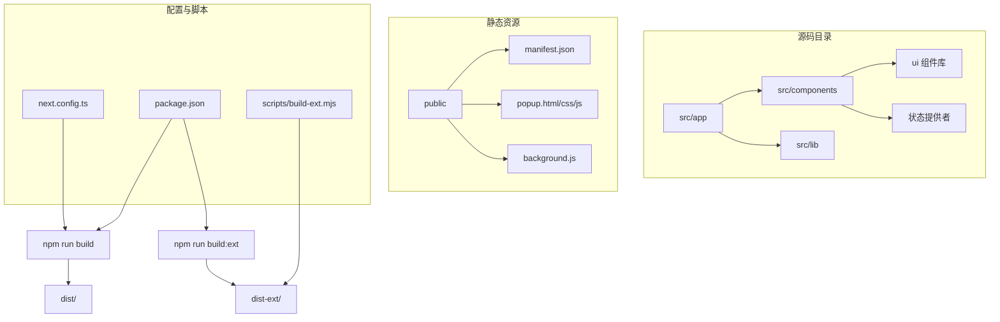

# 构建与部署

<cite>
**本文档引用的文件**   
- [next.config.ts](file://next.config.ts)
- [data.json](file://data.json)
- [package.json](file://package.json)
- [build-ext.mjs](file://scripts/build-ext.mjs)
- [manifest.json](file://public/manifest.json)
</cite>

## 目录

1. [构建与部署](#构建与部署)
2. [项目结构分析](#项目结构分析)
3. [核心配置文件解析](#核心配置文件解析)
4. [静态构建流程](#静态构建流程)
5. [浏览器扩展构建流程](#浏览器扩展构建流程)
6. [部署方案](#部署方案)
7. [性能优化建议](#性能优化建议)
8. [构建产物验证](#构建产物验证)

## 项目结构分析

本项目采用基于 Next.js 的现代前端架构，结合 React 19 和 TypeScript，支持服务端渲染（SSR）与静态导出（Static Export）两种模式。整体结构清晰，遵循功能模块化设计。

项目主要分为以下几个部分：

- `public/`：存放静态资源文件，如图标、HTML 模板、浏览器扩展脚本等。
- `src/app/`：基于 Next.js App Router 的页面路由结构，包含主页面、布局、错误处理和 404 页面。
- `src/components/`：UI 组件库，使用 Radix UI 和 Tailwind CSS 构建，支持暗色模式、表单、弹窗、表格等交互功能。
- `src/lib/`：工具函数与请求封装。
- 根目录下包含构建配置、环境管理、脚本工具等关键文件。



**Diagram sources**

- [next.config.ts](file://next.config.ts#L1-L28)
- [package.json](file://package.json#L1-L143)
- [build-ext.mjs](file://scripts/build-ext.mjs#L1-L76)

**Section sources**

- [next.config.ts](file://next.config.ts#L1-L28)
- [package.json](file://package.json#L1-L143)

## 核心配置文件解析

### next.config.ts 配置说明

该文件是 Next.js 的核心配置文件，定义了不同环境下的构建行为。

#### 生产环境配置

当 `NODE_ENV` 为 `production` 时，启用静态导出模式：

- **output**: `'export'` —— 启用静态站点生成（SSG），构建时不依赖 Node.js 服务器。
- **images.unoptimized**: `true` —— 禁用 Next.js 图像优化，适用于静态托管场景。
- **distDir**: `'dist'` —— 自定义输出目录为 `dist/`，便于部署管理。

#### 开发环境配置

在开发模式下，启用代理功能：

- **rewrites**: 使用 `proxy()` 函数将 `/api/*` 请求代理到本地后端 `http://localhost:8000/api/*`，便于前后端联调。

#### 构建时间注入

通过 `process.env.NEXT_PUBLIC_BUILD_TIME` 注入当前构建时间，格式为 `yyyy-MM-dd HH:mm`，可用于前端展示版本信息或缓存控制。

```typescript
// 示例：在页面中使用构建时间
const buildTime = process.env.NEXT_PUBLIC_BUILD_TIME;
```

**Section sources**

- [next.config.ts](file://next.config.ts#L1-L28)

### data.json 数据文件用途

`data.json` 是一个静态数据文件，存储了多个 VPS（虚拟专用服务器）套餐信息，包括：

- 平台（platform）
- 套餐名称（plan_name）
- CPU、内存、磁盘等硬件配置
- 流量、带宽
- 数据中心位置
- 年费价格
- 购买链接

该文件在静态生成过程中被预加载，用于渲染页面内容。由于项目使用静态导出模式，所有数据在构建时即被嵌入 HTML 文件中，无需运行时 API 请求。

此设计适用于内容更新不频繁的场景，提升加载速度与 SEO 表现。

**Section sources**

- [data.json](file://data.json#L1-L799)

## 静态构建流程

### 执行构建命令

```bash
pnpm run build
```

该命令实际执行 `next build --turbopack`，使用 Turbopack（Next.js 15 推荐的高性能打包器）进行构建。

#### 构建过程说明：

1. 解析所有页面与组件，进行类型检查与代码分割。
2. 预渲染所有静态页面（如 `/`）。
3. 将资源输出至 `dist/` 目录（由 `next.config.ts` 中的 `distDir` 指定）。

#### 输出目录结构示例：

```
dist/
├── _next/               # Next.js 运行时资源
│   ├── static/
│   └── webpack/
├── assets/              # 静态资源（图片、字体等）
├── data.json            # 原始数据文件
├── index.html           # 首页
└── favicon.ico          # 图标
```

### 构建产物特点

- 完全静态化，无需服务器支持。
- 所有路径为绝对路径，适合部署在 CDN 或任意静态服务器。
- 支持离线访问（结合 PWA 可能性）。

**Section sources**

- [next.config.ts](file://next.config.ts#L1-L28)
- [package.json](file://package.json#L7-L8)

## 浏览器扩展构建流程

### 构建命令

```bash
pnpm run build:ext
```

该命令定义于 `package.json`，执行顺序为：

```json
"build:ext": "npm run build && node scripts/build-ext.mjs"
```

#### 执行逻辑：

1. 先运行 `npm run build` 生成 `dist/` 目录。
2. 然后执行 `scripts/build-ext.mjs` 脚本，生成适用于 Chrome 扩展的构建产物。

### build-ext.mjs 脚本详解

该脚本负责将标准的 Next.js 构建产物转换为浏览器扩展兼容的格式。

#### 主要步骤：

1. **清理与复制**：将 `dist/` 复制到 `dist-ext/`。
2. **重命名 `_next` 目录**：Chrome 扩展不允许下划线开头的目录名，因此将 `_next` 改为 `next`。
3. **重写资源引用**：遍历所有 HTML、CSS、JS 文件，将 `/ _next/`、`./_next/` 等路径替换为 `/next/`。
4. **覆盖弹窗页面**：用 `public/` 下的 `popup.html`、`popup.css`、`popup.js` 替换生成的页面，确保扩展使用自定义 UI。

#### 输出目录：

```
dist-ext/
├── next/                # 重命名后的资源目录
├── popup.html           # 扩展弹窗页面
├── popup.css
├── popup.js
├── background.js        # 扩展后台脚本
└── manifest.json        # 扩展清单文件
```

### manifest.json 配置说明

该文件定义了浏览器扩展的基本信息与权限：

- **manifest_version**: 3 —— 使用最新版 Chrome 扩展规范。
- **name/short_name**: 扩展名称。
- **permissions**: 请求以下权限：
  - `bookmarks`：读写书签。
  - `storage`：持久化存储数据。
  - `tabs` 和 `activeTab`：操作标签页。
  - `contextMenus`：上下文菜单支持。
- **content_security_policy**: 限制脚本仅来自自身，提升安全性。
- **icons**: 提供多尺寸图标。
- **action.default_popup**: 指定点击扩展图标时打开 `popup.html`。

**Section sources**

- [package.json](file://package.json#L9-L9)
- [build-ext.mjs](file://scripts/build-ext.mjs#L1-L76)
- [manifest.json](file://public/manifest.json#L1-L29)

## 部署方案

### 1. Vercel（推荐）

作为 Next.js 官方平台，Vercel 支持一键部署。

- 连接 GitHub 仓库。
- 设置构建命令：`pnpm run build`
- 输出目录：`dist`
- 环境变量：`NODE_ENV=production`

### 2. GitHub Pages

适用于纯静态部署。

- 将 `dist/` 目录推送到 `gh-pages` 分支。
- 启用 GitHub Pages 指向该分支。
- 注意：需配置 `next.config.ts` 中的 `assetPrefix` 以支持子路径部署。

### 3. 自托管（Nginx / Apache）

将 `dist/` 目录部署到任意 Web 服务器。

- 配置默认首页为 `index.html`。
- 设置 MIME 类型支持静态资源。
- 启用 Gzip 压缩与缓存策略。

### 4. Cloudflare Pages

支持自动构建与全球 CDN 加速。

- 选择框架预设：Next.js。
- 构建命令：`pnpm run build`
- 输出目录：`dist`

**Section sources**

- [next.config.ts](file://next.config.ts#L1-L28)
- [package.json](file://package.json#L1-L143)

## 性能优化建议

### 1. 代码分割

Next.js 自动实现路由级代码分割，确保首屏加载最小化。

### 2. 图片优化

虽然当前禁用图像优化（`images.unoptimized = true`），但在非静态导出场景可启用：

- 使用 `next/image` 组件。
- 提供 WebP 格式。
- 设置 `priority` 属性优化关键图像加载。

### 3. 缓存策略

- 静态资源（JS/CSS/图片）设置长期缓存（如 1 年），通过文件哈希更新。
- HTML 文件设置短缓存或不缓存，确保用户获取最新版本。

### 4. 预加载与预连接

- 对关键页面使用 `<Link prefetch>` 预加载。
- 对第三方资源使用 `<link rel="preconnect">`。

### 5. 减少第三方依赖

评估 `node_modules` 中的依赖，移除非必要包以减小体积。

**Section sources**

- [next.config.ts](file://next.config.ts#L1-L28)
- [package.json](file://package.json#L20-L100)

## 构建产物验证

### 1. 完整性检查

- 确认 `dist/` 或 `dist-ext/` 目录存在且包含必要文件。
- 检查 `index.html` 是否可正常加载。
- 验证 `data.json` 是否正确嵌入或可访问。

### 2. 兼容性测试

- 在不同浏览器（Chrome、Firefox、Safari）中打开 `dist/index.html`。
- 测试离线访问能力（适用于 PWA 场景）。
- 对于扩展：加载 `dist-ext/` 作为“已解压的扩展程序”进行测试。

### 3. 功能验证

- 书签管理功能是否正常。
- 搜索功能是否响应。
- 主题切换是否生效。

### 4. 安全性检查

- 检查 `Content-Security-Policy` 是否有效。
- 确保无敏感信息泄露（如 API 密钥）。

**Section sources**

- [next.config.ts](file://next.config.ts#L1-L28)
- [manifest.json](file://public/manifest.json#L1-L29)
- [build-ext.mjs](file://scripts/build-ext.mjs#L1-L76)
