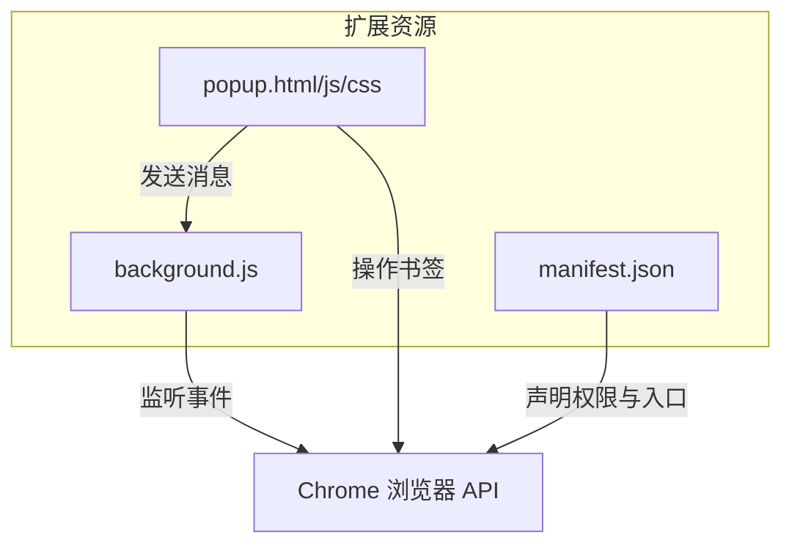

# 后台服务脚本

<cite>
**本文档引用文件**   
- [background.js](file://public/background.js#L1-L47)
- [manifest.json](file://public/manifest.json#L1-L29)
- [popup.js](file://public/popup.js#L1-L331)
</cite>

## 目录

1. [项目结构](#项目结构)
2. [核心组件](#核心组件)
3. [后台脚本生命周期与事件监听](#后台脚本生命周期与事件监听)
4. [功能扩展潜力分析](#功能扩展潜力分析)
5. [持久化与非持久化后台脚本对比](#持久化与非持久化后台脚本对比)
6. [向Service Worker迁移的现代实践](#向service-worker迁移的现代实践)
7. [后台脚本调试方法](#后台脚本调试方法)

## 项目结构

项目采用前后端分离结构，`public`目录存放浏览器扩展所需的静态资源和核心脚本。`background.js`作为后台服务脚本，负责监听浏览器事件并执行后台逻辑。`popup.html`和`popup.js`构成用户界面，用于展示书签和处理用户交互。`manifest.json`定义了扩展的基本信息、权限和入口点。



**图示来源**

- [manifest.json](file://public/manifest.json#L1-L29)
- [background.js](file://public/background.js#L1-L47)
- [popup.js](file://public/popup.js#L1-L331)

**本节来源**

- [manifest.json](file://public/manifest.json#L1-L29)
- [background.js](file://public/background.js#L1-L47)

## 核心组件

`background.js`是扩展的核心逻辑中枢，通过监听`chrome.runtime.onInstalled`、`chrome.contextMenus.onClicked`、`chrome.tabs.onUpdated`和`chrome.runtime.onMessage`等关键事件，实现扩展的初始化、用户交互响应和跨组件通信。

`popup.js`负责用户界面渲染与交互，通过调用`chrome.bookmarks` API实现书签的增删改查、排序和搜索功能。`manifest.json`则声明了扩展所需的`bookmarks`、`storage`、`tabs`等权限，确保后台脚本和弹出页面能够正常访问浏览器功能。

**本节来源**

- [background.js](file://public/background.js#L1-L47)
- [popup.js](file://public/popup.js#L1-L331)
- [manifest.json](file://public/manifest.json#L1-L29)

## 后台脚本生命周期与事件监听

### 安装事件监听

`background.js`通过`chrome.runtime.onInstalled.addListener`监听扩展安装事件。当检测到`details.reason === 'install'`时，执行初始化逻辑，包括创建右键菜单项“添加到 OneNav 书签”，允许用户从任意页面或链接快速添加书签。

```javascript
chrome.runtime.onInstalled.addListener((details) => {
  if (details.reason === 'install') {
    console.log('OneNav 扩展已安装');
    chrome.contextMenus.create({
      id: 'add-bookmark',
      title: '添加到 OneNav 书签',
      contexts: ['page', 'link'],
    });
  }
});
```

### 右键菜单事件处理

脚本监听`chrome.contextMenus.onClicked`事件，当用户点击右键菜单项时，根据`info.menuItemId`判断操作类型。获取当前页面或链接的URL和标题，调用`chrome.bookmarks.create` API创建新书签，并在控制台输出结果。

```javascript
chrome.contextMenus.onClicked.addListener((info, tab) => {
  if (info.menuItemId === 'add-bookmark') {
    const url = info.linkUrl || tab.url;
    const title = info.linkUrl
      ? info.selectionText || 'New Bookmark'
      : tab.title;
    chrome.bookmarks.create(
      {
        title: title,
        url: url,
      },
      (bookmark) => {
        console.log('书签已添加:', bookmark);
      },
    );
  }
});
```

### 标签页更新事件

`chrome.tabs.onUpdated.addListener`用于监听标签页状态变化。当`changeInfo.status === 'complete'`时，表示页面已加载完成，可在此处添加页面分析、内容注入等逻辑。

```javascript
chrome.tabs.onUpdated.addListener((tabId, changeInfo, tab) => {
  if (changeInfo.status === 'complete' && tab.url) {
    // 页面加载完成后的处理逻辑
  }
});
```

### 消息通信机制

后台脚本通过`chrome.runtime.onMessage.addListener`接收来自`popup.js`的消息。当收到`action: 'getData'`请求时，返回预设数据，实现前后端数据交换。`return true`确保异步响应通道保持开放。

```javascript
chrome.runtime.onMessage.addListener((request, sender, sendResponse) => {
  if (request.action === 'getData') {
    sendResponse({ data: 'Hello from background!' });
  }
  return true;
});
```

**本节来源**

- [background.js](file://public/background.js#L1-L47)

## 功能扩展潜力分析

### 消息通信扩展

当前消息系统仅支持单向数据获取。可扩展为双向通信，允许`popup`发送命令（如`syncBookmarks`），后台脚本执行同步逻辑后返回结果。也可支持事件推送，当书签发生变化时主动通知`popup`刷新界面。

### 定时同步功能

利用`chrome.alarms` API设置定时任务，定期与云端服务器同步书签数据，实现跨设备数据一致性。可结合`chrome.storage.sync`存储用户配置，如同步频率、过滤规则等。

### 通知推送能力

通过`chrome.notifications` API，在书签同步完成、发现重复书签或重要更新时向用户发送桌面通知，提升用户体验。

### 高级书签管理

后台脚本可监听`chrome.bookmarks.onCreated`、`onRemoved`、`onChanged`等事件，实现自动分类、标签推荐、重复检测等智能管理功能。

**本节来源**

- [background.js](file://public/background.js#L1-L47)
- [popup.js](file://public/popup.js#L1-L331)

## 持久化与非持久化后台脚本对比

### 持久化后台脚本 (Manifest V2)

在Manifest V2中，后台脚本默认为持久化，常驻内存，可随时响应事件。优点是响应迅速，适合需要实时监听的场景。缺点是占用系统资源，影响浏览器性能。

### 非持久化后台脚本 / Service Worker (Manifest V3)

Manifest V3强制使用Service Worker作为后台脚本，具有事件驱动、按需激活、内存高效的特点。Service Worker在事件触发时被唤醒，执行完毕后可能被终止。这极大提升了资源利用率，但要求代码必须是无状态的，且不能依赖长时间运行的定时器。

当前项目`manifest.json`已声明`manifest_version: 3`，符合现代Chrome扩展标准，其`background`脚本本质上是一个Service Worker。

```json
{
  "manifest_version": 3,
  "name": "OneNav - 书签管理与快速搜索",
  "permissions": ["bookmarks", "storage", "tabs", "activeTab", "contextMenus"]
}
```

**本节来源**

- [manifest.json](file://public/manifest.json#L1-L29)
- [background.js](file://public/background.js#L1-L47)

## 向Service Worker迁移的现代实践

### 事件监听兼容性

Service Worker的生命周期与传统后台脚本不同。必须确保所有事件监听器在脚本启动时立即注册，因为Service Worker可能在任何时候被终止和重启。

### 状态管理

由于Service Worker无状态，长期运行的数据（如定时器ID、连接状态）必须使用`chrome.storage` API持久化存储，避免因脚本终止而丢失。

### 异步操作处理

Service Worker在异步操作（如网络请求、文件读写）期间保持活跃。应合理使用`chrome.alarms`替代`setInterval`，并确保在操作完成后及时释放资源。

### 权限更新

Manifest V3引入了更细粒度的权限控制。例如，`"activeTab"`权限允许扩展在用户激活时安全地与当前标签页交互，而无需请求广泛的`"<all_urls>"`权限。

**本节来源**

- [manifest.json](file://public/manifest.json#L1-L29)
- [background.js](file://public/background.js#L1-L47)

## 后台脚本调试方法

### 日志输出

使用`console.log`将关键信息输出到Chrome扩展管理页面的后台页面控制台。可通过`chrome://extensions`访问，启用开发者模式后点击“后台页面”链接。

### 错误捕获

在关键操作中使用`try-catch`块捕获异常，并通过`console.error`输出详细错误信息，便于定位问题。

```javascript
chrome.bookmarks.create(
  {
    title: title,
    url: url,
  },
  (bookmark) => {
    if (chrome.runtime.lastError) {
      console.error('创建书签失败:', chrome.runtime.lastError);
    } else {
      console.log('书签已添加:', bookmark);
    }
  },
);
```

### 权限异常处理

在调用API前检查权限状态，或在回调中检查`chrome.runtime.lastError`，优雅地处理权限不足的情况，向用户提示需要授予权限。

### 使用Chrome开发者工具

在`chrome://extensions`页面，为扩展启用“错误日志记录”，可捕获未处理的异常和权限警告。使用`chrome.runtime.getBackgroundPage()`方法在开发者工具中直接调试后台脚本。

**本节来源**

- [background.js](file://public/background.js#L1-L47)
- [popup.js](file://public/popup.js#L1-L331)
