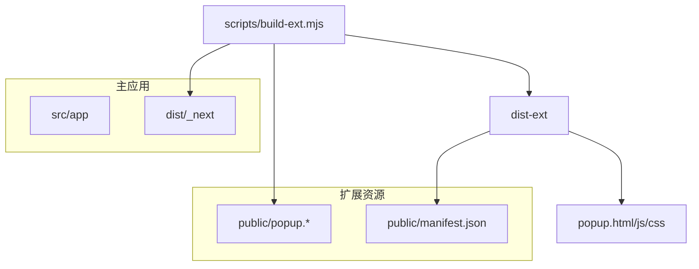
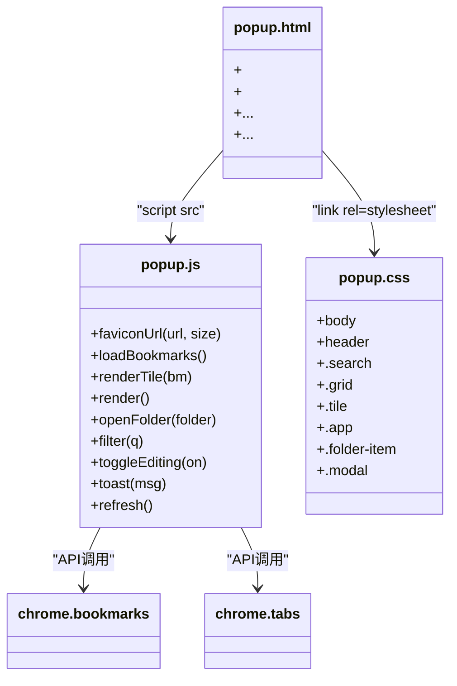
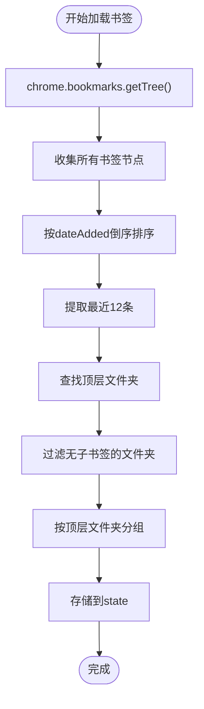
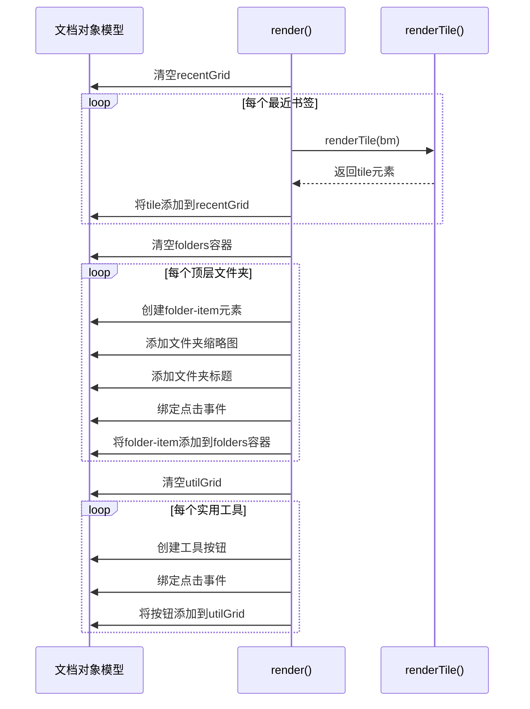
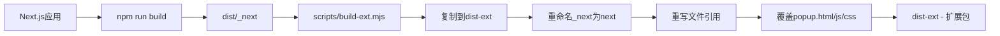

# 弹窗界面实现

<cite>
**本文档引用文件**   
- [popup.html](file://public/popup.html)
- [popup.js](file://public/popup.js)
- [popup.css](file://public/popup.css)
- [manifest.json](file://public/manifest.json)
- [build-ext.mjs](file://scripts/build-ext.mjs)
</cite>

## 目录

1. [项目结构分析](#项目结构分析)
2. [核心组件分析](#核心组件分析)
3. [弹窗HTML结构](#弹窗html结构)
4. [弹窗逻辑实现](#弹窗逻辑实现)
5. [样式与视觉设计](#样式与视觉设计)
6. [浏览器扩展API交互](#浏览器扩展api交互)
7. [与Next.js主应用的分离设计](#与nextjs主应用的分离设计)
8. [性能优化建议](#性能优化建议)
9. [常见问题与解决方案](#常见问题与解决方案)

## 项目结构分析

项目采用混合架构，包含Next.js主应用和独立的浏览器扩展弹窗实现。主应用位于`src/app`目录，而弹窗界面使用静态HTML/JS/CSS实现，存放于`public`目录。构建脚本`build-ext.mjs`负责将Next.js构建产物转换为扩展可用格式，并用`public`中的静态弹窗文件覆盖最终输出。



**Diagram sources**

- [build-ext.mjs](file://scripts/build-ext.mjs#L0-L73)
- [manifest.json](file://public/manifest.json#L0-L28)

**Section sources**

- [build-ext.mjs](file://scripts/build-ext.mjs#L0-L73)
- [manifest.json](file://public/manifest.json#L0-L28)

## 核心组件分析

弹窗功能由三个核心文件构成：`popup.html`定义界面结构，`popup.js`处理业务逻辑，`popup.css`提供样式。这些文件通过`manifest.json`中的`default_popup`字段关联，构成浏览器扩展的弹出界面。



**Diagram sources**

- [popup.html](file://public/popup.html#L0-L59)
- [popup.js](file://public/popup.js#L0-L331)
- [popup.css](file://public/popup.css#L0-L328)

## 弹窗HTML结构

`popup.html`文件定义了弹窗的完整DOM结构，采用语义化HTML5标签组织内容，包含头部搜索区、主体内容区和底部区域。通过`id`和`class`属性为JavaScript和CSS提供操作接口。

```html
<!DOCTYPE html>
<html lang="zh-CN">
  <head>
    <meta charset="UTF-8" />
    <meta
      name="viewport"
      content="width=device-width, initial-scale=1, maximum-scale=1, user-scalable=no"
    />
    <title>OneNav - 书签管理与快速搜索</title>
    <meta
      name="description"
      content="OneNav 是一个书签管理工具，支持书签增删改查、排序、导入导出与快速搜索；并预留 SSH 连接、脚本执行、两步验证等扩展能力。"
    />
    <link rel="icon" href="/favicon-32x32.png" sizes="32x32" />
    <link rel="stylesheet" href="popup.css" />
  </head>
  <body>
    <header>
      <div class="search">
        <svg width="16" height="16" viewBox="0 0 24 24" fill="none">
          <path
            d="m21 21-4.2-4.2m1.2-4.8a7 7 0 1 1-14 0 7 7 0 0 1 14 0Z"
            stroke="#1c1c1e"
            stroke-width="2"
            stroke-linecap="round"
          />
        </svg>
        <input
          id="q"
          placeholder="App Library / 搜索书签…"
          autocomplete="off"
        />
      </div>
    </header>

    <div class="wrap">
      <div id="recent">
        <div class="section-title">Recently Added</div>
        <div class="grid" id="recentGrid"></div>
      </div>

      <div class="seg"></div>

      <div id="folders"></div>

      <div class="seg"></div>

      <div id="utils">
        <div class="section-title">Utilities</div>
        <div class="grid" id="utilGrid"></div>
        <div class="hint">右键或拖动进入编辑模式；拖拽可在同文件夹内排序。</div>
      </div>
    </div>

    <footer></footer>

    <div id="folderModal" class="modal" aria-hidden="true">
      <div class="sheet" role="dialog" aria-modal="true">
        <div class="modal-header">
          <div id="modalTitle" class="modal-title"></div>
          <button id="modalClose" class="modal-close" aria-label="Close">
            ✕
          </button>
        </div>
        <div id="modalGrid" class="modal-grid grid"></div>
      </div>
    </div>

    <script src="popup.js"></script>
  </body>
</html>
```

**Section sources**

- [popup.html](file://public/popup.html#L0-L59)

## 弹窗逻辑实现

`popup.js`文件实现了弹窗的核心功能逻辑，包括书签加载、渲染、搜索过滤、编辑模式和用户交互处理。代码采用模块化设计，通过`state`对象管理应用状态。

### 状态管理

```javascript
const state = {
  editing: false,
  folders: [], // [{id, title, children:[bookmark]}]
  recent: [], // 最近 N 条
  mapParent: {}, // bookmarkId -> topFolderId
};
```

### 书签加载与处理

`loadBookmarks()`函数从浏览器书签API获取书签树，进行扁平化处理，并按顶层文件夹分组。该函数使用递归算法遍历书签树结构。



**Diagram sources**

- [popup.js](file://public/popup.js#L72-L120)

### 界面渲染

`render()`函数根据`state`中的数据渲染界面，包括最近添加的书签、文件夹分区和实用工具。`renderTile()`函数负责渲染单个书签卡片。



**Diagram sources**

- [popup.js](file://public/popup.js#L178-L270)

### 用户交互处理

弹窗支持多种用户交互方式，包括点击打开书签、双击重命名、右键进入编辑模式、拖拽排序等。这些交互通过事件监听器实现。

```javascript
// 点击打开书签
tile.addEventListener('click', (e) => {
  if (state.editing) return;
  const newTab = e.metaKey || e.ctrlKey || e.button === 1;
  chrome.tabs.query({ active: true, lastFocusedWindow: true }, ([tab]) => {
    if (newTab)
      chrome.tabs.create({
        url: bm.url,
        index: tab ? tab.index + 1 : undefined,
      });
    else chrome.tabs.update(tab?.id, { url: bm.url });
    window.close();
  });
});

// 双击重命名
tile.addEventListener('dblclick', async (e) => {
  const name = prompt('重命名书签：', bm.title || '');
  if (name && name !== bm.title) {
    await chrome.bookmarks.update(bm.id, { title: name });
    refresh();
  }
});

// 右键进入编辑模式
tile.addEventListener('contextmenu', (e) => {
  e.preventDefault();
  toggleEditing(true);
});
```

**Section sources**

- [popup.js](file://public/popup.js#L198-L210)
- [popup.js](file://public/popup.js#L210-L218)
- [popup.js](file://public/popup.js#L218-L221)

## 样式与视觉设计

`popup.css`文件提供了弹窗的完整样式定义，采用现代化的CSS设计，包括Flexbox布局、CSS Grid、过渡动画和响应式设计。

### 核心样式组件

```css
/* 基础重置 */
* {
  box-sizing: border-box;
  margin: 0;
  padding: 0;
}

/* 主体样式 */
body {
  width: 600px;
  height: 600px;
  background: #f5f5f7;
  font-family:
    -apple-system, BlinkMacSystemFont, 'SF Pro Display', 'SF Pro Icons',
    'Helvetica Neue', Helvetica, Arial, sans-serif;
  color: #1d1d1f;
  overflow-y: auto;
  overflow-x: hidden;
}

/* 搜索栏 */
.search {
  display: flex;
  align-items: center;
  background: #fff;
  border: 1px solid #d1d1d6;
  border-radius: 10px;
  padding: 8px 12px;
  gap: 8px;
}

/* 网格布局 */
.grid {
  display: grid;
  grid-template-columns: repeat(4, 1fr);
  gap: 12px;
  margin-bottom: 16px;
}

/* 书签卡片 */
.tile {
  display: flex;
  flex-direction: column;
  align-items: center;
  text-align: center;
  cursor: pointer;
  border-radius: 16px;
  padding: 12px 8px;
  background: #fff;
  border: 1px solid transparent;
  transition: all 0.2s ease;
  position: relative;
  user-select: none;
}
```

### 编辑模式动画

当进入编辑模式时，书签卡片会显示删除按钮并添加晃动动画，提供视觉反馈。

```css
.xbtn {
  position: absolute;
  top: -6px;
  right: -6px;
  width: 20px;
  height: 20px;
  background: #ff3b30;
  color: white;
  border-radius: 50%;
  display: none;
  align-items: center;
  justify-content: center;
  font-size: 12px;
  font-weight: bold;
  cursor: pointer;
  z-index: 10;
}

body.editing .xbtn {
  display: flex;
}

body.editing .tile {
  animation: wiggle 0.2s ease-in-out infinite alternate;
}

@keyframes wiggle {
  0% {
    transform: rotate(-1deg);
  }
  100% {
    transform: rotate(1deg);
  }
}
```

**Section sources**

- [popup.css](file://public/popup.css#L0-L328)

## 浏览器扩展API交互

弹窗通过Chrome扩展API与浏览器进行深度集成，主要使用`bookmarks`、`tabs`和`storage`等权限。

### 书签API交互

```javascript
// 读取书签树
const tree = await chrome.bookmarks.getTree();

// 删除书签
await chrome.bookmarks.remove(bm.id);

// 更新书签
await chrome.bookmarks.update(bm.id, { title: name });

// 移动书签（排序）
await chrome.bookmarks.move(list[i], { parentId: folder.id, index: i });
```

### 标签页API交互

```javascript
// 查询当前标签页
const [t] = await chrome.tabs.query({ active: true, lastFocusedWindow: true });

// 固定/取消固定标签页
await chrome.tabs.update(t.id, { pinned: !t.pinned });

// 静音/取消静音标签页
await chrome.tabs.update(t.id, { muted: !t.mutedInfo?.muted });

// 创建新标签页
chrome.tabs.create({ url: bm.url, index: tab ? tab.index + 1 : undefined });

// 更新标签页URL
chrome.tabs.update(tab?.id, { url: bm.url });
```

### 其他API使用

```javascript
// 复制文本到剪贴板
await navigator.clipboard.writeText(t.url);

// 打开书签管理器
chrome.tabs.create({ url: 'chrome://bookmarks/' });
```

**Section sources**

- [popup.js](file://public/popup.js#L100-L331)
- [manifest.json](file://public/manifest.json#L10-L15)

## 与Next.js主应用的分离设计

弹窗界面与Next.js主应用采用分离设计，主要原因包括性能、安全和功能独立性。

### 分离设计原因

1. **性能优化**：弹窗需要快速响应，避免加载整个Next.js应用的开销
2. **安全考虑**：扩展弹窗有更严格的CSP（内容安全策略）限制
3. **功能独立**：弹窗功能相对简单，不需要复杂的React状态管理
4. **启动速度**：静态HTML/JS/CSS加载速度远快于SSR应用

### 构建流程集成

通过`build-ext.mjs`脚本实现两个系统的集成，将Next.js构建产物转换为扩展可用格式，并用静态弹窗文件覆盖。



**Diagram sources**

- [build-ext.mjs](file://scripts/build-ext.mjs#L0-L73)

**Section sources**

- [build-ext.mjs](file://scripts/build-ext.mjs#L0-L73)

## 性能优化建议

尽管当前实现已经较为高效，但仍有一些优化空间。

### 资源加载优化

1. **代码分割**：将`popup.js`中不常用的功能延迟加载
2. **图标缓存**：实现本地缓存机制，减少对Google Favicon服务的请求
3. **懒加载**：对于深层文件夹，采用懒加载方式，只在用户打开时加载内容

### 主线程优化

1. **Web Worker**：将书签树遍历等计算密集型任务移至Web Worker
2. **防抖处理**：对搜索输入添加防抖，避免频繁重新渲染
3. **虚拟滚动**：对于大量书签，实现虚拟滚动以减少DOM节点数量

```javascript
// 搜索输入防抖示例
let searchTimeout;
q.addEventListener('input', () => {
  clearTimeout(searchTimeout);
  searchTimeout = setTimeout(() => filter(q.value), 150);
});
```

### 内存管理

1. **事件监听器清理**：在组件销毁时清理事件监听器
2. **DOM节点复用**：避免频繁创建和销毁DOM节点，采用池化技术
3. **对象复用**：缓存常用对象，减少垃圾回收压力

## 常见问题与解决方案

### 点击穿透问题

**问题描述**：在某些情况下，弹窗的点击事件可能穿透到背景页面。

**解决方案**：

1. 确保弹窗有足够高的`z-index`
2. 在`body`上添加`pointer-events: auto`，在遮罩层上添加`pointer-events: none`
3. 使用`stopPropagation()`阻止事件冒泡

```javascript
tile.addEventListener('click', (e) => {
  e.stopPropagation();
  // 处理点击逻辑
});
```

### 样式失效问题

**问题描述**：在某些浏览器或主题下，弹窗样式可能显示异常。

**解决方案**：

1. 使用更具体的CSS选择器
2. 避免使用浏览器特定的CSS属性
3. 添加CSS重置规则
4. 使用CSS自定义属性确保视觉一致性

```css
/* CSS重置 */
* {
  box-sizing: border-box;
  margin: 0;
  padding: 0;
}

/* 确保字体一致性 */
body {
  font-family:
    -apple-system, BlinkMacSystemFont, 'Segoe UI', Roboto, sans-serif;
}
```

### 跨域资源加载问题

**问题描述**：从Google加载favicon时可能遇到CSP限制。

**解决方案**：

1. 确保`manifest.json`中的`content_security_policy`包含Google域名
2. 实现备用方案，如使用DuckDuckGo的favicon服务
3. 本地缓存常用网站的favicon

```json
"content_security_policy": {
    "extension_pages": "script-src 'self'; object-src 'self'; img-src 'self' data: blob: https://www.google.com https://*.google.com https://*.gstatic.com https://icons.duckduckgo.com; connect-src 'self';"
}
```

**Section sources**

- [popup.css](file://public/popup.css#L0-L328)
- [popup.js](file://public/popup.js#L0-L331)
- [manifest.json](file://public/manifest.json#L16-L18)
