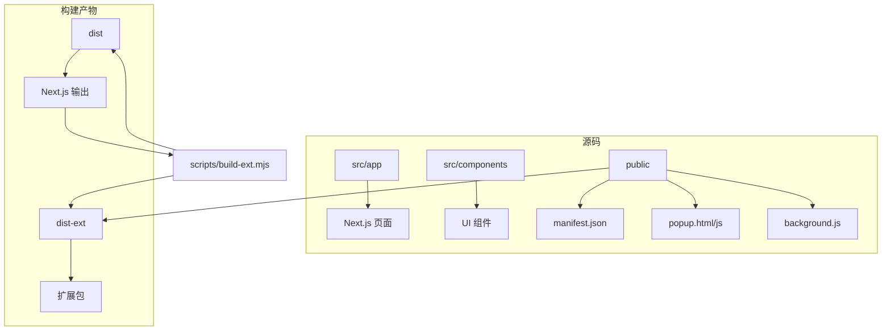
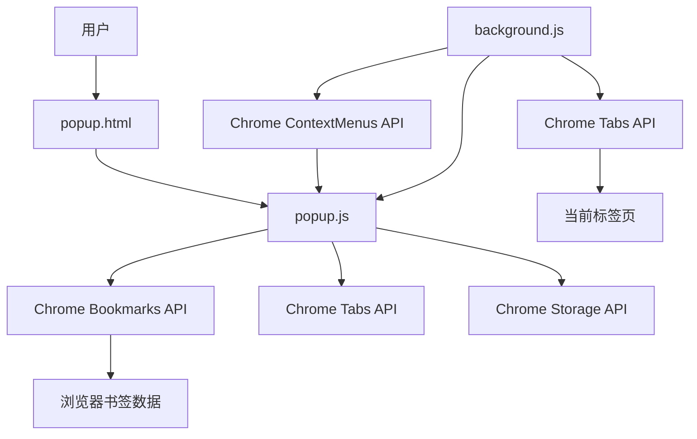
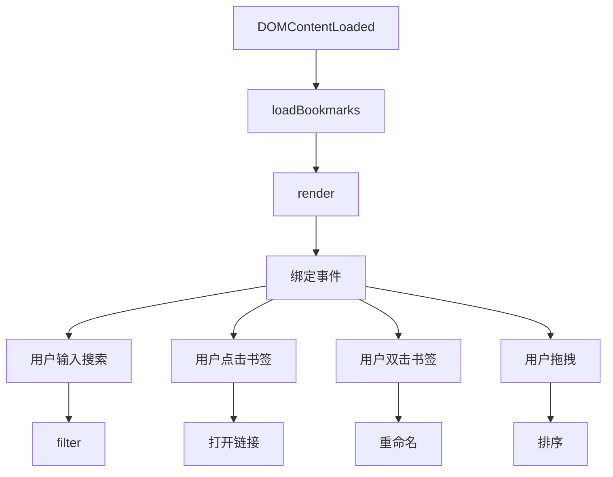
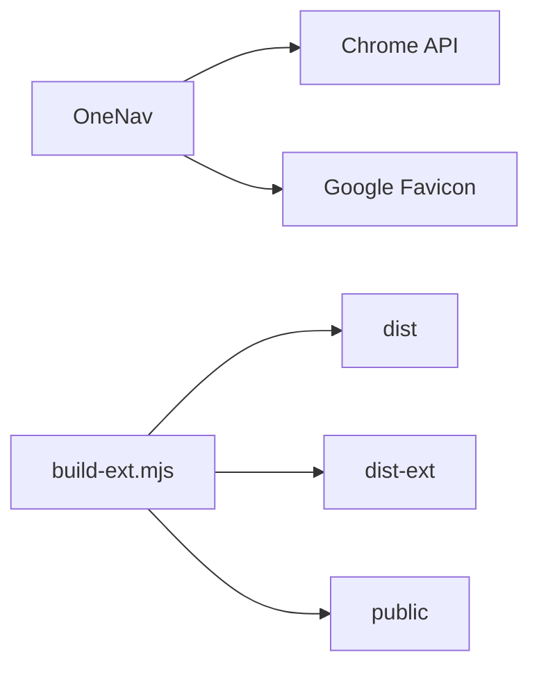

# 扩展清单配置

<cite>
**本文档中引用的文件**  
- [manifest.json](file://public/manifest.json)
- [popup.html](file://public/popup.html)
- [popup.js](file://public/popup.js)
- [background.js](file://public/background.js)
</cite>

## 目录

1. [简介](#简介)
2. [项目结构](#项目结构)
3. [核心组件](#核心组件)
4. [架构概览](#架构概览)
5. [详细组件分析](#详细组件分析)
6. [依赖分析](#依赖分析)
7. [性能考虑](#性能考虑)
8. [故障排除指南](#故障排除指南)
9. [结论](#结论)

## 简介

OneNav 是一款基于 Chrome 扩展的书签管理工具，支持书签的增删改查、排序、导入导出与快速搜索。其扩展功能预留了 SSH 连接、脚本执行、两步验证等能力。本项目通过 `manifest.json` 配置扩展行为，使用 `popup.html` 和 `popup.js` 实现弹窗界面，`background.js` 处理后台逻辑，如右键菜单创建与书签添加。项目同时支持 PWA 与浏览器扩展模式，通过构建脚本 `build-ext.mjs` 将 Next.js 构建产物转换为扩展可用格式。

## 项目结构

项目采用混合架构，前端使用 Next.js 框架，同时通过构建脚本生成独立的浏览器扩展。主要结构分为：

- `public/`：存放扩展所需的静态资源，包括 `manifest.json`、`popup.html`、`popup.js`、`background.js`。
- `src/`：Next.js 源码，包含 React 组件、页面和工具函数。
- `dist/`：Next.js 构建输出目录。
- `dist-ext/`：通过 `build-ext.mjs` 脚本生成的扩展专用目录，将 `_next` 重命名为 `next` 并替换 `popup` 相关文件。



**Diagram sources**

- [manifest.json](file://public/manifest.json)
- [build-ext.mjs](file://scripts/build-ext.mjs)

**Section sources**

- [manifest.json](file://public/manifest.json)
- [build-ext.mjs](file://scripts/build-ext.mjs)

## 核心组件

核心功能由 `manifest.json`、`popup.js` 和 `background.js` 三部分构成。`manifest.json` 定义扩展元数据、权限和入口点；`popup.js` 负责弹窗内的书签加载、渲染、搜索和交互；`background.js` 处理扩展安装、右键菜单事件和标签页更新。

**Section sources**

- [manifest.json](file://public/manifest.json)
- [popup.js](file://public/popup.js)
- [background.js](file://public/background.js)

## 架构概览

系统采用典型的浏览器扩展三层架构：UI 层（popup）、后台层（background）、数据层（Chrome Bookmarks API）。`popup.js` 通过 Chrome API 与书签数据交互，`background.js` 监听全局事件并响应用户操作。



**Diagram sources**

- [popup.js](file://public/popup.js#L1-L331)
- [background.js](file://public/background.js#L1-L47)

## 详细组件分析

### 清单配置分析

`manifest.json` 是扩展的核心配置文件，定义了扩展的行为和权限。

#### 清单版本与元数据

```json
{
  "manifest_version": 3,
  "name": "OneNav - 书签管理与快速搜索",
  "short_name": "OneNav",
  "version": "0.1.0",
  "description": "书签增删改查、排序、导入导出与快速搜索；并预留 SSH 连接、脚本执行、两步验证等扩展能力。",
  "homepage_url": "https://onenav.h06i.com"
}
```

- **manifest_version**: 使用 MV3，支持更安全的权限模型和 service worker。
- **name/short_name/description**: 扩展的显示名称和描述。
- **version**: 版本号，遵循语义化版本控制。
- **homepage_url**: 扩展主页链接。

**Section sources**

- [manifest.json](file://public/manifest.json#L1-L8)

#### 操作与图标配置

```json
"action": {
    "default_title": "OneNav 书签管理",
    "default_popup": "popup.html"
},
"icons": {
    "16": "favicon-16x16.png",
    "32": "favicon-32x32.png",
    "128": "pwa-192x192.png",
    "256": "pwa-512x512.png",
    "512": "pwa-512x512.png"
}
```

- **action**: 定义浏览器工具栏图标的点击行为，`default_popup` 指向 `popup.html`，点击时弹出此页面。
- **icons**: 提供不同尺寸的图标，用于工具栏、扩展管理页面等。

**Section sources**

- [manifest.json](file://public/manifest.json#L9-L16)

#### 权限配置

```json
"permissions": [
    "bookmarks",
    "storage",
    "tabs",
    "activeTab",
    "contextMenus"
]
```

- **bookmarks**: 访问和修改用户书签的核心权限。
- **storage**: 存储扩展的本地设置或状态。
- **tabs**: 获取和操作浏览器标签页信息。
- **activeTab**: 在当前活动标签页执行操作（如获取 URL）。
- **contextMenus**: 创建和管理右键上下文菜单。

**Section sources**

- [manifest.json](file://public/manifest.json#L17-L23)

#### 内容安全策略 (CSP)

```json
"content_security_policy": {
    "extension_pages": "script-src 'self'; object-src 'self'; img-src 'self' data: blob: https://www.google.com https://*.google.com https://*.gstatic.com https://icons.duckduckgo.com; connect-src 'self';"
}
```

- **script-src 'self'**: 仅允许执行扩展包内的脚本，防止 XSS。
- **object-src 'self'**: 限制插件对象来源。
- **img-src**: 允许从扩展自身、data URL、blob URL 以及指定的 Google 和 DuckDuckGo 域名加载图片，用于获取网站 favicon。
- **connect-src 'self'**: 限制网络请求仅能发往扩展自身（通常用于本地通信）。

**Section sources**

- [manifest.json](file://public/manifest.json#L24-L28)

### 弹窗界面分析

`popup.html` 和 `popup.js` 共同实现用户交互界面。

#### 弹窗结构

`popup.html` 定义了弹窗的 HTML 结构，包含搜索框、最近添加书签区、文件夹分区和工具区。

```html
<header>
  <div class="search">
    <input id="q" placeholder="App Library / 搜索书签…" />
  </div>
</header>
<div class="wrap">
  <div id="recent">...</div>
  <div id="folders">...</div>
  <div id="utils">...</div>
</div>
```

- **search**: 搜索输入框，实时过滤书签。
- **recent**: 显示最近添加的 12 个书签。
- **folders**: 以卡片形式展示顶层文件夹。
- **utils**: 提供实用功能按钮，如固定标签、静音、关闭重复标签等。

**Section sources**

- [popup.html](file://public/popup.html#L1-L59)

#### 弹窗逻辑

`popup.js` 实现了核心功能：

1. **加载书签**: 使用 `chrome.bookmarks.getTree()` 获取书签树，扁平化处理并按顶层文件夹分组。
2. **渲染**: 动态生成书签卡片，使用 Google 的 `s2/favicons` 服务获取 favicon。
3. **交互**:
   - 点击书签：在当前或新标签页打开。
   - 双击书签：重命名。
   - 右键/拖动：进入编辑模式。
   - 删除按钮：确认后删除书签。
   - 拖拽排序：在同一文件夹内重新排序。
4. **搜索**: 实时过滤书签标题。
5. **工具功能**: 实现标签页固定、静音、去重等。



**Diagram sources**

- [popup.js](file://public/popup.js#L1-L331)

**Section sources**

- [popup.js](file://public/popup.js#L1-L331)

### 后台脚本分析

`background.js` 在扩展后台运行，处理持久化事件。

#### 功能实现

```javascript
// 监听安装事件
chrome.runtime.onInstalled.addListener(() => {
  // 创建右键菜单
  chrome.contextMenus.create({
    id: 'add-bookmark',
    title: '添加到 OneNav 书签',
    contexts: ['page', 'link'],
  });
});

// 监听右键菜单点击
chrome.contextMenus.onClicked.addListener((info, tab) => {
  // 添加书签
  chrome.bookmarks.create({ title, url });
});

// 监听消息
chrome.runtime.onMessage.addListener((request) => {
  if (request.action === 'getData') {
    sendResponse({ data: 'Hello from background!' });
  }
  return true;
});
```

- **onInstalled**: 扩展安装时创建右键菜单项。
- **onClicked**: 用户点击右键菜单时，获取当前页面或链接的 URL 和标题，创建书签。
- **onMessage**: 监听来自 `popup` 或其他部分的消息，可实现跨组件通信。

**Section sources**

- [background.js](file://public/background.js#L1-L47)

## 依赖分析

项目依赖 Chrome 扩展 API 和 Google 的 favicon 服务。构建过程依赖 Node.js 脚本 `build-ext.mjs` 进行文件复制、重命名和路径替换。



**Diagram sources**

- [build-ext.mjs](file://scripts/build-ext.mjs)
- [background.js](file://public/background.js)

**Section sources**

- [build-ext.mjs](file://scripts/build-ext.mjs)
- [background.js](file://public/background.js)

## 性能考虑

- **书签加载**: 一次性加载整个书签树，对于大量书签可能影响性能。可考虑分页或懒加载。
- **Favicon 获取**: 每个书签都请求 Google 的 favicon 服务，可能产生大量网络请求。可缓存结果。
- **DOM 操作**: `popup.js` 中的 `refresh()` 会重新渲染所有元素，可优化为增量更新。

## 故障排除指南

### 权限缺失

- **现象**: 无法读取或修改书签。
- **解决**: 确认 `manifest.json` 中包含 `"bookmarks"` 权限，并在 Chrome 扩展管理页面检查权限是否已授予。

### 脚本注入失败

- **现象**: `popup.js` 未执行。
- **解决**: 检查 `popup.html` 是否正确引用 `popup.js`，确认 `manifest.json` 中 `default_popup` 路径正确。

### 图标不显示

- **现象**: favicon 无法加载。
- **解决**: 检查 CSP 中 `img-src` 是否包含 `https://www.google.com` 等域名，或检查网络连接。

### 右键菜单不出现

- **现象**: 安装后右键无菜单项。
- **解决**: 确认 `background.js` 中 `chrome.contextMenus.create` 被正确调用，且 `manifest.json` 包含 `"contextMenus"` 权限。

**Section sources**

- [manifest.json](file://public/manifest.json)
- [background.js](file://public/background.js)
- [popup.js](file://public/popup.js)

## 结论

OneNav 通过精心设计的 `manifest.json` 配置，结合 `popup.js` 和 `background.js`，实现了功能丰富的书签管理扩展。其架构清晰，权限使用合理，CSP 策略增强了安全性。未来可优化性能，增加更多扩展 API 支持，并适配更多浏览器。
