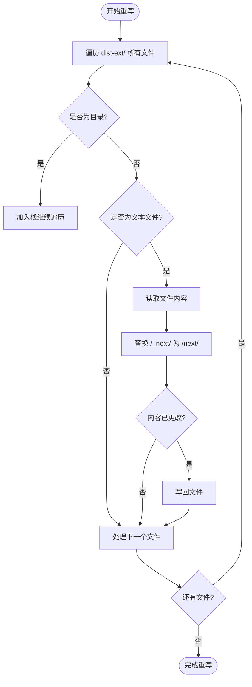

# 构建脚本解析

<cite>
**本文档引用文件**   
- [build-ext.mjs](file://scripts/build-ext.mjs#L0-L75)
- [package.json](file://package.json#L7)
- [manifest.json](file://public/manifest.json#L0-L28)
</cite>

## 目录

1. [项目结构分析](#项目结构分析)
2. [构建脚本核心逻辑](#构建脚本核心逻辑)
3. [文件操作与路径处理](#文件操作与路径处理)
4. [资源引用重写机制](#资源引用重写机制)
5. [构建流程集成与执行](#构建流程集成与执行)
6. [扩展构建行为定制](#扩展构建行为定制)

## 项目结构分析

本项目采用标准的Next.js应用结构，结合浏览器扩展（Chrome Extension）的特殊需求进行构建后处理。主要目录包括：

- `public/`：存放静态资源文件，如`manifest.json`、`popup.html`、`background.js`等，这些是浏览器扩展必需的入口文件。
- `src/`：源码目录，包含React组件、页面、样式和工具函数。
- `scripts/`：构建脚本目录，存放`build-ext.mjs`，用于生成符合扩展规范的构建产物。
- 根目录下包含`package.json`，定义了构建命令和依赖。

该结构支持通过Next.js进行现代化前端开发，同时通过自定义脚本适配浏览器扩展的加载机制。

**Section sources**

- [project_structure](file://#L0-L50)

## 构建脚本核心逻辑

`scripts/build-ext.mjs` 是一个ES模块脚本，其主要目标是将Next.js的标准构建输出（位于`dist/`）转换为符合Chrome扩展规范的格式。由于Chrome扩展不允许使用下划线开头的目录名（如`_next`），该脚本执行以下关键操作：

1. **目录复制**：将`dist/`完整复制到`dist-ext/`。
2. **目录重命名**：将`_next`重命名为`next`。
3. **引用重写**：遍历所有HTML、CSS、JS等文本文件，将内部对`/_next/`的引用替换为`/next/`。
4. **弹窗资源覆盖**：用`public/`中的静态`popup.html`、`popup.css`、`popup.js`覆盖构建产物中的对应文件，确保扩展弹窗使用预定义的UI。

该脚本确保了Next.js构建的现代前端应用能够作为浏览器扩展正常加载和运行。

**Section sources**

- [build-ext.mjs](file://scripts/build-ext.mjs#L0-L75)

## 文件操作与路径处理

脚本中定义了多个异步函数来处理文件系统操作，确保跨平台兼容性。

### 工具函数

- `exists(p)`：检查路径是否存在，通过`fs.access`实现。
- `rmrf(p)`：递归删除目录，等效于`rm -rf`。
- `ensureDir(p)`：确保目录存在，不存在则创建，使用`fs.mkdir`的`recursive: true`选项。

### 目录复制实现

```javascript
async function copyDir(src, dst) {
  await ensureDir(dst);
  const entries = await fs.readdir(src, { withFileTypes: true });
  for (const e of entries) {
    const s = path.join(src, e.name);
    const d = path.join(dst, e.name);
    if (e.isDirectory()) await copyDir(s, d);
    else if (e.isSymbolicLink()) {
      const real = await fs.readlink(s);
      await fs.symlink(real, d);
    } else await fs.copyFile(s, d);
  }
}
```

该函数递归遍历源目录，对子目录递归调用，对符号链接保留链接关系，对普通文件直接复制。

**Section sources**

- [build-ext.mjs](file://scripts/build-ext.mjs#L15-L29)

## 资源引用重写机制

在重命名`_next`目录后，必须更新所有文件中对旧路径的引用。`rewriteFiles(root)`函数负责此任务。

### 实现逻辑

1. 使用栈结构进行深度优先遍历，避免递归过深。
2. 筛选出文本文件（`.html`, `.css`, `.js`, `.json`等）。
3. 读取文件内容，使用`replaceAll`进行多模式替换：
   - `"/_next/"` → `"/next/"`
   - `"./_next/"` → `"./next/"`
   - `'"/_next/'` → `'"/next/'`
   - `"'_next/"` → `"'/next/"`
4. 仅当内容发生变化时才写回文件，提高效率。

此机制确保了所有静态资源（JavaScript、CSS、Source Map等）的引用路径正确，使浏览器能够正确加载资源。



**Diagram sources**

- [build-ext.mjs](file://scripts/build-ext.mjs#L31-L47)

**Section sources**

- [build-ext.mjs](file://scripts/build-ext.mjs#L31-L47)

## 构建流程集成与执行

`build-ext.mjs`通过`package.json`中的`build:ext`脚本命令集成到项目工作流中。

### 构建命令

```json
"scripts": {
  "build": "next build --turbopack",
  "build:ext": "npm run build && node scripts/build-ext.mjs"
}
```

执行`npm run build:ext`时：

1. 先运行`npm run build`，生成标准的Next.js构建产物到`dist/`。
2. 然后执行`node scripts/build-ext.mjs`，启动后处理脚本。

### 主函数流程


**Diagram sources**

- [package.json](file://package.json#L7)
- [build-ext.mjs](file://scripts/build-ext.mjs#L49-L73)

**Section sources**

- [package.json](file://package.json#L7)
- [build-ext.mjs](file://scripts/build-ext.mjs#L49-L73)

## 扩展构建行为定制

开发者可以根据需要自定义此构建脚本以满足特定需求。

### 自定义路径

可通过修改脚本顶部的常量来调整路径：

```javascript
const SRC = 'dist'; // 源构建目录
const DST = 'dist-ext'; // 目标扩展目录
const PUB = 'public'; // 静态资源目录
```

### 添加额外处理

例如，在重写文件后注入`manifest.json`中的版本信息：

```javascript
// 在 main() 函数末尾添加
const manifestPath = path.join(DST, 'manifest.json');
const manifest = JSON.parse(
  await fs.readFile(path.join(PUB, 'manifest.json'), 'utf8'),
);
await fs.writeFile(manifestPath, JSON.stringify(manifest, null, 2));
```

这会将`public/manifest.json`复制到`dist-ext/`，使其成为扩展的有效清单文件。

### 开发与生产环境差异化

虽然当前脚本未显式区分环境，但可通过环境变量或命令行参数实现。例如：

```bash
"build:ext:dev": "NODE_ENV=development node scripts/build-ext.mjs",
"build:ext:prod": "NODE_ENV=production node scripts/build-ext.mjs"
```

在脚本中通过`process.env.NODE_ENV`判断，执行不同的后处理逻辑（如是否保留Source Map）。

**Section sources**

- [build-ext.mjs](file://scripts/build-ext.mjs#L0-L75)
- [manifest.json](file://public/manifest.json#L0-L28)
