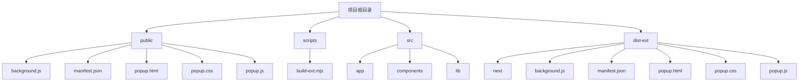

# 浏览器扩展构建

<cite>
**本文档引用的文件**  
- [build-ext.mjs](file://scripts/build-ext.mjs)
- [manifest.json](file://public/manifest.json)
- [popup.html](file://public/popup.html)
- [popup.js](file://public/popup.js)
- [background.js](file://public/background.js)
- [next.config.ts](file://next.config.ts)
</cite>

## 目录

1. [简介](#简介)
2. [项目结构](#项目结构)
3. [核心组件](#核心组件)
4. [构建流程分析](#构建流程分析)
5. [manifest.json 配置详解](#manifestjson-配置详解)
6. [弹窗界面实现](#弹窗界面实现)
7. [后台脚本机制](#后台脚本机制)
8. [打包与调试指南](#打包与调试指南)
9. [常见问题与解决方案](#常见问题与解决方案)
10. [结论](#结论)

## 简介

本文档深入解析 OneNav 浏览器扩展的构建流程，重点分析其构建脚本、扩展配置、弹窗界面和后台脚本的实现机制。该扩展基于 Next.js 构建，通过定制化构建流程适配 Chrome/Firefox 扩展规范，提供书签管理与快速搜索功能。

## 项目结构

项目采用典型的 Next.js 应用结构，并包含专门用于扩展构建的脚本和静态资源。



**Diagram sources**

- [public](file://public)
- [scripts](file://scripts)
- [src](file://src)
- [dist-ext](file://dist-ext)

**Section sources**

- [project_structure](file://project_structure)

## 核心组件

本扩展的核心组件包括构建脚本、扩展配置文件、弹窗界面和后台脚本，它们协同工作以实现完整的扩展功能。

**Section sources**

- [build-ext.mjs](file://scripts/build-ext.mjs)
- [manifest.json](file://public/manifest.json)
- [popup.js](file://public/popup.js)
- [background.js](file://public/background.js)

## 构建流程分析

构建流程的核心是 `scripts/build-ext.mjs` 脚本，它将 Next.js 的标准构建输出转换为符合浏览器扩展要求的目录结构。

### 构建脚本实现机制

该脚本执行以下关键步骤：

1. **目录复制**：将 `dist/` 目录复制到 `dist-ext/`
2. **路径重命名**：将 `_next` 目录重命名为 `next`
3. **引用重写**：更新所有 HTML/JS/CSS 文件中的路径引用
4. **资源覆盖**：用 `public/` 目录中的静态文件替换弹窗相关资源

```javascript
async function main() {
  if (!(await exists(SRC))) {
    console.error(`源目录 \`${SRC}\` 未找到。请运行: npm run build`);
    process.exit(1);
  }
  await rmrf(DST);
  await copyDir(SRC, DST);
  const oldNext = path.join(DST, '_next');
  const newNext = path.join(DST, 'next');
  if (await exists(oldNext)) await fs.rename(oldNext, newNext);
  await rewriteFiles(DST);

  // 用静态实现覆盖弹窗资源
  for (const f of ['popup.html', 'popup.css', 'popup.js']) {
    const src = path.join(PUB, f);
    const dst = path.join(DST, f);
    if (await exists(src)) await fs.copyFile(src, dst);
  }
  console.log('Chrome 扩展目录准备就绪:', DST);
}
```

### 路径引用重写逻辑

脚本通过正则表达式批量替换所有文本文件中的路径引用：

```javascript
const replaced = content
  .replaceAll('/_next/', '/next/')
  .replaceAll('./_next/', './next/')
  .replaceAll('"/_next/', '"/next/')
  .replaceAll("'/_next/", "'/next/");
```

**Diagram sources**

- [build-ext.mjs](file://scripts/build-ext.mjs#L31-L73)

**Section sources**

- [build-ext.mjs](file://scripts/build-ext.mjs#L0-L75)

## manifest.json 配置详解

`manifest.json` 是浏览器扩展的核心配置文件，定义了扩展的基本信息、权限和行为。

### 基本信息配置

```json
{
  "manifest_version": 3,
  "name": "OneNav - 书签管理与快速搜索",
  "short_name": "OneNav",
  "version": "0.1.0",
  "description": "书签增删改查、排序、导入导出与快速搜索；并预留 SSH 连接、脚本执行、两步验证等扩展能力。",
  "homepage_url": "https://onenav.h06i.com"
}
```

### 动作与弹窗配置

```json
"action": {
  "default_title": "OneNav 书签管理",
  "default_popup": "popup.html"
}
```

### 权限声明

扩展声明了以下权限：

- `bookmarks`：访问和管理书签
- `storage`：存储扩展数据
- `tabs`：访问标签页信息
- `activeTab`：与当前活动标签页交互
- `contextMenus`：创建右键菜单

### 内容安全策略 (CSP)

```json
"content_security_policy": {
  "extension_pages": "script-src 'self'; object-src 'self'; img-src 'self' data: blob: https://www.google.com https://*.google.com https://*.gstatic.com https://icons.duckduckgo.com; connect-src 'self';"
}
```

该策略限制了脚本只能从扩展自身加载，图片可以从指定的可信域名加载。

**Diagram sources**

- [manifest.json](file://public/manifest.json#L0-L28)

**Section sources**

- [manifest.json](file://public/manifest.json#L0-L28)

## 弹窗界面实现

弹窗界面由 `popup.html`、`popup.css` 和 `popup.js` 三个文件组成，提供轻量级的用户交互界面。

### 弹窗HTML结构

`popup.html` 定义了弹窗的基本结构，包括搜索栏、最近添加区域、文件夹区域和工具区域。

```html
<body>
  <header>
    <div class="search">
      <svg>...</svg>
      <input id="q" placeholder="App Library / 搜索书签…" />
    </div>
  </header>

  <div class="wrap">
    <div id="recent">...</div>
    <div class="seg"></div>
    <div id="folders"></div>
    <div class="seg"></div>
    <div id="utils">...</div>
  </div>

  <footer></footer>

  <div id="folderModal" class="modal">...</div>

  <script src="popup.js"></script>
</body>
```

### 核心功能实现

`popup.js` 实现了以下核心功能：

1. **书签加载与组织**：从浏览器书签树加载数据并按顶层文件夹分组
2. **网格渲染**：将书签渲染为 iOS 风格的网格
3. **搜索过滤**：实时过滤书签
4. **交互操作**：点击打开、双击重命名、删除书签
5. **拖拽排序**：支持同文件夹内的书签排序
6. **实用工具**：提供固定标签、静音、关闭重复标签等工具

### 状态管理

使用全局 `state` 对象管理应用状态：

```javascript
const state = {
  editing: false,
  folders: [], // 文件夹列表
  recent: [], // 最近添加的书签
  mapParent: {}, // 书签ID到父文件夹的映射
};
```

**Diagram sources**

- [popup.html](file://public/popup.html#L0-L59)
- [popup.js](file://public/popup.js#L0-L331)

**Section sources**

- [popup.html](file://public/popup.html#L0-L59)
- [popup.js](file://public/popup.js#L0-L331)

## 后台脚本机制

`background.js` 文件实现了扩展的后台服务，负责监听浏览器事件和处理跨组件通信。

### 生命周期管理

通过 `chrome.runtime.onInstalled` 监听扩展安装事件：

```javascript
chrome.runtime.onInstalled.addListener((details) => {
  if (details.reason === 'install') {
    console.log('OneNav 扩展已安装');
    // 创建右键菜单
    chrome.contextMenus.create({
      id: 'add-bookmark',
      title: '添加到 OneNav 书签',
      contexts: ['page', 'link'],
    });
  }
});
```

### 事件监听机制

脚本监听了多个浏览器事件：

1. **右键菜单点击**：添加当前页面或链接到书签
2. **标签页更新**：监听标签页状态变化
3. **消息通信**：处理来自弹窗的消息

```javascript
// 监听右键菜单点击
chrome.contextMenus.onClicked.addListener((info, tab) => {
  if (info.menuItemId === 'add-bookmark') {
    const url = info.linkUrl || tab.url;
    const title = info.linkUrl
      ? info.selectionText || 'New Bookmark'
      : tab.title;

    chrome.bookmarks.create({
      title: title,
      url: url,
    });
  }
});

// 处理来自 popup 的消息
chrome.runtime.onMessage.addListener((request, sender, sendResponse) => {
  if (request.action === 'getData') {
    sendResponse({ data: 'Hello from background!' });
  }
  return true;
});
```

**Diagram sources**

- [background.js](file://public/background.js#L0-L47)

**Section sources**

- [background.js](file://public/background.js#L0-L47)

## 打包与调试指南

### 打包生成

构建脚本生成的扩展包位于 `dist-ext/` 目录，可以直接压缩为 `.zip` 文件用于发布。

### 加载开发版扩展

1. 打开 Chrome 浏览器，进入 `chrome://extensions/`
2. 开启"开发者模式"
3. 点击"加载已解压的扩展程序"
4. 选择 `dist-ext/` 目录

### 构建流程

1. 确保已安装依赖：`pnpm install`
2. 构建 Next.js 应用：`npm run build`
3. 运行扩展构建脚本：`node scripts/build-ext.mjs`
4. 加载 `dist-ext/` 目录作为扩展

**Section sources**

- [build-ext.mjs](file://scripts/build-ext.mjs#L0-L75)
- [next.config.ts](file://next.config.ts#L0-L27)

## 常见问题与解决方案

### CSP 冲突

**问题**：由于内容安全策略限制，无法加载外部脚本。
**解决方案**：在 `manifest.json` 的 `content_security_policy` 中添加可信域名，或使用 `chrome.runtime.getURL()` 加载扩展内部资源。

### 权限不足

**问题**：扩展无法访问书签或其他浏览器功能。
**解决方案**：检查 `manifest.json` 中的 `permissions` 字段是否包含所需权限，并确保用户已授权。

### 脚本注入失败

**问题**：内容脚本无法正确注入到页面。
**解决方案**：

1. 检查 `manifest.json` 中的 `content_scripts` 配置
2. 确认匹配模式（match patterns）正确
3. 检查执行时机（run_at）设置

### 构建路径错误

**问题**：构建后资源路径不正确。
**解决方案**：确认 `next.config.ts` 中的 `distDir` 设置为 `dist`，并确保 `build-ext.mjs` 脚本正确处理路径重写。

### 异步操作未返回

**问题**：消息监听器中异步操作未正确处理。
**解决方案**：在 `chrome.runtime.onMessage` 监听器中返回 `true` 以保持消息通道开放：

```javascript
chrome.runtime.onMessage.addListener((request, sender, sendResponse) => {
  // 异步操作
  return true; // 保持消息通道开放
});
```

**Section sources**

- [manifest.json](file://public/manifest.json#L0-L28)
- [background.js](file://public/background.js#L0-L47)
- [popup.js](file://public/popup.js#L0-L331)

## 结论

OneNav 浏览器扩展通过精心设计的构建流程和组件架构，成功将 Next.js 应用转换为功能完整的浏览器扩展。其核心优势包括：

- 通过 `build-ext.mjs` 脚本实现无缝的构建转换
- 合理的 `manifest.json` 配置确保安全性和功能性平衡
- 轻量级弹窗界面提供流畅的用户体验
- 高效的后台脚本实现事件驱动的扩展行为

该架构为基于现代前端框架开发浏览器扩展提供了优秀的实践范例，既利用了 Next.js 的开发便利性，又满足了浏览器扩展的安全和性能要求。
