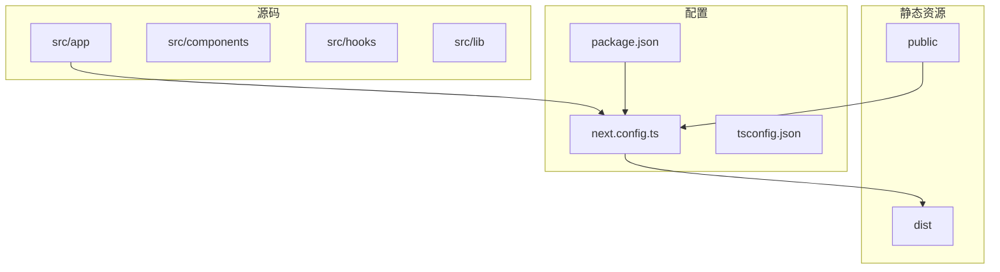
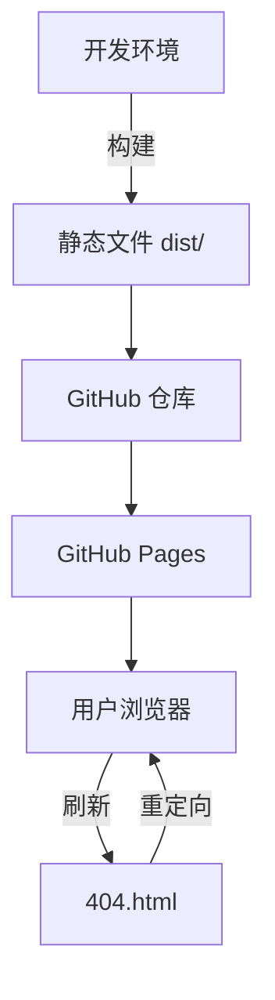
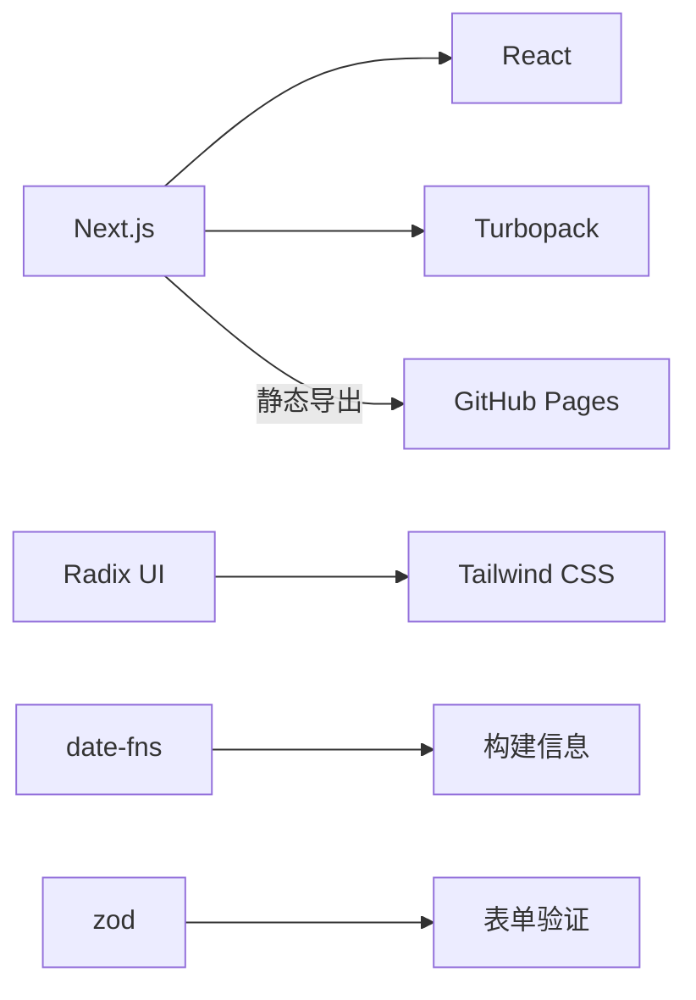

# GitHub Pages 部署

<cite>
**本文档引用的文件**  
- [next.config.ts](file://next.config.ts)
- [package.json](file://package.json)
- [public/popup.html](file://public/popup.html)
- [public/ie.html](file://public/ie.html)
- [src/app/(main)/page.tsx](file://src/app/(main)/page.tsx)
- [src/app/popup/page.tsx](file://src/app/popup/page.tsx)
- [src/app/layout.tsx](file://src/app/layout.tsx)
- [src/app/error.tsx](file://src/app/error.tsx)
- [src/app/not-found.tsx](file://src/app/not-found.tsx)
</cite>

## 目录

1. [简介](#简介)
2. [项目结构](#项目结构)
3. [核心组件](#核心组件)
4. [架构概览](#架构概览)
5. [详细组件分析](#详细组件分析)
6. [依赖分析](#依赖分析)
7. [性能考量](#性能考量)
8. [故障排除指南](#故障排除指南)
9. [结论](#结论)

## 简介

本文档旨在为基于 Next.js 的 OneNav 项目提供完整的 GitHub Pages 静态部署方案。文档重点解决在非根路径下部署时的资源定位问题，指导开发者正确配置 `basePath` 和 `assetPrefix`，并通过自动化脚本实现部署流程。同时涵盖路由刷新 404 问题的解决方案、PWA 限制应对策略以及部署后验证步骤。

## 项目结构

OneNav 是一个基于 Next.js 的书签管理工具，支持快速搜索、排序、导入导出等功能，并具备扩展能力。项目采用 App Router 架构，使用 Turbopack 进行构建，支持静态导出以部署到 GitHub Pages。



**图示来源**

- [next.config.ts](file://next.config.ts)
- [package.json](file://package.json)

**本节来源**

- [next.config.ts](file://next.config.ts)
- [package.json](file://package.json)

## 核心组件

项目核心功能由 Next.js 的 App Router 驱动，主要页面包括主界面和弹窗界面。通过 `next.config.ts` 配置静态导出，确保应用可部署至 GitHub Pages。

**本节来源**

- [next.config.ts](file://next.config.ts)
- [src/app/(main)/page.tsx](<file://src/app/(main)/page.tsx>)
- [src/app/popup/page.tsx](file://src/app/popup/page.tsx)

## 架构概览

系统采用前后端分离的静态架构，前端由 Next.js 构建，通过 `output: 'export'` 生成静态文件。部署后通过 GitHub Pages 提供服务，利用 `404.html` 实现客户端路由支持。



**图示来源**

- [next.config.ts](file://next.config.ts)
- [package.json](file://package.json)

## 详细组件分析

### 主页面分析

主页面是应用的入口，当前仅包含简单占位内容，未来将集成书签管理功能。

```tsx
export default function Page() {
  return <div>1111</div>;
}
```

**本节来源**

- [src/app/(main)/page.tsx](<file://src/app/(main)/page.tsx>)

### 弹窗页面分析

弹窗页面用于浏览器扩展，提供快速搜索和书签访问功能，独立于主应用。

**本节来源**

- [src/app/popup/page.tsx](file://src/app/popup/page.tsx)
- [public/popup.html](file://public/popup.html)

### 布局与错误处理

`layout.tsx` 定义全局布局，`error.tsx` 和 `not-found.tsx` 分别处理错误和未找到页面的情况。

**本节来源**

- [src/app/layout.tsx](file://src/app/layout.tsx)
- [src/app/error.tsx](file://src/app/error.tsx)
- [src/app/not-found.tsx](file://src/app/not-found.tsx)

## 依赖分析

项目依赖主要分为三类：Next.js 核心框架、UI 组件库（Radix UI + Tailwind CSS）和实用工具库。



**图示来源**

- [package.json](file://package.json)

**本节来源**

- [package.json](file://package.json)

## 性能考量

项目通过以下方式优化性能：

- 使用 Turbopack 加快开发构建速度
- 静态导出减少服务器渲染开销
- 图像资源未优化（`images.unoptimized = true`），适合 GitHub Pages 部署
- 利用浏览器缓存和 CDN 加速静态资源加载

## 故障排除指南

常见问题及解决方案：

1. **资源 404 错误**：确保 `basePath` 和 `assetPrefix` 配置正确
2. **路由刷新失败**：确认 `404.html` 存在并正确重定向
3. **PWA 不生效**：GitHub Pages 不支持 Service Worker，需移除或禁用 PWA 功能
4. **构建失败**：检查 `next.config.ts` 中的环境判断逻辑

**本节来源**

- [next.config.ts](file://next.config.ts)
- [public/ie.html](file://public/ie.html)

## 结论

OneNav 项目已具备部署到 GitHub Pages 的基础条件。通过正确配置 `next.config.ts` 中的静态导出选项，并结合自动化部署脚本，可实现高效、可靠的静态部署。建议在部署前移除或调整 PWA 相关功能以适应 GitHub Pages 的限制。
