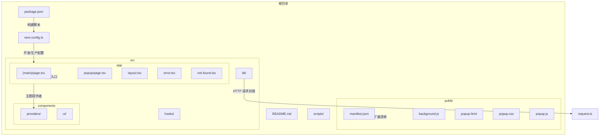
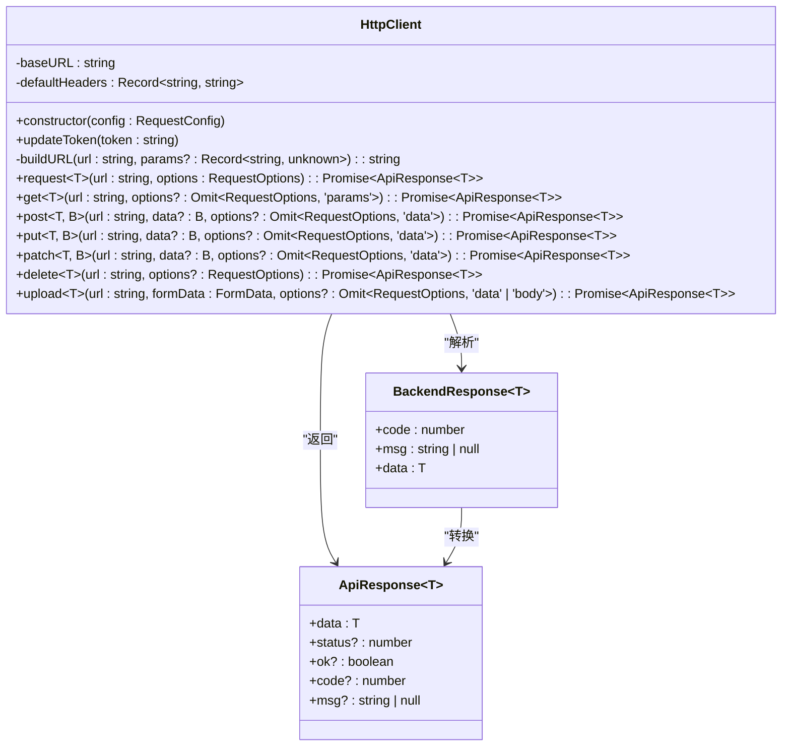
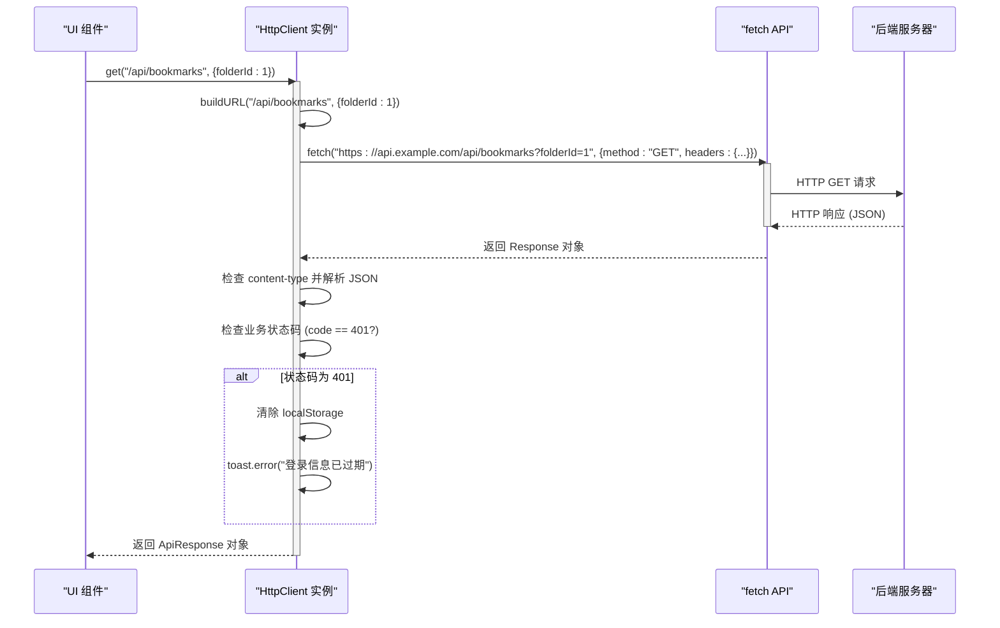
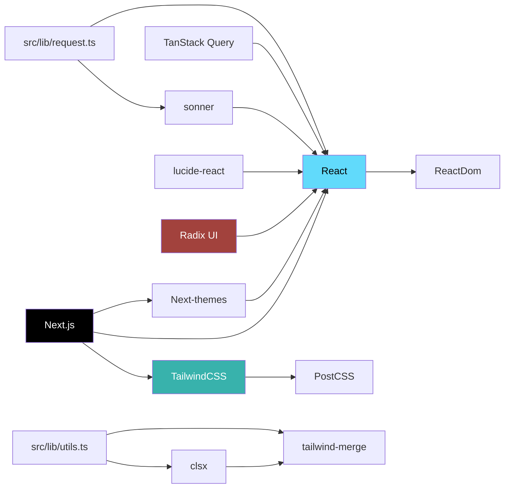

# Vercel 部署

<cite>
**本文档引用的文件**   
- [next.config.ts](file://next.config.ts#L0-L28)
- [public/manifest.json](file://public/manifest.json#L0-L28)
- [src/app/(main)/page.tsx](file://src/app/(main)/page.tsx#L0-L3)
- [src/components/providers/theme.tsx](file://src/components/providers/theme.tsx#L0-L17)
- [src/lib/request.ts](file://src/lib/request.ts#L0-L190)
- [package.json](file://package.json#L0-L142)
- [README.md](file://README.md#L0-L36)
</cite>

## 目录

1. [简介](#简介)
2. [项目结构](#项目结构)
3. [核心组件](#核心组件)
4. [架构概览](#架构概览)
5. [详细组件分析](#详细组件分析)
6. [依赖分析](#依赖分析)
7. [性能考量](#性能考量)
8. [故障排查指南](#故障排查指南)
9. [结论](#结论)

## 简介

本文档旨在为 **OneNav** 项目提供一份详尽的 Vercel 部署指南。OneNav 是一个功能强大的书签管理与快速搜索工具，支持增删改查、排序、导入导出，并预留了 SSH 连接、脚本执行和两步验证等扩展能力。本指南将覆盖从项目连接到生产环境优化的完整流程，重点介绍如何利用 Vercel 实现自动化部署、配置环境变量、设置自定义域名、启用 HTTPS，并深入探讨 Next.js 边缘函数、静态导出兼容性、PWA 功能验证等高级主题。

## 项目结构

OneNav 项目采用标准的 Next.js 应用结构，并结合了现代前端开发的最佳实践。其主要目录和文件组织如下：



**Diagram sources**

- [next.config.ts](file://next.config.ts#L0-L28)
- [public/manifest.json](file://public/manifest.json#L0-L28)
- [src/app/(main)/page.tsx](<file://src/app/(main)/page.tsx#L0-L3>)

**Section sources**

- [next.config.ts](file://next.config.ts#L0-L28)
- [public/manifest.json](file://public/manifest.json#L0-L28)
- [src/app/(main)/page.tsx](<file://src/app/(main)/page.tsx#L0-L3>)

## 核心组件

OneNav 的核心功能由以下几个关键组件构成：

1.  **HTTP 请求封装 (`src/lib/request.ts`)**：一个强类型的 `HttpClient` 类，用于处理所有与后端的 API 通信。它集成了超时、重试、错误处理和自动 token 刷新机制，并与 `sonner` 库集成以提供用户友好的通知。
2.  **主题管理 (`src/components/providers/theme.tsx`)**：基于 `next-themes` 库，为应用提供深色/浅色模式切换功能，支持系统级主题自动适配。
3.  **API 环境配置 (`next.config.ts`)**：通过 `process.env.NEXT_PUBLIC_API_URL` 环境变量动态配置 API 基地址，确保开发、预览和生产环境的无缝切换。
4.  **PWA 支持 (`public/manifest.json`)**：通过 Web App Manifest 文件，使 OneNav 可以作为渐进式 Web 应用安装到桌面，提供类似原生应用的体验。

**Section sources**

- [src/lib/request.ts](file://src/lib/request.ts#L0-L190)
- [src/components/providers/theme.tsx](file://src/components/providers/theme.tsx#L0-L17)
- [next.config.ts](file://next.config.ts#L0-L28)
- [public/manifest.json](file://public/manifest.json#L0-L28)

## 架构概览

OneNav 的整体架构遵循 Next.js 的现代化应用模式，结合了 Vercel 的云平台能力。

```mermaid
graph TD
subgraph "客户端"
Browser[浏览器]
PWA[安装为 PWA]
end
subgraph "Vercel 平台"
Preview[预览部署]
Production[生产部署]
Edge[边缘网络]
CustomDomain[自定义域名 + HTTPS]
end
subgraph "本地开发"
DevServer[开发服务器]
LocalAPI[本地 API (localhost:8000)]
end
DevServer --> |开发代理| LocalAPI
DevServer --> |热重载| Browser
Browser --> |访问| Preview
Browser --> |访问| Production
Preview --> |CI/CD 触发| Vercel
Production --> |CI/CD 触发| Vercel
Vercel --> |静态导出| Edge
Vercel --> |边缘函数| Edge
Vercel --> |自动 HTTPS| CustomDomain
subgraph "代码库"
GitHub[GitHub 仓库]
end
GitHub --> |推送代码| Vercel
style DevServer fill:#f9f,stroke:#333
style LocalAPI fill:#f96,stroke:#333
style Preview fill:#6f9,stroke:#333
style Production fill:#69f,stroke:#333
```

**Diagram sources**

- [next.config.ts](file://next.config.ts#L0-L28)
- [package.json](file://package.json#L0-L142)

## 详细组件分析

### HTTP 请求封装分析

`HttpClient` 类是应用与后端交互的基石，其设计体现了高内聚、低耦合的原则。



**Diagram sources**

- [src/lib/request.ts](file://src/lib/request.ts#L0-L190)

**Section sources**

- [src/lib/request.ts](file://src/lib/request.ts#L0-L190)

### API 请求流程分析

当应用发起一个 `get` 请求时，其内部调用流程如下：



**Diagram sources**

- [src/lib/request.ts](file://src/lib/request.ts#L0-L190)

## 依赖分析

OneNav 项目依赖于一系列现代前端库和工具，其依赖关系清晰。



**Diagram sources**

- [package.json](file://package.json#L0-L142)
- [src/lib/utils.ts](file://src/lib/utils.ts#L0-L6)

**Section sources**

- [package.json](file://package.json#L0-L142)
- [src/lib/utils.ts](file://src/lib/utils.ts#L0-L6)

## 性能考量

OneNav 在性能方面进行了多项优化：

1.  **静态导出 (`output: 'export'`)**：在生产环境中，`next.config.ts` 配置了 `output: 'export'`，这会将应用构建为完全静态的 HTML、CSS 和 JavaScript 文件。这种模式极大地提升了加载速度，因为 Vercel 可以将这些文件缓存到其全球边缘网络上，用户可以从离他们最近的节点获取资源。
2.  **图片优化**：虽然静态导出禁用了 Next.js 的内置图片优化（`images.unoptimized = true`），但项目通过 `public` 目录直接提供经过压缩的静态图片（如 `favicon` 和 `pwa` 图标），确保了关键资源的加载效率。
3.  **边缘函数 (Edge Functions)**：尽管当前代码未直接展示，但 Vercel 的边缘函数可以用于处理 API 请求、身份验证或动态内容生成，将计算任务从中心服务器转移到靠近用户的边缘节点，从而显著降低延迟。
4.  **代码分割**：Next.js 自动进行代码分割，确保用户只加载当前页面所需的代码，减少了初始加载时间。

## 故障排查指南

在部署和运行 OneNav 时，可能会遇到以下常见问题：

**Section sources**

- [next.config.ts](file://next.config.ts#L0-L28)
- [src/lib/request.ts](file://src/lib/request.ts#L0-L190)
- [public/manifest.json](file://public/manifest.json#L0-L28)

### 路由 404 错误

- **问题**：部署后访问非根路径（如 `/about`）返回 404。
- **原因**：静态导出模式下，服务器需要正确配置以将所有路由重定向到 `index.html`。
- **解决方案**：Vercel 通常会自动处理此问题。如果使用其他静态托管服务，需确保服务器配置了“单页应用 (SPA) 重写规则”。

### 静态资源路径异常

- **问题**：CSS、JS 或图片文件无法加载，出现 404 错误。
- **原因**：`next.config.ts` 中的 `distDir` 被设置为 `"dist"`，但 Vercel 默认期望构建输出在 `.next` 目录。或者，`public` 目录下的文件路径引用错误。
- **解决方案**：检查 `next.config.ts` 中的 `distDir` 配置是否与 Vercel 的构建命令兼容。确保在代码中引用 `public` 目录下的资源时，路径以 `/` 开头（例如 `/manifest.json`）。

### 环境变量未生效

- **问题**：`NEXT_PUBLIC_API_URL` 等环境变量在生产环境中未被正确读取。
- **原因**：环境变量未在 Vercel 项目设置中正确配置。
- **解决方案**：登录 Vercel 控制台，进入项目设置，在 "Environment Variables" 部分添加 `NEXT_PUBLIC_API_URL` 及其对应的值（如 `https://api.yourdomain.com`）。注意，只有以 `NEXT_PUBLIC_` 开头的变量才会被暴露给前端代码。

### PWA 功能不完整

- **问题**：无法将应用安装到主屏幕，或 `manifest.json` 未被正确加载。
- **原因**：`public/manifest.json` 文件配置错误，或 Service Worker 未正确注册。
- **解决方案**：
  1.  检查 `public/manifest.json` 文件是否存在于构建输出中。
  2.  确保 `manifest.json` 中的 `start_url` 和 `icons` 路径正确。
  3.  在浏览器开发者工具的 "Application" 标签页中，检查 "Manifest" 和 "Service Workers" 部分，确认清单文件被正确解析且 Service Worker 已注册。

## 结论

本文档全面阐述了 OneNav 项目在 Vercel 上的部署与优化策略。通过利用 `next.config.ts` 的条件配置，项目能够无缝地在开发和生产环境之间切换。静态导出模式确保了卓越的性能和全球可访问性。`HttpClient` 类的设计保证了 API 通信的健壮性和可维护性。遵循本指南中的配置和排查方法，可以确保 OneNav 应用稳定、高效地运行在 Vercel 平台上，并为用户提供流畅的书签管理体验。
