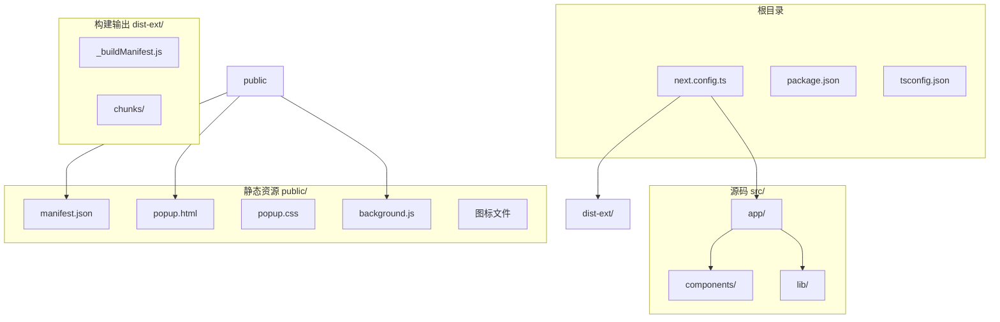
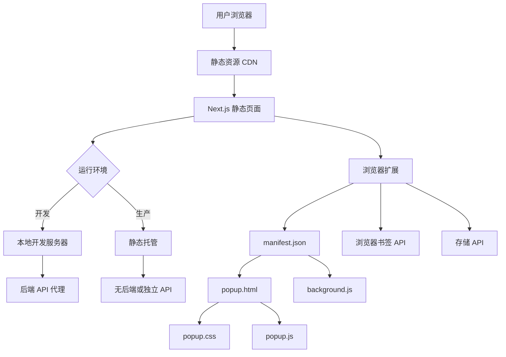
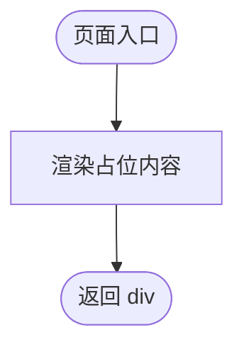
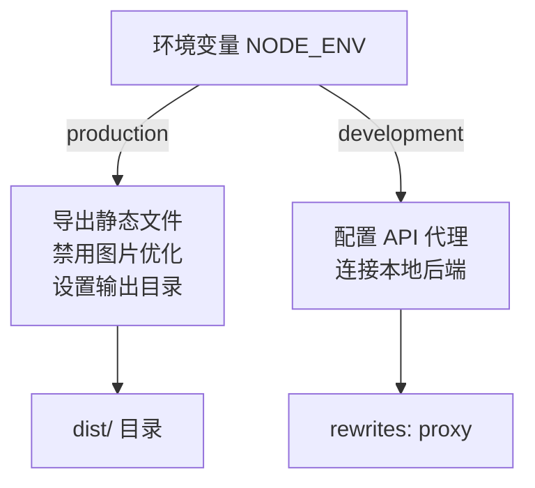
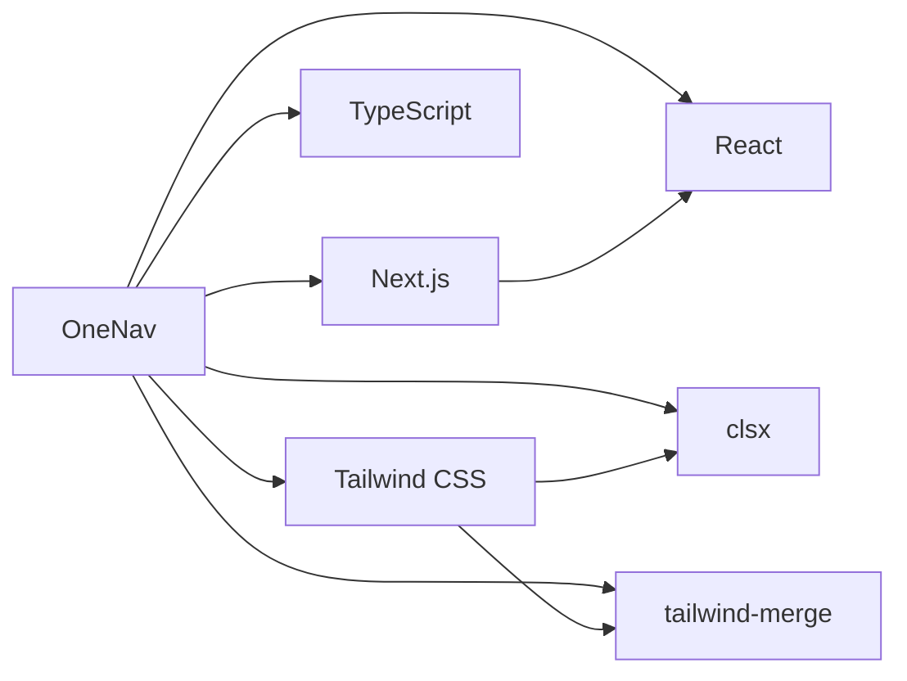

# 安全与性能优化

<cite>
**本文档引用文件**  
- [next.config.ts](file://next.config.ts#L1-L28)
- [public/manifest.json](file://public/manifest.json#L1-L28)
- [src/app/(main)/page.tsx](file://src/app/(main)/page.tsx#L1-L4)
- [src/lib/utils.ts](file://src/lib/utils.ts#L1-L7)
- [public/popup.html](file://public/popup.html)
- [public/popup.css](file://public/popup.css)
- [public/background.js](file://public/background.js)
</cite>

## 目录

1. [简介](#简介)
2. [项目结构](#项目结构)
3. [核心组件](#核心组件)
4. [架构概览](#架构概览)
5. [详细组件分析](#详细组件分析)
6. [依赖分析](#依赖分析)
7. [性能考虑](#性能考虑)
8. [故障排除指南](#故障排除指南)
9. [结论](#结论)

## 简介

本文档旨在为 OneNav 项目提供全面的安全加固与性能优化指南。该项目是一个基于 Next.js 的书签管理与快速搜索工具，支持浏览器扩展功能，具备书签增删改查、排序、导入导出等核心功能，并预留了 SSH 连接、脚本执行、两步验证等扩展能力。文档将围绕 HTTPS 配置、HSTS 启用、内容安全策略（CSP）、CDN 加速、缓存策略、现代图像格式使用及性能监控等方面展开，帮助开发者实现安全、高效、可维护的自托管部署方案。

## 项目结构

OneNav 项目采用标准的 Next.js 应用结构，结合前端静态资源与扩展功能文件，组织清晰，模块分明。主要目录包括：

- `public/`：存放静态资源文件，如图标、HTML 页面、JavaScript 脚本等，直接映射到根路径。
- `src/`：源代码目录，包含应用逻辑、组件、工具函数等。
- `src/app/`：Next.js App Router 结构，包含主页面和弹窗页面。
- `src/components/`：UI 组件库，基于 ShadCN 构建，提供可复用的 UI 元素。
- `src/lib/`：工具函数库，如 `utils.ts` 提供了类名合并工具。
- `scripts/`：构建脚本，用于扩展包的打包。
- 根目录配置文件：包括 `next.config.ts`、`package.json`、`tsconfig.json` 等，控制构建行为与项目设置。

该结构有利于代码维护与功能扩展，特别是通过 `(main)` 路由组区分主应用与扩展弹窗界面。



**图示来源**

- [next.config.ts](file://next.config.ts#L1-L28)
- [public/manifest.json](file://public/manifest.json#L1-L28)
- [src/app/(main)/page.tsx](<file://src/app/(main)/page.tsx#L1-L4>)

## 核心组件

OneNav 的核心功能由以下几个关键文件构成：

- `src/app/(main)/page.tsx`：主页面入口，当前仅返回一个简单的 div，但作为未来功能扩展的基础。
- `public/manifest.json`：浏览器扩展的核心配置文件，定义了扩展名称、权限、图标、弹窗页面及内容安全策略（CSP）。
- `next.config.ts`：Next.js 构建配置，控制开发与生产环境的行为，如静态导出、代理设置、图片优化等。
- `src/lib/utils.ts`：提供 `cn()` 工具函数，用于合并 Tailwind CSS 类名，提升样式处理的灵活性与可维护性。

这些文件共同构成了应用的基础框架与安全边界。

**本节来源**

- [src/app/(main)/page.tsx](<file://src/app/(main)/page.tsx#L1-L4>)
- [public/manifest.json](file://public/manifest.json#L1-L28)
- [next.config.ts](file://next.config.ts#L1-L28)
- [src/lib/utils.ts](file://src/lib/utils.ts#L1-L7)

## 架构概览

OneNav 采用前后端分离的现代 Web 架构，前端基于 Next.js 框架，利用 React Server Components 和 App Router 实现高效渲染。项目支持两种部署模式：开发模式下通过本地代理连接后端 API；生产模式下导出为静态文件，适合 CDN 托管。

扩展功能通过 `public/` 目录下的 `manifest.json`、`popup.html`、`background.js` 等文件实现，与主应用共享部分静态资源，但运行在浏览器扩展环境中，拥有更高的权限（如访问书签、标签页等）。



**图示来源**

- [next.config.ts](file://next.config.ts#L1-L28)
- [public/manifest.json](file://public/manifest.json#L1-L28)
- [public/popup.html](file://public/popup.html)
- [public/background.js](file://public/background.js)

## 详细组件分析

### 主页面组件分析

`src/app/(main)/page.tsx` 是应用的主入口，目前实现非常简洁，仅返回一个占位 div。这表明项目处于早期开发阶段，未来将在此基础上集成书签列表、搜索框、导航栏等核心 UI 组件。

尽管逻辑简单，但其基于 Next.js App Router 的结构为后续功能扩展提供了良好的基础，支持服务端渲染、数据获取、布局嵌套等高级特性。



**图示来源**

- [src/app/(main)/page.tsx](<file://src/app/(main)/page.tsx#L1-L4>)

### 内容安全策略 (CSP) 分析

`public/manifest.json` 中的 `content_security_policy` 字段定义了扩展页面的安全策略，是安全加固的关键部分。

```json
"content_security_policy": {
  "extension_pages": "script-src 'self'; object-src 'self'; img-src 'self' data: blob: https://www.google.com https://*.google.com https://*.gstatic.com https://icons.duckduckgo.com; connect-src 'self';"
}
```

该策略限制了脚本仅能从自身加载（防止 XSS），图像可从自身及可信域名（Google、DuckDuckGo）加载，确保图标资源正常显示的同时，防止恶意资源注入。

**本节来源**

- [public/manifest.json](file://public/manifest.json#L15-L20)

### 构建配置分析

`next.config.ts` 文件根据 `NODE_ENV` 环境变量动态配置构建行为：

- **生产环境**：启用 `output: "export"`，将应用导出为静态 HTML 文件，适合部署在任何静态服务器或 CDN 上。同时禁用图片优化（`images.unoptimized = true`），因为项目可能不依赖动态图片处理。
- **开发环境**：配置 API 代理，将 `/api/*` 请求转发到本地后端服务（`http://localhost:8000`），便于前后端分离开发。
- **构建时间注入**：通过 `process.env.NEXT_PUBLIC_BUILD_TIME` 注入当前构建时间，可用于版本追踪或缓存失效。



**图示来源**

- [next.config.ts](file://next.config.ts#L10-L28)

## 依赖分析

项目依赖主要分为两类：

1. **框架依赖**：Next.js、React、TypeScript、Tailwind CSS，构成现代前端开发栈。
2. **工具依赖**：`clsx` 和 `tailwind-merge` 用于高效处理动态类名，避免样式冲突。

构建工具使用 `pnpm`，由 `pnpm-lock.yaml` 锁定依赖版本，确保构建一致性。



**图示来源**

- [package.json](file://package.json)
- [src/lib/utils.ts](file://src/lib/utils.ts#L1-L7)

## 性能考虑

### CDN 加速与静态资源优化

由于生产模式导出为静态文件，强烈建议将 `dist` 或 `dist-ext` 目录部署在 CDN 上。CDN 可以：

- 缓存 JS、CSS、图片等静态资源，减少服务器负载。
- 利用全球节点加速资源加载，显著降低首屏时间。
- 支持 HTTP/2 和 Brotli 压缩，进一步提升传输效率。

### 缓存策略

- **浏览器缓存**：通过 CDN 配置 `Cache-Control` 头，对静态资源（如 JS、CSS、图片）设置长期缓存（如 `max-age=31536000`）。文件名中包含哈希（如 Next.js 自动生成的 chunk 文件名）可确保更新后缓存自动失效。
- **构建缓存**：`next.config.ts` 中的 `distDir` 指定输出目录，配合 CI/CD 流程可实现增量构建，加快部署速度。

### 现代图像格式与响应式图标

`public/manifest.json` 中定义了多尺寸图标，建议：

- 将 PNG 图标转换为 WebP 格式，通常可减少 30% 以上体积。
- 在 `manifest.json` 中为不同分辨率提供 WebP 版本，并利用 `<picture>` 标签或 CSS `image-set()` 实现响应式加载。

### 性能监控

- **Lighthouse 评分优化**：确保页面加载性能、可访问性、最佳实践等指标达标。可通过 Vercel 或本地 Chrome DevTools 运行 Lighthouse 审计。
- **日志收集**：若部署在 Nginx 等服务器上，应启用访问日志分析，监控请求频率、错误码、用户地域等，为性能调优提供数据支持。

**本节来源**

- [next.config.ts](file://next.config.ts#L1-L28)
- [public/manifest.json](file://public/manifest.json#L1-L28)

## 故障排除指南

### HTTPS 与 HSTS 配置

- **HTTPS**：使用 Let's Encrypt 免费证书（通过 Certbot 或 Caddy 等工具自动配置），确保所有流量加密。
- **HSTS**：在服务器配置中添加 `Strict-Transport-Security: max-age=63072000; includeSubDomains; preload` 头，强制浏览器使用 HTTPS，防止降级攻击。

### CSP 冲突解决

若扩展功能因 CSP 被阻止：

1. 检查 `manifest.json` 中的 `content_security_policy` 是否允许必要的资源域。
2. 避免使用内联脚本或 `eval()`，改用外部文件。
3. 对于动态脚本，考虑使用 `wasm` 或预加载策略。

### 构建失败

- 确保 `pnpm` 已安装并正确配置。
- 检查 `next.config.ts` 中的环境变量是否正确设置。
- 清理 `dist` 目录后重新构建。

**本节来源**

- [next.config.ts](file://next.config.ts#L1-L28)
- [public/manifest.json](file://public/manifest.json#L1-L28)

## 结论

OneNav 项目具备良好的架构基础和扩展潜力。通过实施 HTTPS、HSTS、严格 CSP 等安全措施，结合 CDN 加速、浏览器缓存、WebP 图像优化等性能策略，可打造一个安全、快速、可靠的自托管书签管理平台。建议持续关注 Next.js 最佳实践，集成 Lighthouse 监控，并利用 Nginx 日志进行性能分析，以实现持续优化。
