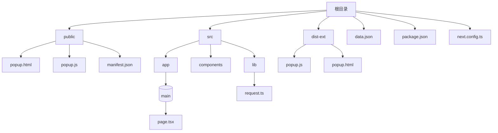
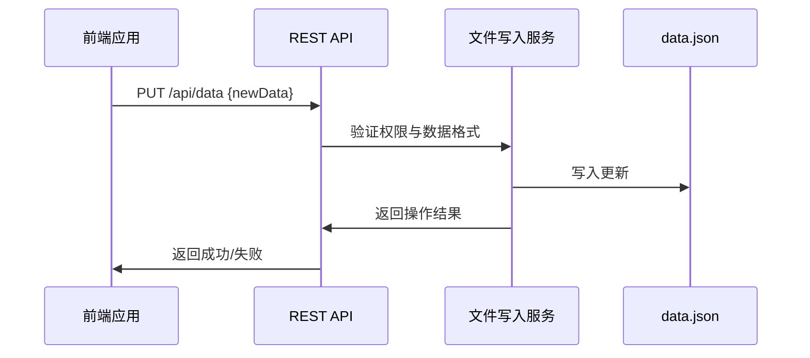
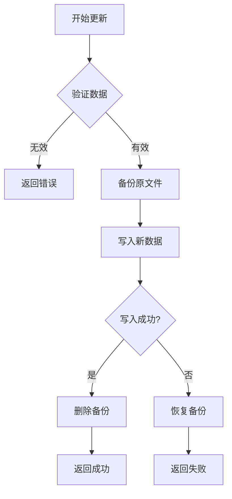

# 数据持久化管理

<cite>
**本文档引用文件**  
- [data.json](file://data.json)
- [next.config.ts](file://next.config.ts)
- [request.ts](file://src/lib/request.ts)
- [query.tsx](file://src/components/providers/query.tsx)
- [layout.tsx](file://src/app/layout.tsx)
- [page.tsx](file://src/app/(main)/page.tsx)
- [popup.js](file://public/popup.js)
- [popup.js](file://dist-ext/popup.js)
- [package.json](file://package.json)
- [README.md](file://README.md)
</cite>

## 目录

1. [项目结构](#项目结构)
2. [核心数据文件 data.json 分析](#核心数据文件-datajson-分析)
3. [数据注入与构建时处理](#数据注入与构建时处理)
4. [运行时动态更新机制](#运行时动态更新机制)
5. [安全更新方案建议](#安全更新方案建议)
6. [生产环境部署建议](#生产环境部署建议)
7. [文件权限与并发风险](#文件权限与并发风险)
8. [备份与恢复策略](#备份与恢复策略)

## 项目结构

本项目为基于 Next.js 的前端应用，主要结构如下：



**图示来源**

- [project_structure](file://project_structure)

**本节来源**

- [project_structure](file://project_structure)
- [README.md](file://README.md)

## 核心数据文件 data.json 分析

`data.json` 是本项目的核心数据存储文件，用于存放 VPS 服务提供商的套餐信息，包括 BandwagonHost (BWG) 和 DMIT 等平台的限量版套餐。

该文件采用标准 JSON 格式，每个条目包含以下字段：

- **platform**: 平台名称（如 bwg, dmit）
- **plan_name**: 套餐名称
- **cpu**: CPU 核心数
- **ram**: 内存大小
- **disk**: 磁盘容量
- **monthly_traffic**: 月流量
- **bandwidth**: 带宽
- **data_center**: 数据中心位置与线路
- **price_per_year**: 年费价格
- **test_address**: 测速地址
- **stock_status**: 库存状态
- **purchase_link**: 购买链接

示例条目：

```json
{
  "platform": "bwg",
  "plan_name": "日本东京限量版",
  "cpu": "1核",
  "ram": "1GB",
  "disk": "20GB",
  "monthly_traffic": "500GB",
  "bandwidth": "2.5Gbps",
  "data_center": "日本东京 DC39v2，三网直连",
  "price_per_year": "$79",
  "test_address": "https://dc39.bwg.net",
  "stock_status": false,
  "purchase_link": "https://www.bandwagonhost.net/1215.html"
}
```

**本节来源**

- [data.json](file://data.json)

## 数据注入与构建时处理

在构建阶段，`data.json` 作为静态资源被直接打包进应用。根据 `next.config.ts` 配置，生产环境使用 `output: 'export'` 模式，将应用导出为静态文件。

```typescript
switch (process.env.NODE_ENV) {
  case 'production':
    nextConfig.output = 'export';
    nextConfig.images = {};
    nextConfig.images.unoptimized = true;
    nextConfig.distDir = 'dist';
    break;
}
```

这意味着 `data.json` 在构建时被固化，无法在运行时修改。任何数据更新都需要重新构建和部署。

此外，`package.json` 中的 SEO 配置表明，该应用注重搜索引擎优化，`data.json` 中的数据可能用于生成页面元信息。

**本节来源**

- [next.config.ts](file://next.config.ts#L0-L27)
- [package.json](file://package.json#L115-L142)

## 运行时动态更新机制

当前项目未实现 `data.json` 的运行时动态更新。所有数据在构建时确定，通过静态文件服务提供。

前端通过 `popup.js` 加载和渲染数据，但该文件处理的是浏览器书签数据，而非 `data.json` 中的 VPS 套餐数据。这表明 `data.json` 主要用于服务端或构建时数据注入。

```javascript
// popup.js 中处理的是浏览器书签
flat.sort((a, b) => (b.dateAdded || 0) - (a.dateAdded || 0));
state.recent = flat.slice(0, 12);
```

若需实现运行时更新，需引入后端服务或 API 接口。

**本节来源**

- [popup.js](file://public/popup.js#L66-L94)
- [popup.js](file://dist-ext/popup.js#L66-L94)

## 安全更新方案建议

为实现 `data.json` 的安全动态更新，建议采用以下方案：

### 方案一：后端代理 API

建立后端服务，提供 REST API 接口用于更新数据：



### 方案二：环境变量注入

在构建时通过环境变量注入数据，避免直接修改文件：

```bash
NEXT_PUBLIC_VPS_DATA='[{"platform":"bwg",...}]' npm run build
```

然后在代码中通过 `process.env.NEXT_PUBLIC_VPS_DATA` 读取。

### 推荐实现

1. 创建 `/api/update-data` 接口
2. 实现身份验证（如 JWT）
3. 添加数据验证逻辑
4. 使用文件锁防止并发写入
5. 写入前备份原文件

**图示来源**

- [request.ts](file://src/lib/request.ts#L0-L123)

**本节来源**

- [request.ts](file://src/lib/request.ts)
- [query.tsx](file://src/components/providers/query.tsx)

## 生产环境部署建议

在生产环境中，为确保数据持久性和安全性，建议：

### 1. 使用持久化卷

将 `data.json` 存放于持久化存储卷中，避免被重新构建覆盖。

```yaml
# Docker Compose 示例
volumes:
  - ./data.json:/app/data.json
```

### 2. 分离数据与代码

将数据文件与应用代码分离，通过 CDN 或独立服务提供数据。

### 3. 使用数据库替代

对于频繁更新的场景，建议使用轻量级数据库（如 SQLite）替代 JSON 文件。

### 4. 环境变量初始化

通过环境变量注入初始数据，确保部署一致性。

```typescript
// 在 next.config.ts 中
const initialData = process.env.VPS_DATA
  ? JSON.parse(process.env.VPS_DATA)
  : require('./data.json');
```

**本节来源**

- [next.config.ts](file://next.config.ts)
- [layout.tsx](file://src/app/layout.tsx#L31-L75)

## 文件权限与并发风险

直接修改 `data.json` 存在以下风险：

### 1. 文件权限问题

确保运行应用的用户有读写权限：

```bash
chmod 644 data.json
chown www-data:www-data data.json
```

### 2. 并发写入风险

多个进程同时写入可能导致数据损坏。解决方案：

- 使用文件锁（如 `fs.lock()`）
- 采用原子写入（先写临时文件，再重命名）
- 使用数据库替代文件存储

### 3. 数据一致性

建议实现写入前备份机制：



**图示来源**

- [request.ts](file://src/lib/request.ts#L74-L123)

**本节来源**

- [request.ts](file://src/lib/request.ts)

## 备份与恢复策略

为保障数据安全，必须实施以下备份策略：

### 1. 自动化备份

```bash
# 每日备份脚本
#!/bin/bash
cp data.json backups/data_$(date +%Y%m%d_%H%M%S).json
# 保留最近7天备份
find backups/ -name "data_*.json" -mtime +7 -delete
```

### 2. 版本控制

将 `data.json` 纳入 Git 版本控制，便于追踪变更。

### 3. 异地备份

定期将备份文件同步到远程存储（如 AWS S3、阿里云 OSS）。

### 4. 恢复流程

建立标准化恢复流程：

1. 停止应用服务
2. 恢复备份文件
3. 重启服务
4. 验证数据完整性

**本节来源**

- [data.json](file://data.json)
- [package.json](file://package.json)
