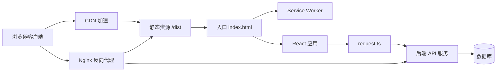
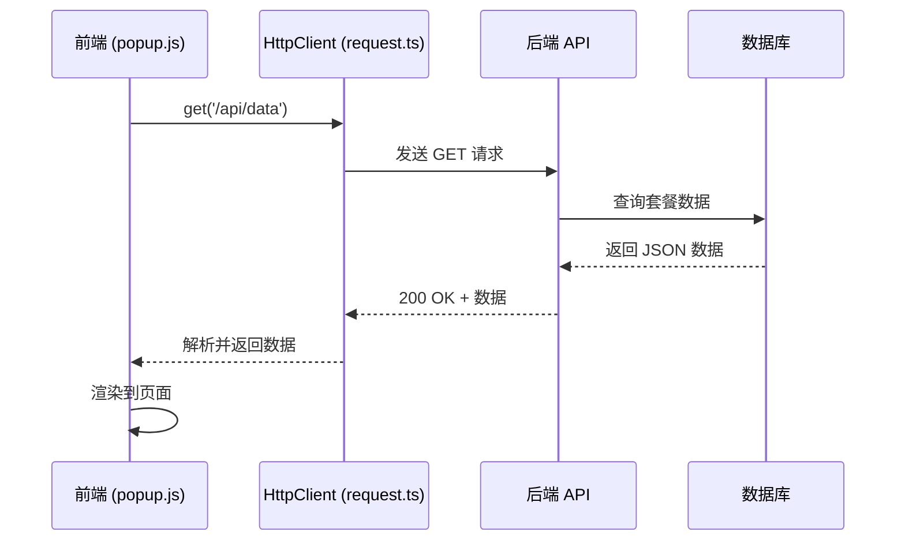
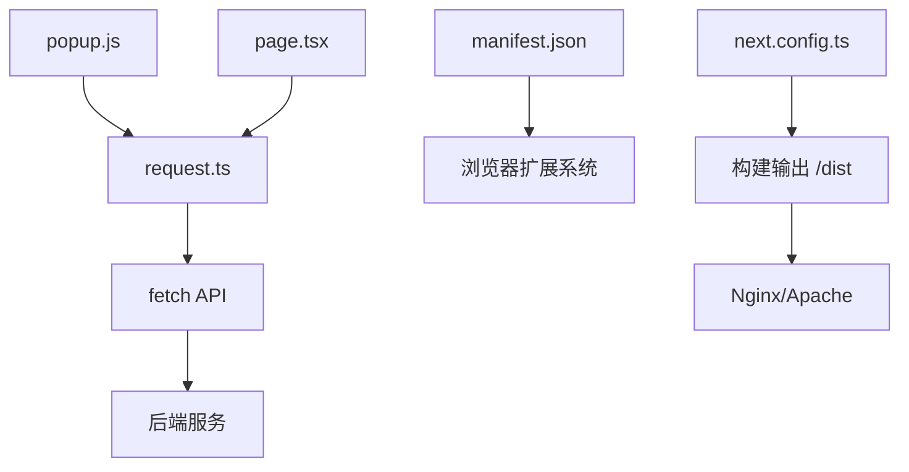

# 自托管部署

<cite>
**本文档中引用的文件**  
- [README.md](file://README.md)
- [data.json](file://data.json)
- [public/manifest.json](file://public/manifest.json)
- [public/popup.html](file://public/popup.html)
- [public/popup.js](file://public/popup.js)
- [src/app/(main)/page.tsx](file://src/app/(main)/page.tsx)
- [next.config.ts](file://next.config.ts)
- [src/lib/request.ts](file://src/lib/request.ts)
</cite>

## 目录

1. [简介](#简介)
2. [项目结构](#项目结构)
3. [核心组件](#核心组件)
4. [架构概览](#架构概览)
5. [详细组件分析](#详细组件分析)
6. [依赖分析](#依赖分析)
7. [性能考虑](#性能考虑)
8. [故障排除指南](#故障排除指南)
9. [结论](#结论)

## 简介

本文档旨在为高级用户提供一个完整的自托管部署方案，适用于基于 Next.js 构建的 OneNav 项目。该方案支持在 Nginx 或 Apache 上进行反向代理配置，确保静态资源高效分发、SPA 路由正确重写，并通过 HTTPS 和 CDN 提升安全性和访问速度。同时，文档涵盖 `data.json` 数据更新机制、PWA 功能配置、Service Worker 作用域设置以及性能监控建议，帮助用户实现完全可控的部署环境。

## 项目结构

OneNav 是一个使用 Next.js 框架构建的前端应用，主要用于书签管理与快速搜索。项目采用模块化设计，包含静态资源、组件库、API 请求封装和配置文件。

```mermaid
graph TB
subgraph "根目录"
README[README.md]
nextConfig[next.config.ts]
dataJson[data.json]
publicDir[public/]
srcDir[src/]
end
subgraph "public"
manifest[manifest.json]
popupHtml[popup.html]
popupJs[popup.js]
backgroundJs[background.js]
end
subgraph "src"
appDir[app/]
componentsDir[components/]
libDir[lib/]
end
subgraph "app"
mainPage[(main)/page.tsx]
end
subgraph "lib"
request[request.ts]
end
README --> nextConfig
nextConfig --> dataJson
nextConfig --> publicDir
nextConfig --> srcDir
publicDir --> manifest
publicDir --> popupHtml
publicDir --> popupJs
srcDir --> appDir
srcDir --> libDir
appDir --> mainPage
libDir --> request
```

**图示来源**

- [README.md](file://README.md)
- [next.config.ts](file://next.config.ts)
- [data.json](file://data.json)

**本节来源**

- [README.md](file://README.md#L0-L36)
- [next.config.ts](file://next.config.ts#L0-L28)

## 核心组件

OneNav 的核心功能由多个关键文件协同实现：

- `data.json`：存储 VPS 服务套餐数据，供前端展示。
- `popup.html` 和 `popup.js`：浏览器扩展弹窗界面及其交互逻辑。
- `manifest.json`：定义扩展的基本信息与权限。
- `next.config.ts`：Next.js 构建配置，区分开发与生产环境。
- `request.ts`：封装 HTTP 请求类，支持类型安全的 API 调用。

这些组件共同构成了一个可扩展、易于维护的单页应用（SPA）。

**本节来源**

- [data.json](file://data.json#L0-L799)
- [public/popup.html](file://public/popup.html#L0-L59)
- [public/popup.js](file://public/popup.js#L0-L331)
- [public/manifest.json](file://public/manifest.json#L0-L28)
- [next.config.ts](file://next.config.ts#L0-L28)
- [src/lib/request.ts](file://src/lib/request.ts#L0-L190)

## 架构概览

整个应用采用前后端分离架构，前端基于 Next.js 实现静态生成（SSG）或服务端渲染（SSR），并通过 `HttpClient` 类与后端 API 通信。



**图示来源**

- [next.config.ts](file://next.config.ts#L0-L28)
- [src/lib/request.ts](file://src/lib/request.ts#L0-L190)
- [public/popup.js](file://public/popup.js#L0-L331)

## 详细组件分析

### 数据管理与更新机制

`data.json` 是项目中用于存储 VPS 套餐信息的核心数据文件。它以数组形式列出多个服务商（如 bwg）提供的套餐，包含 CPU、内存、价格、数据中心等字段。

#### 本地持久化更新

用户可通过以下方式更新 `data.json`：

1. 手动编辑文件并重新构建部署。
2. 提供管理界面调用 `fs.writeFile` 写入新数据（需 Node.js 环境）。
3. 使用 Git Hook 自动拉取远程数据仓库中的最新版本。

#### 动态 API 更新

推荐将 `data.json` 迁移至后端数据库，并通过 RESTful API 提供数据服务。前端通过 `http.get('/api/data')` 获取最新数据，实现动态更新。



**图示来源**

- [data.json](file://data.json#L0-L799)
- [src/lib/request.ts](file://src/lib/request.ts#L0-L190)
- [public/popup.js](file://public/popup.js#L0-L331)

**本节来源**

- [data.json](file://data.json#L0-L799)
- [src/lib/request.ts](file://src/lib/request.ts#L0-L190)

### PWA 与离线功能配置

OneNav 支持渐进式 Web 应用（PWA）特性，通过 `manifest.json` 和 Service Worker 实现离线访问。

#### manifest.json 配置

```json
{
  "manifest_version": 3,
  "name": "OneNav - 书签管理与快速搜索",
  "short_name": "OneNav",
  "start_url": "/",
  "display": "standalone",
  "background_color": "#ffffff",
  "theme_color": "#000000",
  "icons": { ... }
}
```

此配置使应用可在桌面安装并全屏运行。

#### Service Worker 作用域（Scope）

Service Worker 的作用域应设置为 `/`，以确保其能拦截所有网络请求，实现缓存与离线功能。在构建时，Next.js 会自动生成 `sw.js` 并注册到根路径。

**本节来源**

- [public/manifest.json](file://public/manifest.json#L0-L28)

### 反向代理配置

#### Nginx 配置示例

```nginx
server {
    listen 80;
    server_name your-domain.com;

    # 静态文件 MIME 类型与压缩
    location ~* \.(js|css|png|jpg|jpeg|gif|ico|svg)$ {
        expires 1y;
        add_header Cache-Control "public, immutable";
        gzip on;
        gzip_types text/css application/javascript image/svg+xml;
    }

    # SPA 路由重写
    location / {
        root /var/www/onenav/dist;
        try_files $uri $uri/ /index.html;
    }

    # API 代理
    location /api/ {
        proxy_pass http://localhost:8000/api/;
        proxy_set_header Host $host;
        proxy_set_header X-Real-IP $remote_addr;
    }
}
```

#### Apache .htaccess 配置要点

```apache
# 启用重写引擎
RewriteEngine On

# 静态资源缓存
<FilesMatch "\.(js|css|png|jpg|jpeg|gif|ico|svg)$">
    Header set Cache-Control "public, max-age=31536000, immutable"
</FilesMatch>

# SPA 路由重写
RewriteCond %{REQUEST_FILENAME} !-f
RewriteCond %{REQUEST_FILENAME} !-d
RewriteRule ^ index.html [L]

# 启用 gzip 压缩
AddOutputFilterByType DEFLATE text/html text/css application/javascript
```

**本节来源**

- [next.config.ts](file://next.config.ts#L0-L28)
- [public/popup.html](file://public/popup.html#L0-L59)

### HTTPS 与 CDN 配置

- **Let's Encrypt HTTPS**：使用 Certbot 自动生成 SSL 证书。
  ```bash
  sudo certbot --nginx -d your-domain.com
  ```
- **CDN 加速**：将 `/dist` 目录上传至 CDN（如 Cloudflare、阿里云 OSS），并设置缓存策略为 `Cache-Control: public, max-age=31536000, immutable`。

## 依赖分析

项目依赖关系清晰，前端通过 `request.ts` 统一管理 API 调用，降低耦合度。



**图示来源**

- [src/lib/request.ts](file://src/lib/request.ts#L0-L190)
- [next.config.ts](file://next.config.ts#L0-L28)
- [public/popup.js](file://public/popup.js#L0-L331)

**本节来源**

- [src/lib/request.ts](file://src/lib/request.ts#L0-L190)
- [next.config.ts](file://next.config.ts#L0-L28)

## 性能考虑

- **静态资源优化**：Next.js 自动优化字体与图片，生产环境禁用图片优化（`images.unoptimized = true`）。
- **缓存策略**：对 JS/CSS/图片启用长期缓存（1年），利用内容哈希实现版本控制。
- **gzip 压缩**：开启文本资源压缩，减少传输体积。
- **CDN 分发**：静态资源通过 CDN 全球加速，提升加载速度。
- **Service Worker 缓存**：预缓存关键资源，支持离线访问。

## 故障排除指南

- **页面空白**：检查 `dist` 目录是否存在 `index.html`，确认 Nginx/Apache 根路径配置正确。
- **API 请求失败**：验证 `NEXT_PUBLIC_API_URL` 环境变量是否设置，检查代理配置。
- **书签无法加载**：确保浏览器扩展已获取 `bookmarks` 权限。
- **Service Worker 未注册**：确认 `manifest.json` 配置正确，且服务器返回正确 MIME 类型。
- **搜索无结果**：检查 `popup.js` 中的 `filter()` 函数逻辑，确认数据已正确加载。

**本节来源**

- [public/popup.js](file://public/popup.js#L0-L331)
- [src/lib/request.ts](file://src/lib/request.ts#L0-L190)
- [next.config.ts](file://next.config.ts#L0-L28)

## 结论

OneNav 项目结构清晰，适合自托管部署。通过合理的 Nginx/Apache 配置、HTTPS 安全加固、CDN 加速及 PWA 离线支持，可构建高性能、高可用的书签管理系统。建议将 `data.json` 迁移至后端服务，实现数据动态更新，并结合日志监控工具（如 ELK、Prometheus）持续优化系统表现。
