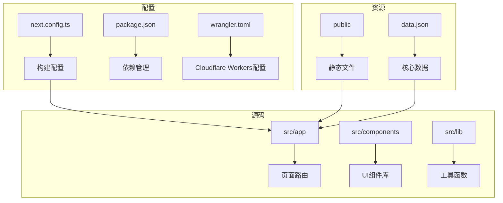

# 部署策略

<cite>
**本文档中引用的文件**   
- [next.config.ts](file://next.config.ts)
- [data.json](file://data.json)
- [public/manifest.json](file://public/manifest.json)
- [src/app/layout.tsx](file://src/app/layout.tsx)
- [package.json](file://package.json)
- [wrangler.toml](file://wrangler.toml)
- [open-next.config.ts](file://open-next.config.ts)
</cite>

## 目录

1. [项目结构分析](#项目结构分析)
2. [Vercel平台部署](#vercel平台部署)
3. [GitHub Pages部署](#github-pages部署)
4. [自托管部署](#自托管部署)
5. [PWA部署](#pwa部署)
6. [生产级运维建议](#生产级运维建议)
7. [部署后验证清单](#部署后验证清单)

## 项目结构分析

本项目采用Next.js框架构建，目录结构清晰，遵循现代前端工程化规范。核心源码位于`src`目录下，包含应用逻辑、组件库、自定义Hook及工具函数。`public`目录存放静态资源和浏览器扩展相关文件，`data.json`为应用的核心数据源，存储VPS服务信息。



**Diagram sources**

- [next.config.ts](file://next.config.ts#L1-L28)
- [data.json](file://data.json#L1-L799)

**Section sources**

- [next.config.ts](file://next.config.ts#L1-L28)
- [data.json](file://data.json#L1-L799)

## Vercel平台部署

### 自动CI/CD集成

Vercel提供开箱即用的CI/CD流水线，通过Git仓库连接实现自动化部署。每次代码推送到指定分支（如main）时，Vercel会自动触发构建流程，执行`next build`并部署到全球边缘网络。

### 环境变量配置

在Vercel控制台的Environment Variables设置中，需配置以下关键变量：

- `NODE_ENV`: 指定运行环境（production/development）
- `NEXT_PUBLIC_BUILD_TIME`: 构建时间戳（由next.config.ts自动生成）
- 其他API密钥或敏感信息

### 自定义域名设置

在Vercel项目设置中添加自定义域名（如onenav.h06i.com），并按照提示完成DNS记录配置（添加CNAME或A记录），Vercel将自动申请并配置SSL证书。

### 边缘函数支持

本项目可通过`open-next.config.ts`配置边缘函数，利用Vercel的Edge Functions实现低延迟的API调用和动态内容渲染，提升全球用户的访问速度。

**Section sources**

- [next.config.ts](file://next.config.ts#L1-L28)
- [open-next.config.ts](file://open-next.config.ts)

## GitHub Pages部署

### next.config.ts配置

为适配GitHub Pages的子路径部署，需在`next.config.ts`中配置`basePath`和`assetPrefix`：

```typescript
const nextConfig: NextConfig = {
  basePath: '/one-nav', // 仓库名称作为基础路径
  assetPrefix: '/one-nav/', // 静态资源前缀
};
```

### 静态文件推送脚本

创建部署脚本`scripts/deploy-gh-pages.mjs`，实现自动化构建和推送：

```javascript
import { execSync } from 'child_process';
import { cpSync, rmSync } from 'fs';

// 清理dist目录
rmSync('dist', { recursive: true, force: true });

// 构建静态站点
execSync('next build && next export', { stdio: 'inherit' });

// 复制文件到gh-pages分支工作区
cpSync('out', '../one-nav-gh-pages', { recursive: true });

// 提交并推送
process.chdir('../one-nav-gh-pages');
execSync('git add .');
execSync('git commit -m "docs: update site"');
execSync('git push');
```

**Section sources**

- [next.config.ts](file://next.config.ts#L1-L28)
- [scripts/build-ext.mjs](file://scripts/build-ext.mjs)

## 自托管部署

### Nginx服务器配置

```nginx
server {
    listen 80;
    server_name onenav.example.com;
    return 301 https://$server_name$request_uri;
}

server {
    listen 443 ssl http2;
    server_name onenav.example.com;

    ssl_certificate /path/to/cert.pem;
    ssl_certificate_key /path/to/privkey.pem;

    root /var/www/one-nav/dist;
    index index.html;

    # 路由重写：支持客户端路由
    location / {
        try_files $uri $uri/ /index.html;
    }

    # MIME类型设置
    location ~* \.(js)$ {
        add_header Content-Type application/javascript;
    }
    location ~* \.(css)$ {
        add_header Content-Type text/css;
    }

    # 缓存头优化
    location ~* \.(jpg|jpeg|png|gif|ico|webp|svg)$ {
        expires 365d;
        add_header Cache-Control "public, immutable";
    }
    location ~* \.(js|css)$ {
        expires 1y;
        add_header Cache-Control "public, immutable";
    }
}
```

### Apache服务器配置

```apache
<VirtualHost *:80>
    ServerName onenav.example.com
    Redirect permanent "/" "https://onenav.example.com/"
</VirtualHost>

<VirtualHost *:443>
    ServerName onenav.example.com
    DocumentRoot "/var/www/one-nav/dist"

    SSLEngine on
    SSLCertificateFile /path/to/cert.pem
    SSLCertificateKeyFile /path/to/privkey.pem

    # 启用重写引擎
    RewriteEngine On

    # 支持客户端路由
    RewriteCond %{REQUEST_FILENAME} !-f
    RewriteCond %{REQUEST_FILENAME} !-d
    RewriteRule ^ index.html [L]

    # 缓存策略
    <FilesMatch "\.(jpg|jpeg|png|gif|ico|webp|svg)$">
        Header set Cache-Control "max-age=31536000, public, immutable"
    </FilesMatch>
    <FilesMatch "\.(js|css)$">
        Header set Cache-Control "max-age=31536000, public, immutable"
    </FilesMatch>
</VirtualHost>
```

**Section sources**

- [next.config.ts](file://next.config.ts#L1-L28)
- [public/manifest.json](file://public/manifest.json)

## PWA部署

### manifest.json配置

`public/manifest.json`已完整配置PWA元数据，包括：

- **name**: 应用名称
- **short_name**: 短名称（桌面图标显示）
- **icons**: 多尺寸图标（支持不同设备）
- **start_url**: 启动URL
- **display**: 显示模式（standalone）
- **theme_color**: 主题色

### Service Worker缓存策略

Next.js自动生成的Service Worker采用以下缓存策略：

- **预缓存**: 构建时生成的静态资源（JS、CSS、图片）
- **运行时缓存**: API请求（通过`next-offline`或自定义逻辑）
- **缓存更新**: 采用"缓存优先，网络回退"策略，确保离线可用性

### data.json更新机制

`data.json`作为核心数据源，在不同环境下的更新策略：

- **开发环境**: 直接修改文件，热重载生效
- **生产环境**: 通过CI/CD流程，与代码版本同步更新
- **动态更新**: 可通过API端点（需配置代理）实现数据热更新

**Section sources**

- [public/manifest.json](file://public/manifest.json#L1-L28)
- [data.json](file://data.json#L1-L799)

## 生产级运维建议

### HTTPS配置

强制启用HTTPS，使用Let's Encrypt等免费证书或云服务商提供的SSL证书。在Nginx/Apache中配置HSTS（HTTP Strict Transport Security）增强安全性。

### CDN集成

将静态资源（`dist`目录）托管到CDN（如Cloudflare、AWS CloudFront），实现全球加速。通过`assetPrefix`配置CDN域名。

### 版本回滚

- **Vercel**: 在Dashboard中选择历史版本进行一键回滚
- **自托管**: 保留历史构建包，通过符号链接切换版本
- **GitHub Pages**: 利用Git版本控制，回退到指定commit并重新部署

### 监控与告警

集成Sentry或LogRocket进行前端错误监控，设置性能指标告警（如LCP、FID超过阈值）。

**Section sources**

- [next.config.ts](file://next.config.ts#L1-L28)
- [wrangler.toml](file://wrangler.toml)

## 部署后验证清单

### Lighthouse评分

使用Chrome DevTools的Lighthouse工具进行评估，目标：

- **性能**: >90分
- **可访问性**: >95分
- **最佳实践**: >95分
- **SEO**: >90分

### 离线访问测试

1. 打开Chrome DevTools → Application → Service Workers
2. 勾选"Offline"模式
3. 刷新页面，验证核心功能是否正常工作

### 书签加载性能

1. 在`data.json`中添加大量书签数据（>1000条）
2. 测试首页加载时间（目标：<2秒）
3. 验证虚拟滚动或分页加载机制是否生效

### 兼容性测试

- **浏览器**: Chrome、Firefox、Safari、Edge最新版
- **移动设备**: iOS Safari、Android Chrome
- **旧版IE**: 通过`ie.html`降级页面提供基本访问能力

**Section sources**

- [data.json](file://data.json#L1-L799)
- [src/app/layout.tsx](file://src/app/layout.tsx#L1-L100)
- [public/ie.html](file://public/ie.html)
