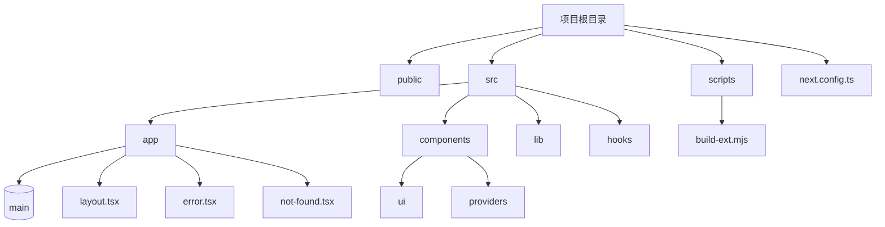

# 构建性能优化

<cite>
**本文档中引用的文件**  
- [next.config.ts](file://next.config.ts)
- [globals.css](file://src/app/globals.css)
- [layout.tsx](file://src/app/layout.tsx)
- [build-ext.mjs](file://scripts/build-ext.mjs)
- [use-mobile.ts](file://src/hooks/use-mobile.ts)
</cite>

## 目录

1. [项目结构分析](#项目结构分析)
2. [构建性能优化策略](#构建性能优化策略)
3. [Next.js 图像优化配置](#nextjs-图像优化配置)
4. [代码分割与懒加载](#代码分割与懒加载)
5. [字体与关键CSS优化](#字体与关键css优化)
6. [资源预加载与预连接](#资源预加载与预连接)
7. [CSS 体积最小化](#css-体积最小化)
8. [性能评估与工具集成](#性能评估与工具集成)

## 项目结构分析

本项目采用 Next.js 框架，结合 React Server Components 和 App Router 架构，整体结构清晰，模块化程度高。主要目录包括：

- `public/`：存放静态资源文件，如图标、清单文件、弹窗页面等。
- `src/app/`：基于 App Router 的页面和布局组件，包含主页面、错误处理、404 页面等。
- `src/components/`：UI 组件库和提供者组件，支持可复用的界面元素。
- `src/hooks/`：自定义 Hook，如 `use-mobile` 用于响应式判断。
- `scripts/`：构建脚本，用于生成 Chrome 扩展包。

项目通过 `next.config.ts` 进行构建配置，支持开发环境代理和生产环境静态导出。



**Diagram sources**

- [next.config.ts](file://next.config.ts#L1-L28)
- [layout.tsx](file://src/app/layout.tsx#L1-L99)

**Section sources**

- [next.config.ts](file://next.config.ts#L1-L28)
- [layout.tsx](file://src/app/layout.tsx#L1-L99)

## 构建性能优化策略

项目在构建层面已实施多项性能优化措施，确保输出高效、轻量且兼容性强。

### 生产环境静态导出

在 `next.config.ts` 中，当环境变量 `NODE_ENV` 为 `production` 时，启用 `output: 'export'`，将应用构建为静态站点，无需服务器支持，适用于部署在 CDN 或静态托管服务上。

```ts
case "production":
  nextConfig.output = "export";
  nextConfig.images = {};
  nextConfig.images.unoptimized = true;
  nextConfig.distDir = "dist";
  break;
```

此配置禁用 Next.js 内置图像优化（`unoptimized = true`），避免在静态导出时依赖运行时图像处理服务，提升构建速度并减少依赖。

### 开发环境代理配置

在开发模式下，通过 `rewrites` 配置代理 API 请求至本地后端服务（`http://localhost:8000`），便于前后端分离开发。

```ts
case "development":
  nextConfig.rewrites = proxy;
  break;
```

### 构建时间注入

构建过程中，使用 `date-fns` 格式化当前时间，并注入为环境变量 `NEXT_PUBLIC_BUILD_TIME`，可用于前端展示构建时间或版本信息。

```ts
process.env.NEXT_PUBLIC_BUILD_TIME = format(new Date(), 'yyyy-MM-dd HH:mm');
```

**Section sources**

- [next.config.ts](file://next.config.ts#L1-L28)

## Next.js 图像优化配置

尽管项目在生产环境中禁用了图像优化（`unoptimized = true`），但在开发或非静态部署场景下，可启用 Next.js 的 `next/image` 组件进行响应式图像生成。

### 启用图像优化

若需启用，可在 `next.config.ts` 中配置 `images` 字段：

```ts
nextConfig.images = {
  domains: ['example.com'],
  deviceSizes: [640, 750, 828, 1080, 1200],
  imageSizes: [16, 32, 48, 64, 96, 128, 384],
};
```

### 响应式图像优势

- 自动生成多种尺寸图像
- 支持 WebP 格式转换
- 懒加载（lazy loading）默认启用
- 减少首屏加载时间

**Section sources**

- [next.config.ts](file://next.config.ts#L1-L28)

## 代码分割与懒加载

Next.js 默认支持代码分割（Code Splitting），每个页面和组件独立打包，按需加载。

### 动态导入（Dynamic Import）

对于非首屏关键组件，可通过 `next/dynamic` 实现懒加载：

```tsx
import dynamic from 'next/dynamic';

const LazyComponent = dynamic(() => import('../components/HeavyComponent'), {
  loading: () => <p>加载中...</p>,
  ssr: false, // 禁用服务端渲染
});
```

### 实际应用

项目中 `Providers` 组件在 `layout.tsx` 中被整体引入，若部分提供者较重，可考虑动态加载。

**Section sources**

- [layout.tsx](file://src/app/layout.tsx#L1-L99)

## 字体与关键CSS优化

### 字体预加载

项目未显式使用自定义字体，但可通过 `<link rel="preload">` 预加载关键字体资源，提升渲染速度。

### 关键CSS内联

Next.js 自动提取并内联关键CSS（Critical CSS），减少渲染阻塞。项目使用 Tailwind CSS 和 `@tailwindcss` 指令，确保样式按需生成。

### CSS 变量与主题

`globals.css` 中定义了大量 CSS 变量，支持深色/浅色主题切换，避免重复样式定义：

```css
:root {
  --background: oklch(1 0 0);
  --foreground: oklch(0.145 0 0);
}

.dark {
  --background: oklch(0.145 0 0);
  --foreground: oklch(0.985 0 0);
}
```

**Section sources**

- [globals.css](file://src/app/globals.css#L1-L123)

## 资源预加载与预连接

### 预连接（Preconnect）

在 `layout.tsx` 的 `<head>` 中，可添加 `preconnect` 提前建立与第三方服务的连接：

```tsx
<link rel="preconnect" href="https://fonts.googleapis.com" />
<link rel="preconnect" href="https://fonts.gstatic.com" crossOrigin="" />
```

### 预加载（Preload）

项目已预加载图标资源：

```tsx
<link rel="apple-touch-icon" href="/apple-touch-icon.png" />
<link rel="icon" href="/favicon.ico" />
<link rel="manifest" href="/site.webmanifest" />
```

### 主题色设置

根据用户偏好设置主题色：

```tsx
<meta name="theme-color" content="#FFFFFF" media="(prefers-color-scheme: light)" />
<meta name="theme-color" content="#000000" media="(prefers-color-scheme: dark)" />
```

**Section sources**

- [layout.tsx](file://src/app/layout.tsx#L31-L99)

## CSS 体积最小化

### 使用 Tailwind CSS 按需生成

项目通过 `@tailwindcss` 指令引入 `base`、`components`、`utilities` 层，结合 PurgeCSS 自动移除未使用样式，显著减小 CSS 体积。

### 避免样式重复

- 使用 CSS 变量统一设计系统
- UI 组件库（`src/components/ui`）封装可复用样式
- 通过 `theme.tsx` 统一主题逻辑

### 示例：按钮组件

```tsx
// src/components/ui/button.tsx
// 所有按钮共享样式，避免重复定义
```

**Section sources**

- [globals.css](file://src/app/globals.css#L1-L123)
- [theme.tsx](file://src/components/providers/theme.tsx)

## 性能评估与工具集成

### Lighthouse 集成建议

1. **启用生产构建**：运行 `NODE_ENV=production next build` 生成静态站点。
2. **部署至线上环境**：使用 Vercel、Netlify 或 GitHub Pages 部署。
3. **运行 Lighthouse 审计**：在 Chrome DevTools 中进行性能、可访问性、SEO 等评估。
4. **优化建议**：
   - 压缩图像资源
   - 启用 Gzip/Brotli 压缩
   - 设置缓存策略
   - 减少第三方脚本

### 构建脚本优化

`scripts/build-ext.mjs` 脚本用于生成 Chrome 扩展包，执行以下操作：

- 复制构建输出
- 重命名 `_next` 为 `next`
- 替换所有路径引用
- 覆盖弹窗静态资源

该脚本确保扩展包路径兼容性，提升加载效率。

**Section sources**

- [build-ext.mjs](file://scripts/build-ext.mjs#L1-L73)
- [layout.tsx](file://src/app/layout.tsx#L31-L99)
