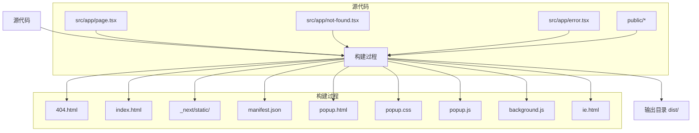
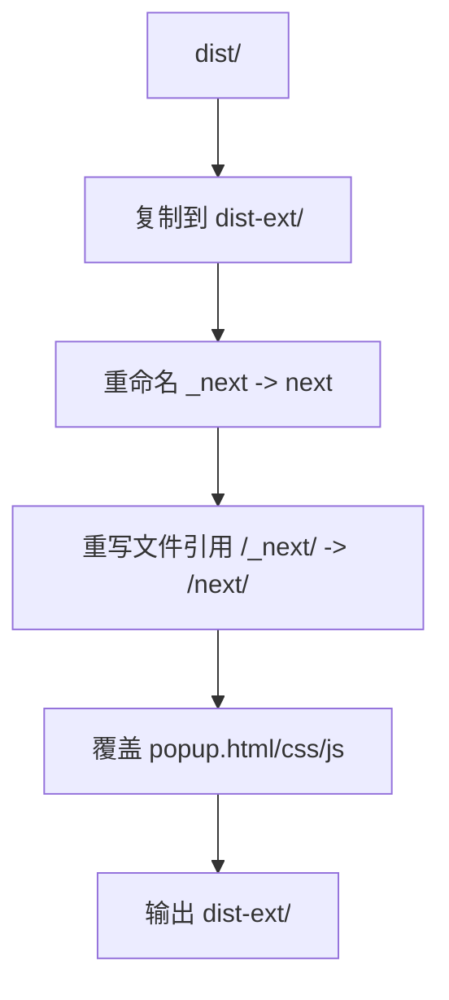

# 构建输出结构

<cite>
**本文档中引用的文件**  
- [next.config.ts](file://next.config.ts)
- [public/manifest.json](file://public/manifest.json)
- [public/popup.html](file://public/popup.html)
- [public/popup.css](file://public/popup.css)
- [public/popup.js](file://public/popup.js)
- [public/background.js](file://public/background.js)
- [public/ie.html](file://public/ie.html)
- [src/app/layout.tsx](file://src/app/layout.tsx)
- [src/app/not-found.tsx](file://src/app/not-found.tsx)
- [src/app/error.tsx](file://src/app/error.tsx)
- [scripts/build-ext.mjs](file://scripts/build-ext.mjs)
- [dist/404.html](file://dist/404.html)
- [dist/_next/static](file://dist/_next/static)
</cite>

## 目录

1. [简介](#简介)
2. [项目结构](#项目结构)
3. [核心组件](#核心组件)
4. [构建输出结构详解](#构建输出结构详解)
5. [静态资源与PWA文件映射](#静态资源与pwa文件映射)
6. [输出文件完整性验证](#输出文件完整性验证)
7. [构建扩展：Chrome插件适配](#构建扩展chrome插件适配)
8. [常见问题与检查清单](#常见问题与检查清单)
9. [结论](#结论)

## 简介

本项目是一个基于Next.js的前端应用，支持静态导出和PWA功能，并可构建为Chrome浏览器扩展。其构建输出目录（`dist/`）由Next.js在生产模式下生成，包含完整的静态网站文件，可用于部署或进一步打包为浏览器扩展。本文档详细解析构建输出结构，说明各文件来源、用途及验证方法。

## 项目结构

项目采用标准的Next.js App Router架构，主要目录包括：

- `public/`：存放静态资源，构建时直接复制到输出目录
- `src/app/`：页面和布局组件，使用React Server Components
- `scripts/`：自定义构建脚本，用于生成浏览器扩展版本

```mermaid
graph TD
A[项目根目录] --> B[public]
A --> C[src/app]
A --> D[scripts]
B --> B1[manifest.json]
B --> B2[popup.html]
B --> B3[popup.css]
B --> B4[popup.js]
B --> B5[background.js]
B --> B6[ie.html]
C --> C1[(main)/page.tsx]
C --> C2[layout.tsx]
C --> C3[not-found.tsx]
C --> C4[error.tsx]
D --> D1[build-ext.mjs]
```

**Diagram sources**

- [next.config.ts](file://next.config.ts#L1-L28)
- [public/manifest.json](file://public/manifest.json#L1-L28)

## 核心组件

### 主布局 (layout.tsx)

定义全局HTML结构、元数据和提供者（Providers），是所有页面的容器。

**Section sources**

- [src/app/layout.tsx](file://src/app/layout.tsx#L1-L100)

### 404页面 (not-found.tsx)

当路由未匹配时显示，提供友好的用户提示和返回首页链接。

**Section sources**

- [src/app/not-found.tsx](file://src/app/not-found.tsx#L1-L16)

### 错误页面 (error.tsx)

捕获客户端运行时错误，提供重试和返回首页选项，使用`use client`指令启用客户端交互。

**Section sources**

- [src/app/error.tsx](file://src/app/error.tsx#L1-L331)

## 构建输出结构详解

根据`next.config.ts`配置，生产环境构建输出目录为`dist/`，通过`output: 'export'`启用静态导出。

### 输出目录结构

```
dist/
├── 404.html
├── _next/
│   └── static/
│       └── [hash]/
│           ├── _buildManifest.js
│           ├── _ssgManifest.js
│           ├── chunks/
│           │   ├── *.js
│           │   └── *.css
│           └── css/
├── manifest.json
├── popup.html
├── popup.css
├── popup.js
├── background.js
├── ie.html
├── favicon-*.png
├── apple-touch-icon.png
├── site.webmanifest
└── index.html
```

### 文件来源与用途

- **`404.html`**：由`not-found.tsx`生成，处理未匹配路由。
- **`_next/static/`**：包含编译后的JavaScript、CSS和构建元数据，文件名含内容哈希以实现缓存。
- **`index.html`**：由`app/(main)/page.tsx`生成的首页。
- **`manifest.json`**：直接从`public/`复制，定义PWA和浏览器扩展元数据。
- **`popup.html/css/js`**：直接从`public/`复制，作为浏览器扩展的弹出界面。
- **`background.js`**：直接从`public/`复制，作为浏览器扩展的后台脚本。
- **`ie.html`**：直接从`public/`复制，用于IE浏览器的降级提示。



**Diagram sources**

- [next.config.ts](file://next.config.ts#L1-L28)
- [src/app/not-found.tsx](file://src/app/not-found.tsx#L1-L16)
- [public/manifest.json](file://public/manifest.json#L1-L28)
- [public/popup.html](file://public/popup.html)
- [public/popup.css](file://public/popup.css)
- [public/popup.js](file://public/popup.js)
- [public/background.js](file://public/background.js)
- [public/ie.html](file://public/ie.html)

## 静态资源与PWA文件映射

### `public/` 目录文件处理

`public/`目录下的所有文件在构建时被**直接复制**到输出根目录，不经过编译或哈希处理。

| 源文件                        | 输出路径                    | 用途                |
| ----------------------------- | --------------------------- | ------------------- |
| `public/manifest.json`        | `dist/manifest.json`        | PWA和浏览器扩展清单 |
| `public/popup.html`           | `dist/popup.html`           | 浏览器扩展弹出页面  |
| `public/popup.css`            | `dist/popup.css`            | 弹出页面样式        |
| `public/popup.js`             | `dist/popup.js`             | 弹出页面脚本        |
| `public/background.js`        | `dist/background.js`        | 扩展后台脚本        |
| `public/ie.html`              | `dist/ie.html`              | IE浏览器降级页面    |
| `public/favicon-*.png`        | `dist/favicon-*.png`        | 网站图标            |
| `public/apple-touch-icon.png` | `dist/apple-touch-icon.png` | Apple触控图标       |
| `public/site.webmanifest`     | `dist/site.webmanifest`     | PWA清单文件         |

**Section sources**

- [public/manifest.json](file://public/manifest.json#L1-L28)
- [public/popup.html](file://public/popup.html)
- [public/popup.css](file://public/popup.css)
- [public/popup.js](file://public/popup.js)
- [public/background.js](file://public/background.js)
- [public/ie.html](file://public/ie.html)

### PWA相关文件

- **`manifest.json`**：定义应用名称、图标、启动URL等，用于PWA安装和浏览器扩展。
- **`site.webmanifest`**：标准PWA清单，由`layout.tsx`中的`<link rel="manifest" href="/site.webmanifest" />`引用。
- **图标文件**：多种尺寸的PNG图标，用于不同设备和场景。

## 输出文件完整性验证

### 关键文件检查清单

开发者应在构建后验证以下文件是否存在且内容正确：

| 文件路径                        | 验证要点                                             |
| ------------------------------- | ---------------------------------------------------- |
| `dist/index.html`               | 是否包含正确的标题和元数据，由`layout.tsx`生成       |
| `dist/404.html`                 | 是否由`not-found.tsx`生成，包含返回首页链接          |
| `dist/_next/static/chunks/*.js` | 是否存在且文件名含哈希，确保缓存                     |
| `dist/manifest.json`            | 是否与`public/manifest.json`一致，包含正确的扩展配置 |
| `dist/popup.html`               | 是否与`public/popup.html`一致，作为扩展入口          |
| `dist/background.js`            | 是否存在，用于扩展后台逻辑                           |

### 验证方法

1. 运行 `npm run build` 或 `pnpm build`
2. 检查 `dist/` 目录是否生成
3. 使用 `ls dist/` 和 `ls dist/_next/static/` 查看文件
4. 打开 `dist/index.html` 在浏览器中预览
5. 检查 `dist/manifest.json` 内容是否符合预期

## 构建扩展：Chrome插件适配

项目包含`scripts/build-ext.mjs`脚本，用于生成Chrome扩展兼容的构建。

### 脚本功能

1. 复制 `dist/` 到 `dist-ext/`
2. 重命名 `_next` 文件夹为 `next`（避免Chrome扩展限制）
3. 重写所有HTML/JS/CSS中对`/_next/`的引用为`/next/`
4. 覆盖 `popup.html/css/js` 为`public/`中的静态版本



**Diagram sources**

- [scripts/build-ext.mjs](file://scripts/build-ext.mjs#L1-L75)

**Section sources**

- [scripts/build-ext.mjs](file://scripts/build-ext.mjs#L1-L75)

### 执行命令

```bash
node scripts/build-ext.mjs
```

成功后输出：`Chrome extension folder ready: dist-ext`

## 常见问题与检查清单

### 常见问题

- **问题**：`dist/` 目录未生成  
  **解决**：确保运行 `npm run build` 且 `next.config.ts` 中 `NODE_ENV=production`
- **问题**：`popup.html` 未更新  
  **解决**：检查 `public/popup.html` 是否存在，且构建脚本正确执行
- **问题**：扩展加载失败，提示`_next`目录  
  **解决**：必须使用 `build-ext.mjs` 脚本生成 `dist-ext/` 版本

### 检查清单

- [ ] `dist/` 目录已生成
- [ ] `dist/index.html` 可正常访问
- [ ] `dist/404.html` 存在且内容正确
- [ ] `dist/_next/static/` 包含哈希化资源文件
- [ ] `dist/manifest.json` 与源文件一致
- [ ] `dist/popup.html` 与 `public/popup.html` 一致
- [ ] 运行 `node scripts/build-ext.mjs` 成功生成 `dist-ext/`

## 结论

本项目构建输出结构清晰，`dist/` 目录包含完整的静态网站，可直接部署。通过`public/`目录直接复制静态资源，确保PWA和浏览器扩展文件的完整性。自定义脚本`build-ext.mjs`解决了Chrome扩展对`_next`目录的限制，实现了从Web应用到浏览器扩展的无缝转换。开发者应使用检查清单验证输出文件，确保部署和扩展打包的成功。
