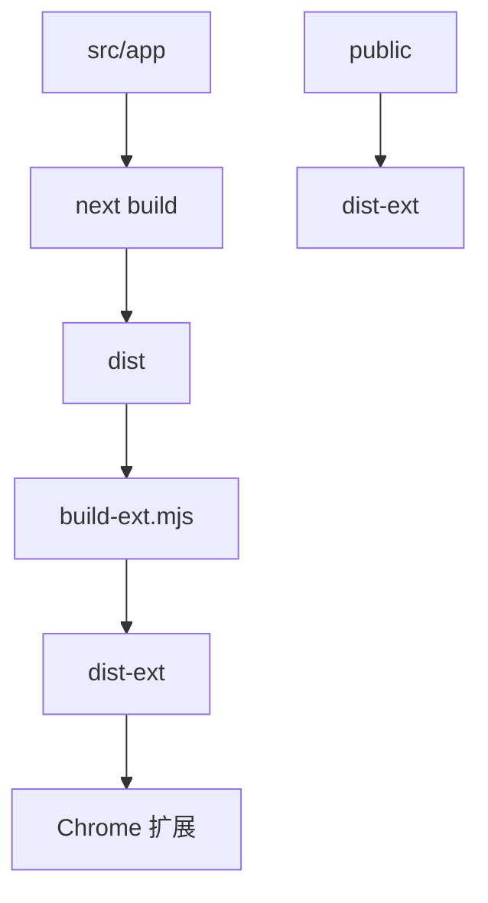
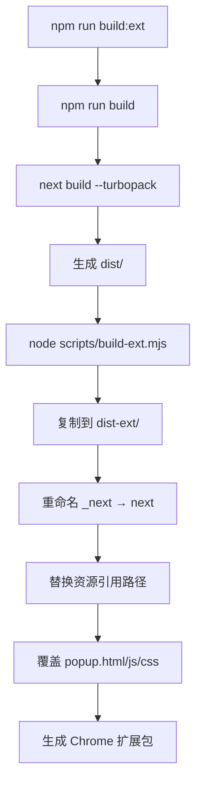

# 构建配置

<cite>
**本文档引用的文件**  
- [next.config.ts](file://next.config.ts)
- [package.json](file://package.json)
- [open-next.config.ts](file://open-next.config.ts)
- [scripts/build-ext.mjs](file://scripts/build-ext.mjs)
- [src/components/build-info.tsx](file://src/components/build-info.tsx)
- [src/app/layout.tsx](file://src/app/layout.tsx)
</cite>

## 目录

1. [项目结构](#项目结构)
2. [核心构建配置](#核心构建配置)
3. [静态导出模式详解](#静态导出模式详解)
4. [环境变量与构建时间注入](#环境变量与构建时间注入)
5. [构建脚本分析](#构建脚本分析)
6. [扩展构建流程](#扩展构建流程)
7. [配置验证与常见问题](#配置验证与常见问题)

## 项目结构

本项目采用标准的 Next.js 应用结构，结合静态导出与浏览器扩展构建流程。主要目录包括：

- `src/app`：基于 App Router 的页面和布局组件
- `public`：静态资源文件，如图标、清单文件等
- `scripts`：自定义构建脚本，用于生成扩展包
- `dist`：生产构建输出目录
- `dist-ext`：扩展专用构建输出目录

项目通过 `next.config.ts` 配置构建行为，并在 `package.json` 中定义了完整的构建与部署脚本链。



**Diagram sources**

- [next.config.ts](file://next.config.ts#L1-L27)
- [scripts/build-ext.mjs](file://scripts/build-ext.mjs#L0-L73)

**Section sources**

- [next.config.ts](file://next.config.ts#L1-L27)
- [package.json](file://package.json#L1-L142)

## 核心构建配置

`next.config.ts` 文件定义了项目的核心构建逻辑，根据运行环境动态调整配置。

### 静态导出配置（生产环境）

当 `NODE_ENV` 为 `production` 时，启用静态导出模式：

- `output: 'export'`：生成静态 HTML 文件，不支持服务端渲染（SSR）和 API Routes
- `images.unoptimized: true`：禁用 Next.js 图像优化，适用于静态部署
- `distDir: 'dist'`：指定构建输出目录为 `dist`

### 开发环境配置

在开发模式下，配置请求重写规则，将 `/api/*` 请求代理到本地后端服务：

- `rewrites`：通过 `proxy` 函数将 API 请求转发至 `http://localhost:8000`

```typescript
switch (process.env.NODE_ENV) {
  case 'production':
    nextConfig.output = 'export';
    nextConfig.images = {};
    nextConfig.images.unoptimized = true;
    nextConfig.distDir = 'dist';
    break;
  case 'development':
    nextConfig.rewrites = proxy;
    break;
}
```

**Section sources**

- [next.config.ts](file://next.config.ts#L10-L25)

## 静态导出模式详解

### 静态导出的含义

设置 `output: 'export'` 后，Next.js 将构建一个完全静态的网站，所有页面在构建时生成 HTML 文件，无需 Node.js 服务器运行。

### 限制与注意事项

- **不支持 API Routes**：无法使用 `/pages/api` 或 `/app/api` 路由
- **不支持服务端组件**：所有组件必须为客户端或静态生成
- **不支持动态路由的运行时生成**：所有动态路由必须通过 `generateStaticParams` 预生成

### 图像配置

```ts
nextConfig.images = {};
nextConfig.images.unoptimized = true;
```

此配置禁用 Next.js 的图像优化功能，适用于静态托管环境（如 CDN 或扩展包），避免因缺少服务端支持而导致图像加载失败。

**Section sources**

- [next.config.ts](file://next.config.ts#L12-L14)

## 环境变量与构建时间注入

项目在构建时动态注入构建时间戳，供前端显示。

### 构建时间注入逻辑

```ts
process.env.NEXT_PUBLIC_BUILD_TIME = format(new Date(), 'yyyy-MM-dd HH:mm');
```

该行代码在构建过程中将当前时间格式化后注入环境变量 `NEXT_PUBLIC_BUILD_TIME`，可在客户端通过 `process.env.NEXT_PUBLIC_BUILD_TIME` 访问。

### 前端使用示例

`src/components/build-info.tsx` 组件在客户端打印构建信息：

```tsx
useEffect(() => {
  print('build time', `${process.env.NEXT_PUBLIC_BUILD_TIME}`);
}, []);
```

此组件在页面加载时输出应用名称、版本和构建时间至控制台，便于版本追踪与调试。

**Section sources**

- [next.config.ts](file://next.config.ts#L27)
- [src/components/build-info.tsx](file://src/components/build-info.tsx#L0-L19)

## 构建脚本分析

`package.json` 中定义了完整的构建流程：

```json
"scripts": {
  "dev": "next dev --turbopack",
  "build": "next build --turbopack",
  "build:ext": "npm run build && node scripts/build-ext.mjs",
  "start": "next start",
  "preview": "opennextjs-cloudflare build && opennextjs-cloudflare preview",
  "deploy": "opennextjs-cloudflare build && opennextjs-cloudflare deploy"
}
```

### 核心构建命令

- `build`：使用 Turbopack 构建生产版本，输出至 `dist` 目录
- `build:ext`：先执行 `build`，再运行 `build-ext.mjs` 脚本生成扩展包

### 构建流程图



**Diagram sources**

- [package.json](file://package.json#L5-L12)
- [scripts/build-ext.mjs](file://scripts/build-ext.mjs#L0-L73)

**Section sources**

- [package.json](file://package.json#L5-L12)

## 扩展构建流程

`scripts/build-ext.mjs` 脚本负责将标准构建输出转换为浏览器扩展可用格式。

### 主要功能

1. **目录复制**：将 `dist/` 复制到 `dist-ext/`
2. **路径重命名**：将 `_next` 目录重命名为 `next`
3. **路径替换**：在 HTML、CSS、JS 文件中替换所有 `/_next/` 为 `/next/`
4. **弹窗覆盖**：用 `public/` 下的静态文件替换生成的弹窗资源

### 路径替换逻辑

```js
.replaceAll('/_next/', '/next/')
.replaceAll('./_next/', './next/')
.replaceAll('"/_next/', '"/next/')
.replaceAll("'/_next/", "'/next/");
```

此逻辑确保扩展内资源引用正确，避免因 `_next` 目录名下划线导致的扩展加载问题。

**Section sources**

- [scripts/build-ext.mjs](file://scripts/build-ext.mjs#L31-L73)

## 配置验证与常见问题

### 验证静态导出是否生效

1. 检查 `dist` 目录是否存在 `404.html`、`index.html` 等静态文件
2. 确认无 `server.js` 或 `.next/server` 目录
3. 检查 `dist/_next` 是否存在（应为静态资源）

### 常见配置错误

- **未设置 `output: 'export'`**：导致构建残留 SSR 文件，无法静态部署
- **忘记设置 `images.unoptimized`**：图像优化功能在静态环境中失效
- **API Routes 未移除**：在静态导出模式下会导致构建警告或失败

### 验证构建时间注入

在浏览器控制台执行：

```js
console.log('构建时间:', process.env.NEXT_PUBLIC_BUILD_TIME);
```

应输出与构建时匹配的时间戳。

**Section sources**

- [next.config.ts](file://next.config.ts#L1-L27)
- [src/components/build-info.tsx](file://src/components/build-info.tsx#L0-L19)
