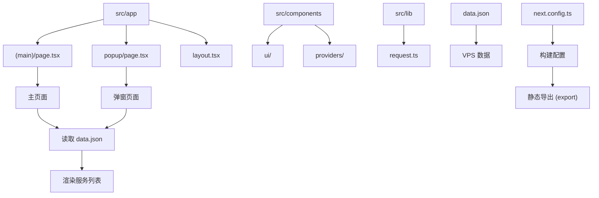

# 构建问题排查

<cite>
**本文档引用的文件**  
- [next.config.ts](file://next.config.ts#L1-L29)
- [data.json](file://data.json#L1-L1094)
- [page.tsx](file://src/app/(main)/page.tsx#L1-L4)
- [popup/page.tsx](file://src/app/popup/page.tsx#L1-L3)
- [request.ts](file://src/lib/request.ts)
</cite>

## 目录

1. [简介](#简介)
2. [项目结构分析](#项目结构分析)
3. [静态构建配置分析](#静态构建配置分析)
4. [数据加载与静态生成](#数据加载与静态生成)
5. [常见构建错误及解决方案](#常见构建错误及解决方案)
6. [性能优化建议](#性能优化建议)
7. [总结](#总结)

## 简介

本文档旨在为基于 Next.js 的 `one-nav` 项目提供全面的构建问题排查指南。重点分析在静态构建（Static Site Generation, SSG）过程中可能出现的典型错误，包括动态路由未实现 `generateStaticParams`、外部 API 调用未降级、静态资源路径或格式错误等。通过分析项目配置和数据结构，提供具体的错误定位方法和修复方案，并结合 Next.js 最佳实践给出性能优化建议。

## 项目结构分析

`one-nav` 项目采用 Next.js App Router 架构，其核心结构如下：

- `src/app`：包含应用的主要页面和布局，使用 `(main)` 和 `popup` 命名路由组。
- `src/components`：存放可复用的 UI 组件和提供者（Providers）。
- `src/lib`：存放工具函数和请求逻辑。
- `public`：存放静态资源文件。
- `data.json`：作为应用的核心数据源，存储 VPS 服务信息。
- `next.config.ts`：Next.js 的核心配置文件，决定了构建行为。

该结构清晰地分离了视图、组件、逻辑和配置，符合现代前端应用的最佳实践。



**Diagram sources**

- [next.config.ts](file://next.config.ts#L1-L29)
- [data.json](file://data.json#L1-L1094)
- [src/app/(main)/page.tsx](<file://src/app/(main)/page.tsx#L1-L4>)
- [src/app/popup/page.tsx](file://src/app/popup/page.tsx#L1-L3)

**Section sources**

- [next.config.ts](file://next.config.ts#L1-L29)
- [data.json](file://data.json#L1-L1094)

## 静态构建配置分析

项目的 `next.config.ts` 文件是决定构建模式的关键。通过分析其内容，可以明确构建行为。

```typescript
import { format } from 'date-fns';
import { NextConfig } from 'next';

const nextConfig: NextConfig = {};

// ... 代理配置 ...

switch (process.env.NODE_ENV) {
  case 'production':
    nextConfig.output = 'export'; // 关键配置：启用静态导出
    nextConfig.images = {};
    nextConfig.images.unoptimized = true; // 关键配置：禁用图片优化
    nextConfig.distDir = 'dist';
    break;
  // ... development 配置 ...
}

process.env.NEXT_PUBLIC_BUILD_TIME = format(new Date(), 'yyyy-MM-dd HH:mm');
export default nextConfig;
```

**关键配置项分析**：

- **`output: "export"`**：此配置强制 Next.js 使用 `next export` 模式进行构建。这意味着所有页面都必须在构建时生成为静态 HTML 文件。任何依赖于服务器端运行时（如 `getServerSideProps`）的功能都将失效。
- **`images.unoptimized = true`**：禁用了 Next.js 的内置图片优化功能。这通常是因为在静态导出模式下，无法在构建时动态生成不同尺寸的图片。虽然这简化了构建，但也意味着所有图片都将以原始大小提供，可能影响性能。
- **`distDir: "dist"`**：指定构建输出目录为 `dist`，而非默认的 `out`。

**Section sources**

- [next.config.ts](file://next.config.ts#L1-L29)

## 数据加载与静态生成

在静态导出模式下，数据获取必须在构建时完成。`one-nav` 项目通过 `data.json` 文件作为数据源，这是一种典型的静态数据管理方式。

### 数据文件分析

`data.json` 文件是一个包含多个 VPS 服务信息的数组。每个对象包含 `platform`, `plan_name`, `cpu`, `ram` 等字段。该文件在构建时被直接读取，确保了数据的静态性。

### 页面数据获取

主页面 `src/app/(main)/page.tsx` 和弹窗页面 `src/app/popup/page.tsx` 都需要从 `data.json` 加载数据。在静态构建中，正确的做法是在页面组件内部同步导入或使用 `fs` 模块读取该文件。

**正确示例（伪代码）**：

```tsx
// src/app/page.tsx
import data from '../../data.json';

// 在构建时被解析

export default function Page() {
  return (
    <div>
      {data.map((item) => (
        <div key={item.plan_name}>{item.plan_name}</div>
      ))}
    </div>
  );
}
```

如果使用 `fetch` 或 `axios` 等网络请求库从 `/data.json` 获取数据，即使该文件存在于 `public` 目录，也可能会在构建时失败，因为 `next export` 期望所有数据在构建时可用，而不是在运行时通过网络请求获取。

**Section sources**

- [data.json](file://data.json#L1-L1094)
- [src/app/(main)/page.tsx](<file://src/app/(main)/page.tsx#L1-L4>)
- [src/app/popup/page.tsx](file://src/app/popup/page.tsx#L1-L3)

## 常见构建错误及解决方案

### 1. 动态路由未实现 `generateStaticParams`

**问题描述**：如果项目中存在基于参数的动态路由（如 `[id].tsx`），但在 `production` 模式下未实现 `generateStaticParams` 函数，`next export` 将无法确定需要生成哪些具体的 HTML 文件，从而导致构建失败。

**错误日志**：

```
Error: Page with dynamic route requires "generateStaticParams" method.
```

**解决方案**：为动态路由页面实现 `generateStaticParams` 函数，返回所有可能的参数组合。

```tsx
// src/app/product/[id]/page.tsx
import data from '../../../data.json';

export async function generateStaticParams() {
  return data.map((item) => ({
    id: item.plan_name, // 假设 id 是 plan_name
  }));
}

export default function ProductPage({ params }) {
  const product = data.find((item) => item.plan_name === params.id);
  return <div>{product?.plan_name}</div>;
}
```

### 2. 外部 API 调用未降级

**问题描述**：`src/lib/request.ts` 文件很可能封装了网络请求逻辑。如果在页面组件中直接调用此文件发起对远程 API 的请求，`next export` 会因无法在构建时执行网络请求而中断。

**错误日志**：

```
Error: fetch failed
```

**解决方案**：在 `production` 环境下，必须将外部 API 调用降级为读取本地静态数据。

```tsx
// src/lib/request.ts
const API_URL = 'https://api.example.com/vps';

export async function getVPSData() {
  // 在开发环境下使用代理
  if (process.env.NODE_ENV === 'development') {
    const res = await fetch('/api/vps');
    return res.json();
  }
  // 在生产环境下读取本地 data.json
  if (process.env.NODE_ENV === 'production') {
    // 使用动态导入或 require 读取本地文件
    const data = await import('../../data.json');
    return data.default;
  }
}
```

### 3. `data.json` 路径或格式错误

**问题描述**：如果 `data.json` 文件不存在于预期路径，或其 JSON 格式不正确（如缺少逗号、引号错误），在构建时导入或读取该文件会抛出异常，导致构建失败。

**错误日志**：

```
Error: Cannot find module '../../data.json'
SyntaxError: Unexpected token } in JSON at position 100
```

**解决方案**：

1. **验证路径**：确保 `data.json` 位于项目根目录，且导入路径正确。
2. **验证格式**：使用在线 JSON 验证工具或 IDE 的语法检查功能，确保 `data.json` 是有效的 JSON。
3. **添加错误处理**：

```tsx
export async function getVPSData() {
  try {
    const data = await import('../../data.json');
    return data.default;
  } catch (error) {
    console.error('Failed to load data.json:', error);
    return []; // 返回默认空数组，避免构建中断
  }
}
```

## 性能优化建议

### 1. 图片优化

当前配置 `images.unoptimized = true` 会显著影响页面加载性能。建议：

- **启用图片优化**：移除 `unoptimized: true` 配置。
- **使用 `next/image`**：将所有 `` 标签替换为 `next/image` 组件，并指定 `width` 和 `height`。
- **提供静态图片**：将 `data.json` 中的 `test_address` 替换为指向 `public` 目录下的实际图片路径。

### 2. 资源压缩与代码分割

- **启用 Gzip/Brotli**：确保部署服务器（如 Nginx）启用了 Gzip 或 Brotli 压缩。
- **利用代码分割**：Next.js 默认支持代码分割，确保组件按需加载。

### 3. 数据预处理

对于大型 `data.json` 文件，可以在构建时进行预处理，例如：

- **移除未使用字段**：只保留页面渲染所需的字段。
- **生成索引**：为搜索功能创建轻量级索引。
- **分页数据**：如果列表过长，可考虑生成分页的静态文件。

## 总结

`one-nav` 项目的静态构建成功与否，关键在于确保所有数据和路由在构建时是确定和可用的。核心要点包括：

1. **严格遵守 SSG 规则**：避免在构建时执行任何异步网络请求。
2. **正确配置 `next.config.ts`**：明确 `output: "export"` 和图片优化策略。
3. **妥善管理静态数据**：确保 `data.json` 文件路径正确、格式有效，并在代码中安全地读取。
4. **处理动态路由**：为任何动态路由实现 `generateStaticParams`。
5. **关注性能**：在静态导出的限制下，尽可能利用 Next.js 的优化功能，特别是图片优化。

通过遵循以上指南，可以有效排查和解决 `one-nav` 项目在静态构建过程中遇到的绝大多数问题。
