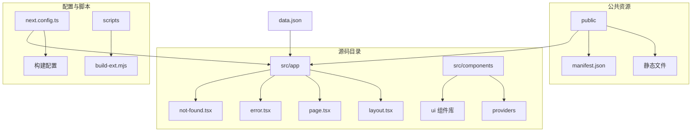
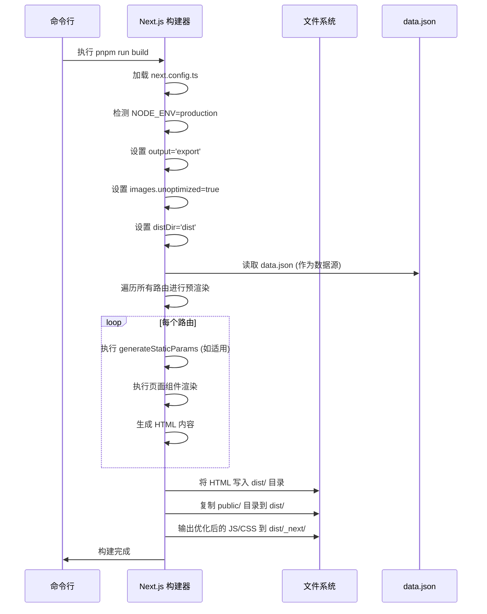

# 静态构建

<cite>
**本文档中引用的文件**   
- [next.config.ts](file://next.config.ts)
- [data.json](file://data.json)
- [package.json](file://package.json)
- [layout.tsx](file://src/app/layout.tsx)
- [page.tsx](file://src/app/(main)/page.tsx)
</cite>

## 目录

1. [静态构建](#静态构建)
2. [项目结构分析](#项目结构分析)
3. [核心配置文件分析](#核心配置文件分析)
4. [构建流程详解](#构建流程详解)
5. [数据集成与预渲染](#数据集成与预渲染)
6. [输出目录结构](#输出目录结构)
7. [常见构建问题排查](#常见构建问题排查)
8. [性能优化实践](#性能优化实践)

## 项目结构分析

本项目采用 Next.js App Router 架构，结合现代前端工程化工具链，构建一个静态书签导航应用。项目结构清晰，遵循功能模块化组织原则。



**图示来源**

- [next.config.ts](file://next.config.ts#L1-L28)
- [data.json](file://data.json#L1-L1094)
- [src/app/layout.tsx](file://src/app/layout.tsx#L1-L101)
- [src/app/(main)/page.tsx](<file://src/app/(main)/page.tsx#L1-L4>)

**本节来源**

- [next.config.ts](file://next.config.ts#L1-L28)
- [data.json](file://data.json#L1-L1094)
- [package.json](file://package.json#L1-L143)

## 核心配置文件分析

### next.config.ts 配置解析

`next.config.ts` 是 Next.js 应用的核心配置文件，决定了构建行为和运行时特性。

```typescript
import { format } from 'date-fns';
import { NextConfig } from 'next';

const nextConfig: NextConfig = {};

const proxy = async () => {
  return [
    {
      source: '/api/:path*',
      destination: 'http://localhost:8000/api/:path*',
    },
  ];
};

switch (process.env.NODE_ENV) {
  case 'production':
    nextConfig.output = 'export';
    nextConfig.images = {};
    nextConfig.images.unoptimized = true;
    nextConfig.distDir = 'dist';
    break;
  case 'development':
    nextConfig.rewrites = proxy;
    break;
}

process.env.NEXT_PUBLIC_BUILD_TIME = format(new Date(), 'yyyy-MM-dd HH:mm');

export default nextConfig;
```

**关键配置项说明：**

- **output: 'export'**：在生产环境中启用静态导出模式，将应用构建为完全静态的 HTML 文件，无需 Node.js 服务器即可运行。
- **images.unoptimized: true**：禁用 Next.js 图像优化，因为静态站点无法运行优化服务。所有图像将以原始形式提供。
- **distDir: "dist"**：指定构建输出目录为 `dist`，而非默认的 `.next`。
- **rewrites (开发环境)**：在开发模式下设置代理重写规则，将 `/api/*` 请求代理到本地后端服务 `http://localhost:8000/api/*`。
- **构建时间注入**：使用 `date-fns` 格式化当前时间，并通过环境变量 `NEXT_PUBLIC_BUILD_TIME` 注入到客户端，可用于显示构建信息。

**本节来源**

- [next.config.ts](file://next.config.ts#L1-L28)

### package.json 构建脚本分析

`package.json` 中定义了完整的构建流程：

```json
"scripts": {
  "dev": "next dev --turbopack",
  "build": "next build --turbopack",
  "build:ext": "npm run build && node scripts/build-ext.mjs",
  "start": "next start"
}
```

- **build**：使用 Turbopack 进行构建，利用其增量编译优势提升构建速度。
- **build:ext**：完整构建流程，先执行 `build`，然后运行 `scripts/build-ext.mjs` 脚本，可能用于生成浏览器扩展相关文件。

**本节来源**

- [package.json](file://package.json#L5-L10)

## 构建流程详解

执行 `pnpm run build` 命令时，Next.js 会启动静态构建流程，主要包含以下阶段：

### 1. 预渲染阶段 (Pre-rendering)

- **静态生成 (Static Generation)**：Next.js 会遍历所有路由，使用 `getStaticProps` 或 `generateStaticParams`（App Router）预渲染每个页面为 HTML。
- **动态路由处理**：对于动态路由，必须通过 `generateStaticParams` 提供所有可能的参数组合，否则构建会失败。
- **元数据生成**：根据 `layout.tsx` 中的 `metadata` 配置，生成页面的 `<head>` 内容，包括标题、描述、Open Graph 标签等。

### 2. 资源优化阶段 (Resource Optimization)

- **代码分割 (Code Splitting)**：JavaScript 代码被分割成多个 chunk，实现按需加载，减少首屏加载时间。
- **CSS 提取与内联**：Tailwind CSS 被处理并提取，关键 CSS 可能被内联以提升性能。
- **字体与图标处理**：静态资源如字体、图标被复制到输出目录。

### 3. 静态文件生成阶段 (Static File Generation)

- **HTML 生成**：每个路由生成对应的 `.html` 文件。
- **资源复制**：`public` 目录下的所有文件被直接复制到输出目录根路径。
- **清单文件生成**：生成 `buildManifest.js` 和 `ssgManifest.js`，用于客户端路由和静态生成的元数据。



**图示来源**

- [next.config.ts](file://next.config.ts#L1-L28)
- [data.json](file://data.json#L1-L1094)
- [src/app/layout.tsx](file://src/app/layout.tsx#L1-L101)

**本节来源**

- [next.config.ts](file://next.config.ts#L1-L28)
- [package.json](file://package.json#L7-L8)

## 数据集成与预渲染

### data.json 作为预渲染数据源

`data.json` 文件在本项目中扮演着核心数据源的角色，存储了 VPS 服务提供商的详细信息。

```json
[
  {
    "platform": "bwg",
    "plan_name": "日本东京限量版",
    "cpu": "1核",
    "ram": "1GB",
    "disk": "20GB",
    "monthly_traffic": "500GB",
    "bandwidth": "2.5Gbps",
    "data_center": "日本东京 DC39v2，三网直连",
    "price_per_year": "$79",
    "test_address": "https://dc39.bwg.net",
    "stock_status": false,
    "purchase_link": "https://www.bandwagonhost.net/1215.html"
  }
  // ... 更多数据
]
```

在 App Router 中，可以通过 `generateStaticParams` 和服务器组件直接读取 `data.json` 来预渲染页面：

```tsx
// 示例：在服务器组件中使用
import data from '@/data.json';

export default function Page() {
  return (
    <div>
      {data.map((item, index) => (
        <div key={index}>
          <h2>{item.plan_name}</h2>
          <p>价格: {item.price_per_year}</p>
          <p>库存: {item.stock_status ? '有货' : '缺货'}</p>
        </div>
      ))}
    </div>
  );
}
```

**本节来源**

- [data.json](file://data.json#L1-L1094)
- [src/app/(main)/page.tsx](<file://src/app/(main)/page.tsx#L1-L4>)

## 输出目录结构

构建完成后，输出目录（`dist/`）的结构如下：

```
dist/
├── _next/
│   ├── static/
│   │   ├── chunks/           # 代码分割后的 JavaScript chunks
│   │   └── ...               # 其他静态资源
│   ├── buildManifest.js      # 构建清单
│   └── ssgManifest.js        # 静态生成清单
├── background.js             # 从 public 复制
├── ie.html                   # 从 public 复制
├── index.html                # 主页 HTML
├── manifest.json             # 从 public 复制
├── popup.css                 # 从 public 复制
├── popup.html                # 从 public 复制
├── popup.js                  # 从 public 复制
└── ...                       # 其他 public 文件和路由 HTML
```

**验证文件完整性：**

1. 检查 `dist/` 目录是否存在且非空。
2. 确认 `index.html` 和其他关键页面 HTML 文件已生成。
3. 验证 `_next/` 目录包含必要的 JS 和 CSS 资源。
4. 使用 `npx serve -s dist` 本地启动服务器，测试所有链接和功能。

**本节来源**

- [next.config.ts](file://next.config.ts#L14-L15)
- [public](file://public)

## 常见构建问题排查

### 1. 动态路由未配置 `generateStaticParams`

**错误信息**：`Error: Page with dynamic route requires "generateStaticParams" method`

**解决方案**：为动态路由的 `page.tsx` 添加 `generateStaticParams` 函数，返回所有可能的参数组合。

### 2. 使用了不支持静态导出的 API

**问题**：使用了 `getServerSideProps` 或 `appDir: true` 时的服务器端逻辑。

**解决方案**：改用 `generateStaticParams` 和 `async` 服务器组件从 `data.json` 或外部 API（在构建时）获取数据。

### 3. 外部资源未配置

**问题**：图像优化 (`next/image`) 在静态导出中默认禁用。

**解决方案**：已在 `next.config.ts` 中通过 `images.unoptimized = true` 解决，确保所有图像使用普通 `` 标签或配置 `remotePatterns`。

### 4. 环境变量未正确注入

**问题**：客户端无法访问环境变量。

**解决方案**：确保变量名以 `NEXT_PUBLIC_` 开头（如 `NEXT_PUBLIC_BUILD_TIME`）。

**本节来源**

- [next.config.ts](file://next.config.ts#L12-L18)

## 性能优化实践

### 1. 图像优化替代方案

由于 `images.unoptimized = true`，应：

- 使用 WebP 或 AVIF 格式预压缩图像。
- 在 `public` 目录中提供多种尺寸的图像，根据需要手动选择。

### 2. 代码分割与懒加载

- Next.js 自动进行代码分割。
- 对于大型组件，可使用 `dynamic` 进行懒加载：
  ```ts
  const HeavyComponent = dynamic(() => import('@/components/HeavyComponent'));
  ```

### 3. 字体与关键资源预加载

- 在 `layout.tsx` 的 `<head>` 中使用 `<link rel="preload">` 预加载关键字体或脚本。
- 利用 `next/script` 组件控制脚本加载策略。

### 4. 利用 Turbopack

- `--turbopack` 标志利用 Rust 编写的 Turbopack，显著提升开发和构建速度，尤其在大型项目中。

**本节来源**

- [next.config.ts](file://next.config.ts#L12-L13)
- [layout.tsx](file://src/app/layout.tsx#L1-L101)
- [package.json](file://package.json#L7-L8)
