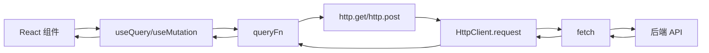
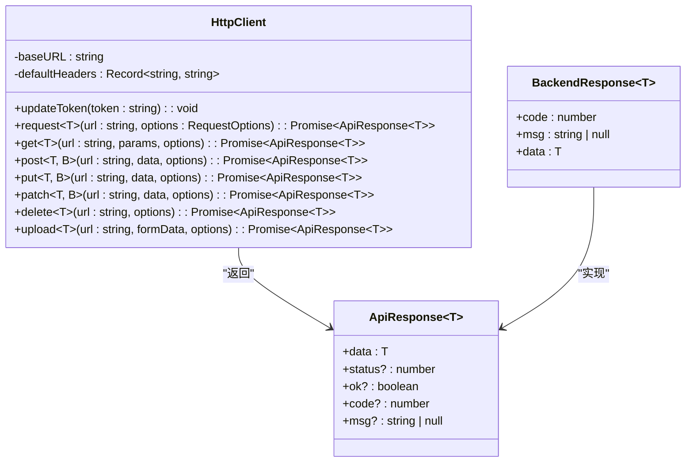
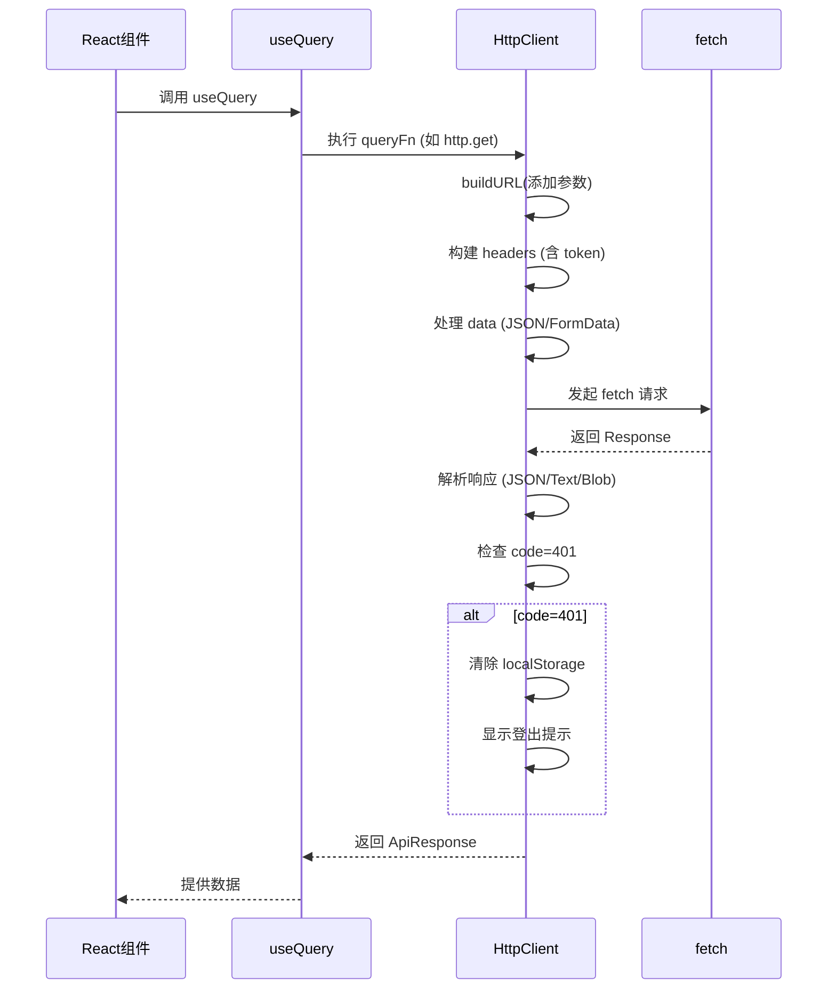
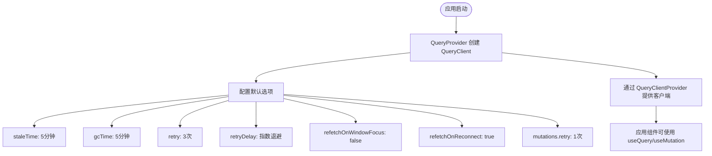
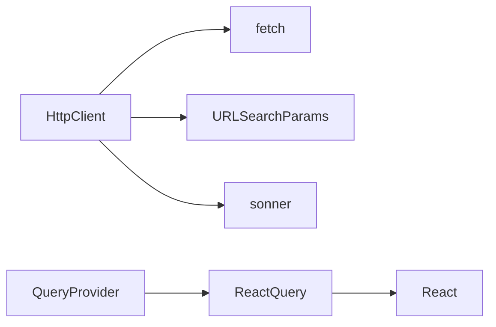

# HTTP 客户端集成

<cite>
**本文档引用的文件**  
- [request.ts](file://src/lib/request.ts)
- [query.tsx](file://src/components/providers/query.tsx)
</cite>

## 目录

1. [简介](#简介)
2. [项目结构](#项目结构)
3. [核心组件](#核心组件)
4. [架构概览](#架构概览)
5. [详细组件分析](#详细组件分析)
6. [依赖分析](#依赖分析)
7. [性能考量](#性能考量)
8. [故障排除指南](#故障排除指南)
9. [结论](#结论)

## 简介

本文档深入解析 `one-nav` 项目中基于 `fetch` 封装的强类型 HTTP 客户端如何与 React Query 协同工作。重点分析 `http.get`、`http.post` 等方法的设计原理，包括请求拦截、认证 token 自动注入、Content-Type 处理、FormData 序列化等机制。同时说明响应数据的统一解析流程及错误标准化处理（如 401 自动登出、500 降级提示），并展示该客户端如何作为 `queryFn` 的基础支撑，实现 `useQuery` 和 `useMutation` 的数据获取与提交。

## 项目结构

项目采用典型的 Next.js 应用结构，核心代码位于 `src` 目录下。HTTP 客户端相关逻辑集中在 `src/lib/request.ts`，而 React Query 的配置则在 `src/components/providers/query.tsx` 中完成。整体结构清晰，分层明确。

```mermaid
graph TB
subgraph "核心逻辑"
request[request.ts]
query[query.tsx]
end
subgraph "应用层"
app[app/]
components[components/]
end
request --> query : "提供 http 实例"
query --> app : "为应用提供 QueryClient"
```

**图示来源**

- [request.ts](file://src/lib/request.ts)
- [query.tsx](file://src/components/providers/query.tsx)

**本节来源**

- [request.ts](file://src/lib/request.ts)
- [query.tsx](file://src/components/providers/query.tsx)

## 核心组件

`HttpClient` 类是整个 HTTP 通信的核心，它封装了 `fetch` API，提供了强类型、可复用的请求方法。通过 `http` 实例暴露 `get`、`post` 等便捷方法，极大简化了网络请求的调用。

**本节来源**

- [request.ts](file://src/lib/request.ts#L15-L190)

## 架构概览

系统通过 `HttpClient` 统一管理所有 API 请求，结合 React Query 实现数据的获取、缓存、同步和更新。React Query 负责状态管理，而 `HttpClient` 负责底层通信。



**图示来源**

- [request.ts](file://src/lib/request.ts)
- [query.tsx](file://src/components/providers/query.tsx)

## 详细组件分析

### HttpClient 类分析

`HttpClient` 类封装了所有 HTTP 请求的通用逻辑，确保请求的一致性和安全性。

#### 类结构与方法



**图示来源**

- [request.ts](file://src/lib/request.ts#L15-L190)

#### 请求流程分析



**图示来源**

- [request.ts](file://src/lib/request.ts#L15-L190)

**本节来源**

- [request.ts](file://src/lib/request.ts#L15-L190)

### 请求拦截与处理机制

`HttpClient` 在请求和响应阶段实现了多种自动化处理。

#### 请求拦截器功能

- **URL 构建**: `buildURL` 方法自动拼接 baseURL 和查询参数。
- **Header 注入**: 自动添加 `Content-Type: application/json`，支持通过 `updateToken` 动态注入认证 token。
- **数据序列化**: 自动将 `data` 字段序列化为 JSON 字符串，若为 `FormData` 则自动删除 `Content-Type` 头。

#### 响应处理与错误标准化

- **响应解析**: 根据 `Content-Type` 自动解析 JSON、文本或 Blob 数据。
- **错误处理**: 捕获网络异常，统一抛出错误。
- **业务状态码处理**: 识别后端返回的 `code` 字段，对 `401` 状态码执行自动登出并清除本地数据。

**本节来源**

- [request.ts](file://src/lib/request.ts#L15-L190)

### React Query 集成分析

`QueryProvider` 组件为整个应用提供了配置好的 `QueryClient`，实现了与 `HttpClient` 的无缝集成。



**图示来源**

- [query.tsx](file://src/components/providers/query.tsx#L1-L45)

**本节来源**

- [query.tsx](file://src/components/providers/query.tsx#L1-L45)

## 依赖分析

`HttpClient` 依赖于浏览器的 `fetch` API 和 `URLSearchParams`，同时使用 `sonner` 进行用户提示。`QueryProvider` 依赖于 `@tanstack/react-query` 库。



**图示来源**

- [request.ts](file://src/lib/request.ts)
- [query.tsx](file://src/components/providers/query.tsx)

**本节来源**

- [request.ts](file://src/lib/request.ts)
- [query.tsx](file://src/components/providers/query.tsx)

## 性能考量

- **缓存策略**: React Query 的 `staleTime` 和 `gcTime` 设置为 5 分钟，平衡了数据新鲜度和网络请求频率。
- **重试机制**: 采用指数退避重试策略，避免网络抖动导致的请求失败。
- **请求优化**: `HttpClient` 的统一管理减少了重复代码，提高了请求效率。

## 故障排除指南

- **401 错误**: 检查 token 是否过期，`HttpClient` 会自动清除本地数据并提示用户重新登录。
- **网络请求失败**: 检查网络连接，或确认 API 地址是否正确。
- **数据未更新**: 检查 `refetchOnWindowFocus` 配置，必要时手动调用 `refetch`。
- **FormData 上传失败**: 确认 `HttpClient` 已正确处理 `FormData`，不会错误地设置 `Content-Type`。

**本节来源**

- [request.ts](file://src/lib/request.ts#L15-L190)
- [query.tsx](file://src/components/providers/query.tsx#L1-L45)

## 结论

`one-nav` 项目通过 `HttpClient` 类实现了强类型、高内聚的 HTTP 客户端，并与 React Query 深度集成，构建了一套高效、可靠的数据获取与状态管理方案。该设计不仅简化了 API 调用，还通过统一的错误处理和认证管理提升了应用的健壮性和用户体验。
