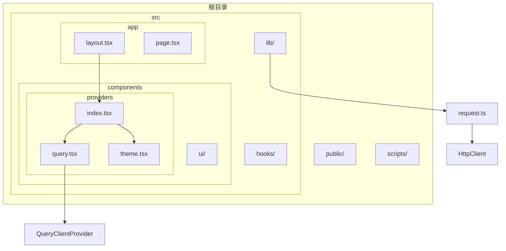
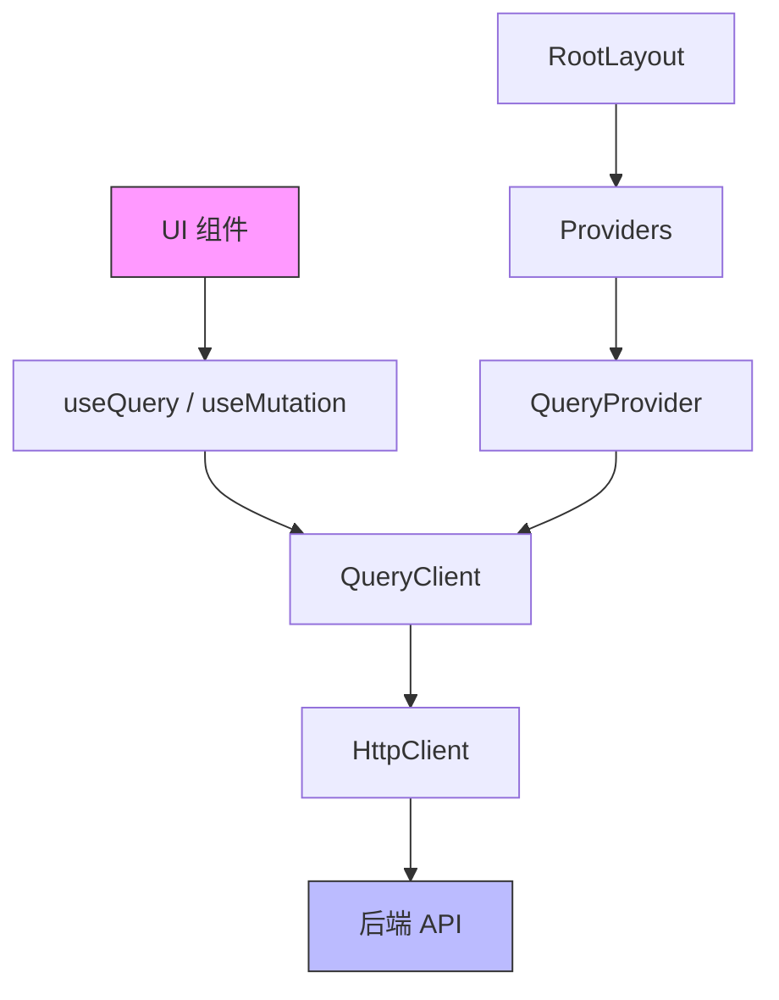
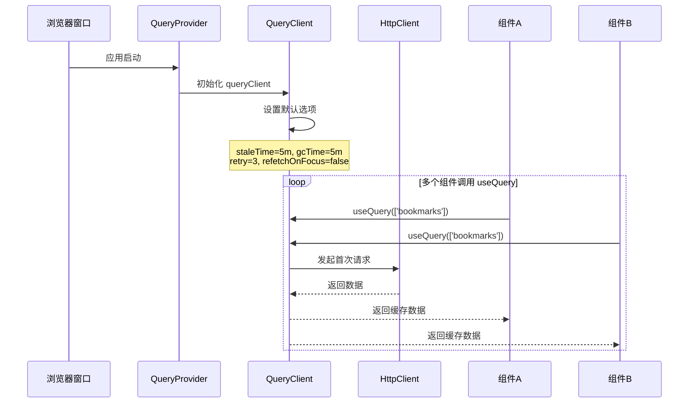
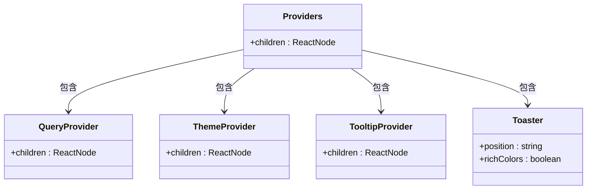

# Query Provider 配置

<cite>
**本文档引用的文件**   
- [query.tsx](file://src/components/providers/query.tsx)
- [index.tsx](file://src/components/providers/index.tsx)
- [layout.tsx](file://src/app/layout.tsx)
- [package.json](file://package.json)
- [request.ts](file://src/lib/request.ts)
</cite>

## 目录

1. [简介](#简介)
2. [项目结构](#项目结构)
3. [核心组件](#核心组件)
4. [架构概览](#架构概览)
5. [详细组件分析](#详细组件分析)
6. [依赖分析](#依赖分析)
7. [性能考量](#性能考量)
8. [故障排除指南](#故障排除指南)
9. [结论](#结论)

## 简介

本文档详细说明了 `QueryProvider` 在 OneNav 应用中的配置与初始化过程。重点阐述如何通过 `providers/index.tsx` 将 `ReactQueryProvider` 注入根布局，实现全局状态共享。同时解释 `queryClient` 实例的创建方式、默认选项（如缓存时间、重试机制、错误处理）的设置方法，并结合代码示例展示数据同步与查询去重策略。此外，还介绍了开发环境与生产环境下的调试工具集成方法，以及如何自定义查询客户端行为以满足特定业务需求。

## 项目结构

OneNav 项目采用基于功能模块的组织结构，主要分为 `public`、`scripts` 和 `src` 三大目录。其中 `src` 目录为核心代码所在，包含应用逻辑、组件库、自定义 Hook 和工具函数。

关键路径如下：

- `/src/app`：Next.js 应用的根布局和页面入口
- `/src/components/providers`：全局上下文提供者，包括主题、查询、提示等
- `/src/lib`：通用工具类和请求封装
- `/src/hooks`：自定义 React Hook

该结构清晰分离关注点，便于维护和扩展。



**图示来源**

- [layout.tsx](file://src/app/layout.tsx#L1-L100)
- [index.tsx](file://src/components/providers/index.tsx#L0-L14)
- [query.tsx](file://src/components/providers/query.tsx#L0-L44)
- [request.ts](file://src/lib/request.ts#L0-L79)

## 核心组件

`QueryProvider` 是 OneNav 应用中负责管理全局数据状态的核心组件之一。它基于 `@tanstack/react-query` 构建，封装了 `QueryClient` 的初始化逻辑，并通过 React Context 向整个应用提供数据查询能力。

其主要职责包括：

- 创建并维护单一的 `queryClient` 实例
- 配置默认查询与变更行为
- 提供全局错误处理和重试机制
- 支持开发调试工具集成

该组件确保所有数据请求具有一致的行为模式，提升用户体验和系统稳定性。

**本节来源**

- [query.tsx](file://src/components/providers/query.tsx#L0-L44)

## 架构概览

OneNav 的数据管理架构采用分层设计，自上而下分别为 UI 层、Provider 层、Query Client 层和 HTTP 请求层。



**图示来源**

- [query.tsx](file://src/components/providers/query.tsx#L0-L44)
- [index.tsx](file://src/components/providers/index.tsx#L0-L14)
- [layout.tsx](file://src/app/layout.tsx#L1-L100)
- [request.ts](file://src/lib/request.ts#L0-L79)

## 详细组件分析

### QueryProvider 组件分析

`QueryProvider` 组件封装了 `React Query` 的客户端实例，通过 `useState` 初始化一个持久化的 `queryClient`，确保在整个应用生命周期内使用同一个实例。

#### 初始化逻辑

组件使用惰性初始化模式创建 `QueryClient`：

```tsx
const [queryClient] = useState(() => new QueryClient({ ...options }));
```

此写法确保即使组件多次渲染，`queryClient` 实例也仅创建一次。

#### 默认选项配置

以下是 `QueryClient` 的默认配置及其含义：

**:defaultOptions.queries.staleTime**  
数据被视为“新鲜”的时间（默认 5 分钟）。在此期间，重复请求将直接返回缓存数据，避免不必要的网络请求。

**:defaultOptions.queries.gcTime**  
数据在内存中的保留时间（默认 5 分钟）。超过此时间后，未被引用的数据将被垃圾回收。

**:defaultOptions.queries.retry**  
查询失败后的重试次数（默认 3 次）。

**:defaultOptions.queries.retryDelay**  
重试延迟策略，采用指数退避算法：

```ts
retryDelay: (attemptIndex) => Math.min(1000 * 2 ** attemptIndex, 30000);
```

即第1次延迟1秒，第2次2秒，第3次4秒，最大不超过30秒。

**:defaultOptions.queries.refetchOnWindowFocus**  
窗口重新获得焦点时是否重新获取数据（设为 `false`，避免频繁刷新影响体验）。

**:defaultOptions.queries.refetchOnReconnect**  
网络重新连接时是否自动重试（设为 `true`，提升离线恢复能力）。

**:defaultOptions.mutations.retry**  
变更操作的重试次数（默认 1 次），通常变更具有副作用，不宜过度重试。

**:defaultOptions.mutations.retryDelay**  
变更重试延迟（固定 1 秒）。

#### 跨组件数据同步与查询去重

React Query 自动根据查询键（queryKey）进行去重。例如：

```ts
useQuery({
  queryKey: ['bookmarks'],
  queryFn: fetchBookmarks,
});
```

只要多个组件使用相同的 `queryKey`，它们将共享同一份缓存数据，实现自动同步。

#### 开发调试工具集成

虽然当前代码中注释掉了 `ReactQueryDevtools`，但保留了集成入口：

```tsx
{
  /* {process.env.NODE_ENV === 'development' && (
  <ReactQueryDevtools initialIsOpen={false} />
)} */
}
```

开发者可随时取消注释以启用调试面板，查看查询状态、缓存情况和性能指标。



**图示来源**

- [query.tsx](file://src/components/providers/query.tsx#L0-L44)
- [request.ts](file://src/lib/request.ts#L0-L79)

**本节来源**

- [query.tsx](file://src/components/providers/query.tsx#L0-L44)
- [request.ts](file://src/lib/request.ts#L0-L79)

### Providers 集成分析

`Providers` 组件作为所有全局上下文的容器，在 `layout.tsx` 中被注入根布局。

#### 注入流程

1. `layout.tsx` 导入 `Providers`
2. 在 `<body>` 内包裹 `{children}`
3. 所有页面组件均继承这些上下文

```tsx
// layout.tsx
<Providers>{children}</Providers>
```

#### 组件层级关系



**图示来源**

- [index.tsx](file://src/components/providers/index.tsx#L0-L14)
- [layout.tsx](file://src/app/layout.tsx#L1-L100)

**本节来源**

- [index.tsx](file://src/components/providers/index.tsx#L0-L14)
- [layout.tsx](file://src/app/layout.tsx#L1-L100)

## 依赖分析

`QueryProvider` 的正常运行依赖于多个关键包和模块。

```mermaid
dependency-graph
"query.tsx" --> "@tanstack/react-query"
"query.tsx" --> "@tanstack/react-query-devtools"
"request.ts" --> "sonner"
"index.tsx" --> "query.tsx"
"index.tsx" --> "theme.tsx"
"layout.tsx" --> "index.tsx"
"package.json" --> "@tanstack/react-query"
"package.json" --> "@tanstack/react-query-devtools"
```

**图示来源**

- [package.json](file://package.json#L1-L142)
- [query.tsx](file://src/components/providers/query.tsx#L0-L44)
- [index.tsx](file://src/components/providers/index.tsx#L0-L14)
- [layout.tsx](file://src/app/layout.tsx#L1-L100)

**本节来源**

- [package.json](file://package.json#L1-L142)

## 性能考量

`QueryProvider` 的配置充分考虑了性能优化：

- **缓存策略**：5分钟的 `staleTime` 和 `gcTime` 平衡了数据新鲜度与请求频率
- **智能重取**：关闭窗口焦点重取，减少不必要的请求
- **指数退避重试**：避免雪崩效应
- **内存管理**：及时清理过期数据，防止内存泄漏
- **单例模式**：全局唯一 `queryClient` 减少资源开销

这些配置显著提升了应用响应速度和用户体验。

## 故障排除指南

### 常见问题

**:查询未去重**  
检查 `queryKey` 是否完全一致（包括顺序和类型）。

**:数据未更新**  
确认 `refetchOnWindowFocus` 和 `refetchOnReconnect` 设置是否符合预期。

**:重试机制未生效**  
确保网络请求抛出的是错误（Error），而非返回失败状态码。

**:开发工具无法显示**  
取消注释 `<ReactQueryDevtools />` 并确保 `NODE_ENV=development`。

### 自定义行为建议

可通过修改 `queryClient` 配置来自定义行为：

```ts
new QueryClient({
  defaultOptions: {
    queries: {
      staleTime: 10 * 60 * 1000, // 延长至10分钟
      gcTime: 10 * 60 * 1000,
      retry: 2,
      refetchOnWindowFocus: true, // 启用焦点重取
    },
  },
});
```

**本节来源**

- [query.tsx](file://src/components/providers/query.tsx#L0-L44)

## 结论

`QueryProvider` 在 OneNav 应用中扮演着至关重要的角色，它不仅实现了全局数据状态管理，还通过精细的默认配置提升了应用性能和用户体验。通过 `providers/index.tsx` 的组合式设计和 `layout.tsx` 的根注入机制，确保了所有子组件都能无缝接入数据查询系统。未来可根据业务需求进一步优化缓存策略或启用调试工具，持续提升开发效率和系统稳定性。
