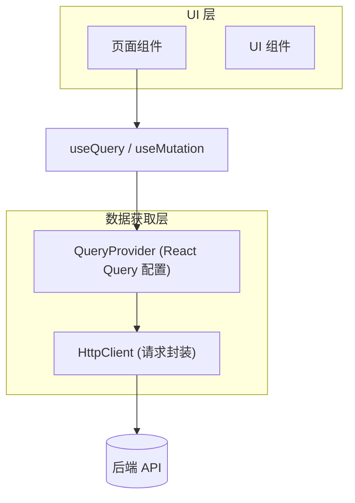
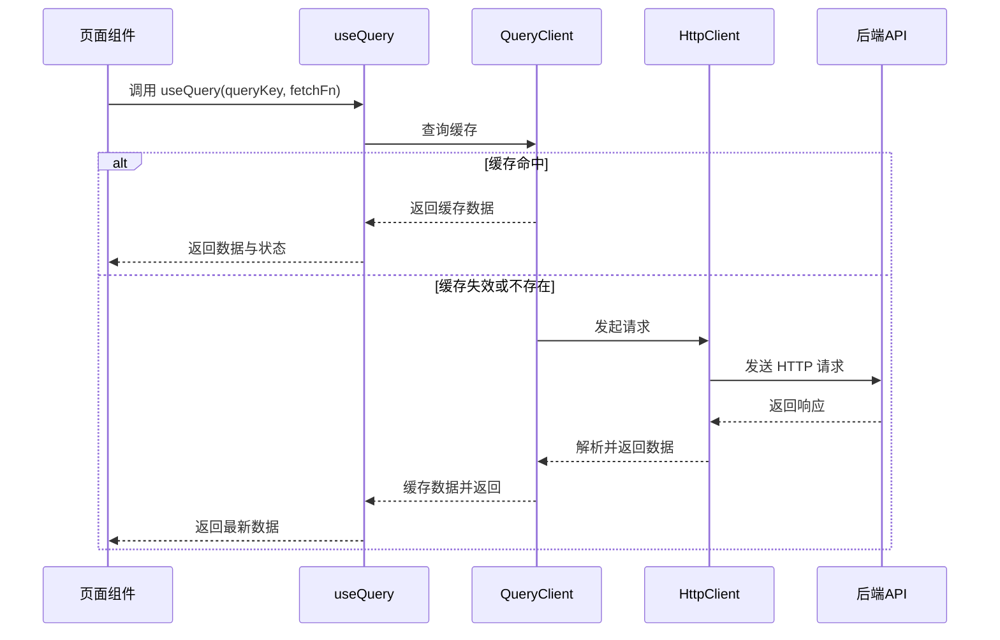
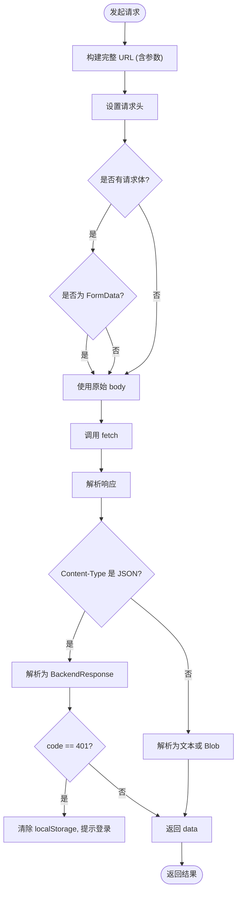
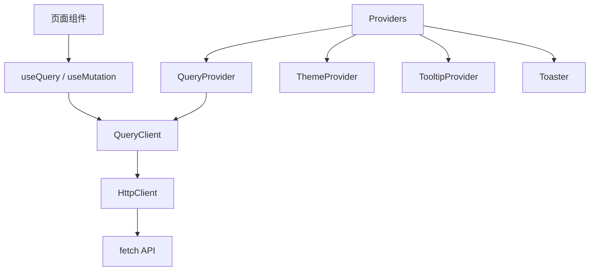

# 数据获取模式

<cite>
**本文档引用文件**  
- [query.tsx](file://src/components/providers/query.tsx#L1-L45)
- [request.ts](file://src/lib/request.ts#L1-L191)
- [index.tsx](file://src/components/providers/index.tsx#L1-L14)
</cite>

## 目录

1. [简介](#简介)
2. [项目结构](#项目结构)
3. [核心组件](#核心组件)
4. [架构概览](#架构概览)
5. [详细组件分析](#详细组件分析)
6. [依赖分析](#依赖分析)
7. [性能考量](#性能考量)
8. [常见问题与解决方案](#常见问题与解决方案)
9. [结论](#结论)

## 简介

本文档系统性地介绍基于 React Query 的数据获取实践模式，涵盖异步请求、缓存管理、增删改操作、分页与搜索等场景。通过分析 `one-nav` 项目中的实际代码实现，展示如何在现代 React 应用中高效、可靠地处理数据交互。

## 项目结构

项目采用典型的 Next.js 应用结构，主要分为以下几个部分：

- `public/`：静态资源文件
- `src/app/`：页面路由与布局组件
- `src/components/`：UI 组件与提供者（Providers）
- `src/lib/`：工具类与网络请求封装
- `src/hooks/`：自定义 Hook

数据获取相关的核心逻辑集中在 `src/lib/request.ts` 和 `src/components/providers/query.tsx` 中。



**图示来源**

- [query.tsx](file://src/components/providers/query.tsx#L1-L45)
- [request.ts](file://src/lib/request.ts#L1-L191)

## 核心组件

项目中与数据获取相关的核心组件包括：

- `QueryProvider`：React Query 的全局配置提供者
- `HttpClient`：强类型封装的 HTTP 请求类
- `useQuery` 与 `useMutation`：React Query 提供的 Hook，用于数据获取与变更操作

这些组件共同构成了应用的数据交互基础。

**组件来源**

- [query.tsx](file://src/components/providers/query.tsx#L1-L45)
- [request.ts](file://src/lib/request.ts#L1-L191)

## 架构概览

整个数据获取架构基于 React Query 的声明式数据管理理念，结合自定义的 HTTP 客户端实现。架构分为三层：

1. **UI 层**：页面组件通过 `useQuery` 和 `useMutation` 声明数据需求
2. **状态管理层**：React Query 负责缓存、重试、去重、自动刷新等逻辑
3. **请求层**：`HttpClient` 封装底层 `fetch` 调用，处理 URL 构建、请求头、响应解析等



**图示来源**

- [query.tsx](file://src/components/providers/query.tsx#L1-L45)
- [request.ts](file://src/lib/request.ts#L1-L191)

## 详细组件分析

### QueryProvider 分析

`QueryProvider` 是 React Query 的上下文提供者，负责初始化 `QueryClient` 并配置全局默认行为。

```tsx
export function QueryProvider({ children }: { children: React.ReactNode }) {
  const [queryClient] = useState(
    () =>
      new QueryClient({
        defaultOptions: {
          queries: {
            staleTime: 5 * 60 * 1000, // 数据缓存时间（5分钟）
            gcTime: 5 * 60 * 1000, // 内存中保留时间（5分钟）
            retry: 3, // 失败重试次数
            retryDelay: (attemptIndex) =>
              Math.min(1000 * 2 ** attemptIndex, 30000), // 指数退避
            refetchOnWindowFocus: false, // 窗口聚焦时不自动刷新
            refetchOnReconnect: true, // 网络重连时自动刷新
          },
          mutations: {
            retry: 1,
            retryDelay: 1000,
          },
        },
      }),
  );

  return (
    <QueryClientProvider client={queryClient}>{children}</QueryClientProvider>
  );
}
```

该配置确保了：

- 数据在 5 分钟内被视为“新鲜”，避免频繁请求
- 请求失败时最多重试 3 次，采用指数退避策略
- 网络中断恢复后自动重试请求，提升用户体验

**组件来源**

- [query.tsx](file://src/components/providers/query.tsx#L1-L45)

### HttpClient 分析

`HttpClient` 是一个强类型的 HTTP 请求封装类，支持 GET、POST、PUT、DELETE、PATCH 和文件上传。

关键特性：

- 支持 URL 参数自动拼接
- 自动处理 JSON 序列化与反序列化
- 支持 `FormData` 上传
- 统一处理后端响应结构 `{ code, msg, data }`
- 错误码 401 时自动清除本地存储并提示重新登录



**图示来源**

- [request.ts](file://src/lib/request.ts#L1-L191)

## 依赖分析

项目中数据获取模块的依赖关系清晰，层次分明：



- `useQuery` 和 `useMutation` 是 React Query 提供的 Hook，依赖 `QueryClient`
- `QueryClient` 由 `QueryProvider` 初始化
- `HttpClient` 独立封装，仅依赖原生 `fetch`，便于测试与复用
- 所有组件通过 `Providers` 统一注入上下文

**图示来源**

- [query.tsx](file://src/components/providers/query.tsx#L1-L45)
- [index.tsx](file://src/components/providers/index.tsx#L1-L14)
- [request.ts](file://src/lib/request.ts#L1-L191)

## 性能考量

1. **缓存策略**：`staleTime` 和 `gcTime` 设置为 5 分钟，平衡了数据新鲜度与请求频率
2. **重试机制**：指数退避减少服务器压力，避免雪崩
3. **请求去重**：React Query 自动合并相同 `queryKey` 的请求
4. **内存管理**：`gcTime` 确保无用数据及时释放
5. **网络优化**：`refetchOnWindowFocus: false` 避免用户切回页面时不必要的请求

## 常见问题与解决方案

### 问题1：参数变化未触发刷新

**原因**：`queryKey` 未包含动态参数。  
**解决方案**：确保 `queryKey` 包含所有影响数据的变量。

```ts
useQuery({
  queryKey: ['user', userId], // 包含 userId
  queryFn: () => fetchUser(userId),
});
```

### 问题2：缓存失效策略不当

**现象**：数据过时或频繁请求。  
**建议**：

- 高频变化数据：降低 `staleTime`
- 静态数据：提高 `staleTime` 或设为 `Infinity`
- 手动失效：使用 `queryClient.invalidateQueries(['key'])`

### 问题3：乐观更新实现

在 `useMutation` 中可通过 `onMutate` 实现乐观更新：

```ts
useMutation({
  mutationFn: updateTodo,
  onMutate: async (newTodo) => {
    await queryClient.cancelQueries({ queryKey: ['todos'] });
    const previousTodos = queryClient.getQueryData(['todos']);
    queryClient.setQueryData(['todos'], (old) => [...old, newTodo]);
    return { previousTodos };
  },
  onError: (err, variables, context) => {
    queryClient.setQueryData(['todos'], context.previousTodos);
  },
});
```

## 结论

`one-nav` 项目通过 `React Query` 与自定义 `HttpClient` 的结合，构建了一套高效、健壮的数据获取体系。`QueryProvider` 提供了合理的全局配置，`HttpClient` 实现了类型安全的请求封装，二者协同工作，显著提升了开发效率与用户体验。建议在实际开发中遵循此模式，合理配置缓存与重试策略，充分利用 React Query 的强大功能。
