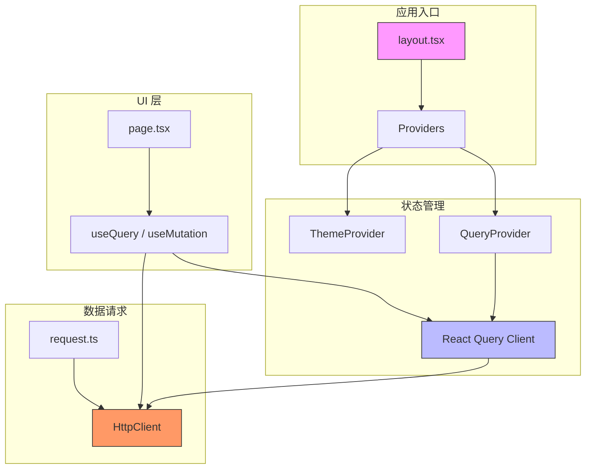
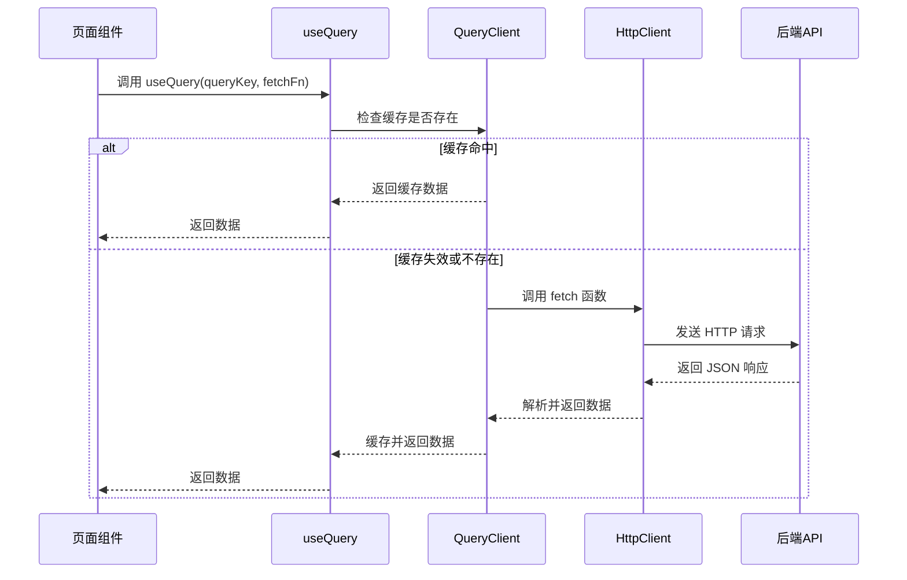
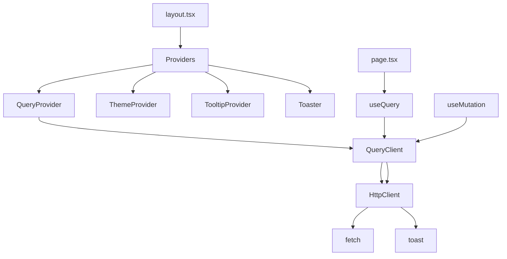

# 状态管理

<cite>
**本文档引用的文件**   
- [query.tsx](file://src/components/providers/query.tsx)
- [request.ts](file://src/lib/request.ts)
- [layout.tsx](file://src/app/layout.tsx)
- [index.tsx](file://src/components/providers/index.tsx)
</cite>

## 目录

1. [项目结构](#项目结构)
2. [核心组件](#核心组件)
3. [架构概览](#架构概览)
4. [详细组件分析](#详细组件分析)
5. [依赖关系分析](#依赖关系分析)

## 项目结构

该项目采用基于功能模块的组织方式，主要分为以下几个核心目录：

- `app/`：Next.js 应用的页面和布局入口，包含根布局 `layout.tsx` 和主页面。
- `components/`：UI 组件与全局提供者（Providers），其中 `providers/` 包含状态管理、主题、提示等全局上下文。
- `lib/`：工具类与核心逻辑封装，如 HTTP 请求客户端。
- `public/`：静态资源文件。

状态管理的核心实现位于 `src/components/providers/` 和 `src/lib/request.ts`，通过 React Query 实现数据获取与缓存机制，并结合自定义 HTTP 客户端完成强类型请求处理。



**图示来源**

- [layout.tsx](file://src/app/layout.tsx#L1-L101)
- [query.tsx](file://src/components/providers/query.tsx#L1-L45)
- [request.ts](file://src/lib/request.ts#L1-L191)

**本节来源**

- [layout.tsx](file://src/app/layout.tsx#L1-L101)
- [project_structure](file://.)

## 核心组件

本项目的核心状态管理由 `@tanstack/react-query` 驱动，结合自定义的 `QueryProvider` 和强类型 `HttpClient` 实现高效、可靠的数据流控制。主要组件包括：

- **QueryProvider**：封装 React Query 客户端，提供全局数据缓存、重试、刷新等策略。
- **HttpClient**：基于 `fetch` 的强类型 HTTP 封装，支持请求拦截、参数构建、错误统一处理。
- **Providers**：组合多个上下文提供者（如主题、查询、提示等），在根布局中统一注入。

这些组件共同构成了一个健壮的状态管理架构，支持自动缓存、乐观更新、错误提示和 token 自动刷新。

**本节来源**

- [query.tsx](file://src/components/providers/query.tsx#L1-L45)
- [request.ts](file://src/lib/request.ts#L1-L191)
- [index.tsx](file://src/components/providers/index.tsx#L1-L15)

## 架构概览

整个状态管理架构遵循“单一数据源”原则，通过 `QueryClient` 统一管理所有异步状态。架构分为三层：

1. **UI 层**：使用 `useQuery` 获取数据，`useMutation` 执行变更。
2. **服务层**：由 `HttpClient` 提供类型安全的 API 调用。
3. **缓存层**：React Query 负责数据缓存、去重、自动刷新。



**图示来源**

- [query.tsx](file://src/components/providers/query.tsx#L1-L45)
- [request.ts](file://src/lib/request.ts#L1-L191)

## 详细组件分析

### QueryProvider 分析

`QueryProvider` 是 React Query 的封装组件，负责在应用根部注入 `QueryClient`，实现全局状态管理。

#### 功能特性

- 使用 `useState` 初始化 `QueryClient`，确保客户端实例在组件生命周期内保持不变。
- 配置默认查询选项：
  - `staleTime`: 数据陈旧时间（5分钟），超过此时间再次访问会触发后台刷新。
  - `gcTime`: 垃圾回收时间（5分钟），未被使用时缓存保留时间。
  - `retry`: 查询失败自动重试3次，指数退避延迟。
  - `refetchOnWindowFocus`: 窗口聚焦时不自动刷新，避免频繁请求。
  - `refetchOnReconnect`: 网络重连时自动重试，提升用户体验。

```tsx
const [queryClient] = useState(
  () =>
    new QueryClient({
      defaultOptions: {
        queries: {
          staleTime: 5 * 60 * 1000,
          gcTime: 5 * 60 * 1000,
          retry: 3,
          retryDelay: (attemptIndex) =>
            Math.min(1000 * 2 ** attemptIndex, 30000),
          refetchOnWindowFocus: false,
          refetchOnReconnect: true,
        },
        mutations: {
          retry: 1,
          retryDelay: 1000,
        },
      },
    }),
);
```

该设计有效平衡了数据新鲜度与网络开销。

**本节来源**

- [query.tsx](file://src/components/providers/query.tsx#L1-L45)

### HttpClient 分析

`HttpClient` 是一个强类型的 HTTP 客户端封装，专为与 React Query 集成而设计。

#### 核心功能

- **类型安全**：使用泛型 `ApiResponse<T>` 和 `BackendResponse<T>` 确保响应结构明确。
- **请求构建**：自动处理 URL 参数拼接、JSON 序列化、FormData 特殊处理。
- **错误统一处理**：
  - 捕获网络异常并抛出可读错误。
  - 自动识别后端业务状态码（如 `code: 401` 触发登录过期提示）。
- **Token 自动更新**：通过 `updateToken` 方法动态设置请求头中的 token。

```ts
if (jsonResponse.code == 401) {
  localStorage.clear();
  toast.error('登录信息已过期，请重新登录');
}
```

#### 请求方法封装

提供 `get`, `post`, `put`, `patch`, `delete`, `upload` 等快捷方法，支持函数式调用。

```ts
export const http = new HttpClient({
  baseURL: `${process.env.NEXT_PUBLIC_API_URL || '/api'}`,
});

export const get = http.get.bind(http);
export const post = http.post.bind(http);
// ...
```

这种设计极大简化了 API 调用，提升开发效率。

**本节来源**

- [request.ts](file://src/lib/request.ts#L1-L191)

### Providers 组合分析

`Providers` 组件将多个上下文提供者组合在一起，便于在根布局中统一注入。

```tsx
export function Providers({ children }: React.PropsWithChildren) {
  return (
    <QueryProvider>
      <ThemeProvider>
        <TooltipProvider>{children}</TooltipProvider>
        <Toaster position="top-right" richColors />
      </ThemeProvider>
    </QueryProvider>
  );
}
```

在 `layout.tsx` 中被调用：

```tsx
<body>
  <Providers>{children}</Providers>
</body>
```

这种模式实现了关注点分离，同时保证了全局状态的可维护性。

**本节来源**

- [index.tsx](file://src/components/providers/index.tsx#L1-L15)
- [layout.tsx](file://src/app/layout.tsx#L1-L101)

## 依赖关系分析



**图示来源**

- [layout.tsx](file://src/app/layout.tsx#L1-L101)
- [index.tsx](file://src/components/providers/index.tsx#L1-L15)
- [query.tsx](file://src/components/providers/query.tsx#L1-L45)
- [request.ts](file://src/lib/request.ts#L1-L191)

**本节来源**

- [layout.tsx](file://src/app/layout.tsx#L1-L101)
- [index.tsx](file://src/components/providers/index.tsx#L1-L15)
- [query.tsx](file://src/components/providers/query.tsx#L1-L45)
- [request.ts](file://src/lib/request.ts#L1-L191)
