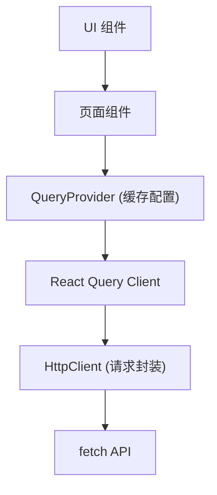
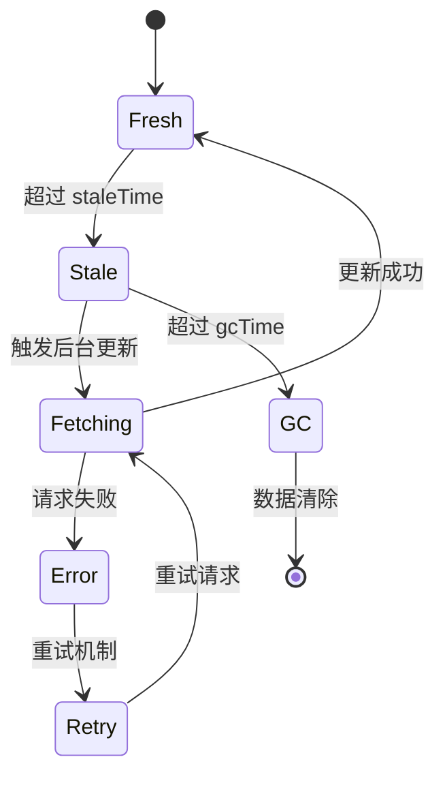
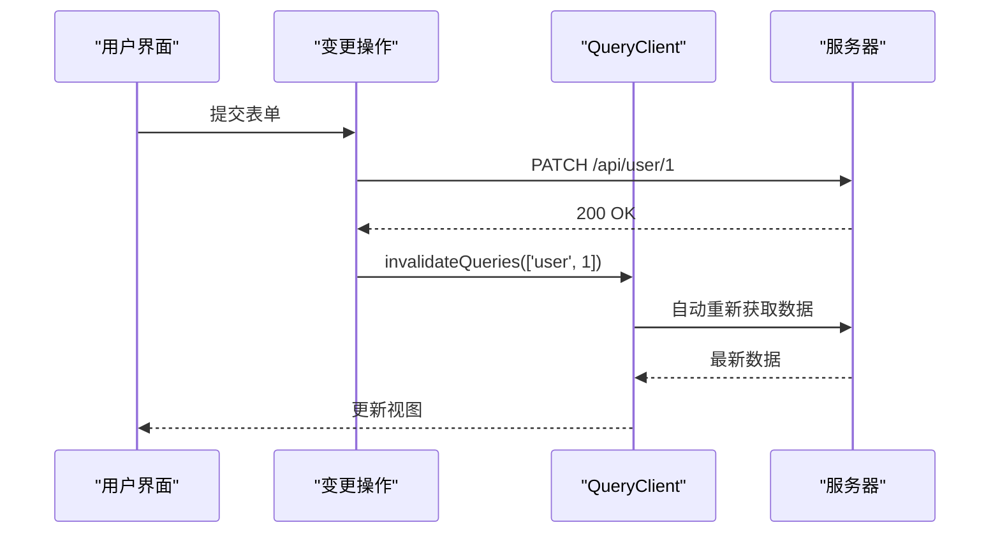

# 缓存策略与性能优化

<cite>
**本文档引用的文件**   
- [query.tsx](file://src/components/providers/query.tsx#L1-L45)
- [request.ts](file://src/lib/request.ts#L1-L191)
- [index.tsx](file://src/components/providers/index.tsx#L1-L14)
</cite>

## 目录

1. [项目结构分析](#项目结构分析)
2. [核心缓存机制详解](#核心缓存机制详解)
3. [查询键设计原则](#查询键设计原则)
4. [关键缓存参数解析](#关键缓存参数解析)
5. [结构化克隆与渲染优化](#结构化克隆与渲染优化)
6. [缓存失效控制策略](#缓存失效控制策略)
7. [性能监控与陷阱规避](#性能监控与陷阱规避)

## 项目结构分析

本项目采用基于 Next.js 的 App Router 架构，组件按功能模块化组织。核心缓存逻辑集中在 `src/components/providers/query.tsx` 文件中，通过 React Query 提供全局状态管理能力。HTTP 请求封装位于 `src/lib/request.ts`，与 React Query 深度集成。



**图示来源**

- [query.tsx](file://src/components/providers/query.tsx#L1-L45)
- [request.ts](file://src/lib/request.ts#L1-L191)

**本节来源**

- [query.tsx](file://src/components/providers/query.tsx#L1-L45)
- [request.ts](file://src/lib/request.ts#L1-L191)

## 核心缓存机制详解

React Query 在本项目中通过 `QueryProvider` 进行初始化，封装了默认的查询与变更选项。其核心机制基于数据的“新鲜度”（staleness）模型，自动管理数据获取、缓存、同步和更新。

缓存生命周期包含三个阶段：

1. **新鲜状态（Stale）**：数据可直接使用，无需重新请求
2. **过期状态（Stale）**：数据可显示但会触发后台更新
3. **垃圾回收（GC）**：数据从内存中清除

```typescript
const [queryClient] = useState(
  () =>
    new QueryClient({
      defaultOptions: {
        queries: {
          staleTime: 5 * 60 * 1000,
          gcTime: 5 * 60 * 1000,
          retry: 3,
          refetchOnWindowFocus: false,
          refetchOnReconnect: true,
        },
      },
    }),
);
```

**本节来源**

- [query.tsx](file://src/components/providers/query.tsx#L10-L35)

## 查询键设计原则

查询键（queryKey）是 React Query 缓存系统的唯一标识符，采用数组形式表达资源层级与参数依赖关系。例如：

```typescript
// 示例：获取用户数据
const { data } = useQuery({
  queryKey: ['user', userId],
  queryFn: () => fetchUser(userId),
});

// 示例：分页获取文章列表
const { data } = useQuery({
  queryKey: ['posts', { page, limit, category }],
  queryFn: () => fetchPosts(page, limit, category),
});
```

**设计原则：**

- **层级清晰**：数组首项为资源类型，后续为具体参数
- **可序列化**：所有键值必须能被序列化以支持缓存比较
- **依赖完整**：包含所有影响数据结果的变量
- **顺序一致**：相同逻辑的 queryKey 应保持参数顺序统一

**本节来源**

- [query.tsx](file://src/components/providers/query.tsx#L10-L35)

## 关键缓存参数解析

### staleTime

- **定义**：数据保持“新鲜”的时间（毫秒）
- **当前值**：`5 * 60 * 1000`（5分钟）
- **影响**：在此时间内重复请求将直接返回缓存数据，不发起网络请求
- **建议值**：根据数据更新频率设定，静态数据可设为 `Infinity`，动态数据建议 30s~5min

### gcTime (原 cacheTime)

- **定义**：数据在内存中的保留时间（垃圾回收时间）
- **当前值**：`5 * 60 * 1000`（5分钟）
- **影响**：超过此时间后，未被引用的数据将被清除
- **建议值**：通常略大于 `staleTime`，避免频繁重新获取

### refetchOnWindowFocus

- **定义**：窗口重新获得焦点时是否重新获取数据
- **当前值**：`false`
- **影响**：防止用户切换标签页回来时触发不必要的请求
- **建议值**：对实时性要求高的应用可设为 `true`，否则建议关闭以提升性能

### refetchOnReconnect

- **定义**：网络重新连接时是否重新获取数据
- **当前值**：`true`
- **影响**：确保离线操作后能恢复最新数据
- **建议值**：生产环境建议开启

### retry 与 retryDelay

- **重试机制**：失败请求自动重试最多 3 次
- **退避策略**：指数退避（1s, 2s, 4s... 最大30s），避免服务雪崩



**图示来源**

- [query.tsx](file://src/components/providers/query.tsx#L15-L35)

**本节来源**

- [query.tsx](file://src/components/providers/query.tsx#L15-L35)

## 结构化克隆与渲染优化

React Query 默认启用结构化克隆（structural sharing），在数据更新时仅返回发生变化的部分，未变更字段保持引用相等。这使得 React 能够通过 `Object.is()` 快速判断 props 是否变化，避免不必要的重新渲染。

例如：

```typescript
// 初始数据
{ users: [{ id: 1, name: 'Alice' }], pagination: { total: 1 } }

// 更新后数据
{ users: [{ id: 1, name: 'Alice' }], pagination: { total: 2 } }
```

尽管对象整体不同，但 `users[0]` 引用不变，相关组件不会重新渲染。

**优化建议：**

- 使用 `select` 选项提取子数据，进一步减少订阅范围
- 避免在 `queryFn` 中返回多余字段
- 结合 `React.memo` 对子组件进行记忆化

**本节来源**

- [query.tsx](file://src/components/providers/query.tsx#L10-L35)

## 缓存失效控制策略

精确控制缓存失效是避免全局刷新的关键。通过 `queryClient.invalidateQueries` 可实现细粒度更新：

```typescript
// 使所有用户查询失效
queryClient.invalidateQueries({ queryKey: ['user'] });

// 使特定用户查询失效
queryClient.invalidateQueries({ queryKey: ['user', userId] });

// 使文章列表查询失效（触发重新获取）
queryClient.invalidateQueries({ queryKey: ['posts'] });
```

**最佳实践：**

- 在 mutation 成功后调用 `invalidateQueries`
- 使用精确的 queryKey 前缀匹配
- 避免使用 `refetchOnWindowFocus: true` 替代手动失效，因其效率低下



**图示来源**

- [query.tsx](file://src/components/providers/query.tsx#L10-L35)
- [request.ts](file://src/lib/request.ts#L1-L191)

**本节来源**

- [query.tsx](file://src/components/providers/query.tsx#L10-L35)

## 性能监控与陷阱规避

### 常见性能陷阱

| 陷阱     | 表现               | 规避方案                                     |
| -------- | ------------------ | -------------------------------------------- |
| 过度渲染 | 组件频繁重绘       | 使用 `select` 提取子数据，结合 `React.memo`  |
| 内存泄漏 | 页面切换后请求仍在 | React Query 自动取消未完成请求，无需手动清理 |
| 请求风暴 | 多个相同请求并发   | 启用默认去重机制（React Query 自动处理）     |
| 缓存膨胀 | 内存占用持续增长   | 合理设置 `gcTime`，定期清理无用缓存          |

### 监控手段

1. **开发工具**：启用 `ReactQueryDevtools`（当前注释状态）
2. **日志追踪**：在 `request.ts` 中添加请求耗时统计
3. **错误收集**：通过 `sonner` 显示网络错误提示
4. **性能分析**：使用 Chrome DevTools 监控内存与渲染性能

```typescript
// 建议启用开发工具（在 query.tsx 中取消注释）
// <ReactQueryDevtools initialIsOpen={false} />
```

**本节来源**

- [query.tsx](file://src/components/providers/query.tsx#L1-L45)
- [request.ts](file://src/lib/request.ts#L1-L191)
