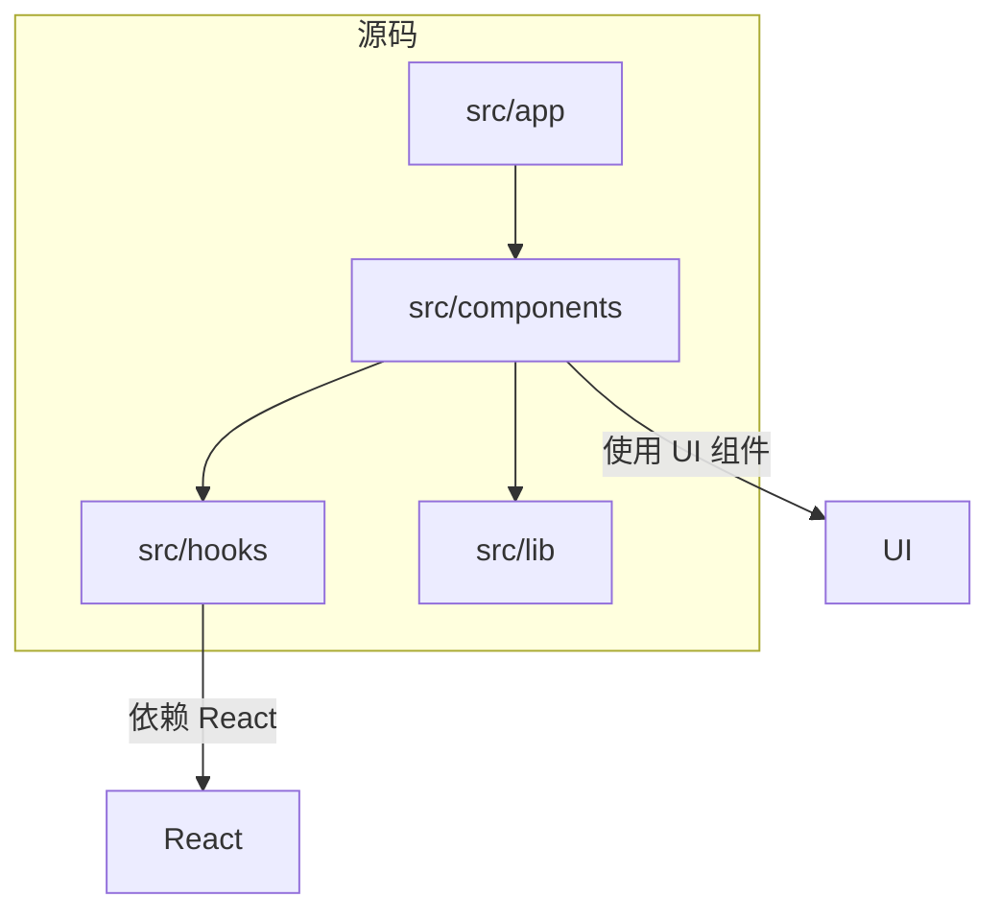
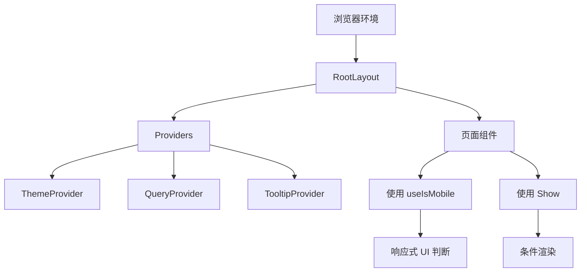
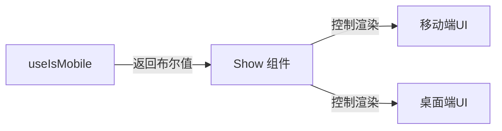

# 自定义Hook

<cite>
**本文档中引用的文件**  
- [use-mobile.ts](file://src/hooks/use-mobile.ts#L1-L19)
- [show.tsx](file://src/components/show.tsx#L1-L12)
- [layout.tsx](file://src/app/layout.tsx#L1-L101)
</cite>

## 目录

1. [简介](#简介)
2. [项目结构](#项目结构)
3. [核心组件](#核心组件)
4. [架构概述](#架构概述)
5. [详细组件分析](#详细组件分析)
6. [依赖分析](#依赖分析)
7. [性能考量](#性能考量)
8. [故障排除指南](#故障排除指南)
9. [结论](#结论)

## 简介

本文档旨在全面解析位于 `/src/hooks/use-mobile.ts` 的自定义 React Hook —— `useIsMobile`。该 Hook 用于检测当前设备是否为移动设备，通过监听窗口尺寸变化并结合 CSS 媒体查询实现响应式判断。文档将深入探讨其实现机制、使用场景、性能优化及与其他组件的集成方式，帮助开发者理解其在构建响应式用户界面中的关键作用。

## 项目结构

项目采用标准的 Next.js 应用结构，主要分为 `public`（静态资源）、`src`（源码）和配置文件三大部分。核心逻辑集中在 `src` 目录下，包括页面、组件、自定义 Hook 和工具函数。



**图示来源**

- [use-mobile.ts](file://src/hooks/use-mobile.ts#L1-L19)
- [show.tsx](file://src/components/show.tsx#L1-L12)
- [layout.tsx](file://src/app/layout.tsx#L1-L101)

## 核心组件

本项目的核心功能由多个可复用的组件和 Hook 构成。其中，`useIsMobile` 是一个轻量级的状态检测 Hook，用于响应式布局控制；`Show` 组件则基于条件渲染封装了显示/隐藏逻辑，常与 `useIsMobile` 配合使用。

**组件来源**

- [use-mobile.ts](file://src/hooks/use-mobile.ts#L1-L19)
- [show.tsx](file://src/components/show.tsx#L1-L12)

## 架构概述

整体架构遵循 React 函数式编程与 Hooks 模式，通过自定义 Hook 封装通用逻辑，组件间通过 props 和 context 进行通信。状态管理简洁，依赖原生 React 状态与第三方库（如 react-query）完成数据获取。



**图示来源**

- [layout.tsx](file://src/app/layout.tsx#L1-L101)
- [use-mobile.ts](file://src/hooks/use-mobile.ts#L1-L19)
- [show.tsx](file://src/components/show.tsx#L1-L12)

## 详细组件分析

### useIsMobile Hook 分析

`useIsMobile` 是一个自定义 React Hook，用于检测当前视口宽度是否小于指定的移动设备断点（768px），从而判断设备类型。

#### 实现机制

该 Hook 使用 `React.useState` 初始化一个布尔状态 `isMobile`，初始值为 `undefined`。通过 `React.useEffect` 在组件挂载时执行以下操作：

- 创建一个媒体查询监听器 `mql`，监听 `(max-width: 767px)` 的条件。
- 定义 `onChange` 回调函数，当媒体查询条件变化时，根据 `window.innerWidth < 768` 更新 `isMobile` 状态。
- 立即设置初始状态以确保首屏正确渲染。
- 在副作用清理阶段移除事件监听器，防止内存泄漏。

最终返回 `!!isMobile`，确保返回值始终为布尔类型。

```typescript
import * as React from 'react';

const MOBILE_BREAKPOINT = 768;

export function useIsMobile() {
  const [isMobile, setIsMobile] = React.useState<boolean | undefined>(
    undefined,
  );

  React.useEffect(() => {
    const mql = window.matchMedia(`(max-width: ${MOBILE_BREAKPOINT - 1}px)`);
    const onChange = () => {
      setIsMobile(window.innerWidth < MOBILE_BREAKPOINT);
    };
    mql.addEventListener('change', onChange);
    setIsMobile(window.innerWidth < MOBILE_BREAKPOINT);
    return () => mql.removeEventListener('change', onChange);
  }, []);

  return !!isMobile;
}
```

#### 关键特性

- **响应式检测**：利用 `window.matchMedia` 实现高效的媒体查询监听。
- **避免重复计算**：依赖 `useEffect` 的依赖数组为空 `[]`，确保仅在挂载/卸载时执行。
- **边界处理完善**：在组件卸载时正确移除事件监听器，避免内存泄漏。
- **初始状态准确**：首次渲染即设置正确状态，避免闪烁或错误布局。

**图示来源**

- [use-mobile.ts](file://src/hooks/use-mobile.ts#L1-L19)

#### 使用示例

```tsx
import Show from '@/components/show';
import { useIsMobile } from '@/hooks/use-mobile';

function MyComponent() {
  const isMobile = useIsMobile();

  return (
    <div>
      <Show when={isMobile}>
        <p>这是移动端显示的内容</p>
      </Show>
      <Show when={!isMobile}>
        <p>这是桌面端显示的内容</p>
      </Show>
    </div>
  );
}
```

此模式广泛应用于响应式导航栏、弹窗布局调整、触摸交互优化等场景。

**组件来源**

- [use-mobile.ts](file://src/hooks/use-mobile.ts#L1-L19)
- [show.tsx](file://src/components/show.tsx#L1-L12)

## 依赖分析

`useIsMobile` 仅依赖 React 核心 API，无外部库依赖，具备高度可移植性。它与 `Show` 组件形成逻辑闭环，前者提供设备判断，后者实现条件渲染，二者共同支撑响应式 UI 构建。



**图示来源**

- [use-mobile.ts](file://src/hooks/use-mobile.ts#L1-L19)
- [show.tsx](file://src/components/show.tsx#L1-L12)

## 性能考量

- **轻量高效**：Hook 本身无复杂计算，仅依赖浏览器原生 `matchMedia` API。
- **事件监听优化**：使用 `addEventListener` 而非 `onchange`，符合现代 Web 标准。
- **内存安全**：`useEffect` 清理函数确保事件监听器被正确释放。
- **避免重渲染**：状态更新仅发生在窗口尺寸跨越断点时，减少不必要的 re-render。

尽管如此，在极端频繁的 resize 事件中仍建议添加防抖（debounce）机制以进一步优化性能。

## 故障排除指南

### 常见问题

1. **首次加载判断错误**
   - 可能原因：服务端渲染（SSR）环境下 `window` 未定义。
   - 解决方案：确保 Hook 仅在客户端执行，或初始化时设为 `undefined` 并在 `useEffect` 中更新。

2. **状态未及时更新**
   - 检查是否遗漏了 `mql.removeEventListener` 的清理逻辑。
   - 确认 `onChange` 回调是否正确绑定。

3. **TypeScript 类型警告**
   - 确保 `window.matchMedia` 存在（客户端环境）。
   - 可添加运行时检查：`if (typeof window !== 'undefined')`。

**组件来源**

- [use-mobile.ts](file://src/hooks/use-mobile.ts#L1-L19)

## 结论

`useIsMobile` 是一个简洁、高效且健壮的自定义 Hook，完美体现了 React Hooks 封装可复用逻辑的设计理念。它通过监听媒体查询实现精准的设备类型检测，配合 `Show` 等组件可轻松构建响应式用户界面。其良好的性能表现和完善的边界处理使其成为现代 Web 应用中不可或缺的工具之一。建议在所有需要响应式布局的项目中推广使用此类轻量级 Hook，以提升开发效率与用户体验一致性。
