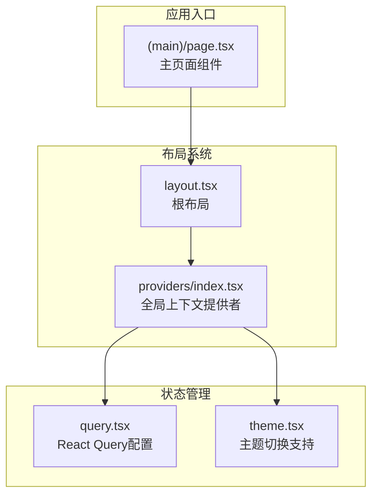
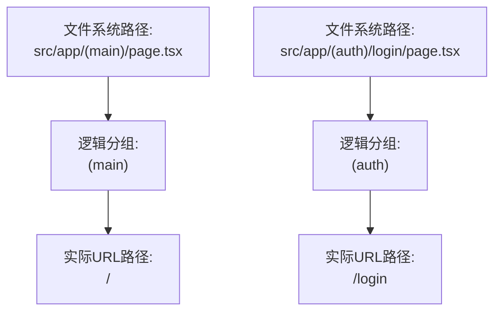
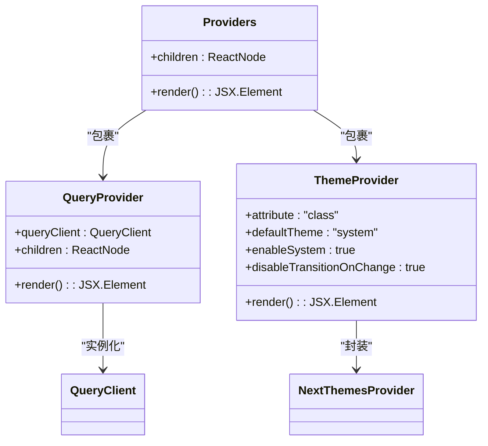
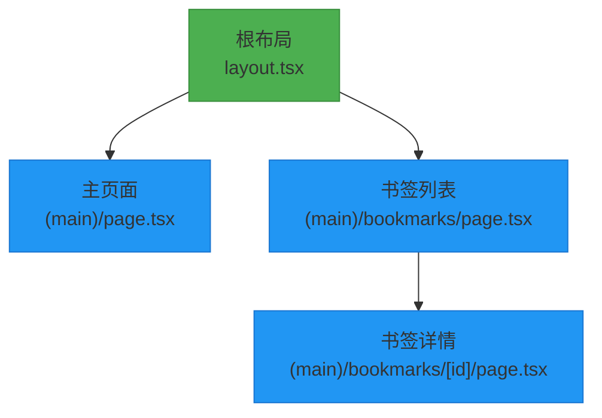

# 主页面与路由组

<cite>
**本文档中引用的文件**   
- [page.tsx](file://src/app/(main)/page.tsx)
- [layout.tsx](file://src/app/layout.tsx)
- [query.tsx](file://src/components/providers/query.tsx)
- [theme.tsx](file://src/components/providers/theme.tsx)
- [index.tsx](file://src/components/providers/index.tsx)
- [package.json](file://package.json)
</cite>

## 目录

1. [项目结构分析](#项目结构分析)
2. [主页面角色与实现细节](#主页面角色与实现细节)
3. [路由组概念详解](#路由组概念详解)
4. [根布局与页面协同机制](#根布局与页面协同机制)
5. [数据获取与状态管理](#数据获取与状态管理)
6. [UI组件集成方式](#ui组件集成方式)
7. [扩展多级路由指南](#扩展多级路由指南)

## 项目结构分析

本项目采用Next.js App Router架构，遵循功能模块化组织原则。核心应用逻辑位于`src/app`目录下，通过路由组`(main)`对主应用路径进行逻辑分组。

关键目录结构如下：

- `src/app/(main)/page.tsx`：主应用默认页面入口
- `src/app/layout.tsx`：根布局文件，定义全局UI与元数据
- `src/components/providers/`：提供全局状态、主题和查询管理的上下文封装
- `src/lib/`：包含请求工具和工具函数
- `public/`：静态资源目录



**图示来源**

- [page.tsx](<file://src/app/(main)/page.tsx>)
- [layout.tsx](file://src/app/layout.tsx)
- [index.tsx](file://src/components/providers/index.tsx)

**本节来源**

- [page.tsx](<file://src/app/(main)/page.tsx>)
- [layout.tsx](file://src/app/layout.tsx)

## 主页面角色与实现细节

`src/app/(main)/page.tsx`是主应用区域的默认页面组件，作为用户访问根路径时渲染的核心UI入口。该文件导出一个名为`Page`的默认函数组件。

当前实现非常简洁：

```tsx
export default function Page() {
  return <div>1111</div>;
}
```

此代码表明页面目前仅渲染一个包含文本“1111”的`<div>`元素。尽管实现简单，但其在架构中扮演关键角色：

- 作为`(main)`路由组下的默认页面，响应`/`路径请求
- 继承并使用根布局`layout.tsx`定义的全局样式与上下文
- 未来将集成书签数据展示、搜索功能等核心业务逻辑

**本节来源**

- [page.tsx](<file://src/app/(main)/page.tsx>)

## 路由组概念详解

Next.js中的**路由组（Route Groups）** 是一种组织路由逻辑而不影响URL路径的机制。通过将文件夹名称用英文括号包裹（如`(main)`），开发者可以对相关路由进行逻辑分组。

### 路由组的作用

1. **逻辑分组**：将主应用、管理后台、API等不同模块的路由分开管理
2. **不影响URL**：括号内的名称不会出现在实际URL中
3. **灵活布局继承**：允许不同路由组使用不同的布局结构

### 命名约定与路径映射

| 文件路径                              | 实际访问URL  | 说明                            |
| ------------------------------------- | ------------ | ------------------------------- |
| `/src/app/(main)/page.tsx`            | `/`          | `(main)`为逻辑分组，不体现在URL |
| `/src/app/(admin)/dashboard/page.tsx` | `/dashboard` | 同样忽略`(admin)`               |

使用`(main)`命名主应用路由组的优势：

- 明确标识这是主应用区域
- 便于未来添加其他路由组（如`(auth)`、`(api)`）
- 提高项目可维护性与可读性



**图示来源**

- [page.tsx](<file://src/app/(main)/page.tsx>)

**本节来源**

- [page.tsx](<file://src/app/(main)/page.tsx>)

## 根布局与页面协同机制

`layout.tsx`作为根布局文件，为所有页面提供统一的HTML结构、元数据和全局上下文。

### 元数据配置

通过`metadata`对象配置SEO相关信息，这些信息来源于`package.json`中的`seo`字段：

```ts
export const metadata: Metadata = {
  title: pkg.seo.title,
  description: pkg.seo.description,
  keywords: pkg.seo.keywords,
  openGraph: {
    title: pkg.seo.og.title,
    description: pkg.seo.og.description,
    url: pkg.seo.og.url,
    type: pkg.seo.og.type as 'website',
    images: pkg.seo.og.image,
  },
  twitter: {
    card: pkg.seo.twitter.card as 'summary_large_image',
    title: pkg.seo.twitter.title,
    description: pkg.seo.twitter.description,
    images: pkg.seo.twitter.image,
  },
  metadataBase: new URL(pkg.seo.og.url),
};
```

最终生成的页面标题为：“OneNav - 书签管理与快速搜索”。

### 布局继承机制

根布局通过`children`属性接收并渲染具体页面内容：

```tsx
export default function RootLayout({
  children,
}: {
  children: React.ReactNode;
}) {
  return (
    <html lang="en">
      <body className={inter.className}>
        <Providers>{children}</Providers>
      </body>
    </html>
  );
}
```

当访问`/`路径时：

1. 加载`layout.tsx`构建基础HTML结构
2. 将`page.tsx`的渲染结果注入`children`位置
3. 所有全局上下文（Providers）对页面生效

**本节来源**

- [layout.tsx](file://src/app/layout.tsx)
- [package.json](file://package.json)

## 数据获取与状态管理

虽然当前`page.tsx`未实现复杂逻辑，但项目已搭建完整的客户端状态管理架构，为后续数据预加载做好准备。

### React Query配置

`src/components/providers/query.tsx`中配置了`QueryClient`，用于管理书签等数据的获取与缓存：

```ts
const [queryClient] = useState(
  () =>
    new QueryClient({
      defaultOptions: {
        queries: {
          staleTime: 5 * 60 * 1000, // 数据新鲜期5分钟
          gcTime: 5 * 60 * 1000, // 内存缓存时间5分钟
          retry: 3, // 失败重试3次
          retryDelay: (attemptIndex) =>
            Math.min(1000 * 2 ** attemptIndex, 30000), // 指数退避
          refetchOnWindowFocus: false, // 窗口聚焦时不自动刷新
          refetchOnReconnect: true, // 网络重连时自动刷新
        },
      },
    }),
);
```

该配置适合书签类应用：

- 适度的缓存时间平衡性能与数据实时性
- 自动重试机制提升弱网环境下的用户体验
- 网络恢复时自动同步最新数据

### 全局状态提供链



**图示来源**

- [query.tsx](file://src/components/providers/query.tsx)
- [theme.tsx](file://src/components/providers/theme.tsx)
- [index.tsx](file://src/components/providers/index.tsx)

**本节来源**

- [query.tsx](file://src/components/providers/query.tsx)
- [theme.tsx](file://src/components/providers/theme.tsx)
- [index.tsx](file://src/components/providers/index.tsx)

## UI组件集成方式

主页面将通过以下方式集成UI组件以实现完整功能：

### 核心UI组件体系

项目使用基于Radix UI的组件库，位于`src/components/ui/`目录，包括：

- `card.tsx`：书签卡片容器
- `input.tsx`：搜索输入框
- `button.tsx`：操作按钮
- `scroll-area.tsx`：滚动区域
- `skeleton.tsx`：加载占位符

### 主页面预期集成结构

未来`page.tsx`可能演变为：

```tsx
export default function Page() {
  const { data: bookmarks, isLoading } = useQuery({
    queryKey: ['bookmarks'],
    queryFn: fetchBookmarks,
  });

  if (isLoading) return <BookmarksSkeleton />;

  return (
    <div className="container mx-auto p-4">
      <SearchBar />
      <BookmarkGrid bookmarks={bookmarks} />
    </div>
  );
}
```

### 提示与通知系统

通过`sonner`库提供Toast通知：

```tsx
<Toaster position="top-right" richColors />
```

可在用户添加/删除书签时提供即时反馈。

**本节来源**

- [page.tsx](<file://src/app/(main)/page.tsx>)
- [components/ui/\*.tsx](file://src/components/ui/)

## 扩展多级路由指南

### 添加新页面步骤

1. **确定路由组**：选择现有组或创建新组

   ```bash
   mkdir src/app/(main)/settings
   ```

2. **创建页面文件**：

   ```tsx
   // src/app/(main)/settings/page.tsx
   export default function SettingsPage() {
     return <div>设置页面</div>;
   }
   ```

3. **验证路径映射**：
   - 文件路径：`src/app/(main)/settings/page.tsx`
   - 实际URL：`/settings`

### 多级路由示例

```bash
src/app/
├── (main)/
│   ├── page.tsx           → /
│   ├── bookmarks/
│   │   ├── page.tsx       → /bookmarks
│   │   └── [id]/
│   │       └── page.tsx   → /bookmarks/123
│   └── settings/
│       └── page.tsx       → /settings
```

### 布局继承规则

- 每个层级可定义自己的`layout.tsx`
- 子布局会继承父布局的上下文
- 可实现嵌套路由布局（如主布局+侧边栏布局）



**图示来源**

- [layout.tsx](file://src/app/layout.tsx)
- [page.tsx](<file://src/app/(main)/page.tsx>)

**本节来源**

- [layout.tsx](file://src/app/layout.tsx)
- [page.tsx](<file://src/app/(main)/page.tsx>)
