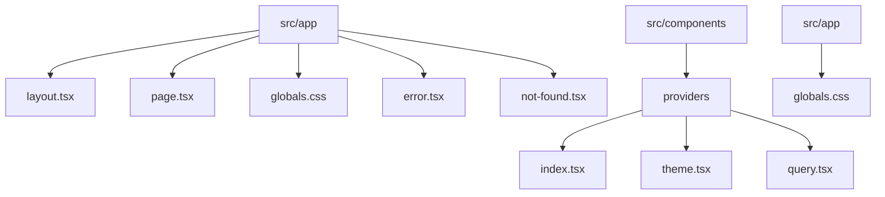
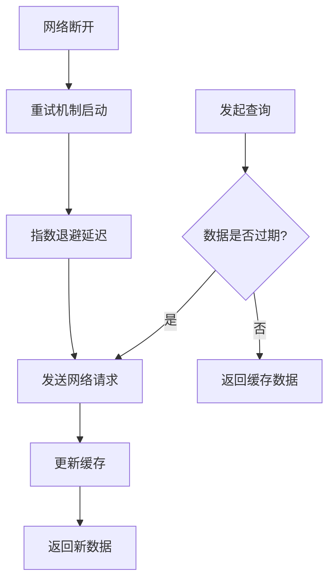
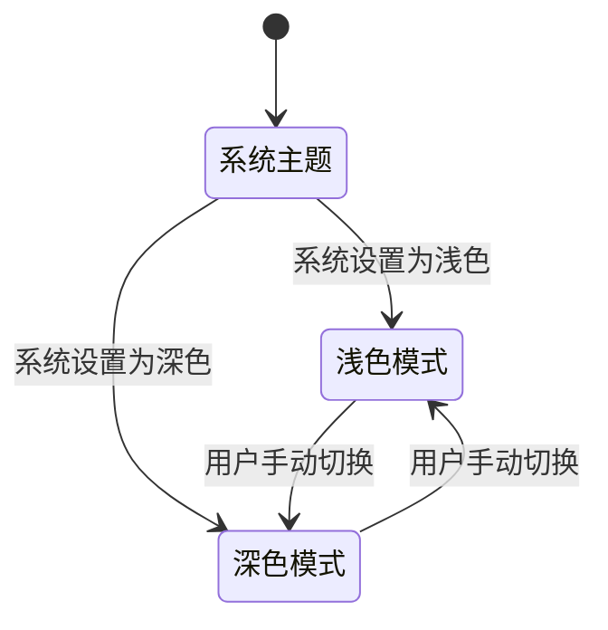
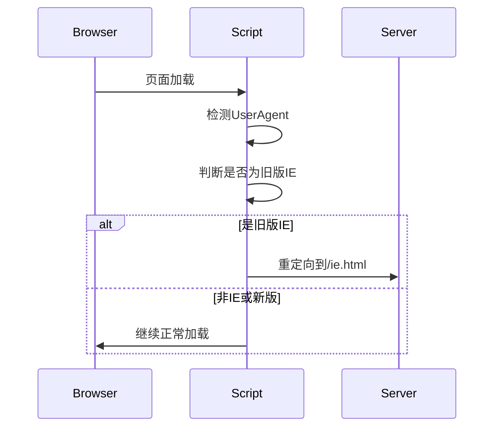
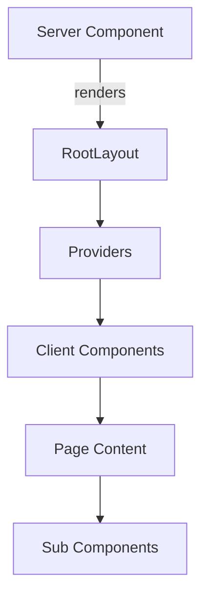

# 根布局与共享UI

<cite>
**本文档中引用的文件**   
- [layout.tsx](file://src/app/layout.tsx)
- [providers/index.tsx](file://src/components/providers/index.tsx)
- [theme.tsx](file://src/components/providers/theme.tsx)
- [query.tsx](file://src/components/providers/query.tsx)
- [globals.css](file://src/app/globals.css)
- [package.json](file://package.json)
- [page.tsx](file://src/app/(main)/page.tsx)
</cite>

## 目录

1. [简介](#简介)
2. [项目结构概览](#项目结构概览)
3. [根布局文件分析](#根布局文件分析)
4. [全局样式与CSS注入](#全局样式与css注入)
5. [Providers集成与状态共享](#providers集成与状态共享)
6. [元数据与SEO优化](#元数据与seo优化)
7. [脚本加载与浏览器兼容性处理](#脚本加载与浏览器兼容性处理)
8. [客户端组件协调机制](#客户端组件协调机制)
9. [常见问题与解决方案](#常见问题与解决方案)
10. [总结](#总结)

## 简介

`layout.tsx` 是 Next.js App Router 架构中的核心文件，位于 `src/app` 目录下，作为整个应用的根布局组件。它负责定义应用的顶层 HTML 结构、注入全局元数据（metadata）、配置页面标题和图标，并集成多个 Providers 以实现跨页面的状态共享。该文件作为一个服务器组件，不直接参与客户端渲染，而是作为客户端组件的容器，协调其渲染流程。通过合理配置 `layout.tsx`，可以显著提升应用的 SEO 表现和首屏加载性能。

**Section sources**

- [layout.tsx](file://src/app/layout.tsx#L1-L101)

## 项目结构概览

本项目采用 Next.js 的 App Router 模式组织代码，主要结构如下：



**Diagram sources**

- [layout.tsx](file://src/app/layout.tsx#L1-L101)
- [index.tsx](file://src/components/providers/index.tsx#L1-L16)

## 根布局文件分析

`layout.tsx` 文件是整个应用的入口布局，其核心职责包括：

- 定义 `<html>` 和 `<body>` 标签及其属性
- 注入全局元数据（metadata）
- 加载全局样式表
- 集成 Providers 实现状态共享
- 处理浏览器兼容性脚本

该组件接收 `children` 属性，用于渲染嵌套的子页面内容。

```tsx
export default function RootLayout({
  children,
}: {
  children: React.ReactNode;
}) {
  return (
    <html lang="en" suppressHydrationWarning>
      <head>...</head>
      <body className={inter.className} suppressHydrationWarning>
        <Providers>{children}</Providers>
      </body>
    </html>
  );
}
```

**Section sources**

- [layout.tsx](file://src/app/layout.tsx#L15-L101)

## 全局样式与CSS注入

`layout.tsx` 通过导入 `globals.css` 文件来注入全局样式。该文件使用 Tailwind CSS 和自定义变量定义了整个应用的视觉主题，包括颜色、字体、边框半径等。通过 `:root` 和 `.dark` 类分别定义了浅色和深色模式下的 CSS 变量。

```css
:root {
  --radius: 0.625rem;
  --background: oklch(1 0 0);
  --foreground: oklch(0.145 0 0);
  /* ... */
}

.dark {
  --background: oklch(0.145 0 0);
  --foreground: oklch(0.985 0 0);
  /* ... */
}
```

字体通过 `next/font` 的 `Inter` 字体进行优化加载，并应用到 `body` 标签上。

**Section sources**

- [globals.css](file://src/app/globals.css#L1-L123)
- [layout.tsx](file://src/app/layout.tsx#L5-L7)

## Providers集成与状态共享

`layout.tsx` 通过 `<Providers>` 组件集成多个状态管理 Provider，确保所有子页面都能访问共享状态。`Providers` 组件定义在 `src/components/providers/index.tsx` 中，包含以下核心 Provider：

- **QueryProvider**: 基于 `@tanstack/react-query` 的数据请求状态管理
- **ThemeProvider**: 基于 `next-themes` 的主题切换支持
- **TooltipProvider**: Radix UI 的 Tooltip 功能支持
- **Toaster**: Sonner 库的全局通知系统

```tsx
export function Providers({ children }: React.PropsWithChildren) {
  return (
    <QueryProvider>
      <ThemeProvider>
        <TooltipProvider>{children}</TooltipProvider>
        <Toaster position="top-right" richColors />
      </ThemeProvider>
    </QueryProvider>
  );
}
```

这种嵌套结构确保了各 Provider 的作用域正确，避免了状态冲突。

**Section sources**

- [index.tsx](file://src/components/providers/index.tsx#L1-L16)
- [theme.tsx](file://src/components/providers/theme.tsx#L1-L18)
- [query.tsx](file://src/components/providers/query.tsx#L1-L46)

### QueryProvider 详细配置

`QueryProvider` 使用 `useState` 创建一个持久化的 `QueryClient` 实例，避免在组件重渲染时重新创建客户端。其配置包括：

- **staleTime**: 数据缓存时间（5分钟）
- **gcTime**: 内存中数据的垃圾回收时间（5分钟）
- **retry**: 查询失败时的重试次数（3次）
- **refetchOnWindowFocus**: 窗口获得焦点时不自动重新获取数据
- **refetchOnReconnect**: 网络重连时自动重新获取数据



**Diagram sources**

- [query.tsx](file://src/components/providers/query.tsx#L1-L46)

### ThemeProvider 工作机制

`ThemeProvider` 封装了 `next-themes` 的 `ThemeProvider`，支持系统级主题自动切换。其关键配置：

- **attribute="class"**: 使用 CSS 类而非内联样式控制主题
- **defaultTheme="system"**: 默认跟随系统设置
- **enableSystem**: 启用系统主题检测
- **disableTransitionOnChange**: 切换主题时禁用CSS过渡动画



**Diagram sources**

- [theme.tsx](file://src/components/providers/theme.tsx#L1-L18)

## 元数据与SEO优化

`layout.tsx` 中的 `metadata` 对象从 `package.json` 的 `seo` 字段读取配置，实现集中化的 SEO 管理。这包括：

- 页面标题和描述
- 关键词
- Open Graph 协议数据
- Twitter 卡片数据
- JSON-LD 结构化数据

```tsx
export const metadata: Metadata = {
  title: pkg.seo.title,
  description: pkg.seo.description,
  keywords: pkg.seo.keywords,
  openGraph: {
    title: pkg.seo.og.title,
    description: pkg.seo.og.description,
    url: pkg.seo.og.url,
    type: pkg.seo.og.type as 'website',
    images: pkg.seo.og.image,
  },
  twitter: {
    card: pkg.seo.twitter.card as 'summary_large_image',
    title: pkg.seo.twitter.title,
    description: pkg.seo.twitter.description,
    images: pkg.seo.twitter.image,
  },
  metadataBase: new URL(pkg.seo.og.url),
};
```

JSON-LD 结构化数据通过 `Script` 组件注入，提升搜索引擎对网站内容的理解。

**Section sources**

- [layout.tsx](file://src/app/layout.tsx#L9-L50)
- [package.json](file://package.json#L100-L142)

## 脚本加载与浏览器兼容性处理

`layout.tsx` 在 `<head>` 中注入了多个脚本和元标签，用于处理浏览器兼容性和用户体验：

- **IE 兼容性检测**: 通过内联脚本检测 IE 浏览器并重定向到 `ie.html`
- **视口配置**: 确保移动设备正确缩放
- **图标配置**: 定义多种尺寸的 favicon 和 Apple Touch Icon
- **PWA 支持**: 通过 `manifest.json` 支持渐进式 Web 应用
- **主题色**: 根据用户偏好设置主题颜色



**Diagram sources**

- [layout.tsx](file://src/app/layout.tsx#L20-L90)

## 客户端组件协调机制

`layout.tsx` 作为服务器组件，通过以下方式协调客户端组件的渲染：

1. 使用 `suppressHydrationWarning` 属性避免 hydration 警告
2. 将客户端组件（如 Providers）包裹在服务器组件中
3. 通过 `children` prop 传递子页面内容
4. 确保所有客户端状态在组件树顶层初始化



**Diagram sources**

- [layout.tsx](file://src/app/layout.tsx#L15-L101)
- [page.tsx](<file://src/app/(main)/page.tsx#L1-L4>)

## 常见问题与解决方案

### Provider 未正确包裹导致的状态丢失

**问题**: 客户端组件无法访问 Provider 提供的状态  
**原因**: `Providers` 组件未在 `layout.tsx` 中正确包裹 `children`  
**解决方案**: 确保 `layout.tsx` 返回 `<Providers>{children}</Providers>`

### 主题切换不生效

**问题**: 页面主题无法切换或闪烁  
**解决方案**:

- 确保 `suppressHydrationWarning` 已添加
- 检查 `attribute="class"` 配置是否正确
- 验证 CSS 变量在 `:root` 和 `.dark` 中正确定义

### SEO 元数据未更新

**问题**: 页面标题和描述未按预期显示  
**解决方案**:

- 检查 `package.json` 中的 `seo` 配置
- 验证 `metadataBase` 是否为有效 URL
- 确保 `openGraph.url` 与部署地址一致

**Section sources**

- [layout.tsx](file://src/app/layout.tsx#L1-L101)
- [theme.tsx](file://src/components/providers/theme.tsx#L1-L18)

## 总结

`layout.tsx` 作为 Next.js 应用的根布局文件，承担着定义应用基础结构、注入全局配置和协调组件渲染的核心职责。通过合理配置元数据、集成 Providers 和管理全局样式，它为整个应用提供了稳定、高效且 SEO 友好的基础架构。理解其工作原理对于构建高质量的 Next.js 应用至关重要。
