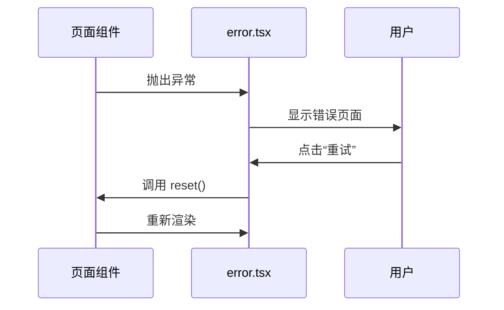
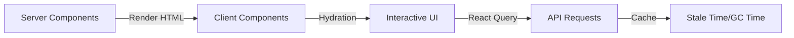

# 路由与页面结构

<cite>
**本文档引用文件**  
- [layout.tsx](file://src/app/layout.tsx#L1-L101)
- [page.tsx](file://src/app/(main)/page.tsx#L1-L4)
- [error.tsx](file://src/app/error.tsx#L1-L332)
- [not-found.tsx](file://src/app/not-found.tsx#L1-L17)
- [theme.tsx](file://src/components/providers/theme.tsx#L1-L18)
- [query.tsx](file://src/components/providers/query.tsx#L1-L46)
- [index.tsx](file://src/components/providers/index.tsx#L1-L16)
- [package.json](file://package.json#L1-L143)
</cite>

## 目录

1. [项目结构概览](#项目结构概览)
2. [(main)路由组的作用与命名约定](#main路由组的作用与命名约定)
3. [根布局文件 layout.tsx 的功能解析](#根布局文件-layouttsx-的功能解析)
4. [主页面入口 page.tsx 的职责](#主页面入口-pagetSX-的职责)
5. [错误边界 error.tsx 的处理机制](#错误边界-errortSX-的处理机制)
6. [404 页面 not-found.tsx 的实现](#404-页面-not-foundtsx-的实现)
7. [服务器组件与客户端组件的混合使用](#服务器组件与客户端组件的混合使用)
8. [页面导航与动态路由](#页面导航与动态路由)
9. [元数据（SEO）配置方法](#元数据seo配置方法)
10. [新增页面的集成方式](#新增页面的集成方式)
11. [路由结构对性能与用户体验的影响](#路由结构对性能与用户体验的影响)

## 项目结构概览

本项目采用 Next.js App Router 架构，目录结构清晰，遵循模块化设计原则。核心路由与页面逻辑位于 `src/app` 目录下，支持路由组、布局共享、错误处理和未找到页面等特性。

```mermaid
graph TB
A[src/app] --> B[(main)/]
A --> C[layout.tsx]
A --> D[error.tsx]
A --> E[not-found.tsx]
A --> F[popup/page.tsx]
B --> G[page.tsx]
C --> H[定义根布局]
D --> I[全局错误处理]
E --> J[404 页面]
F --> K[弹窗页面]
```

**图示来源**

- [layout.tsx](file://src/app/layout.tsx#L1-L101)
- [page.tsx](<file://src/app/(main)/page.tsx#L1-L4>)
- [not-found.tsx](file://src/app/not-found.tsx#L1-L17)

## (main)路由组的作用与命名约定

在 Next.js 中，使用括号 `(group)` 的目录表示路由组，不会出现在 URL 路径中。本项目中的 `(main)` 是一个命名路由组，用于组织主应用的页面结构。

- **作用**：将主应用的页面逻辑隔离，便于管理多个并行的路由结构（如 `/popup` 与 `/` 主路径）。
- **命名约定**：使用有意义的名称（如 `main`、`auth`、`dashboard`）提高可读性。
- **URL 映射**：`(main)/page.tsx` 对应根路径 `/`，不暴露 `main` 字段。

例如：

- `(main)/page.tsx` → `/`
- `popup/page.tsx` → `/popup`

**章节来源**

- [page.tsx](<file://src/app/(main)/page.tsx#L1-L4>)
- [popup/page.tsx](file://src/app/popup/page.tsx)

## 根布局文件 layout.tsx 的功能解析

`layout.tsx` 是整个应用的根布局组件，定义了所有页面共享的 UI 结构、全局 Providers 和元数据。

### 共享 UI 结构

通过 `children` prop 渲染子页面内容，确保页面切换时保持一致的布局框架。

### 注入全局 Providers

使用自定义的 `Providers` 组件注入多个全局状态管理器：

- `QueryProvider`：基于 TanStack React Query 管理数据请求
- `ThemeProvider`：支持暗色/亮色主题切换
- `TooltipProvider`：统一管理 Tooltip 行为
- `Toaster`：显示全局通知（来自 Sonner）

### 配置元数据（Metadata）

从 `package.json` 中读取 SEO 配置，动态生成 `<head>` 中的元信息，包括：

- 页面标题
- 描述
- 关键词
- Open Graph 数据
- Twitter 卡片
- JSON-LD 结构化数据

```tsx
export const metadata: Metadata = {
  title: pkg.seo.title,
  description: pkg.seo.description,
  openGraph: {
    title: pkg.seo.og.title,
    images: pkg.seo.og.image,
    url: pkg.seo.og.url,
  },
  twitter: {
    card: pkg.seo.twitter.card,
    image: pkg.seo.twitter.image,
  },
};
```

此外，还设置了视口、图标、主题色等基础标签，并注入 JSON-LD 结构化数据以提升搜索引擎优化效果。

**章节来源**

- [layout.tsx](file://src/app/layout.tsx#L1-L101)
- [package.json](file://package.json#L1-L143)
- [index.tsx](file://src/components/providers/index.tsx#L1-L16)

## 主页面入口 page.tsx 的职责

`src/app/(main)/page.tsx` 是应用的主页面入口，负责渲染首页内容。

当前实现非常简单，仅返回一个占位文本：

```tsx
export default function Page() {
  return <div>1111</div>;
}
```

其职责包括：

- 作为根路径 `/` 的默认页面
- 可扩展为首页组件，集成书签列表、搜索框等功能
- 继承 `layout.tsx` 定义的布局和 Providers

**章节来源**

- [page.tsx](<file://src/app/(main)/page.tsx#L1-L4>)

## 错误边界 error.tsx 的处理机制

`error.tsx` 是一个客户端组件，作为全局错误边界捕获子组件抛出的异常。

### 实现方式

- 使用 `"use client"` 指令声明为客户端组件
- 接收 `error` 和 `reset` 两个 props
- 显示友好的错误提示界面
- 提供“重试”按钮调用 `reset()` 恢复组件状态
- 提供“返回首页”链接引导用户离开错误页面

### 动画效果

使用 `motion` 组件为错误提示添加渐入动画，提升用户体验。

### 错误处理流程



**图示来源**

- [error.tsx](file://src/app/error.tsx#L1-L332)

**章节来源**

- [error.tsx](file://src/app/error.tsx#L1-L332)

## 404 页面 not-found.tsx 的实现

`not-found.tsx` 用于处理未匹配到路由的请求，即 404 页面。

### 功能特点

- 显示“页面未找到”的提示信息
- 提供返回首页的链接
- 使用 Tailwind CSS 进行样式布局

### 代码实现

```tsx
export default function NotFound() {
  return (
    <div className="flex min-h-screen flex-col items-center justify-center">
      <h2 className="text-2xl font-bold">页面未找到</h2>
      <p className="mt-4 text-gray-600">抱歉，您访问的页面不存在。</p>
      <Link
        href="/"
        className="mt-6 rounded bg-blue-500 px-4 py-2 text-white hover:bg-blue-600"
      >
        返回首页
      </Link>
    </div>
  );
}
```

该组件会在路由无法匹配时自动渲染。

**章节来源**

- [not-found.tsx](file://src/app/not-found.tsx#L1-L17)

## 服务器组件与客户端组件的混合使用

本项目采用混合渲染策略，合理划分服务器组件与客户端组件。

### 服务器组件

- `layout.tsx`
- `page.tsx`
- `not-found.tsx`

优势：

- 减少客户端 JavaScript 体积
- 支持服务端数据获取
- 提升首屏加载性能

### 客户端组件

- `error.tsx`
- `src/components/providers/*.tsx`

通过 `"use client"` 显式声明，用于：

- 处理用户交互（如错误重试）
- 使用状态管理（如 React Query、Theme）
- 使用浏览器 API（如 localStorage）

### 数据流示意图



**图示来源**

- [layout.tsx](file://src/app/layout.tsx#L1-L101)
- [error.tsx](file://src/app/error.tsx#L1-L332)
- [query.tsx](file://src/components/providers/query.tsx#L1-L46)

**章节来源**

- [layout.tsx](file://src/app/layout.tsx#L1-L101)
- [error.tsx](file://src/app/error.tsx#L1-L332)
- [query.tsx](file://src/components/providers/query.tsx#L1-L46)

## 页面导航与动态路由

### 页面导航

使用 Next.js 的 `Link` 组件实现客户端路由跳转，避免整页刷新。

示例：

```tsx
import Link from 'next/link';

<Link href="/">返回首页</Link>;
```

### 动态路由

当前项目未使用动态路由，但可根据需要创建 `[id]/page.tsx` 等模式。

**章节来源**

- [not-found.tsx](file://src/app/not-found.tsx#L1-L17)

## 元数据（SEO）配置方法

元数据通过 `metadata` 对象在 `layout.tsx` 中集中配置。

### 配置来源

所有 SEO 信息来自 `package.json` 中的 `seo` 字段，便于统一管理。

### 支持的元数据类型

- **基础信息**：title, description, keywords
- **Open Graph**：社交分享卡片
- **Twitter Card**：Twitter 平台优化
- **JSON-LD**：结构化数据，提升搜索引擎理解

### metadataBase

设置 `metadataBase: new URL(pkg.seo.og.url)` 确保生成绝对 URL，利于 SEO。

**章节来源**

- [layout.tsx](file://src/app/layout.tsx#L1-L101)
- [package.json](file://package.json#L1-L143)

## 新增页面的集成方式

### 步骤一：创建新页面文件

在 `src/app` 下创建新路径，如 `about/page.tsx`。

### 步骤二：编写页面内容

```tsx
export default function AboutPage() {
  return <div>关于我们</div>;
}
```

### 步骤三：自动集成

- 自动继承 `layout.tsx` 布局
- 自动获得 Providers 支持
- 自动获得错误处理和 404 支持
- 可通过 `Link` 导航访问

### 示例结构

```bash
src/app/
├── about/
│   └── page.tsx     # → /about
├── blog/
│   └── [slug]/
│       └── page.tsx # → /blog/hello-world
```

**章节来源**

- [layout.tsx](file://src/app/layout.tsx#L1-L101)
- [page.tsx](<file://src/app/(main)/page.tsx#L1-L4>)

## 路由结构对性能与用户体验的影响

### 性能优势

- **代码分割**：每个页面独立打包，按需加载
- **服务端渲染**：关键页面 SSR 提升首屏速度
- **缓存策略**：React Query 配置 `staleTime` 和 `gcTime` 优化数据请求

### 用户体验提升

- **无缝导航**：`Link` 组件实现快速页面切换
- **错误恢复**：错误边界提供重试机制，避免白屏
- **离线支持**：PWA 配置（manifest.json）支持离线访问
- **主题记忆**：`next-themes` 记住用户主题偏好

### 可维护性

- 路由组 `(main)` 便于组织复杂路由
- 集中式元数据管理，便于 SEO 维护
- 统一的 Providers 注入，避免重复代码

**章节来源**

- [layout.tsx](file://src/app/layout.tsx#L1-L101)
- [query.tsx](file://src/components/providers/query.tsx#L1-L46)
- [theme.tsx](file://src/components/providers/theme.tsx#L1-L18)
