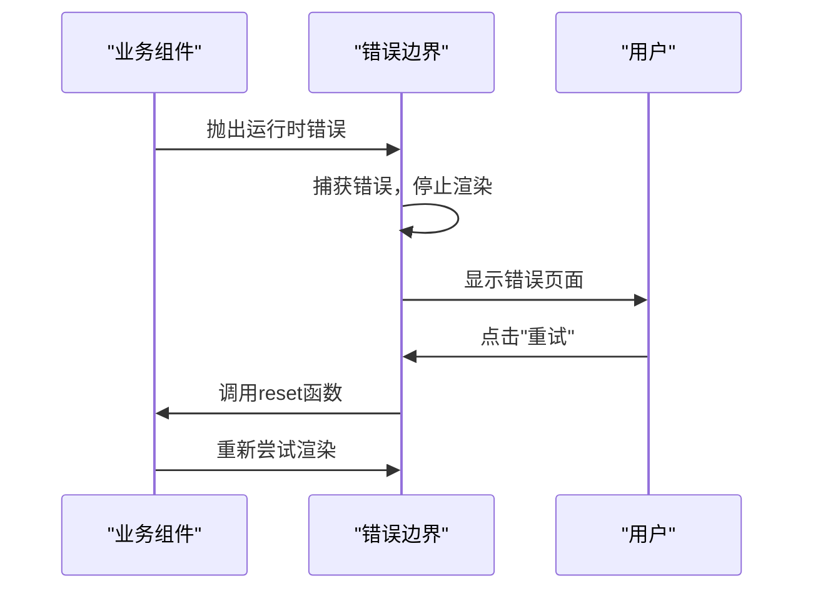
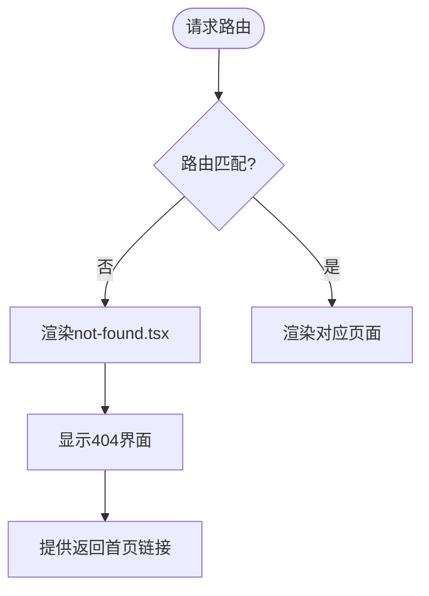

# 错误边界与404处理

<cite>
**本文档引用的文件**   
- [error.tsx](file://src/app/error.tsx)
- [not-found.tsx](file://src/app/not-found.tsx)
</cite>

## 目录

1. [简介](#简介)
2. [项目结构](#项目结构)
3. [核心组件](#核心组件)
4. [错误边界机制详解](#错误边界机制详解)
5. [404页面处理机制](#404页面处理机制)
6. [错误边界与404处理对比](#错误边界与404处理对比)
7. [实际使用示例](#实际使用示例)
8. [最佳实践建议](#最佳实践建议)

## 简介

本文档系统化地阐述了应用中的错误处理机制，重点分析客户端运行时错误和未匹配路由的响应策略。详细说明了 `error.tsx` 作为错误边界（Error Boundary）的工作原理，以及 `not-found.tsx` 在路由层面处理404情况的机制。通过代码分析和对比，帮助开发者理解两种错误处理方式的差异和应用场景。

## 项目结构

项目采用Next.js的App Router架构，错误处理相关文件位于 `src/app` 目录下，作为应用的顶级错误处理组件。

```mermaid
graph TB
subgraph "应用根目录"
error[error.tsx]
notFound[not-found.tsx]
layout[layout.tsx]
main[(main)]
end
layout --> error
layout --> notFound
layout --> main
error -.-> "捕获子组件错误"
notFound -.-> "处理未匹配路由"
```

**Diagram sources**

- [error.tsx](file://src/app/error.tsx)
- [not-found.tsx](file://src/app/not-found.tsx)

**Section sources**

- [error.tsx](file://src/app/error.tsx)
- [not-found.tsx](file://src/app/not-found.tsx)

## 核心组件

本项目的核心错误处理组件包括 `error.tsx` 和 `not-found.tsx`，分别负责运行时错误和路由未找到的处理。

**Section sources**

- [error.tsx](file://src/app/error.tsx)
- [not-found.tsx](file://src/app/not-found.tsx)

## 错误边界机制详解

`error.tsx` 组件作为React的错误边界，能够捕获其子组件树中产生的JavaScript运行时错误。

### 错误边界工作原理

```tsx
export default function ErrorPage({
  error,
  reset,
}: {
  error: Error;
  reset: () => void;
}) {
  // ...
}
```

错误边界组件接收两个关键属性：

- **error**: 包含错误信息的对象，提供 `error.message` 等属性
- **reset**: 重置函数，用于尝试重新渲染组件树

### 用户界面设计

组件采用了友好的用户界面设计，包含：

- 动画效果：使用 `motion` 组件实现渐入、缩放等动画
- 错误信息展示：显示具体的错误消息
- 恢复选项：提供"重试"和"返回首页"两个操作按钮



**Diagram sources**

- [error.tsx](file://src/app/error.tsx#L7-L331)

**Section sources**

- [error.tsx](file://src/app/error.tsx#L7-L331)

## 404页面处理机制

`not-found.tsx` 组件专门处理路由未匹配的情况，当用户访问不存在的页面时被触发。

### 组件实现

```tsx
export default function NotFound() {
  return (
    <div className="flex min-h-screen flex-col items-center justify-center">
      <h2 className="text-2xl font-bold">页面未找到</h2>
      <p className="mt-4 text-gray-600">抱歉，您访问的页面不存在。</p>
      <Link
        href="/"
        className="mt-6 rounded bg-blue-500 px-4 py-2 text-white hover:bg-blue-600"
      >
        返回首页
      </Link>
    </div>
  );
}
```

### 触发方式

404处理可以通过调用 `notFound()` 函数在业务逻辑中主动触发：

```tsx
import { notFound } from 'next/navigation';

// 在服务器组件中
if (!user) {
  notFound();
}
```



**Diagram sources**

- [not-found.tsx](file://src/app/not-found.tsx#L1-L17)

**Section sources**

- [not-found.tsx](file://src/app/not-found.tsx#L1-L17)

## 错误边界与404处理对比

两种错误处理机制在触发条件、作用范围和恢复行为上有显著差异。

### 对比表格

| 特性         | 错误边界 (error.tsx)     | 404处理 (not-found.tsx)        |
| ------------ | ------------------------ | ------------------------------ |
| **触发条件** | JavaScript运行时错误     | 路由未匹配或调用notFound()     |
| **作用范围** | 组件树中的任何运行时错误 | 特定路由不存在                 |
| **恢复行为** | 可通过reset函数重试      | 通常需要导航到其他页面         |
| **错误类型** | 客户端错误               | 路由/资源不存在                |
| **调用方式** | 自动捕获异常             | 主动调用notFound()或路由不匹配 |

### 作用范围差异

```mermaid
graph TD
subgraph "错误边界作用范围"
A[Layout]
B[ErrorBoundary]
C[PageComponent]
D[ChildComponent]
E[GrandChildComponent]
A --> B
B --> C
C --> D
D --> E
style B fill:#f9f,stroke:#333
style D stroke:#f00,stroke-width:2px
note right of D: "此处抛出错误被B捕获"
end
subgraph "404处理作用范围"
F[Router]
G[RouteA]
H[RouteB]
I[UnknownRoute]
F --> G
F --> H
F --> I
style I fill:#f99,stroke:#333
note right of I: "未定义的路由触发404"
end
```

**Diagram sources**

- [error.tsx](file://src/app/error.tsx)
- [not-found.tsx](file://src/app/not-found.tsx)

## 实际使用示例

### 在业务组件中抛出错误

```tsx
'use client';

import { useEffect } from 'react';

export default function ProblematicComponent() {
  useEffect(() => {
    // 模拟运行时错误
    throw new Error('数据加载失败');
  }, []);

  return <div>这个组件会抛出错误</div>;
}
```

### 主动触发404

```tsx
import { getUser } from '@/lib/api';
import { notFound } from 'next/navigation';

// 服务器组件中
export default async function UserPage({ params }) {
  const user = await getUser(params.id);

  if (!user) {
    notFound(); // 主动触发404页面
  }

  return <div>{user.name}</div>;
}
```

**Section sources**

- [error.tsx](file://src/app/error.tsx)
- [not-found.tsx](file://src/app/not-found.tsx)

## 最佳实践建议

### 错误日志收集

建议在错误边界中集成错误监控服务：

```tsx
export default function ErrorPage({
  error,
  reset,
}: {
  error: Error;
  reset: () => void;
}) {
  useEffect(() => {
    // 发送错误日志到监控服务
    console.error('应用错误:', error);
    // sendErrorToAnalytics(error);
  }, [error]);

  return (
    // ... 错误界面
  );
}
```

### 监控策略

1. **客户端错误监控**: 使用Sentry、LogRocket等工具捕获运行时错误
2. **404页面监控**: 记录频繁访问的不存在页面，用于优化路由或设置重定向
3. **用户行为分析**: 跟踪用户在错误页面的操作，优化恢复流程

### 设计原则

- **用户友好**: 提供清晰的错误信息和明确的恢复路径
- **一致性**: 保持错误页面与应用整体设计风格一致
- **可恢复性**: 尽可能提供重试或替代方案
- **监控完备**: 确保所有错误类型都能被有效捕获和分析

**Section sources**

- [error.tsx](file://src/app/error.tsx)
- [not-found.tsx](file://src/app/not-found.tsx)
